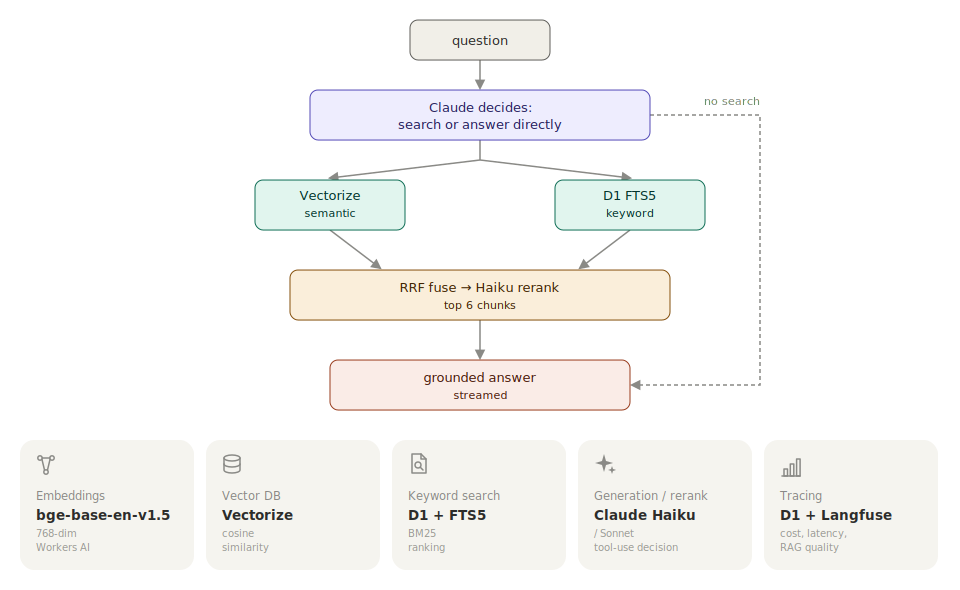

# ashimsharma10.github.io

Personal portfolio and write-ups, with an AI assistant that answers questions about me using RAG over this site's content.

Built with Next.js, Tailwind CSS, and Contentlayer. Live at [ashimsharma10.github.io](https://ashimsharma10.github.io)

## Stack

- **Site**: Next.js (static export) + Tailwind + Contentlayer (MDX blog)
- **Chatbot backend**: Cloudflare Worker ([worker/](worker/))
- **Deploy**: GitHub Pages (site) + `wrangler deploy` (Worker)

## Chatbot infrastructure

Agentic hybrid RAG, fully on Cloudflare.



Knowledge base = bio, projects, and blog posts, chunked and embedded via `npm run ingest`. Setup in [worker/README.md](worker/README.md), live metrics at `/ops`.

## Development

```bash
npm install
npm run dev
```

See [worker/README.md](worker/README.md) to run the chatbot backend locally.
