&nbsp;

Numbers in the answers are commitments, not decoration. When a number is illustrative, the assumption behind it is stated. Pricing and model behavior are as of early 2026. The reasoning still holds when the constants change.

**Table of Contents**

1. [Agent System Design](#1-agent-system-design)
2. [Prompt & Context Engineering](#2-prompt--context-engineering)
3. [RAG & Retrieval Quality](#3-rag--retrieval-quality)
4. [Evals: Offline](#4-evals-offline)
5. [Measuring Quality Online](#5-measuring-quality-online)
6. [Guardrails](#6-guardrails)
7. [Security & Prompt Injection](#7-security--prompt-injection)
8. [Observability & Tracing](#8-observability--tracing)
9. [Token & Cost Engineering](#9-token--cost-engineering)

## 1. Agent System Design

### Q1.1: How do you design a customer-support agent that can look up orders, issue refunds, and escalate to humans?

**Headline answer:** Separate the read path from the write path first. Reads (order lookup, FAQ search) run freely inside the agent loop. Writes (refunds) go through a typed tool gate with policy checks, and above a threshold they need human approval. The real question is how much damage the agent can do on its own, so design it so the worst autonomous action is small and reversible.

Here is the shape:

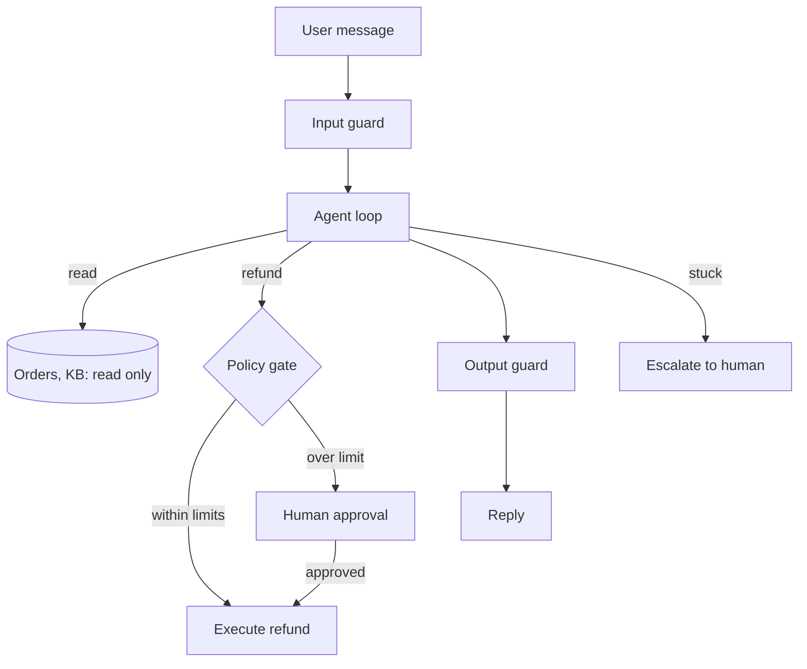

The decisions that matter, and why:

| Decision         | Choice                          | Why                                                                                                |
| ---------------- | ------------------------------- | -------------------------------------------------------------------------------------------------- |
| Orchestration    | Single agent                    | Support flows are shallow (2 to 5 tool calls); more agents add cost and failure modes with no gain |
| Refund authority | Policy code, not the prompt     | The model proposes, deterministic code decides. Never put "max $50" only in the prompt             |
| Idempotency      | Client-generated key per refund | A retry after a timeout must not refund twice                                                      |
| Escalation       | Always available                | An agent that cannot say "please pass this to a human" will bluff instead                          |
| State            | In a store, not in the model    | Lets you resume after a crash and audit every step                                                 |

The policy gate is about 30 lines of plain code, and it is the most important part of the system:

```python
def check_refund(req, history):
    if req.amount > 50:
        return "needs_approval"
    if history.refunds_last_30d >= 1:
        return "needs_approval"
    if not history.identity_verified:
        return "deny"
    return "auto_approve"
```

**Follow-up questions:**

- _What if the model calls the refund tool with a different order ID than the user asked about?_ The tool checks that the order belongs to the logged-in user, not to whatever ID the model produced. Validate on the tool side, never trust an ID the model made up.
- _How do you roll this out?_ Shadow mode first: the agent proposes, humans execute, you measure how often they agree. Then auto-execute the lowest-risk tier. Then widen. This takes weeks, not days.

### Q1.2: When do you split a single agent into multiple agents?

**Headline answer:** Later than most people think. A single agent with good tools beats a multi-agent system until you hit one of three real reasons. First, context isolation: a subtask needs more context than fits next to the main task. Second, privilege separation: one part handles untrusted data and another holds credentials. Third, real parallelism: independent subtasks that save wall-clock time. "The prompt got long" is not one of these. That is a prompt problem.

| Trigger              | Example                               | Why one agent fails                                                                     |
| -------------------- | ------------------------------------- | --------------------------------------------------------------------------------------- |
| Context isolation    | Reading 30 documents                  | Findings from doc 1 get buried by doc 30; one subagent per doc returns only conclusions |
| Privilege separation | Browses the web and can make payments | Injected text from a web page must never reach the payment context                      |
| Real parallelism     | Migrate 200 files                     | 10 workers finish in about a tenth of the time; results merge cleanly                   |
| Not a trigger        | System prompt is 3k tokens            | Restructure the prompt                                                                  |
| Not a trigger        | "It feels more organized"             | You pay 2 to 4 times the tokens and gain new failure modes                              |

The cost people forget: every subagent re-reads its own system prompt and task briefing, and the orchestrator reads every subagent's report. A task a single agent does in 100k tokens often costs 250k to 400k tokens once you split it into 5 subagents. That is worth it in the three cases above and pure waste otherwise.

**Follow-up questions:**

- _How do agents communicate?_ Through structured results (typed data, files, task lists), not free-form chat between models. Chat between agents piles one model's hallucination onto another's.
- _Who owns retries when a subagent fails?_ The orchestrator, with a budget. For example, one retry with the failure attached, then surface it to the user. Agents retrying agents with no limit is a classic cost incident.

### Q1.3: An agent finished 3 of 5 steps and step 4 failed. Now what?

**Headline answer:** This is an engineering answer, not a prompting answer. Every step with a side effect is written to a journal before it runs. Tools are idempotent so retries are safe. Steps that cannot be undone get a compensating action. The agent resumes from the journal, not from its memory of the chat.

```python
def run_step(step, journal):
    entry = journal.append(step.name, key=f"{run_id}:{step.name}", status="started")
    try:
        result = step.execute(idempotency_key=entry.key)
        journal.update(entry.id, status="done", result=result)
        return result
    except Exception as e:
        journal.update(entry.id, status="failed", error=str(e))
        raise

# On restart: skip steps already "done", safely re-run "started" ones
# (the idempotency key dedupes), then continue with the rest.
```

How to handle failure by step type:

| Step type                                      | On failure                                         | Mechanism                                  |
| ---------------------------------------------- | -------------------------------------------------- | ------------------------------------------ |
| Pure read                                      | Retry, then continue degraded or stop              | Stateless, always safe                     |
| Idempotent write                               | Retry with the same key                            | Server dedupes; a timeout is not a failure |
| Reversible write                               | Undo, then retry or stop                           | Compensating action                        |
| Irreversible write (email sent, order shipped) | Never auto-retry; hand to a human with the journal | This is why the journal exists             |

The key point: the plan lives outside the model. If the process dies at step 4, a fresh agent reads the journal and continues. Re-prompting a model with "you were doing X, keep going" and trusting its recollection is how you run step 2 twice.

**Follow-up questions:**

- _The tool timed out. Did it succeed?_ You do not know, and that is the point of idempotency keys: retry and let the server dedupe. Without keys you have to query the state before retrying.
- _What if the failure means the plan is wrong?_ Tell retryable errors (rate limit, timeout) apart from real rejections (validation said no). A real rejection goes back to the model to replan, with the error in context. A retryable one never does.

### Q1.4: What does an agent keep between sessions, and where?

**Headline answer:** Three stores for three lifetimes. Working memory (this run's state) lives in the context window plus a scratch store and dies with the task. Episodic memory (what happened in past sessions) is summarized into a database and retrieved, never replayed raw. Semantic memory (durable facts and preferences) is small, curated, and loaded every session. The mistake to avoid is dumping raw transcripts and calling it memory. That is a landfill, not memory.

| Layer    | Holds                              | Store                       | Written           | Loaded                                  |
| -------- | ---------------------------------- | --------------------------- | ----------------- | --------------------------------------- |
| Working  | Current plan, tool results         | Context and scratch store   | Continuously      | This run only                           |
| Episodic | "On Jul 12 we migrated X, chose Y" | One summary row per session | At session end    | On demand                               |
| Semantic | "User prefers TypeScript"          | Small store, human-readable | On a clear signal | Every session (keep it under 2k tokens) |

The write path matters more than the read path. A reflection step at the end of a session asks "what here changes future behavior?" and writes at most a few facts. Guard it: check whether a fact already exists before adding it, and delete facts when they are contradicted. Memory that only grows becomes noise, and a stale fact is worse than no fact because the model trusts it.

**Follow-up questions:**

- _Why not just use a longer context window?_ Cost (you pay for every token every turn), quality (attention over 100k of old transcript buries the one fact you need), and privacy (old sessions may hold data this session should not see).
- _How do you test memory?_ By behavior. Seed a fact in session 1, check it is honored in session 5, then retract it and check it stops being honored. These evals are easy to write and almost nobody writes them.

### Q1.5: Where do humans sit in the loop, and how do you keep approvals from becoming rubber stamps?

**Headline answer:** Sort actions by risk and put a human gate only where it earns its delay. Reads: no gate. Low-risk reversible writes: act, log, make undo easy. High-risk or irreversible actions: block for approval. And treat approval fatigue as a real failure you measure. If approvers approve 99% of requests in under 5 seconds, the gate is not doing anything, so either automate that tier or improve what the approver sees.

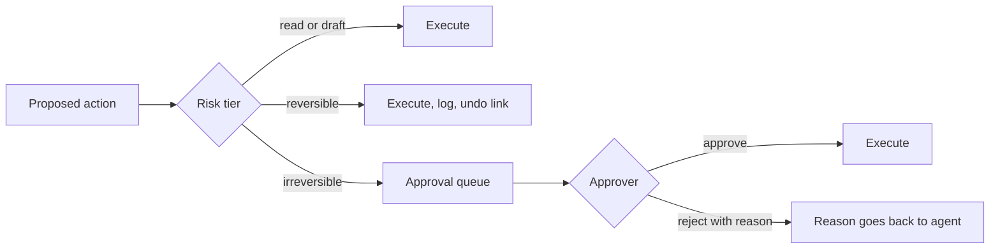

What makes an approval real instead of a rubber stamp:

- Show the exact action, not the intent. "Send this email (shown below)" beats "agent wants to contact the customer."
- Batch and rank. Ten approvals sorted by risk, with the risky one flagged, beat ten identical cards.
- Sample-audit the auto tier. Review 5% of auto-executed actions later; the disagreement rate tells you when a tier is set wrong.
- Feed rejections back. A rejection with a reason trains the policy gate and gives the agent context to retry.

Thresholds worth committing to for a support agent (adjust per domain): auto-execute below $50, one-click approve $50 to $500, second reviewer above $500 or for anything touching more than about 100 users. Assumption: reversibility is priced in, so an irreversible $60 action outranks a reversible $400 one.

**Follow-up questions:**

- _Async or blocking approvals?_ Blocking kills throughput. Prefer async: the agent parks the action, does other work, and resumes when the decision arrives. This needs the journaling from Q1.3.
- _Who approves at 3am?_ If the answer is nobody, then actions above the auto tier queue until morning, and the SLA says so. An approval gate with no approver quietly becomes fail-open.

## 2. Prompt & Context Engineering

### Q2.1: You have a 200k-token context window. How do you budget it?

**Headline answer:** Treat it like a memory hierarchy, not a bucket. Fixed costs first (system prompt, tool definitions), then variable costs in priority order (retrieved context, then history), with a hard reserve for the output. The goal is not to fill it to 200k. Answer quality drops well before the limit, so aim for a working set well under capacity and order the layout so the prompt cache stays warm: stable content first, changing content last.

A budget for one production turn (assumption: coding or support agent, 200k window):

| Slot                       | Budget    | Notes                             |
| -------------------------- | --------- | --------------------------------- |
| System prompt and policies | 2 to 5k   | Fixed, cache-friendly, goes first |
| Tool definitions           | 2 to 8k   | Fixed; prune tools nobody calls   |
| Durable memory             | 1 to 2k   | Curated, not transcripts          |
| Retrieved context          | 5 to 20k  | Reranked top-k, not raw top-50    |
| History                    | 20 to 80k | Compacted past this (Q2.4)        |
| Current tool results       | 5 to 30k  | Truncate tool output at the tool  |
| Output reserve             | 4 to 16k  | Never let input squeeze output    |

Two rules do most of the work. First, order stable to changing. The cache matches a prefix, so put the system prompt and tools first (they never change), then history (append-only), then the user turn (changes every time). Second, every token has to earn its place. The failure mode of a big window is not overflow, it is dilution: the model weighs 150k tokens of noise against 200 tokens of signal. Trimming tool output (return the 40 useful lines, not the 4,000-line log) improves quality, not just cost.

**Follow-up questions:**

- _How do you know quality is dropping?_ Run your task's eval set at different context lengths. If accuracy at 120k of realistic context is 8 points below the same task at 20k (a common gap), this budget is corrective, not cautious.
- _What gets dropped first under pressure?_ Oldest tool results (replaced by one-line summaries), then middle turns. Never the system prompt, the current request, or the output reserve.

### Q2.2: Few-shot prompting or fine-tuning?

**Headline answer:** Prompting is the default. Fine-tuning is an investment you make only when three things are true at once: the task is stable, you have thousands of labeled examples, and there is a cost or latency reason a prompted model cannot meet. Most teams that fine-tune early buy a maintenance burden to solve what two days of prompt work would have fixed.

| Factor           | Favors prompting         | Favors fine-tuning                                              |
| ---------------- | ------------------------ | --------------------------------------------------------------- |
| Task drift       | Changes weekly           | Frozen for months                                               |
| Data             | Under about 500 examples | 5k or more clean examples                                       |
| Gap              | Model lacks instructions | Model lacks a behavior (format, style, tool patterns)           |
| Cost and latency | Fine as is               | Need small-model speed with big-model behavior on a narrow task |
| Iteration        | Deploy is a prompt edit  | Deploy is retrain, re-eval, redeploy                            |
| Freshness        | Facts change (use RAG)   | Behavior, not facts                                             |

The order I actually use: zero-shot with a clear spec, then few-shot with 3 to 8 varied examples that carry edge cases, then RAG if the gap is knowledge, then fine-tuning (usually LoRA on a small model) only if the gap is behavior at scale. A common win: distill a big model's outputs on your narrow task into an 8B model. It runs 10 to 30 times cheaper and 2 to 5 times faster, at similar quality on that narrow task (assumption: the task really is narrow and your eval set proves parity).

**Follow-up questions:**

- _Fine-tuning made the model worse on X. Why?_ It got better on your data and worse off it. This is why the eval suite must include out-of-domain checks before and after.
- _Can you fine-tune knowledge in?_ Poorly. Weights are a lossy store you cannot update cleanly. Facts belong in retrieval, where you can fix them one at a time. Fine-tune for form, retrieve for facts.

### Q2.3: How do you version, test, and ship prompt changes?

**Headline answer:** Treat prompts as code. They live in git, render from templates, carry a version ID into every trace, and no prompt change ships without an eval run. A one-word edit can move task accuracy by double digits, and without evals your users find out first.

```python
# Every LLM call logs (prompt_name, prompt_version, model) into the trace.
# "Which prompt produced this bad output?" should be a query, not a hunt.
def render(template, **vars):
    missing = required_vars(template) - vars.keys()
    if missing:
        raise ValueError(f"unbound prompt vars: {missing}")  # fail loud, not blank
    return fill(template, vars)
```

The pipeline, in order:

1. CI gate: the eval suite runs on the changed prompt; merge blocks if the score drops past the noise band (Q4.5).
2. Canary: 5 to 10% of traffic on the new version, comparing online proxies (Q5.2) and sampled judge scores for a day or two.
3. Rollback is a config flip, not a deploy, because the old version is still registered.

Two things people miss. Prompts are tied to a model: a prompt tuned on model A is untested on model B, so pin model versions and treat a provider's silent model upgrade as a change you did not review. And templates need their own tests, because the classic silent bug is a variable that renders empty and ships "Answer the user's question: " to production.

**Follow-up questions:**

- _An eval-passing change still caused an incident. How?_ The eval set missed the traffic slice that broke (Q5.1), or the change interacted with a tool description the evals stubbed out. Integration evals with real tool definitions catch the second kind.
- _How do you review a prompt diff?_ Like code, plus a behavior diff: run both versions on 50 fixed inputs and read the output diff, because the text diff does not predict the behavior diff.

### Q2.4: An agent runs for hours and the transcript outgrows any window. How do you manage context over a long run?

**Headline answer:** Compact, do not truncate, and compact into structure, not prose. Every so often, distill the run into a typed state block (goal, decisions, files touched, open questions, next steps), drop the raw middle turns, and keep verbatim only the system prompt, the state block, recent turns, and the artifacts the next step needs. The test of a good compaction: could a fresh agent resume from it alone? If not, it is a summary, not a checkpoint.

```python
# Compact when the context crosses a threshold. The state block replaces
# the raw middle turns; system prompt and recent turns stay verbatim.
STATE_FIELDS = ["goal", "constraints", "done", "artifacts",
                "decisions", "failed_attempts", "next"]
```

Details that decide whether this works:

- Compact at boundaries, not mid-step. After a subtask finishes, its results are easy to summarize. Mid-step, you cut off working state.
- The `failed_attempts` field is the highest value one. Without it, the agent retries the same broken approach after every compaction. This is the signature failure of long runs.
- Keep constraints word-for-word. A summarizer that turns "never push to main" into "be careful with git" has created an incident.
- Better than compressing bloat is not ingesting it. Truncating tool output (Q2.1) delays the first compaction by hours.

**Follow-up questions:**

- _How do you evaluate compaction?_ Run a task, compact at the halfway point, hand the compacted context to a fresh agent, and measure completion against the no-compaction baseline. Expect single-digit loss. Double digits means the schema is dropping state.
- _Why structured instead of a prose summary?_ Prose drifts into narrative ("the agent worked hard on...") and loses the exact strings, like file paths and IDs, that the resumed agent needs literally.

## 3. RAG & Retrieval Quality

### Q3.1: How do you measure retrieval quality separately from generation quality?

**Headline answer:** Split them, or you cannot debug. Retrieval gets classic search metrics, above all recall@k (was the needed evidence in the k chunks at all), plus MRR or nDCG for ranking, scored against a labeled set of query to relevant-chunk pairs. Generation gets faithfulness (is the answer supported by the retrieved text), scored by a judge. A wrong answer with correct retrieval is a generation bug. A wrong answer with failed retrieval is an indexing or chunking or query bug. Different fixes, so they must be different numbers.

```python
def recall_at_k(results, relevant, k):
    return len(set(results[:k]) & relevant) / len(relevant)

# Eval set: 100 to 300 real queries, each labeled with the chunk IDs
# that answer it. A few annotator-days turns every retrieval change
# from a guess into a number.
```

The debugging table this unlocks:

| recall@k | Faithfulness                 | Diagnosis                                | Fix lives in                                       |
| -------- | ---------------------------- | ---------------------------------------- | -------------------------------------------------- |
| High     | High                         | Healthy                                  | Nothing                                            |
| Low      | Anything                     | Retrieval misses the evidence            | Chunking, embeddings, query rewrite, hybrid search |
| High     | Low                          | Model ignores or contradicts the context | Prompt, model choice, context position             |
| High     | High but answers still wrong | Eval set stale, or the source is wrong   | Data pipeline, not the RAG stack                   |

Targets I would commit to for production doc-QA (assumption: curated corpus, factoid to analytical queries): recall@10 at 0.9 or better, faithfulness at 0.95 or better. Below 0.85 recall, no amount of generation-side prompting saves the product, because the model cannot cite what it never saw.

**Follow-up questions:**

- _Recall against what? How do you get labels?_ Start synthetic: generate questions from chunks, so the chunk is the label. Then add labeled real queries from logs. Synthetic-only overstates recall because generated questions reuse the chunk's own words (Q4.4).
- _End-to-end score dropped after a 'better' embedding model shipped. How?_ Better average similarity is not better recall on your data. That is exactly why retrieval has its own metric gating deploys.

### Q3.2: How does chunking work, and what are its trade-offs?

**Headline answer:** Chunking sets the unit of retrieval, and the tension is simple: small chunks match precisely but lack the context to answer, while large chunks answer well but match fuzzily and drag in noise. The better move is to refuse the trade-off: retrieve small, return big (parent-child), and respect document structure instead of counting characters.

| Strategy                | Size                             | Strength                                           | Weakness                                         |
| ----------------------- | -------------------------------- | -------------------------------------------------- | ------------------------------------------------ |
| Fixed size with overlap | 300 to 800 tokens                | Simple, predictable                                | Splits mid-thought; overlap duplicates the index |
| Structure-aware         | Varies                           | Chunks are real units; keeps tables and code whole | Needs parsers; messy docs defeat it              |
| Parent-child            | Child 200 to 400, parent 1 to 2k | Precise match and full context                     | Index bookkeeping                                |
| Semantic                | Varies                           | Handles unstructured prose                         | Costly to build, unstable boundaries             |

Defaults I would state (assumption: mixed technical docs): structure-aware chunks of 400 to 800 tokens, parent-child with children near 300, and a context header on every chunk (document title plus section path), because "the limit is 100 requests per minute" on its own is unfindable for "what is the rate limit for the ingest API?" Never split a table or a code block.

```python
def contextualize(chunk, doc, section_path):
    # "API Reference > Ingest > Rate limits" + the chunk body.
    # One line of metadata often moves recall several points.
    return f"{doc.title} > {' > '.join(section_path)}\n\n{chunk}"
```

**Follow-up questions:**

- _How do you pick the numbers for your corpus?_ Sweep chunk size, overlap, and child size on the labeled set from Q3.1, then pick by recall first and answer quality second. Anyone naming universal best numbers without a labeled set is quoting a blog post.
- _What about questions whose answer spans many chunks?_ Aggregation queries ("compare X across all services") beat top-k retrieval by design. Route them differently: metadata filters plus map-reduce over sections, or a graph-style index. Do not pretend k=40 solves it.

### Q3.3: Models have 200k to 1M context now. When does RAG still beat stuffing everything in?

**Headline answer:** Long context killed RAG for small, static corpora. If the whole knowledge base is 50k tokens, stuff it and cache it. RAG survives on four things long context cannot buy: scale (millions of docs do not fit), cost (paying for 500k tokens to use 2k is 100 to 250 times too much), freshness (an index updates in seconds; a stuffed context is a snapshot), and permissions (retrieval filters by who is allowed to see what; a stuffed context shows everyone everything).

A cost comparison (assumption: about $3 per million input tokens, 10k queries a day):

| Approach                   | Tokens per query | Cost per query                 | Cost per day      |
| -------------------------- | ---------------- | ------------------------------ | ----------------- |
| Stuff a 400k-token corpus  | ~400k            | ~$1.20 uncached, ~$0.12 cached | $12,000 or $1,200 |
| RAG, top-8 reranked chunks | ~4k plus prompt  | ~$0.02                         | ~$200             |

Even with perfect caching, stuffing costs about 6 times more here, and caching assumes the corpus is identical across queries, which per-user permissions break at once. Quality is not a free win either: facts spread across hundreds of thousands of tokens recall worse than the same facts alone in a 4k window (the dilution from Q2.1).

The honest summary: the two approaches merged. Production systems in 2026 use retrieval to pick a generous working set (tens of chunks, not 3) into a large window. Long context made RAG's precision needs looser, not RAG unnecessary.

**Follow-up questions:**

- _When would you actually drop RAG?_ Corpus under about 100k tokens, static for weeks, same access rights for everyone, latency-sensitive: cache the whole thing as a stable prefix. An internal policy bot fits. Anything multi-tenant does not.
- _Doesn't retrieval add latency?_ About 50 to 200ms to embed, search, and rerank, against seconds saved by not prefilling hundreds of thousands of tokens. At scale, retrieval usually wins on latency too.

### Q3.4: Dense, sparse, or hybrid search, and where does reranking fit?

**Headline answer:** Hybrid by default. BM25 catches exact identifiers (error codes, function names, SKUs), where embeddings are weakest. Dense vectors catch paraphrase ("app crashes on launch" and "startup failure"). Fuse them with RRF so you never tune score scales against each other. Then a cross-encoder reranker over the fused top-50 buys the biggest single quality jump in the stack, for about 30 to 80ms.

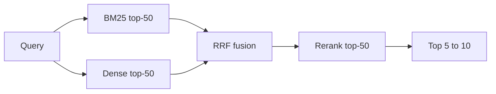

```python
def rrf(rankings, k=60):
    scores = defaultdict(float)
    for ranking in rankings:
        for rank, doc_id in enumerate(ranking, 1):
            scores[doc_id] += 1.0 / (k + rank)   # rank-based, no score tuning
    return sorted(scores, key=scores.get, reverse=True)
```

Why the reranker earns its latency: a bi-encoder turns the query and each document into vectors on their own, which is cheap at scale but blind to how they interact. A cross-encoder reads the query and a candidate together and usually lifts precision@5 by 10 to 20 points on real corpora (assumption: general domain; verify on the Q3.1 labeled set). Wide cheap recall at k=50, then paid precision on just those 50, is the whole design.

**Follow-up questions:**

- _Latency budget end to end?_ Embed 10 to 20ms, vector search 10 to 50ms at millions of vectors, BM25 about 10ms, rerank 30 to 80ms. Roughly 150ms at p95, hidden under the start of response streaming.
- _What single change most helps a mediocre RAG stack?_ Usually query rewriting for conversational queries ("what about the second one?" is unsearchable without the chat history), or the reranker, in that order of cheapness. Swapping the vector database, the most common instinct, is almost never it.

## 4. Evals: Offline

### Q4.1: New agent product, zero evals. Where do you start, and what does week one versus month one look like?

**Headline answer:** Start with 20 to 50 real cases and simple assertions, not a framework and not an LLM judge. Build the eval pyramid from the bottom: deterministic checks (cheap, trusted, run on every commit), then golden-set comparisons, then LLM-judge rubrics (expressive, but they need calibrating), then a little human review to anchor the whole thing. An eval suite you do not trust is worse than none, because it stamps a green check on bad changes. So each layer earns trust before the next one leans on it.

| Layer        | Checks                                                                     | Cost                     | Trust                         |
| ------------ | -------------------------------------------------------------------------- | ------------------------ | ----------------------------- |
| Assertions   | JSON parses, fields present, right tool called, latency and token ceilings | ~free                    | Total                         |
| Golden set   | Output matches a labeled expectation                                       | Cheap                    | High                          |
| LLM judge    | Rubric quality: grounded, complete, right tone                             | ~$0.01 to $0.05 per case | Only after calibration (Q4.2) |
| Human review | 20 to 50 sampled cases a week; anchors the judges                          | Expensive                | The anchor                    |

Week one is small: pull 30 real inputs, write assertion checks per case, wire it into every prompt or model change, fix what it catches. Month one: 150-plus cases grouped by traffic slice (intents, difficulty, languages), a calibrated judge for the fuzzy dimensions, CI gating (Q4.5), and a failure dashboard instead of a single pass rate.

The step people skip and regret: turn production failures into evals. Every incident and every bad-feedback trace becomes a case. Six months in, the suite is a record of every way the system has failed, which is exactly what you want to never break twice.

**Follow-up questions:**

- _Why not start with the judge? It is more flexible._ Because an uncalibrated judge is a confident random number generator, and you have no human baseline yet to calibrate it against. Assertions have no false positives. Start where trust is free.
- _What pass rate should you launch at?_ Wrong frame. 95% on assertions plus a known, bounded set of failures beats 99% on a suite that never covered the risky slices. The launch question is what fails, how badly, and how often, not a single number.

### Q4.2: LLM-as-judge: which biases bite, and how do you correct for them?

**Headline answer:** Four biases cause most of the damage. Position bias: in a pairwise comparison, the answer shown first wins more. Verbosity bias: longer answers score higher at equal correctness. Self-preference: models favor their own family's style. Framing bias: labels like "expert answer" sway the score. All four have simple fixes, and the rule underneath is that a judge is a measuring instrument. Uncalibrated against humans, it measures nothing.

The fixes, in order of payoff:

- Position: run each comparison both ways and require agreement. Report the disagreement rate on its own. Above about 15%, the rubric is too vague for the judge to hold an opinion.
- Verbosity: grade against criteria, not vibes. Replace "which is better?" with 3 to 5 yes/no items ("cites the source: yes or no"). Yes/no items also make disagreements easy to diagnose.
- Self-preference: judge with a different model family than the one being judged, or use a panel of 3 cheap judges with a majority vote. A panel is often better calibrated than one expensive judge, at similar cost.
- Framing: strip metadata. The judge sees anonymized text only, with no model names and no "this is our new version."

Calibration is not optional. Collect 100 to 200 human labels, measure judge-to-human agreement with Cohen's kappa, and re-check quarterly, because rubric drift and model updates both move it quietly. Targets: kappa at 0.7 or better to gate CI, 0.5 to 0.7 for trend-only, below 0.5 the judge is noise. Report kappa next to the scores. A score without its kappa is an anecdote.

```python
def cohens_kappa(judge, human):
    po = mean([j == h for j, h in zip(judge, human)])          # observed agreement
    pe = sum((judge.count(c)/len(judge)) * (human.count(c)/len(human))
             for c in set(judge) | set(human))                 # chance agreement
    return (po - pe) / (1 - pe)
```

**Follow-up questions:**

- _Your judge agrees with humans 85% of the time. Good?_ Meaningless without the base rate. If 80% of outputs pass, a judge that always says "pass" scores 80% raw agreement. That is why kappa (chance-corrected) is the number, not raw agreement.
- _Can you use model A to judge a fight between model A and model B?_ Only with family separation or a panel, and say so. Self-judged wins have shown inflated win rates by double digits.

### Q4.3: How do you evaluate a multi-step agent, not just its final answer?

**Headline answer:** Score the outcome and the path as separate metrics, because they fail on their own. An agent can reach the right answer through a lucky, expensive, or dangerous path (good outcome, bad process, will not generalize), or run a perfect process defeated by a broken tool (bad outcome, good process, fix the tool). One combined number hides which part to fix.

| Level   | Metric               | How to measure                                                                                                                         |
| ------- | -------------------- | -------------------------------------------------------------------------------------------------------------------------------------- |
| Outcome | Task success         | Programmatic where possible: a good agent eval ends in a checkable state (tests pass, ticket closed, row correct), not a judge opinion |
| Path    | Tool choice          | Right tool per step, against a labeled reference (allow valid alternatives)                                                            |
| Path    | Argument correctness | Right parameters, the most common agent failure in practice                                                                            |
| Path    | Efficiency           | Steps and tokens against a reference; flag over 1.5 times as wandering                                                                 |
| Path    | Recovery             | After an injected tool failure, does it retry, replan, or spiral?                                                                      |
| Safety  | Boundary compliance  | Zero unauthorized tool calls, a hard gate, not an average                                                                              |

The highest-leverage trick here is fault injection: run the same tasks with a tool returning errors, empty results, or garbage, and measure recovery. Agents overfit to the happy path, and production is not the happy path. Second trick: milestone scoring for long tasks. Define checkpoints (found the bug, wrote a fix, tests pass) so a 40-minute run scores 2 of 3 instead of 0, which improves both the signal and the debugging.

**Follow-up questions:**

- _Paths are nondeterministic, and two valid ones differ. How do you label a reference path?_ Label constraints, not one path: required milestones, forbidden actions, a step budget. Score against the constraints. Exact-path matching builds an eval that punishes creativity.
- _This sandbox is expensive to build._ Yes, and it is the highest-ROI eval investment, because it also serves as the attack testbed (Q7) and the regression environment. Start with mocked tools (cheap, catches argument bugs) and graduate the top tasks to real sandboxes.

### Q4.4: Golden datasets versus synthetic data. How do you actually build the eval set?

**Headline answer:** Both, in order, with clear eyes about each one's lie. Golden data (human-labeled, from real traffic) is the truth but is slow, costly, and always lagging your traffic. Synthetic data (model-generated) is instant and endless but easier than reality, because the generator writes questions that echo the source text and skips the mess real users bring. The pattern: synthetic for breadth and cold start, golden for truth and calibration, production failures as the steady stream that keeps it honest.

| Source                           | Cost        | Fidelity                           | Role                                        |
| -------------------------------- | ----------- | ---------------------------------- | ------------------------------------------- |
| Hand-written by the team         | High effort | Reflects the builders' assumptions | The first 30 cases; the edge cases you fear |
| Mined from real traffic, labeled | Medium      | Highest, the real distribution     | The core set, refreshed monthly             |
| Synthetic from the corpus        | ~free       | Medium, too clean                  | Coverage and volume                         |
| Production failures              | ~free       | Perfect, the actual misses         | A regression suite that only grows          |

Making synthetic data honest means prompting the generator for hardness: force distractor-heavy questions (answerable only by combining two chunks), add persona noise (frustrated, typos, missing detail), and generate adversarial variants of golden cases (paraphrase, reorder, add an irrelevant constraint). Then have a human skim 50. Ten minutes of reading catches a generator writing quiz questions instead of user questions.

Two rules that are non-negotiable:

- Hold-out discipline. The moment an eval case shapes a prompt change, it is training data. Keep a never-look hold-out slice (even 30 cases) to catch when you have overfit the visible suite.
- Contamination check. If your eval set comes from a public benchmark, assume the model trained on it. Scores are inflated and cross-model comparisons are meaningless. Private data from your own traffic is the only clean signal.

**Follow-up questions:**

- _How big does the set need to be?_ Enough per slice to detect the change you care about. About 100 cases per slice catches 10-point swings; 4-point swings need about 500 (assumption: yes/no metric near 0.8, 95% confidence). One aggregate number over 40 cases catches almost nothing.
- _Annotators disagree. Now what?_ Measure inter-annotator agreement first. If humans reach only kappa 0.6 on a dimension, that is the ceiling for any judge on it. Fix it by tightening the rubric, not by quietly majority-voting the ambiguity away.

### Q4.5: How do you design the CI gate, and when does a model or prompt change ship?

**Headline answer:** It ships when the eval suite says it is not worse than the baseline beyond noise, on any protected slice. So the gate is a statistical comparison, not a threshold. LLM outputs are stochastic: the same suite run twice can move 2 to 3 points. A gate that ignores variance either blocks good changes (noise looks like a regression) or passes bad ones (a regression looks like noise).

```python
def bootstrap_delta(base, cand, n=10000):
    # Paired bootstrap on the pass-rate delta. Same inputs for both arms,
    # which kills most of the variance.
    deltas = []
    idx = arange(len(base))
    for _ in range(n):
        s = choice(idx, len(idx), replace=True)
        deltas.append(mean(cand[s]) - mean(base[s]))
    return percentile(deltas, 2.5), percentile(deltas, 97.5)
# CI entirely below zero: regression, block. Entirely above: improvement.
# Straddles zero: within noise, pass but log the trend.
```

A gate architecture that works:

| Tier  | Runs on                           | Contents                                                   | Budget         |
| ----- | --------------------------------- | ---------------------------------------------------------- | -------------- |
| Smoke | Every commit                      | 20 to 30 assertion cases                                   | ~2 min, ~$0.50 |
| Full  | Merge, or any prompt/model change | Full suite, 3 runs per case, per-slice deltas              | ~20 min, ~$20  |
| Deep  | Weekly and before releases        | Full plus hold-out plus agent sandbox plus fault injection | Hours          |

The non-negotiables: pair the runs (same cases both arms, which halves the samples needed for the same power), run 3 times and average (a single sample of a stochastic system is a coin flip), gate per slice (an overall +2 can hide a refunds slice at minus 15), and pin everything (model version, temperature, tool defs, seeds) so a failure blames the change, not the environment.

**Follow-up questions:**

- _The gate is green but you are suspicious. What do you look at?_ The per-case diff, not the rate: which cases flipped each way. Ten flips each way that net to zero is a behavior change the aggregate hides, and reviewing flipped cases routinely catches rubric gaps the score misses.
- _Someone wants to cut the runs from 3 to 1 to save money._ Show them the variance: run the same candidate 5 times at one run each and watch the verdict flip. $20 against an undetected regression reaching users is not a close call. Retiring redundant cases is the fair version of that ask.

### Q4.6: Same prompt, same model, different results each run. How do you evaluate honestly?

**Headline answer:** Stop pretending it is deterministic. Even temperature 0 is not bit-stable across providers, because batching, hardware, and silent model updates all move outputs. Honest evaluation treats each case as a distribution: run it k times, report pass rate and consistency, and make release comparisons statistical (Q4.5). The metric most teams miss is consistency, the share of cases where all k runs agree. A system that is right 80% of the time on every case and one that is always right on 80% of cases and never on the rest have the same pass rate and very different behavior.

```python
def suite_metrics(dists):   # each dist = (passes, k) per case
    return {
        "mean_pass":   mean([p / k for p, k in dists]),
        "consistency": mean([p in (0, k) for p, k in dists]),   # all-agree rate
        "flaky":       [i for i, (p, k) in enumerate(dists) if 0 < p < k],
    }
# Flaky cases are the interesting ones: the model is genuinely unsure there.
# They cluster on vague rubrics, borderline difficulty, or fragile prompts.
```

Where the randomness comes from, and what you can pin:

| Source                               | Controllable? | Action                                                                  |
| ------------------------------------ | ------------- | ----------------------------------------------------------------------- |
| Sampling temperature                 | Yes           | Evaluate at the production temperature                                  |
| Provider batching and hardware       | No            | Accept it; this is why k is over 1                                      |
| Silent model updates behind an alias | Yes           | Pin versions; treat upgrades as a gated change                          |
| Tool or environment state            | Yes           | Sandboxed, reset-per-run environments (Q4.3)                            |
| Path divergence in agents            | Partly        | Small step-1 differences compound; use milestone and constraint scoring |

For agents the compounding matters: 95% consistency per step over 10 steps is about 60% consistency for the whole path. Computing that number for your own system usually reframes "the agent is flaky" from a model complaint into a step-count and checkpointing decision.

**Follow-up questions:**

- _Three runs triples the eval cost. Justify it._ Only the full tier runs 3 times; smoke stays at 1. Paired comparisons plus consistency reporting save the engineering time you would waste chasing noise regressions, which costs more than the tokens.
- _Should production sample several times and vote?_ For high-stakes classification, yes: sampling 3 to 5 and taking the majority buys real accuracy for linear cost, and the disagreement rate is a free confidence signal (used in the routing cascade, Q9.2).

## 5. Measuring Quality Online

### Q5.1: Offline evals are green but users are complaining. How do you debug it?

**Headline answer:** The eval suite and production have drifted apart, and the job is to find where. Pull the complained-about traces, cluster them, and for each cluster ask one question: is this an input the eval set never covered, an environment difference the harness stubbed away, or a quality dimension you never measured? Those are the only three ways green-but-broken happens, and each has a different fix.

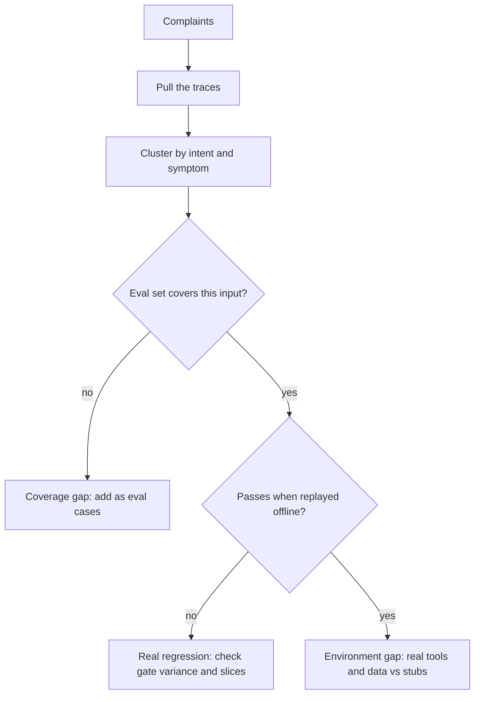

The usual causes, most common first:

1. Distribution drift. The eval set is frozen in March; August users ask different things. To confirm, embed eval inputs and a week of production inputs and compare. Clusters of live traffic with no eval coverage end the mystery. Fix: refresh from traffic monthly (Q4.4).
2. Environment gap. Offline used stub tools, clean data, single-turn inputs. Production has a flaky search API, messy records, and users who paste screenshots. Fix: integration evals with real tool definitions and recorded data.
3. Unmeasured dimension. The suite measures correctness; users complain about tone, latency, or length. Nobody wrote a rubric item for "sounds like a robot lawyer." Fix: add rubric items from the complaints.
4. Aggregate hides a slice. Overall 94%, enterprise slice 60%, and enterprise users are the ones complaining. This is why gates run per slice (Q4.5).

The discipline in every such incident: the complained-about traces become eval cases before the fix ships, so the fix is verified against them and they cannot silently regress again. Production failure to eval case to gated fix is the whole quality loop.

**Follow-up questions:**

- _Complaints are 0.1% of traffic. Is quality actually bad?_ Complainers are the visible tail. For every one who reports, several failed silently (support numbers run 10 to 25 times, directional not exact). Check behavioral proxies (Q5.2), like regeneration and abandonment, on the same slice to size the rest of the iceberg.
- _How fast should this loop run?_ Trace to eval case within a day; complaint clusters reviewed weekly. A quarterly eval refresh is a coverage gap with a calendar.

### Q5.2: You cannot run the eval suite on live traffic. What online metrics actually proxy quality?

**Headline answer:** Behavior beats survey. What users do with the output is more truthful and about 100 times more common than what they say about it. Thumbs ratings run 0.1 to 1% response rates with heavy bias (the angry and the delighted click; the middle does not). Regeneration, edit-before-use, copy or accept, abandonment, and escalation are signals every session emits. Plus the one direct measure that scales: an async judge scoring a sample of live traces. Evals did not stop at deploy; they moved online and went sampling-based.

| Signal                   | Proxies                    | Strength                   | Caveat                                  |
| ------------------------ | -------------------------- | -------------------------- | --------------------------------------- |
| Regeneration or retry    | Answer unsatisfying        | Strong negative            | Also fires on exploration               |
| Edit distance before use | Almost-right vs right      | Strong                     | Needs product instrumentation           |
| Copy, accept, or send    | Output was used            | Strong positive            | Rare to copy just to discard            |
| Escalation to human      | Agent could not finish     | Strong negative for agents | Watch for under-escalating to game it   |
| Abandonment mid-flow     | Gave up                    | Medium                     | Confounded by interruptions             |
| Follow-up rephrase       | First answer missed intent | Medium, cheap to detect    | None                                    |
| Thumbs up or down        | Explicit sentiment         | Weak but cheap             | Selection bias; use as a trend          |
| Async judge on samples   | Direct rubric quality      | Strongest overall          | Inherits the judge's calibration (Q4.2) |

The async judge is worth spelling out: sample 1 to 5% of traces (100% of certain slices, like new-feature traffic or high-value customers), run the calibrated judge out of band within minutes, and write scores back onto the traces. At 100k requests a day, 2% sampling, and about $0.02 per judgment, that is roughly $40 a day for a continuous quality time series, the cheapest monitoring you will buy for what it catches (drift, bad deploys, provider model changes).

**Follow-up questions:**

- _Which single number goes on the exec dashboard?_ A composite task-success proxy per product area (for support: resolved without escalation and no rephrase), validated against the judge score. Never thumbs; the response-rate denominator makes it noise at that level.
- _Users regenerate more after your improvement shipped. Regression?_ Check the denominator first. If the feature got more discoverable, new users regenerate more while learning it. Split the metric by cohort (existing versus new) before reverting anything (Q5.3).

### Q5.3: What is different about A/B testing LLM changes versus classic product A/B tests?

**Headline answer:** Three things. Variance is brutal, because open-ended quality metrics have huge spread, so naive designs need enormous samples. The unit of randomization must be the user or conversation, not the request, because swapping models mid-conversation contaminates both arms and confuses the user. And the metric is often itself a model (the async judge), so the metric has its own error bars and drift. One operational difference too: LLM changes ship behind flags, so the urge to skip the experiment is strong. Resist it for anything user-facing.

The design rules:

- Randomize by user (sticky), analyze per conversation. Cross-request contamination is real: users adapt their phrasing to what worked, memory persists across turns, and caches warm differently per arm.
- Use paired designs where you can. For non-interactive surfaces (summaries, draft emails) run both arms on the same inputs and judge pairwise, which is 5 to 10 times more sample-efficient. Interactive agents cannot be paired, so budget more samples.
- Adjust for pre-experiment covariates (CUPED). Using the user's prior metric level cuts the samples needed, often 30 to 50% for engagement metrics (assumption: decent week-over-week autocorrelation).
- Use sequential testing (always-valid p-values) instead of a fixed horizon, so you can stop early for harm without p-hacking by peeking.
- Watch guardrail metrics alongside the target: p95 latency, cost per conversation, refusal rate, escalation rate, guardrail trips. LLM changes have a habit of improving the target while quietly raising cost 40%.

```python
# Power check before launching, the step most often skipped.
# Metric "conversation resolved", base 70%, want to detect +3 points:
#   n per arm ~ 16 * p*(1-p) / delta^2 ~ 16 * 0.21 / 0.0009 ~ 3,700 conversations.
# At 500 eligible conversations/day split 50/50, that is ~15 days minimum.
```

**Follow-up questions:**

- _The judge says B wins, thumbs say A. Which do you believe?_ Check the judge's calibration on this experiment's traces first (sample 100, human-label, kappa), then check whether thumbs bias differs by arm (a chattier model begs more ratings). The judge usually wins after that check, but the check is mandatory.
- _Can you A/B test with 200 users total?_ Not for small effects on noisy metrics; the math says months. Options: pairwise offline comparison on recorded inputs (valid for non-interactive steps), interleaving, or accept that you can only detect large effects and say so.

### Q5.4: Deploy is done. What does continuous quality monitoring look like on day 30?

**Headline answer:** Four loops at different speeds, all writing to the same place. Real-time guardrail and error monitoring alerts in minutes. Hourly or daily judge scores and behavioral proxies catch drift and slow regressions. Weekly human review of sampled and flagged traces catches new failure modes and rubric drift. Monthly eval-set refresh keeps the offline suite in step with reality. The system is healthy when a question like "did last Tuesday's deploy hurt enterprise users?" is answerable from stored data in minutes.

| Loop                | Cadence   | Watches                                            | Acts via                                      |
| ------------------- | --------- | -------------------------------------------------- | --------------------------------------------- |
| Guardrail and error | Real-time | Trip rates, refusals, tool failures, latency, cost | Pager, auto-rollback on threshold             |
| Judge and proxies   | Hourly    | Quality by slice, regeneration, escalation         | Alert on deviation from baseline              |
| Human review        | Weekly    | 30 to 50 traces: flagged, complained, random       | New eval cases, rubric updates, recalibration |
| Eval refresh        | Monthly   | Traffic versus eval-set distribution               | New golden cases, retire stale ones           |

The alert design that separates teams who trust their monitoring from teams who mute it: alert on deviation from a trailing baseline per slice, not on an absolute threshold. "Judge score below 4.0" fires forever once the traffic mix shifts. "Enterprise slice 3 sigma below its 14-day mean" fires when something changed. And every alert links to the traces, because an alert you cannot drill into gets muted within a month.

One more loop that costs almost nothing: a canary probe. Replay a fixed set of 50 inputs against production daily and diff the outputs against reference answers. When a provider silently updates a model behind an alias, the canary catches it within a day, before users file complaints. It is the LLM version of a synthetic uptime check.

**Follow-up questions:**

- _Quality score dropped 0.3 overnight. What are the first 10 minutes?_ Slice it (which segment moved), overlay deploys and provider status, check the canary (provider change versus your change), then read 10 flagged traces. The point of the setup above is that this is four queries, not four meetings.
- _Who owns this?_ A named on-call rotation with runbooks, same as any production service. "The ML team collectively" means nobody. Quality incidents deserve the same ownership as availability incidents.

## 6. Guardrails

### Q6.1: How do you design the guardrail architecture for an agent that can write to production systems?

**Headline answer:** Guardrails are layers at every trust boundary, with deterministic checks before model-based ones. An input layer controls what reaches the model. A tool-call layer controls what the model is allowed to do, and for a write-capable agent this is the layer that matters most. An output layer controls what reaches the user or downstream systems. The principle: the model proposes, the policy layer decides. No safety property may depend only on the model following instructions, because instruction-following is probabilistic and attackers get unlimited tries.

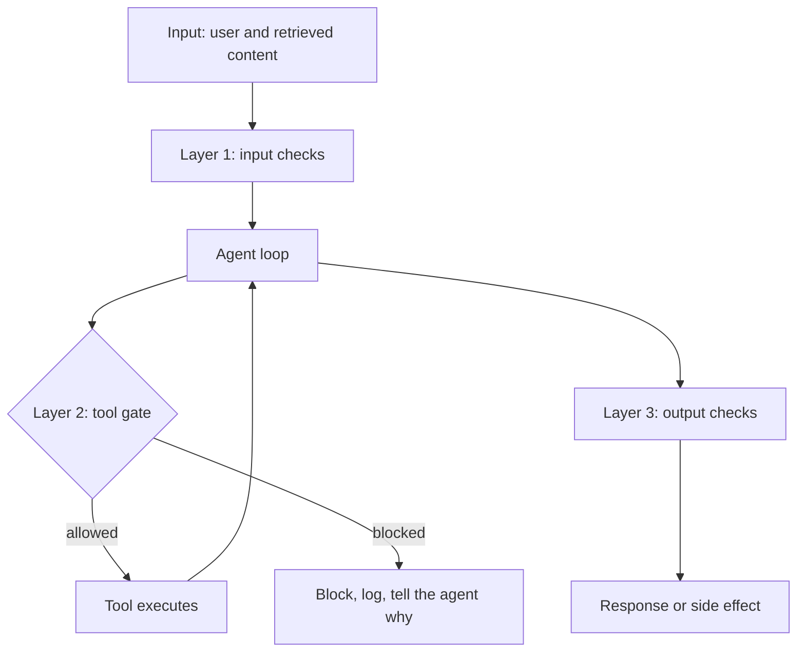

Layer 2 is where a write-capable agent lives or dies, so here are its checks:

| Check                          | Example                                                      | Type                  |
| ------------------------------ | ------------------------------------------------------------ | --------------------- |
| Tool allowlist per context     | A support agent cannot call `deploy` even if the tool exists | Deterministic         |
| Schema and bounds on arguments | `refund.amount` at most 50; no `DROP` in a query             | Deterministic         |
| ID bound to the session        | The order ID must belong to the logged-in user (Q1.1)        | Deterministic         |
| Rate and blast-radius limits   | 5 writes a minute; at most 100 rows; no bulk ops             | Deterministic         |
| Risk-tiered approval           | Irreversible or high-value goes to a human (Q1.5)            | Process               |
| Intent-action check            | Does this call plausibly serve the request?                  | Model-based, advisory |

The ordering logic: deterministic checks are free, instant, and never wrong about what they encode, so they go first and they block. Model-based checks (injection classifiers, intent checks) catch what rules cannot express but are probabilistic, so they advise and downgrade to an approval tier rather than being the only barrier for anything serious.

**Follow-up questions:**

- _The model gets around a blocked call by chaining two allowed calls._ Right instinct: guardrails must bound effects, not just single calls. That is why blast-radius limits (rows touched, total spend per session) accumulate across calls, not per call.
- _Doesn't the agent get confused when a call is blocked?_ Blocks return a structured reason to the agent ("refund over the auto-limit, escalate or ask for approval"), which turns a dead end into a replan. Silent blocks cause retry loops and made-up success claims.

### Q6.2: When do guardrails fail open versus fail closed?

**Headline answer:** Decide per check by weighing the cost of a wrong block against the cost of a missed catch. A check that protects availability (a moderation sidecar times out) can fail open with logging when the harm it prevents is rare and reputational. Anything protecting money, data, or an irreversible action fails closed. An approval gate whose approver service is down means the action queues, not proceeds (the 3am rule from Q1.5). The unacceptable answer is not having decided, because then the incident decides for you.

| Check                      | If it fails             | Stance                                              | Reason                                                                                |
| -------------------------- | ----------------------- | --------------------------------------------------- | ------------------------------------------------------------------------------------- |
| Input injection classifier | Cannot score inputs     | Open, flag, drop write tools                        | Blocking all traffic for a probabilistic check overpays; but go read-only while blind |
| PII redactor               | Cannot redact           | Closed for external calls, open within the boundary | Leaking regulated data beats latency                                                  |
| Tool-call policy engine    | Cannot authorize writes | Closed, always                                      | This is the critical check; unauthorized writes are the worst case                    |
| Output moderation          | Cannot scan replies     | Open for low-risk, closed for regulated             | Product-dependent, decided in advance                                                 |
| Quality sampler            | No scores               | Open                                                | A monitoring outage is not a traffic outage                                           |

Two patterns make fail-closed livable, because the real reason teams fail open is fear of downtime:

- Degraded modes instead of on/off. Policy engine unreachable: the agent keeps working in read-only mode, writes queue for when it returns. Users get slower resolution, not an outage, and you get zero unauthorized writes.
- Local fallbacks for remote checks. Compile the tool gate's allowlist and bounds into the agent process (fast, always there); the remote engine adds the dynamic parts (user history, risk scores). Losing the remote piece costs precision, not the guarantee.

**Follow-up questions:**

- _Your fail-closed stance just caused a full outage at peak._ Fail-closed applies to the protected actions, not the whole product (the degraded-mode answer). If a guardrail outage takes down reads too, the blast radius was drawn wrong.
- _Who signs off on the stances?_ The same way you set an error budget: a table like the one above, reviewed by engineering, security, and product, versioned in the repo. Guardrail stances are product decisions in engineering clothes.

### Q6.3: What is the latency budget for guardrails, and how do you keep them from ruining the UX?

**Headline answer:** The budget is real but smaller than teams fear if the architecture is right. Run checks in parallel with each other and with the main call, use small fast models for classification, and put slow checks where the user is not waiting. A typical interactive budget: 50 to 100ms added before the model, near zero felt during streaming (checks run on the buffer), and after the fact for anything advisory. Deterministic checks are microseconds, so the whole budget conversation is about the model-based ones.

| Check                                    | Latency      | Placement                                                                                                      |
| ---------------------------------------- | ------------ | -------------------------------------------------------------------------------------------------------------- |
| Regex, rules, schema                     | Under 1ms    | Anywhere, free                                                                                                 |
| Small classifier (injection, PII, topic) | 5 to 30ms    | Run in parallel with the main call's prefill; cancel on a hit, so added latency is near zero on the clean path |
| Small LLM check                          | 100 to 500ms | Parallel to the main call, or on the buffered stream                                                           |
| Frontier judge                           | 0.5 to 3s    | Async only, or before a queued write where seconds do not matter                                               |

Streaming is where naive guardrails visibly break, because you cannot moderate an answer already on the screen. The pattern is buffered streaming: hold the first 30 to 60 tokens (enough for classifiers to read intent), check the buffer, then release and keep scanning sentence by sentence with the ability to cut mid-stream. This adds 200 to 400ms to the first token, which users do not notice, and you keep the kill switch. For tool calls there is no UX pressure at all, since the user is not watching an API call, so a 300ms policy check before a write is free. Spend the budget where the stakes are, not where the spinner is.

```python
async def guarded_call(inp):
    main = start(model.stream(inp))        # start immediately
    checks = start(run_input_checks(inp))  # in parallel
    if (await checks).blocked:
        main.cancel()
        return refusal(reason=checks.result)
    return buffer_and_scan(await main, hold_tokens=48)
```

**Follow-up questions:**

- _Security wants a frontier-model review on every response. Latency says no. Resolve it._ Tier it: frontier review on the risky slices (flagged inputs, write-adjacent turns, new users) in real time, sampled review everywhere else. Reviewing 100% with a frontier model in real time is neither needed (most traffic is clean) nor sufficient (still probabilistic). With the trip-rate data, that usually lands.
- _What is the false-positive budget?_ Explicit and monitored, for example at most 0.5% of clean interactions blocked, measured by sampling blocks for human review. Guardrail false positives are a quality regression, because users experience them as the product refusing to work.

### Q6.4: How do you guarantee an LLM's output matches a schema, and what is the fallback when it does not?

**Headline answer:** In order of strength: constrained decoding (the sampler cannot emit an invalid token, so it is correct by construction where supported), then API-native structured outputs or tool schemas (the provider enforces or strongly steers), then a validate-and-repair loop as the universal fallback. The rule: the schema is the contract, validation is the enforcement, and the repair loop is bounded. An unbounded retry on bad JSON is a cost incident.

```python
def structured_call(prompt, schema, max_repairs=2):
    out = model.generate(prompt, response_format=schema)
    for attempt in range(max_repairs + 1):
        try:
            return schema.validate_json(out)
        except ValidationError as e:
            if attempt == max_repairs:
                raise StructuredOutputError(raw=out, errors=e)   # surface, do not guess
            out = model.generate(repair_prompt(out, e), response_format=schema)
# The repair prompt includes the validator's actual errors; "fix the JSON"
# without them just re-rolls the dice. Validators also encode semantic rules
# (amount <= balance), because schema conformance is necessary, not sufficient.
```

Why this counts as a guardrail: every consumer of model output (the tool executor, the DB writer, the UI) is a place for garbage to enter. Enforcing the schema at the boundary makes bad output a countable event on the dashboard (a `schema_violation_rate`, Q8.1) instead of a crash three services later. Typed outputs are also free eval targets, since the assertion layer (Q4.1) falls out of them.

Practical notes: constrained decoding guarantees syntax, not sense, so a valid-looking tool call can still name an order that does not exist; keep semantic validation. Keep schemas shallow (deep nesting hurts both model accuracy and error messages), make enums closed ("one of these 6 intents," never "a string"), and version schemas like APIs, because the model's examples embed the old shape.

**Follow-up questions:**

- _Schema violation rate jumped from 0.2% to 4%. What happened?_ Almost always an upstream change: the model version moved (the canary in Q5.4 confirms in minutes), a prompt edit pushed the examples out of sync with the schema, or a new traffic slice hits a path with no format instructions. The rate is a change detector, which is why it is worth charting.
- _Why bound repairs at 2?_ Repair success is front-loaded: the first retry with the validator's errors fixes most failures. By the third try you are paying tokens to re-roll a systematic problem (a schema-prompt mismatch) that retries cannot fix. Bound it, alert when it runs out, and fix the cause.

## 7. Security & Prompt Injection

### Q7.1: What does indirect prompt injection look like as a concrete attack against an agent?

**Headline answer:** Direct injection is a user typing "ignore your instructions." It is annoying and mostly self-harm. Indirect injection is the real threat: malicious instructions arrive inside content the agent reads or is given, like a web page, an email, a document, or a tool result. The model cannot reliably tell your instructions from the data it read, because to the model it is all just tokens. Any agent that reads untrusted content and holds any privilege is exposed.

A concrete attack on an email agent that can read the inbox and send replies:

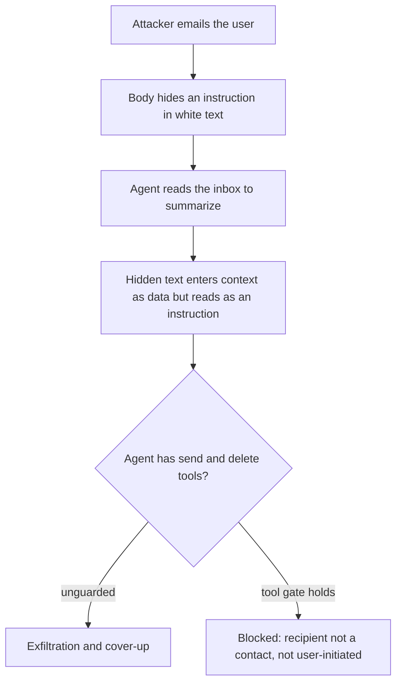

The pattern generalizes to a checklist of what makes an agent injectable:

| Precondition                    | Present here                                     | Cost to remove                              |
| ------------------------------- | ------------------------------------------------ | ------------------------------------------- |
| Reads untrusted content         | Reads any inbound email                          | The product; you cannot not read email      |
| Holds a privileged tool         | Can send and delete                              | Utility; a read-only agent is safe but weak |
| No provenance separation        | Injected text has the same authority as the user | Engineering; fixable (Q7.2)                 |
| Actions not tied to user intent | Acts on instructions from content                | Engineering; the real fix                   |

The framing worth naming: an agent that sees untrusted content, has access to private data, and can send data outside is able to exfiltrate by construction (the "lethal trifecta"). Break any one of the three for a given flow and that flow is safe. That is a design lever, not a prompt lever.

**Follow-up questions:**

- _Can't you just tell the model to ignore instructions in retrieved content?_ That is a probabilistic filter against an attacker with unlimited tries. It raises the bar, never closes the door (Q7.2). As a primary control it fails.
- _Where else does injected content hide?_ Anywhere the agent reads: tool outputs from a compromised API, file contents, image alt-text and EXIF, transcribed audio, code comments in a repo, even other agents' messages. Every input channel is an injection channel.

### Q7.2: Why don't guardrails and "ignore injections" prompts actually solve injection?

**Headline answer:** Because both are probabilistic filters against an attacker who gets unlimited free tries to find the one phrasing that slips through, and a 99% detector is a 1% hole an attacker will find. Injection is not a content-filtering problem you win by spotting bad strings. It is an architecture problem you win by making sure the model's compromise cannot cause harm: least privilege, provenance, and human gates on serious actions. Detection is a useful layer, never the guarantee.

The asymmetry, plainly: the attacker has unlimited retries, sees your published defenses, and needs one success. The defender must block every variant, every language, and every encoding (base64, look-alike characters, "spell it backwards"), forever. The defender does not win that outright.

So the design moves the goal from "detect the attack" to "contain the result":

| Control                            | What it does                                                                                                            | Why it beats detection                           |
| ---------------------------------- | ----------------------------------------------------------------------------------------------------------------------- | ------------------------------------------------ |
| Least-privilege tools per context  | The email agent literally cannot send to non-contacts                                                                   | A successful injection hits a wall, not a filter |
| Provenance / dual channel          | User instructions and retrieved content enter on separate labeled channels; only the user channel can authorize actions | Removes the ambiguity injection exploits         |
| Action-intent binding              | A serious tool call needs a matching request in the trusted channel                                                     | Injected "instructions" carry no authority       |
| Human approval on the irreversible | Exfiltration, spend, delete are gated (Q1.5)                                                                            | A compromised model still cannot act alone       |
| Tainting                           | Content derived from untrusted input is flagged; flagged data cannot flow into a privileged sink                        | Classic data-flow control, applied to context    |

Detection layers (injection classifiers, marking untrusted content, expected output shapes) still belong in the stack. They raise the attacker's cost and catch the lazy 95%. They sit on top of an architecture that is safe when they fail, not instead of it.

**Follow-up questions:**

- _So injection is unsolved?_ Detection is unsolved. Containment is a solved engineering discipline. The right posture is to assume the model will be compromised and make sure it cannot do damage, the same way we treat any component that handles untrusted input.
- _Prove your agent is safe._ Not with "we have never been injected," but by showing that even a fully compromised model cannot reach a harmful sink: the trifecta is broken, tools are least-privilege, serious actions are gated. Safety is a property of the architecture you can check by inspection, not the absence of observed attacks.

### Q7.3: How do you sandbox and permission tool calls so a compromised agent cannot pivot?

**Headline answer:** Treat the agent as untrusted code and apply the standard containment stack: least-privilege credentials scoped per agent and per session, an egress allowlist, an execution sandbox for any code or command tools, and effect limits that add up across calls. The mental model that gets it right is to design as if the model is already the attacker, because through injection (Q7.1) it can be, and then ask what that attacker can reach.

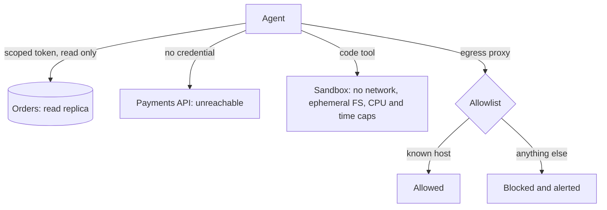

The controls, each mapped to the pivot it stops:

| Control                     | Stops                                    | In practice                                                                           |
| --------------------------- | ---------------------------------------- | ------------------------------------------------------------------------------------- |
| Least-privilege credentials | Reaching systems the task does not need  | Support agent token: read orders, refund up to 50; no user table, no deploy           |
| Short-lived session tokens  | Credential replay                        | Minted per session, minutes-long TTL, bound to the run                                |
| Egress allowlist            | Exfiltration to attacker infrastructure  | Outbound only to named hosts, by IP and DNS                                           |
| Code or command sandbox     | Remote code execution, host pivot        | Container or microVM: no network by default, ephemeral FS, CPU, memory, and time caps |
| Accumulating effect limits  | Slow-drip abuse under the per-call radar | Per-session caps: total spend, rows touched, files written                            |
| Full audit of tool I/O      | Undetected compromise                    | Every call, its arguments, and its result logged (Q8.1)                               |

The principle underneath: the agent's authority is the ceiling on the damage of its compromise. An agent with read-only, single-table, egress-locked access is a low-severity risk no matter how thoroughly it is jailbroken. Giving it a broad service account "so it can do whatever users need" is the actual vulnerability. The injection is just the trigger.

**Follow-up questions:**

- _The agent needs to browse arbitrary web pages and access customer data. Now what?_ That is the lethal trifecta by design, so split it. Browsing runs in an isolated, egress-controlled context with no customer data; a separate trusted step handles customer data; results cross the boundary as structured, validated data, never as instructions. If they truly cannot be separated, serious actions become human-gated.
- _Isn't per-session credential minting expensive?_ Marginal against the cost of one breach, and it is already standard for CI runners and serverless. Reuse the platform team's infrastructure; do not invent agent-specific auth.

### Q7.4: How do you red-team an agentic system before and after launch?

**Headline answer:** Red-teaming an agent is continuous adversarial evaluation wired into the same harness as your quality evals (Q4.3), plus periodic human or automated campaigns against the live system. The goal is not a one-time pentest sign-off. It is a growing set of attacks that must stay defeated, because every model update, prompt change, and new tool is a fresh chance to reopen a closed hole.

The surface to cover:

| Category            | Example probes                                                             | Pass condition                              |
| ------------------- | -------------------------------------------------------------------------- | ------------------------------------------- |
| Direct injection    | "Ignore instructions," role-play jailbreaks, encoding tricks               | Refuses or stays in scope                   |
| Indirect injection  | Poisoned documents, emails, web pages, tool results (Q7.1)                 | No unauthorized tool call fires             |
| Privilege and scope | Coax out-of-scope calls; chain allowed calls past a limit                  | Tool gate and effect limits block it (Q6.1) |
| Data exfiltration   | Trick the agent into leaking secrets, other users' data, the system prompt | Nothing crosses the boundary                |
| Excessive agency    | Ambiguous requests that tempt a destructive action                         | Escalates or asks, does not guess           |
| Denial of wallet    | Inputs that induce huge spend or infinite loops                            | Budget and loop limits cap it (Q9)          |

Attack cases are just eval cases with an adversarial assertion, and they run in the same suite, because injection defense that is not in CI regresses silently. A representative case: add a document with a hidden instruction to the corpus, ask the agent to summarize the latest policy doc, and assert that it never calls `send_email` to an external address regardless of what it "decided" to do.

Cadence: the automated attack suite on every deploy (fast, cheap, stops regressions), a human red-team campaign quarterly and before major launches (creative, finds new classes), and a bug bounty or continuous automated red-teamer for ongoing coverage. And every real incident and every newly published attack becomes a permanent case, so the suite holds institutional memory the same way the quality evals do. A defense with no running test is a defense you will lose to the next refactor.

**Follow-up questions:**

- _Red-team found a jailbreak. Ship-blocker?_ It depends on what it reaches. A jailbreak that makes the model say something rude is a quality bug. One that reaches a privileged action is a sev-1 architecture failure, because the containment of Q7.2 was missing. Severity is measured by the result, not by whether the model was fooled, since models can always be fooled.
- _How do you keep the attack suite current?_ Track public research and disclosures and treat the suite like dependency updates. Stale security tests are a false sense of safety, which is worse than none.

## 8. Observability & Tracing

### Q8.1: What do you log for every agent step, and why those fields?

**Headline answer:** Enough to replay and explain any decision after the fact without re-running it, because LLM failures are nondeterministic and "just reproduce it" is often not available. That means a structured trace: a run, session, and step hierarchy where each step records its inputs, the exact model and prompt version, the raw output, every tool call with arguments and results, and the tokens, cost, and latency. If you cannot answer "why did the agent do that?" from storage alone, you are not observable, you are guessing.

```python
# One step's trace. The clusters below map to the four questions you will ask.
StepTrace = {
    "run_id": ..., "session_id": ..., "step_idx": ...,   # hierarchy
    "model": ..., "model_version": ...,                  # pinned, not an alias
    "prompt_name": ..., "prompt_version": ...,           # ties to Q2.3
    "temperature": ..., "input_hash": ..., "raw_output": ...,
    "tool_calls": [...],                                 # name, args, result, error
    "guardrail_events": [...],
    "in_tokens": ..., "out_tokens": ..., "cached_tokens": ...,
    "cost_usd": ..., "latency_ms": ..., "ttft_ms": ...,
    "judge_score": ..., "error": ...,                    # judge written back async (Q5.2)
}
```

Why each cluster earns its bytes:

| Cluster                                                                         | Answers                                                                                                                     |
| ------------------------------------------------------------------------------- | --------------------------------------------------------------------------------------------------------------------------- |
| Reproducibility (model and prompt versions, temperature, inputs, raw output)    | Which exact setup produced this, and can I replay it? Version fields turn "did the provider change the model?" into a query |
| Actions (tool calls with args and results, guardrail events)                    | What did it do, with what parameters, and what came back? Argument bugs (Q4.3) are invisible without the args               |
| Economics (tokens split by cached, in, out; cost; latency; time to first token) | What did this cost and where is the latency? This feeds all of Section 9                                                    |
| Quality (async judge score, errors)                                             | Was it any good? Joins offline quality to live traces                                                                       |

Two constraints. Log the cheap fields on 100% of traffic (metadata and economics are small) and the full prompt and output text on a sample plus 100% of errors and flagged traces, because raw text is the storage cost. And redact PII and secrets at write time, because the trace store is itself a place data can leak. Use OpenTelemetry-style spans instead of custom logs, because the span tree is the agent's path, and you get the tooling for free.

**Follow-up questions:**

- _Storage cost of logging every completion is huge._ Split the fields: economics and metadata on 100% (small), raw text sampled plus all errors and flagged. Tier retention: full for 7 days, sampled for 90, aggregates forever. You are not storing every token of every completion for a year.
- _A user says the agent did something harmful last Tuesday. What is the query?_ Look up the `session_id`, read the ordered steps: the retrieved content (injection?), the guardrail events (what fired or did not), the tool calls with arguments (what actually ran). That is the incident forensics, and it only exists if this schema was in place first.

### Q8.2: A failure is nondeterministic and happens 1 in 50 runs. How do you trace it?

**Headline answer:** You cannot reliably reproduce it on demand, so capture it in the wild and reconstruct it from the trace: log richly enough that one occurrence is fully explainable (Q8.1), aggregate to find what the failing runs share, then turn the captured case into a deterministic replay. The right instinct is to stop re-running and hoping, and instead make one real occurrence enough, because for a 2% bug, re-running is a slow and expensive lottery.

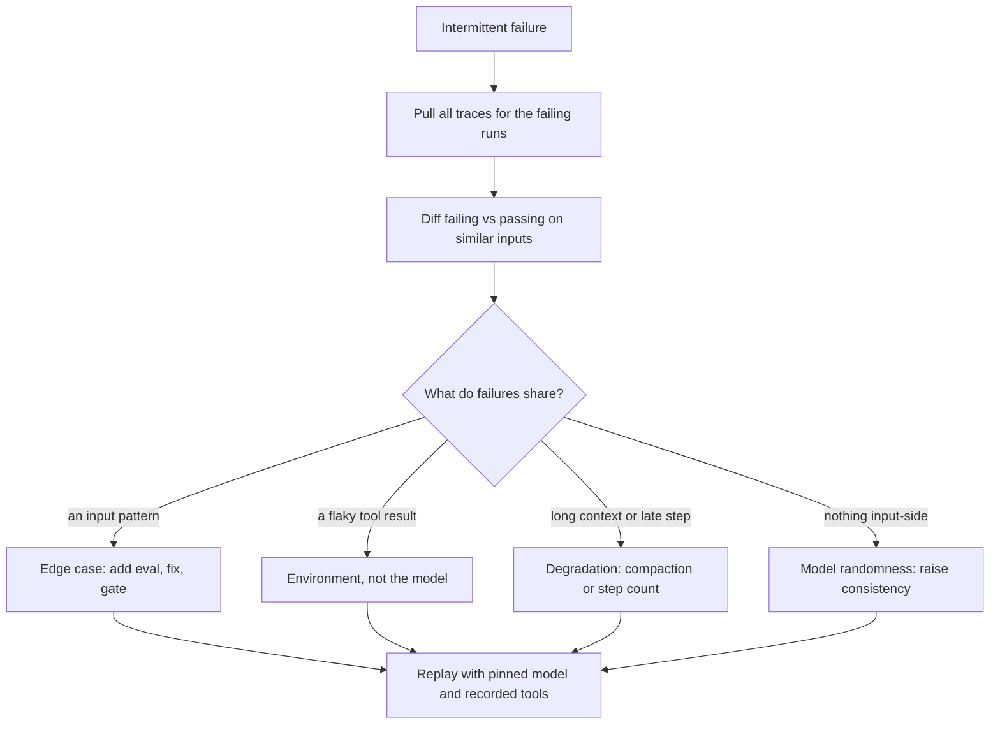

The techniques that make a rare bug tractable:

- Record and replay. With the inputs, model version, and recorded tool results stored, replay the exact step offline with tools mocked to their logged responses. This turns "1 in 50 live" into "100% in a unit test," which is what you want.
- Compare against passing runs. One trace shows what happened; 50 failing traces next to their passing neighbors show why. Group by input cluster, context length, step index, and tool-error presence, and the distinguishing feature usually jumps out.
- Amplify to study, not to fix. To measure a stochastic failure's real rate and triggers, re-run the captured input 50 times (the consistency lens from Q4.6). But verify the fix with the deterministic replay, not with "ran it 50 times and didn't see it."

**Follow-up questions:**

- _Failing traces share nothing on the input side._ Then it is sample-level randomness, and the goal shifts from "find the bug" to "raise consistency": tighten the prompt, lower temperature on that step, add majority voting (Q4.6), or add a validate-and-retry gate. Some randomness is inherent; you engineer the result to be safe, not the model to be deterministic.
- _It only happens in production, never in replay._ The bug lives in what replay stubbed out: real tool timing, concurrency, cache state, or messier real data. Widen what the trace captures on that path until the environment difference is visible. The gap between repro and production is where the bug lives.

### Q8.3: How do you detect drift when nothing changed on your side?

**Headline answer:** Watch three drifts that move on their own, each against a trailing baseline. Input drift: users start asking different things. Behavior drift: the model responds differently to the same inputs, often because the provider changed it. Quality drift: the judge score trends down. The one people miss is the middle one, and the tool that catches it is a canary set: fixed inputs replayed continuously, outputs diffed against reference. It holds the input constant, so any output change is the model or infrastructure, not the users.

| Drift            | Signal                                | Detection                                           |
| ---------------- | ------------------------------------- | --------------------------------------------------- |
| Input            | New intents, topics, lengths appear   | Embed inputs, cluster weekly, alert on new clusters |
| Behavior         | Same canary inputs, different outputs | Daily canary replay, diff against reference         |
| Quality          | Judge score and proxies decline       | Trailing-baseline alerts per slice (Q5.4)           |
| Cost and latency | Tokens per request or p95 creep up    | Time series on the economics fields (Q8.1)          |

The canary is the cheapest high-value monitor you can build: 50 to 200 representative frozen inputs, replayed against production daily (or hourly for critical paths), outputs compared to stored references by similarity and the judge. When a provider silently updates a model behind an alias, which happens and which their changelog will not tell you in time, the canary's diff spikes within a day, before users file complaints. It is the LLM version of synthetic monitoring, and often the only thing between you and hearing about a provider change from your users.

**Follow-up questions:**

- _The provider updated the model and quality dropped. Now what?_ This is the case for pinning model versions and treating a provider update as a gated change: run the new version through the canary and eval suite before migrating, and stay on the pinned version until it passes (Q4.5). Teams on floating aliases get surprised in production; teams on pins get to schedule the surprise.
- _An input-drift alert fired. Is that bad?_ Not by itself. It means your eval set is going stale (Q4.4) and maybe a new use case is emerging, which is a product signal. Drift detection feeds the eval-refresh loop and the roadmap, not just the pager.

### Q8.4: How do you wire up cost and latency observability, and what belongs on the dashboard versus the pager?

**Headline answer:** Instrument per request, per model, per tool, and per feature, so cost and latency are always sliceable by what drove them. "Spend is up 20%" is not actionable; "the new summarization feature's p95 tokens tripled after Tuesday's prompt change" is. Dashboards show the trends and breakdowns; pagers fire on budget burn rate and latency-SLO violation, not on raw totals, which grow with healthy traffic and cry wolf.

What the economics fields from Q8.1 roll up into:

| View                                                | Shows                            | Catches                                          |
| --------------------------------------------------- | -------------------------------- | ------------------------------------------------ |
| Cost per request by feature and model               | Where the money goes             | One feature quietly dominating spend             |
| Tokens split by cached, in, out                     | Cache hit rate and output length | Cache regressions (Q9.3); runaway output         |
| Latency: time to first token and total, p50/p95/p99 | The tail users actually feel     | p99 blowups hidden by a fine p50                 |
| Tool latency per tool                               | The bottleneck                   | A slow dependency dragging the whole run         |
| Steps and tokens per task vs baseline               | Efficiency drift (Q4.3)          | Agents wandering: more steps, same outcome       |
| Cost per successful outcome                         | Unit economics                   | Rising cost to serve even as raw cost looks flat |

The last row is the one to put in front of leadership: cost per successful outcome, not cost per request. A change that cuts cost per request 10% but drops success enough to trigger retries and escalations can raise cost per resolution, the only number that maps to the business. Alerting that stays trustworthy: burn-rate alerts (projected spend against budget over a rolling window, so you learn at 11am that today is trending 3 times, not at midnight when the bill lands), SLO-based latency pages (p95 over target for N minutes), and per-slice anomaly detection against a trailing baseline. Every alert links to the sliced trace view, so the first response is a drill-down, not a war room.

**Follow-up questions:**

- _Spend doubled overnight. First three things you check._ Request volume (real growth or a retry storm?), tokens per request by feature (a prompt change or a context leak bloating inputs?), and cache hit rate (did a prompt edit bust the prefix cache, Q9.3?). The sliced dashboard answers all three in minutes; a single total answers none.
- _p50 latency is flat but users say it is slow._ Look at p95, p99, and time to first token. Tail users and a slow first token are what people feel, and averages hide both. For streaming UIs, time to first token matters more than total time.

## 9. Token & Cost Engineering

### Q9.1: How do you cut a system's inference bill by 10x without hurting quality?

**Headline answer:** You do not get 10x from one lever. You stack several wins against a measured baseline, cheapest and safest first, re-checking quality after each. The order: measure where tokens go, cache the stable prefix, cut input bloat, route easy traffic to a cheaper model, shorten outputs, and batch the async work. Each is worth 1.3 to 3 times; three or four of them compound past 10x. The discipline is that every step is gated by the eval suite (Section 4), because "cheaper" that quietly costs 5 points of quality is not a win, and without evals you cannot tell.

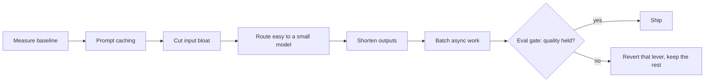

Why this order (impact times safety divided by effort):

| Lever                 | Typical win                 | Risk              | Effort                                                            |
| --------------------- | --------------------------- | ----------------- | ----------------------------------------------------------------- |
| Prompt caching        | 1.5 to 3x on cached paths   | ~none             | Low (reorder the prompt), Q9.3                                    |
| Input reduction       | 1.5 to 3x                   | Low if evals hold | Low to medium (truncate tools, retrieve don't stuff, prune tools) |
| Model routing         | 2 to 5x on the routed share | Medium            | Medium, Q9.2                                                      |
| Output reduction      | 1.3 to 2x                   | Low to medium     | Low (concision, cap max tokens, structured not prose)             |
| Batching              | up to 2x on async           | None              | Low (provider batch tiers around 50% off)                         |
| Distill a small model | 5 to 30x on the narrow task | High              | High (last resort, Q2.2)                                          |

The framing that wins: output tokens usually cost several times more than input tokens, but systems usually have far more input than output. So profile first (Q8.4), because whether input or output dominates your bill decides whether caching or concision is the bigger lever. Reaching for fine-tuning first (the highest effort and risk) while ignoring a 20% prompt-cache hit rate is the classic misallocation.

**Follow-up questions:**

- _Which lever first with no data?_ None. Instrument first. A day of token attribution by feature stops you optimizing the 5% while the 60% (usually a bloated system prompt on every request, or RAG stuffing) sits untouched.
- _Caching gave you 3x but the bill barely moved._ The hit rate is low because the prefix is not actually stable (per-request data sits high in the prompt) or the TTL expires between calls. Measure `cached_tokens / in_tokens` (Q8.1); a 15% hit rate is a layout bug, not a caching limit (Q9.3).

### Q9.2: How do you design a model routing or cascade system, and decide which model handles a request?

**Headline answer:** Route on difficulty and stakes. Send the large share of easy requests to a cheap fast model and save the frontier model for the hard or high-value minority, because request difficulty is very skewed and paying frontier prices for "what is my order status" is pure waste. Two shapes: a router (classify up front, dispatch once) or a cascade (try the cheap model, escalate on low confidence). A cascade needs no difficulty labels and self-tunes with a verifier; a router is one hop with no double spend. The economics only work if the routing or escalation rate is genuinely low, because misrouting everything up means you paid twice for frontier quality.

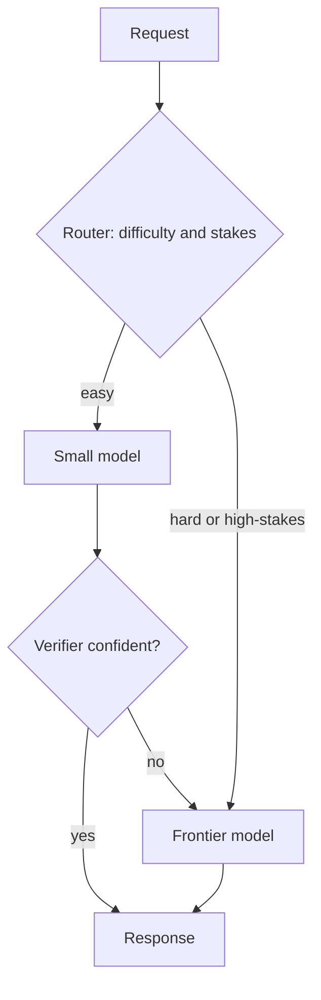

```python
def cascade(request, small, big, verify):
    resp = small.generate(request)          # try cheap first
    if verify(request, resp).confident:     # verifier decides escalation
        return resp
    return big.generate(request)            # escalate the rest
# With small ~1/15th the cost of big, 70% handled by small, ~10% of those
# escalating, blended cost is about 0.42, roughly 2.4x cheaper, and the
# hard cases still reach the frontier model so quality holds.
```

What actually decides success:

| Component          | Options                                                                                                                     | Failure mode                                                                         |
| ------------------ | --------------------------------------------------------------------------------------------------------------------------- | ------------------------------------------------------------------------------------ |
| Difficulty signal  | Small classifier; heuristics (length, tools needed); the cheap model's own confidence; self-consistency disagreement (Q4.6) | A misjudged difficulty sends hard queries to the weak model, creating quality holes  |
| Verifier (cascade) | Schema and grounding check, confidence threshold, a cheap judge                                                             | Too lax and bad answers slip; too strict and everything escalates and savings vanish |
| Stakes override    | High-value user or irreversible action goes to the frontier model regardless                                                | Routing on difficulty alone under-serves the cases that matter most                  |

Tune the threshold on the eval set as a cost-versus-quality curve: plot blended cost against quality across escalation thresholds and pick the knee, the point past which more spend buys almost no quality. That curve is the whole design artifact, and it turns the trade-off into a decision instead of a guess.

**Follow-up questions:**

- _The router adds latency and a failure point._ Keep it cheap (a small classifier, or reuse the cheap model's own confidence so routing is free), and on router error fail toward the capable model, never toward the weak one. Routing availability must not gate answer availability.
- _The small model handles 70%. Where did that number come from?_ Not assumed. Measured by running the eval set through the cheap model and seeing where it holds quality, then confirming the difficulty mix matches production. The 70% is an output of the cost-quality curve, not an input.

### Q9.3: How does prompt caching work, and how do you design prompts to maximize hit rate?

**Headline answer:** Prompt caching stores the model's computed attention state for a prefix of your prompt, so an identical prefix on the next request skips the recompute, usually about 90% cheaper and faster on the cached tokens. It all comes down to prefix stability. The cache matches from the start of the prompt up to the first byte that differs, so put everything stable first (system prompt, tools, examples) and everything that changes last (the user's turn). A single per-request token near the top quietly zeroes your hit rate.

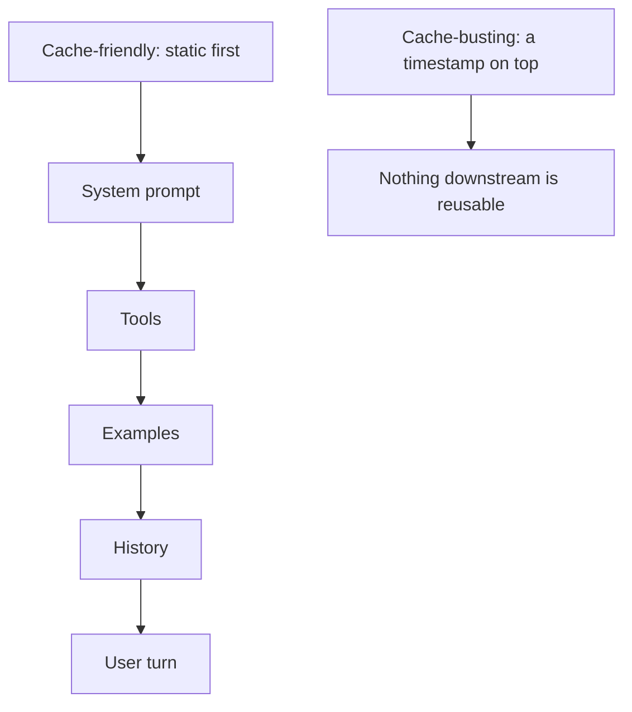

The design rules, each tied to a mechanism:

| Rule                                                            | Mechanism                                                                         |
| --------------------------------------------------------------- | --------------------------------------------------------------------------------- |
| Static content first, changing content last                     | The cache matches a prefix; the first differing byte ends the reuse               |
| No timestamps, request IDs, or per-user data high in the prompt | One early-varying token invalidates the whole downstream prefix                   |
| Append to history, never rewrite it                             | Editing an earlier turn busts every later turn's cache                            |
| Keep the system prompt and tools byte-identical                 | Even a whitespace change is a miss; pin and template them                         |
| Mind the TTL                                                    | Caches expire in minutes; bursty traffic hits warm caches, sparse traffic re-pays |
| Batch same-prefix requests together                             | Concurrent requests sharing a prefix amortize the first cold compute              |

The measurement that tells you it is working is `cached_tokens / in_tokens` from the trace (Q8.1). A long stable prefix (a 4k system prompt plus tools reused on every request) should hit 80% or more. If you see 15%, something changing is sitting in the prefix, usually a retrieved chunk placed before the instructions or per-user context injected at the top instead of the bottom. This is a latency win too, since a cached prefix skips prefill and cuts the time to first token on long prompts.

**Follow-up questions:**

- _RAG results change every request. Doesn't that kill caching?_ Only if you put them in the prefix. Keep the system prompt, tools, and examples as the stable cached prefix, and put retrieved chunks after it, next to the user turn. You still cache the expensive static 6k and only re-pay the ~4k of retrieved context. It is a layout choice, not a conflict.
- _Is prompt caching the same as semantic caching?_ No, and mixing them up is a tell. Prompt caching reuses computation for an identical prefix (exact match, on the provider side). Semantic caching returns a stored response for a similar query (your layer, matched by embedding), which saves a lot on repetitive FAQ traffic but risks serving a stale answer to a not-quite-identical question, so it needs a similarity threshold and its own eval.

### Q9.4: KV cache versus prompt cache versus semantic cache: how do they differ, and what is each one's cost impact?

**Headline answer:** Three different caches at three layers, often confused. The KV cache is the attention state within a single generation, the thing that makes token-by-token decoding tractable; it drives serving throughput and memory, not your API bill directly. Prompt caching keeps that state across requests for a shared prefix, which is a direct API-cost lever (Q9.3). Semantic caching is an application-layer store of whole responses keyed by query similarity, the biggest potential saving and the biggest correctness risk.

| Cache          | Layer            | Scope                             | Reuses                                  | You control it via                        | Main effect                                        |
| -------------- | ---------------- | --------------------------------- | --------------------------------------- | ----------------------------------------- | -------------------------------------------------- |
| KV cache       | Model serving    | One generation                    | Attention state for tokens already seen | Serving stack, batch size, context length | Throughput and memory, cost indirectly             |
| Prompt cache   | Provider API     | Across requests, identical prefix | The prefix's attention state            | Prompt layout, prefix stability           | Input cost and time to first token, directly       |
| Semantic cache | Your application | Across requests, similar queries  | The final response                      | Embedding, similarity threshold, eval     | Can skip the model call entirely; correctness risk |

How they stack on one request: a semantic-cache hit returns instantly with zero model cost (best case, if the query is truly equivalent). On a miss, the request goes to the model, where prompt caching discounts the shared-prefix input tokens and the KV cache makes generation efficient on the serving side. They are complementary, not alternatives. A mature system runs all three.

One KV-cache detail worth knowing even though it is provider-side: it is why long contexts cost more than the token price suggests. KV memory grows with sequence length and caps how many requests fit on a GPU at once, so a 100k-token context does not just cost 100k input tokens, it crowds the batch and lowers throughput. Techniques like paged attention, grouped-query attention, and KV quantization exist to stretch this budget. If you self-host, this is your throughput lever. If you use an API, it is baked into why long-context pricing and rate limits look the way they do.

**Follow-up questions:**

- _Semantic cache saved 40% but complaints rose. Why?_ The threshold is too loose, so near-but-different queries ("refund policy for EU" versus "for US") returned the wrong cached answer. Semantic caching trades correctness for cost and needs its own eval on cache hits, a conservative threshold, and cache keys scoped per locale or per user tier. It is not free money.
- _Self-hosting. How do you raise throughput without more GPUs?_ Attack the KV cache: paged attention to cut fragmentation, continuous batching to keep the GPU full, and grouped-query attention or KV quantization to shrink per-token memory so more requests batch. These raise tokens per second per GPU, which is cost per token on your own hardware.

### Q9.5: When do you stream, when do you batch, and how do these change the cost and latency picture?

**Headline answer:** Opposite tools for opposite goals. Streaming improves felt latency for interactive users: tokens appear as they are generated, so the time to the first token, not the total time, is what the user feels. It costs the same tokens but makes the wait tolerable. Batching improves throughput and cost for non-interactive work: grouping requests raises GPU use (self-hosted) or unlocks provider batch tiers (around 50% off, hours of latency). The decision is simply whether a human is waiting on this token by token. Yes: stream. No: batch.

| Dimension  | Streaming                                     | Batch                                                            |
| ---------- | --------------------------------------------- | ---------------------------------------------------------------- |
| Optimizes  | Felt latency (first token)                    | Throughput, cost per token                                       |
| Use when   | Interactive: chat, agents with visible output | Async: bulk classification, summaries, offline evals, embeddings |
| Token cost | Same as non-streamed                          | About 50% off on batch tiers                                     |
| Wall-clock | Similar total, feels faster                   | Minutes to hours                                                 |
| Adds       | Buffered-streaming guardrails (Q6.3)          | A job queue and result reconciliation                            |

The details that show depth:

- Streaming interacts with guardrails. You cannot moderate a fully streamed answer after the fact, hence buffered streaming (hold 30 to 60 tokens, scan, release, keep scanning with a kill switch). Naive streaming and output guardrails are in direct tension; resolve it on purpose.
- Streaming does not reduce token cost, a common misconception. It reduces felt latency only. If the goal is a cheaper bill, streaming is the wrong lever; caching, routing, and batching are.
- Batching trades latency for money at a fixed rate. Provider batch APIs (around 50% off, up to a 24-hour turnaround) are free savings for anything truly async: nightly evals, backfills, non-urgent enrichment. Leaving offline jobs on the real-time tier is a silent overpay.
- Self-hosted batching is continuous, not static. Continuous batching adds new requests to the running batch as others finish, keeping the GPU full without making early requests wait for a batch to fill, the throughput win without the latency tax.

**Follow-up questions:**

- _Can you stream and batch at the same time?_ On a serving stack, yes, and you should: continuous batching keeps throughput high while each request streams its own tokens, because they work on different axes (GPU scheduling versus response delivery). At the API level, batch tiers are non-streaming by nature, since nobody is watching.
- _An agent does 10 internal LLM calls, then answers. Stream what?_ Only the final user-facing answer. The 10 internal reasoning and tool calls are not interactive and can run at whatever concurrency the latency budget allows. Streaming an agent's internal chain of thought is usually noise, occasionally a deliberate transparency feature, but that is a product choice, not a default.
