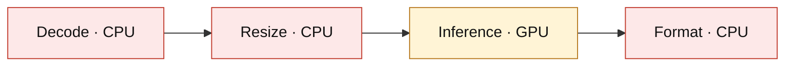
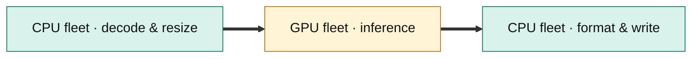
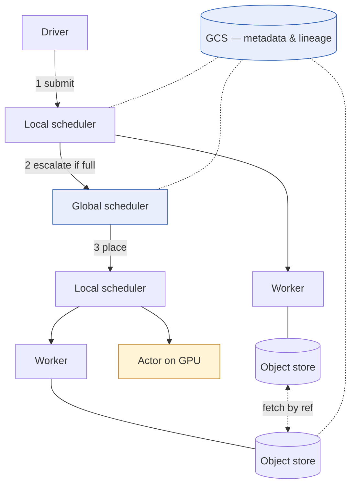
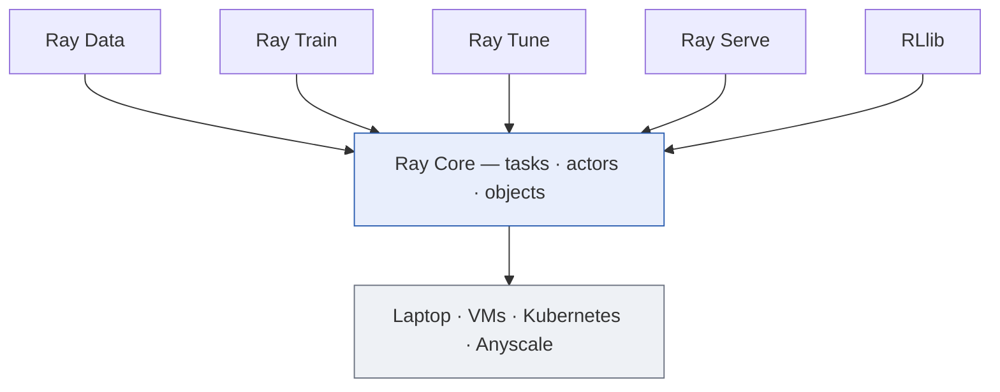
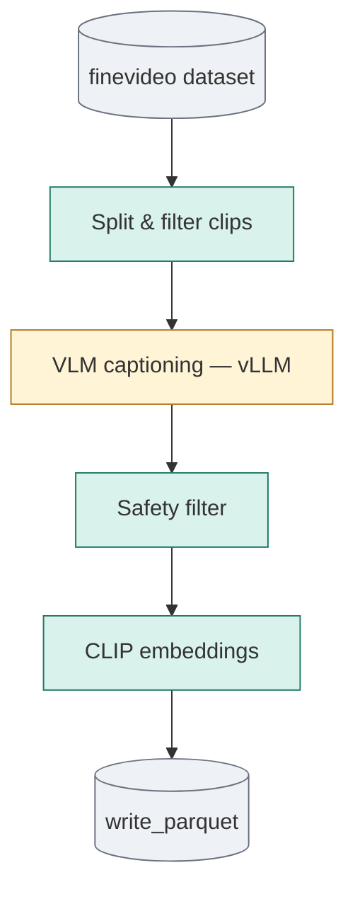
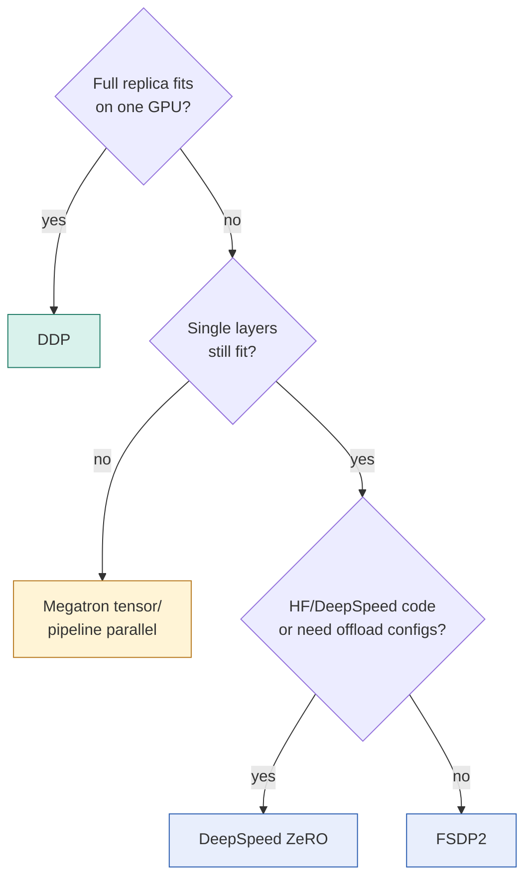
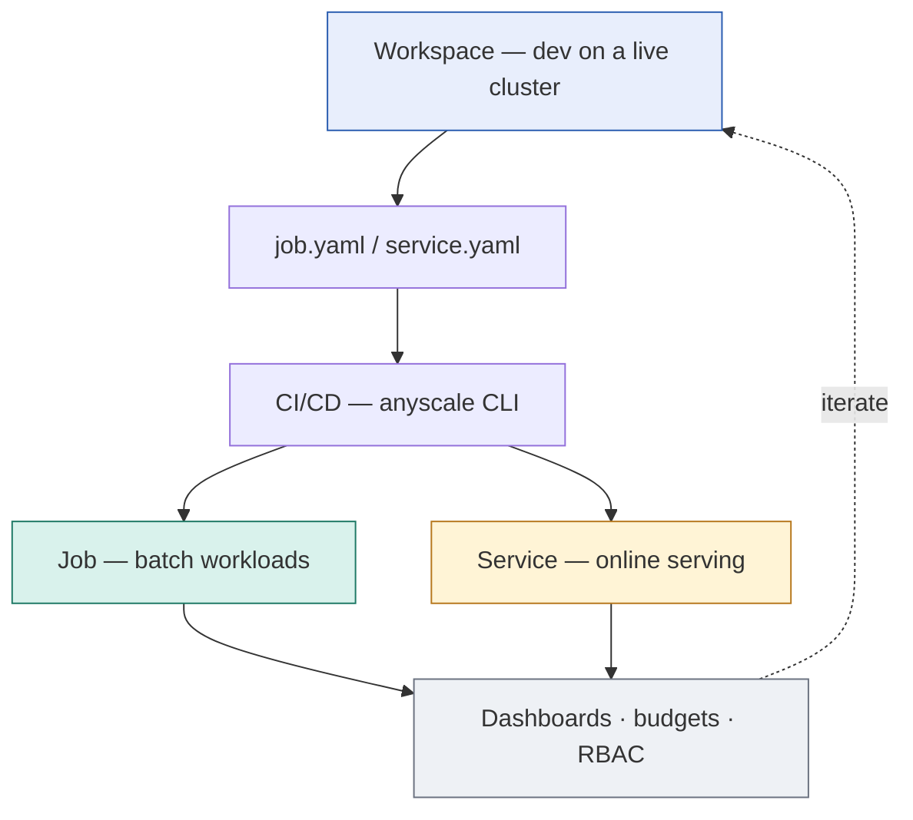

*A comprehensive technical writeup covering why distributed computing for AI is hard, what Ray is, what Anyscale adds on top of it, how it compares to the alternatives, and how to actually use it, from `ray.remote` basics to FSDP2, DeepSpeed ZeRO, and multimodal data pipelines.*


---

## Table of Contents

1. [The Problem: Why AI Broke Traditional Infrastructure](#1-the-problem-why-ai-broke-traditional-infrastructure)
2. [What Is Ray?](#2-what-is-ray)
3. [Ray's Architecture (The Research Behind It)](#3-rays-architecture-the-research-behind-it)
4. [The Ray Libraries](#4-the-ray-libraries)
5. [What Is Anyscale?](#5-what-is-anyscale)
6. [Why Anyscale Makes Everything Easier](#6-why-anyscale-makes-everything-easier)
7. [Alternatives and How They Compare](#7-alternatives-and-how-they-compare)
8. [Beginner: Your First Ray Program and Your First Anyscale Job](#8-beginner-your-first-ray-program-and-your-first-anyscale-job)
9. [Intermediate: Architecting Multimodal Data Pipelines That Scale](#9-intermediate-architecting-multimodal-data-pipelines-that-scale)
10. [Advanced: Distributed Training with Ray Train, FSDP2, and DeepSpeed](#10-advanced-distributed-training-with-ray-train-fsdp2-and-deepspeed)
11. [Production Patterns and Real-World Case Studies](#11-production-patterns-and-real-world-case-studies)
12. [Honest Limitations: When NOT to Use Ray/Anyscale](#12-honest-limitations-when-not-to-use-rayanyscale)
13. [References](#references)

---

## 1. The Problem: Why AI Broke Traditional Infrastructure

To understand why Ray and Anyscale exist, you first have to understand a mismatch that quietly became the central infrastructure problem of the AI era.

### 1.1 Compute demand is growing faster than hardware

Since roughly 2010, the compute required to train state-of-the-art machine learning models has grown approximately 10x every 18 months, while the compute power of individual accelerators (GPUs, TPUs) has grown far more slowly over the same period [[16]](#ref-16)[[22]](#ref-22). The unavoidable consequence: no single machine can train or serve a frontier model. Every serious AI team is forced into *distributed computing*, but distributed systems are notoriously hard to build, debug, and operate. Historically, this required dedicated infrastructure teams that most ML engineers don't have.

### 1.2 AI workloads are heterogeneous; infrastructure is monolithic

Modern AI pipelines are no longer "load tensors, train model." A typical multimodal pipeline looks like:

```
video / images / PDFs / audio
   → decode & parse        (CPU-heavy)
   → resize / chunk        (CPU-heavy)
   → model inference       (GPU-heavy)
   → filter / format       (CPU-heavy)
   → write to storage      (I/O-heavy)
```

Despite this heterogeneity, teams traditionally package the entire workload into a single containerized runtime that scales out by sharding data. The GPU is allocated for the *whole* lifecycle of the container even though it is only needed for one stage. The result is a structural mismatch between the shape of the workload and the shape of the infrastructure, leading to chronically low GPU utilization [[12]](#ref-12).

**Monolithic container:** one container holds every stage, so the GPU is reserved for the whole lifecycle but only works during inference (pink = GPU sitting idle while CPUs grind):



**Disaggregated + streaming (Ray Data):** same code, restructured. CPU stages run on an independently scaled CPU fleet, GPU stages on a GPU fleet, and blocks stream between them through the in-memory object store so the GPU stays saturated:



Anyscale's engineering analysis (citing prior research on data stalls in DNN training) notes that CPU-bound preprocessing stages can consume the majority of total epoch time in multimodal workloads, leaving the most expensive hardware in the datacenter idle [[11]](#ref-11)[[13]](#ref-13).

### 1.3 The "stitching" problem

The common workaround is to stitch together multiple specialized systems: Spark for CPU-bound ETL, a separate containerized Python service for GPU inference, an orchestrator (Airflow/Kubeflow) to glue stages together, and object storage as the handoff layer between every stage. Each handoff means serializing intermediate results to disk/S3 and reading them back. This adds I/O cost, latency, operational complexity, and multiple systems to maintain [[3]](#ref-3)[[11]](#ref-11). Teams end up "manually orchestrating multiple Python runtimes," patching together scripts and infrastructure just to keep schedulers and accelerators busy [[20]](#ref-20).

### 1.4 The requirements, formalized

The original Ray paper (OSDI 2018) formalized what an AI-native compute system must support [[1]](#ref-1):

- **Fine-grained, millisecond-level computations** (e.g., simulation steps, serving actions) alongside hour-long training tasks, meaning *extreme heterogeneity in task duration*.
- **Heterogeneous hardware**: CPUs, GPUs, TPUs mixed in one application.
- **Both stateless and stateful computation**: pure functions (tasks) and long-lived stateful workers (actors).
- **Dynamic execution**: the task graph evolves at runtime. The result of one computation determines what runs next (essential for RL, hyperparameter search, agentic systems).

No existing system at the time (not Spark, not MapReduce, not MPI, not specialized RL or serving systems) satisfied all four simultaneously. That gap is what Ray was built to fill.

---

## 2. What Is Ray?

**Ray is an open-source, Python-native distributed computing framework that lets you scale ordinary Python code from a laptop to a cluster of thousands of machines with minimal code changes.** It is released under Apache 2.0, hosted at [github.com/ray-project/ray](https://github.com/ray-project/ray), and has accumulated tens of thousands of GitHub stars, over a thousand contributors, and on the order of 12 million downloads per week as of 2026 [[17]](#ref-17)[[24]](#ref-24).

### 2.1 Origin story

Ray began in 2016 as a project by PhD students **Robert Nishihara** and **Philipp Moritz** at UC Berkeley's **RISELab**, the successor to the AMPLab that produced Apache Spark and Databricks. They were frustrated that existing distributed tools were either too rigid for dynamic AI workloads (Spark's bulk-synchronous batch model) or required deep distributed-systems expertise (MPI). Working with their advisor **Ion Stoica** (co-creator of Spark, co-founder of Databricks) and ML professor **Michael I. Jordan**, they built Ray initially to support distributed reinforcement learning, which uniquely needed simulation, training, and serving in one system [[1]](#ref-1)[[14]](#ref-14)[[15]](#ref-15).

The research was published as *"Ray: A Distributed Framework for Emerging AI Applications"* at OSDI 2018, demonstrating sub-millisecond remote task latencies and linear throughput scaling beyond **1.8 million tasks per second** [[1]](#ref-1).

In December 2019, the same team founded **Anyscale** with a $20.6M Series A led by Andreessen Horowitz to commercialize Ray [[14]](#ref-14)[[15]](#ref-15). (More on Anyscale in Section 5.)

### 2.2 The core idea: six API calls

Ray's core API is famously small. You decorate Python functions and classes, and Ray distributes them:

```python
import ray

ray.init()  # connect to (or start) a Ray cluster

# --- TASKS: stateless, parallel functions ---
@ray.remote
def square(x):
    return x ** 2

futures = [square.remote(i) for i in range(100)]   # runs in parallel across the cluster
results = ray.get(futures)                          # [0, 1, 4, 9, ...]

# --- ACTORS: stateful, long-lived workers ---
@ray.remote(num_gpus=1)
class ModelServer:
    def __init__(self):
        self.model = load_model()       # loaded ONCE, kept on the GPU
    def predict(self, batch):
        return self.model(batch)

server = ModelServer.remote()
pred = ray.get(server.predict.remote(data))
```

Three things make this powerful:

1. **Tasks + Actors in one system.** Tasks are stateless functions (perfect for data processing); actors are stateful processes (perfect for holding a model on a GPU, a simulator, or a parameter server). Ray was the first widely adopted system to unify both under a single dynamic execution engine [[1]](#ref-1).
2. **Declarative resource requests.** `@ray.remote(num_gpus=1)`, `num_cpus=4`, or even *fractional* GPUs (`num_gpus=0.25`). Ray's scheduler packs heterogeneous tasks onto heterogeneous nodes, routing CPU work to CPU nodes and GPU work to GPU nodes. This is exactly what monolithic containers cannot do [[12]](#ref-12).
3. **A distributed object store.** Results live in a shared-memory object store (Plasma) distributed across the cluster; large objects are passed by reference, not copied, and stream between pipeline stages without round-tripping through S3 [[1]](#ref-1)[[13]](#ref-13).

### 2.3 Who uses it

Ray runs in production at OpenAI (which used Ray to coordinate training of the models behind ChatGPT. OpenAI co-founder Greg Brockman has publicly described Ray as integral to training their largest models), Uber, Spotify, Shopify, Pinterest, Instacart, Netflix, ByteDance, Ant Group, Canva, Coinbase, Cursor, xAI, Runway, and many others [[16]](#ref-16)[[21]](#ref-21)[[22]](#ref-22)[[23]](#ref-23).

---

## 3. Ray's Architecture (The Research Behind It)

This section is for readers who want to understand *why* Ray performs the way it does. (Skip to Section 4 if you just want to use it.)

### 3.1 Two-layer design

The OSDI 2018 paper describes two layers [[1]](#ref-1):

**Application layer:**
- **Driver:** the process executing your Python program.
- **Workers:** stateless processes that execute tasks.
- **Actors:** stateful processes that execute only their exposed methods.

**System layer:**
- **Global Control Store (GCS):** a sharded, fault-tolerant key-value store with pub/sub that holds the entire control state of the system: task specifications, object metadata (locations, sizes), and lineage. Centralizing metadata in the GCS *decouples task scheduling from task dispatch* and makes every other component effectively stateless. Schedulers and object stores can therefore scale independently and recover from failure by reading the GCS [[1]](#ref-1).
- **Distributed (bottom-up) scheduler:** tasks are first submitted to a *local* scheduler on each node; only if the node is overloaded or lacks resources does the task escalate to a global scheduler. This bottom-up design is what enables millions of fine-grained task scheduling decisions per second. A global-only scheduler would bottleneck [[1]](#ref-1).
- **In-memory distributed object store:** each node runs a shared-memory object store; immutable objects are tracked via the GCS and fetched on demand by whichever node needs them.



*How a task gets scheduled: the driver submits to its **local** scheduler first (1); only if that node is overloaded does the task escalate to the **global** scheduler (2), which places it on another node (3). Workers exchange large objects by reference through per-node shared-memory **object stores**, looking up locations in the **GCS**, the sharded key-value store holding all metadata and lineage. This bottom-up scheduling plus centralized metadata is what enables Ray's >1.8M scheduled tasks/sec while keeping every other component stateless and recoverable [[1]](#ref-1).*

### 3.2 Fault tolerance via lineage and ownership

Ray records the lineage of task execution, so lost objects can be transparently reconstructed by re-executing the tasks that produced them; lost actors are automatically restarted and redistributed across surviving nodes [[1]](#ref-1). Later research from the same group, *"Ownership: A Distributed Futures System for Fine-Grained Tasks"* (NSDI 2021), refined this with a decentralized ownership model that made Ray's fault tolerance scale to much finer-grained tasks with lower overhead [[2]](#ref-2). This research lineage matters in practice: it's why a Ray Data pipeline can lose a spot instance mid-job and keep running.

### 3.3 Heterogeneity-awareness

A key result in the paper: a Ray implementation of an RL workload outperformed an optimized MPI implementation *while using a fraction of the GPUs*, because Ray lets the application express resource requirements per task/actor and exploit asymmetric architectures, while MPI assumes symmetric processes [[1]](#ref-1). This single property, per-task heterogeneous resource scheduling, is the architectural root of essentially every cost-saving claim you'll read about Ray and Anyscale for multimodal workloads.

---

## 4. The Ray Libraries

Ray Core (tasks/actors/objects) is the foundation. On top of it sits a suite of purpose-built libraries, and this is what most people actually use day-to-day:



*The stack: five AI libraries (data processing, training, tuning, serving, RL) all compile down to Ray Core's task/actor/object primitives, and Ray Core runs on anything: your laptop, raw cloud VMs, Kubernetes via KubeRay, or Anyscale's managed platform.*

| Library | Purpose | Typical use |
|---|---|---|
| **Ray Data** | Distributed data processing with *streaming execution* across CPU+GPU | Multimodal ETL, batch inference, last-mile training data loading |
| **Ray Train** | Distributed model training; wraps PyTorch DDP/FSDP, DeepSpeed, Lightning, HF Transformers, XGBoost, JAX | Multi-node multi-GPU training and fine-tuning |
| **Ray Tune** | Distributed hyperparameter search (ASHA, PBT, Optuna/HyperOpt integration) | Sweeps at cluster scale |
| **Ray Serve** | Scalable model serving with autoscaling, model composition, fractional GPUs | Online inference, LLM endpoints (integrates with vLLM) |
| **RLlib** | Production reinforcement learning | RL/RLHF, simulation-heavy workloads |

Two library-level details are worth understanding because they explain Ray's performance profile:

**Ray Data's streaming execution model.** Prior to Ray 2.4, Ray Data executed like Spark: bulk-synchronous (materialize all of stage N before starting stage N+1). In Ray 2.4 the default switched to **streaming execution**: all pipeline stages run *concurrently*, data flows block-by-block through the in-memory object store, and a backpressure mechanism caps intermediate memory so the pipeline never degrades back into bulk execution or spills uncontrollably [[13]](#ref-13). In Anyscale's published example, a heterogeneous CPU+GPU video pipeline processed ~350 GB of frame data in ~5 minutes with stable memory, precisely because GPU inference on chunk *k* overlaps with CPU decoding of chunk *k+1* [[13]](#ref-13).

**Ray Data LLM / inference-engine integrations.** Ray 2.44+ added native vLLM integration for batch LLM inference, and 2.45 added SGLang, so turning unstructured data (images, audio, documents) into structured data with a large model is a first-class, scalable operation rather than a hand-rolled actor pool [[17]](#ref-17).

---

## 5. What Is Anyscale?

**Anyscale is the commercial company founded by Ray's creators (Nishihara, Moritz, Stoica, plus Michael I. Jordan), and the Anyscale Platform is a fully managed compute platform for building, running, and scaling Ray workloads**, whether in Anyscale's hosted cloud or inside your own AWS/GCP/Azure account or Kubernetes clusters (BYOC) [[9]](#ref-9)[[14]](#ref-14)[[15]](#ref-15).

The honest one-line framing: **Ray solves the distributed *programming* problem; Anyscale solves the distributed *operations* problem.** Open-source Ray gives you the APIs, but you still must provision clusters, manage autoscaling and node failures, build images, wire up monitoring, secure everything, and shepherd code from a laptop to production. Anyscale productizes all of that.

### 5.1 The main platform components

**Workspaces:** managed, cloud-based development environments attached to an elastic Ray cluster. You get VS Code / Jupyter / SSH against a live multi-node cluster, with dependency management and workload-aware observability built in, so development happens in an environment nearly identical to production. No Kubernetes expertise required to self-serve dev infrastructure [[9]](#ref-9)[[19]](#ref-19).

**Jobs:** submit a discrete workload (batch inference, embedding generation, fine-tuning, data processing) to a standalone, auto-provisioned Ray cluster. Designed for CI/CD: define everything in a YAML, `anyscale job submit -f job.yaml`, get retries, alerts, and logs [[6]](#ref-6)[[9]](#ref-9).

**Services:** deploy Ray Serve applications as highly available production endpoints with zero-downtime rolling upgrades, canary deployments, autoscaling (including scale-to-zero behavior on replicas), and head-node fault tolerance [[9]](#ref-9)[[10]](#ref-10).

**Anyscale Runtime (formerly RayTurbo):** a proprietary, drop-in, API-compatible optimized Ray runtime. Same code, faster execution: Anyscale's published numbers include data-processing speedups up to ~5–6x over open-source Ray on certain workloads, ~40% faster real-time video inference pipelines, up to 4.5x faster end-to-end scale-up for Llama-3-70B serving, up to 6x cheaper batch LLM inference versus repurposed online inference APIs, and up to 10x faster feature preprocessing. It also includes elastic training and aggressive spot-instance support cutting training costs by large margins [[10]](#ref-10)[[18]](#ref-18)[[19]](#ref-19). Treat vendor benchmarks with normal skepticism, but the mechanism is plausible: it's the Ray team optimizing the runtime they wrote, with features (replica compaction, smarter parallelism heuristics, faster autoscaling) not in OSS Ray [[18]](#ref-18).

**Managed clusters, governance, and observability:** proactive draining/replacement of unhealthy nodes, fast autoscaling, managed Prometheus/Grafana, unified log viewers, Ray Data/Train/Serve-specific dashboards, plus enterprise admin features: resource quotas, role-based access controls, audit logs, budgets and cost dashboards per user/project/cloud [[9]](#ref-9)[[18]](#ref-18)[[19]](#ref-19).

### 5.2 Deployment models and pricing

Anyscale offers two deployment models [[25]](#ref-25)[[26]](#ref-26):

- **Hosted**: Anyscale runs the infrastructure; you're billed (pay-as-you-go, usage-based, no fixed monthly fee) for the compute you consume. New accounts get free starter credits. Fastest path to a working cluster.
- **BYOC (Bring Your Own Cloud)**: the Anyscale control plane manages compute that runs *inside your own* AWS, GCP, or Azure account, or your own Kubernetes (EKS, GKE, AKS), including GPU-cloud partners such as CoreWeave and Nebius and an Azure-native marketplace integration. Your data never leaves your environment, you can burn existing cloud commitments and GPU reservations, and billing typically flows through your cloud marketplace [[19]](#ref-19)[[20]](#ref-20)[[25]](#ref-25)[[26]](#ref-26).

Committed-use contracts unlock volume discounts. The practical caveat anyone evaluating it should hear: pure usage-based pricing makes budgeting harder than fixed plans. Runaway jobs cost real money, which is exactly why the platform ships budget alerts and auto-suspension of idle clusters [[25]](#ref-25)[[26]](#ref-26).

---

## 6. Why Anyscale Makes Everything Easier

Let's be concrete about what you stop doing when you move from self-managed Ray (or stitched-together systems) to Anyscale.

**1. You stop building and babysitting clusters.** Self-hosting Ray on Kubernetes via KubeRay means owning cluster setup, the operator, autoscaler tuning, node-failure handling, upgrades, monitoring stacks, and security patching. This is a permanent operational tax that demands real Kubernetes expertise [[27]](#ref-27). On Anyscale, clusters are declarative (a `compute_config` in YAML or the console), elastic from zero to thousands of nodes, and self-healing.

**2. You collapse the dev→prod gap.** The classic ML failure mode is "worked in the notebook, died in production." Because an Anyscale Workspace *is* a Ray cluster with the same images, dependencies, and storage as Jobs and Services, promotion to production is a one-line CLI command rather than a re-platforming project [[9]](#ref-9)[[24]](#ref-24).

**3. You unify the CPU/GPU stack.** Instead of Spark for CPU ETL + a separate GPU inference service + an orchestrator + S3 handoffs between them, one Ray Data pipeline runs the whole thing with streaming execution, eliminating intermediate I/O and keeping both CPUs and GPUs saturated [[3]](#ref-3)[[11]](#ref-11). Anyscale customers describe this directly: heterogeneous scheduling they "couldn't really do easily before," much lower idle time, and researchers who "just write code without worrying about the underlying infrastructure" [[3]](#ref-3).

**4. You get performance you didn't have to engineer.** The Anyscale Runtime's optimizations are free in the sense that they require zero code changes. The runtime is fully compatible with the open-source Ray API [[10]](#ref-10)[[18]](#ref-18)[[20]](#ref-20).

**5. You get production-grade reliability semantics.** Head-node fault tolerance for services, zero-downtime upgrades, job retries, proactive node replacement, and elastic training that tolerates losing spot instances mid-run. Each of these is weeks of platform engineering if you build it yourself [[9]](#ref-9)[[18]](#ref-18).

**6. You get organizational controls.** Quotas, RBAC, audit logs, per-project budgets, and utilization dashboards turn "the GPU bill" from a monthly surprise into something governable [[18]](#ref-18)[[19]](#ref-19).

The pattern across public case studies is consistent: Anyscale's value proposition is *not* "Ray, but you couldn't have run Ray yourself." It is "Ray, minus the platform team you'd otherwise need, plus a faster runtime."

---

## 7. Alternatives and How They Compare

There are really two separate comparison questions, and conflating them causes most of the confusion online.

### 7.1 Alternatives to *Ray* (the framework)

| Framework | Model | Strengths | Weaknesses vs Ray for AI |
|---|---|---|---|
| **Apache Spark** | JVM-based, bulk-synchronous, DataFrame/SQL-centric | Mature, unmatched for large structured ETL/SQL, huge ecosystem, strong fault tolerance via RDD lineage | Not Python-native (Py4J overhead); BSP execution stalls GPUs between stages; weak GPU/heterogeneous scheduling; awkward for stateful actors, RL, serving [[28]](#ref-28)[[29]](#ref-29) |
| **Dask** | Python-native task graphs, scales NumPy/Pandas/scikit-learn APIs | Lowest cognitive overhead for the PyData stack; great for DataFrame-style preprocessing | Simpler scheduler; no actor-centric stateful model comparable to Ray's; thinner story for GPU pipelines, distributed training orchestration, and serving [[28]](#ref-28)[[29]](#ref-29) |
| **MPI / Slurm (HPC)** | Message passing on static allocations | Maximum control, ubiquitous in academia/national labs | Static, symmetric, no elasticity or fault tolerance by default; the OSDI paper showed Ray beating tuned MPI on heterogeneous RL workloads with fewer GPUs [[1]](#ref-1) |
| **Daft, Bodo, Polars, DuckDB, etc.** | Newer engines (Rust/HPC-compiler/single-node) | Excellent price-performance in their niches; vendor benchmarks (e.g., Bodo's) show big wins on structured DataFrame workloads | Narrower scope. They are data engines, not a general distributed compute substrate for training + tuning + serving; Anyscale's own benchmarks vs Daft show Ray Data sustaining higher GPU utilization at larger scales on multimodal pipelines [[11]](#ref-11)[[30]](#ref-30) |
| **Kubernetes alone** | Container orchestration | Universal substrate | Orchestrates containers, not Python functions; you still need a compute framework on top, which is why KubeRay (Ray *on* K8s) exists |

Rule of thumb that most practitioners converge on: **Spark for massive structured SQL/ETL; Dask for scaling Pandas-shaped science; Ray for anything involving GPUs, models, heterogeneous pipelines, training, RL, or serving** [[28]](#ref-28)[[29]](#ref-29).

### 7.2 Alternatives to *Anyscale* (the platform)

| Option | What it is | Trade-off vs Anyscale |
|---|---|---|
| **Self-managed Ray + KubeRay** | OSS Ray on your own Kubernetes (EKS/GKE/AKS; GKE has first-class KubeRay support) | Zero platform fees, total control, no lock-in, but you own all the operational burden: setup, autoscaling, observability, upgrades, security. Viable only with a strong infra team [[27]](#ref-27)[[31]](#ref-31) |
| **AWS SageMaker** | Full-suite managed MLOps on AWS | Deep AWS integration and compliance tooling; but more rigid training/serving abstractions, AWS-only, and less flexible for custom distributed logic [[31]](#ref-31)[[32]](#ref-32) |
| **GCP Vertex AI** (incl. Ray on Vertex) | GCP's managed ML platform; offers managed Ray clusters | Great if you live in GCP/BigQuery; GCP-only, less Ray-native depth than Anyscale [[31]](#ref-31)[[32]](#ref-32) |
| **Databricks** | Lakehouse + Spark-centric ML platform (can also run Ray on Spark clusters) | Best-in-class for data engineering + SQL + governance; Ray support is secondary to Spark; heavier platform |
| **Modal** | Serverless Python functions with GPUs | Wonderful developer experience for inference APIs, ETL jobs, async tasks; per-second billing. But serverless functions are not a distributed compute fabric. There is no equivalent of Ray's cluster-wide object store, actors, or gang-scheduled multi-node training [[32]](#ref-32)[[33]](#ref-33) |
| **Coiled** | Managed Dask (analogous to Anyscale-for-Dask) | Same trade as Dask vs Ray, in managed form |
| **GPU clouds (CoreWeave, Nebius, Lambda, RunPod...)** | Raw or lightly managed GPU capacity | Cheapest raw FLOPs; but they are a *data plane*. Notably, CoreWeave and Nebius now partner with Anyscale precisely so Anyscale provides the control plane on their hardware [[19]](#ref-19)[[20]](#ref-20) |
| **Northflank / general PaaS** | Run Ray and non-Ray services side by side | Good when your product is mostly a web app with some ML; less depth for large-scale distributed AI [[33]](#ref-33) |

The structural observation: Anyscale's strongest moat is that it's built by the people who build Ray, and Ray has become something close to the default distributed substrate for AI (it underpins parts of Vertex AI's Ray offering, runs on EKS/AKS/GKE through first-party partnerships, and is the engine behind many internal ML platforms) [[19]](#ref-19)[[20]](#ref-20)[[24]](#ref-24)[[31]](#ref-31). Its strongest criticism is the mirror image: if your workload isn't Ray-shaped, the platform's focus becomes a constraint [[27]](#ref-27)[[33]](#ref-33).

---

## 8. Beginner: Your First Ray Program and Your First Anyscale Job

### 8.1 Local Ray in 60 seconds

```bash
pip install -U "ray[default]"
```

```python
import ray, time

ray.init()  # starts a local "cluster" using all your cores

@ray.remote
def slow_square(x):
    time.sleep(1)
    return x * x

start = time.time()
results = ray.get([slow_square.remote(i) for i in range(8)])
print(results, f"in {time.time() - start:.1f}s")   # ~1s on 8 cores, not 8s
```

That's the entire mental model: decorate, call `.remote()`, collect futures with `ray.get()`. The same code runs unchanged on a 1,000-node cluster; only `ray.init()`'s target changes.

### 8.2 Your first Anyscale Job

The `anyscale/examples` repo's `job_hello_world` is the canonical starting point [[6]](#ref-6). Anyscale Jobs submit your working directory plus a config to a fresh, auto-provisioned Ray cluster:

```bash
pip install -U anyscale
anyscale login

git clone https://github.com/anyscale/examples.git
cd examples/job_hello_world
anyscale job submit -f job.yaml
```

The `job.yaml` is the whole infrastructure story. Note how much is optional because Anyscale auto-selects sane defaults:

```yaml
name: my-first-job

# Optional: pin a base image, or point at your own Dockerfile
image_uri:            # e.g. anyscale/ray:2.43.0-slim-py312-cu125

# Optional: leave empty to auto-select instance types,
# or pin node shapes, autoscaling ranges, and spot preference:
compute_config:
#   worker_nodes:
#     - instance_type: g4dn.2xlarge
#       min_nodes: 0
#       max_nodes: 100
#       market_type: PREFER_SPOT

working_dir: .                 # auto-uploaded to the cluster
entrypoint: python main.py
max_retries: 0
```

A more realistic config (from the billion-image processing example, Section 9) shows production controls: a custom `containerfile`, GPU worker pools (`g5.12xlarge`, 0→16 nodes), global `max_resources` caps, and a `timeout_s` to bound cost [[6]](#ref-6). The point for a beginner: *infrastructure became a 30-line YAML*, and the identical pattern scales from "hello world" to billions of images.

### 8.3 Templates: learning by running

Anyscale's console ships dozens of runnable templates ("Run on Anyscale" launches a Workspace pre-loaded with the notebook, dependencies, and a live cluster) mirrored at `github.com/anyscale/templates`, and the examples gallery at anyscale.com/examples spans batch inference, video analytics, RAG pipelines, LLM fine-tuning, and robotics datasets [[4]](#ref-4)[[5]](#ref-5)[[6]](#ref-6)[[7]](#ref-7)[[8]](#ref-8). The three templates analyzed in Sections 9–10 below (distributing-pytorch, pytorch-fsdp, deepspeed_finetune) come straight from this catalog.

---

## 9. Intermediate: Architecting Multimodal Data Pipelines That Scale

This section synthesizes Anyscale's "architecting multimodal data pipelines" material [[3]](#ref-3)[[11]](#ref-11)[[12]](#ref-12)[[13]](#ref-13) and the open-source examples that implement it [[6]](#ref-6).

### 9.1 The core architectural insight: disaggregate and stream

Multimodal AI has unlocked the ~90% of enterprise data that is unstructured (video, audio, PDFs, sensor streams), but processing it surfaces a hard engineering problem: every pipeline alternates between CPU-bound stages (decode, parse, chunk, resize) and GPU-bound stages (embedding, captioning, detection) [[3]](#ref-3)[[11]](#ref-11). Two architectural decisions fix the utilization problem:

1. **Disaggregation**: run CPU preprocessing on a dedicated, independently scaled CPU fleet and GPU inference on GPU nodes. Do not force them into the same container or the same VM shape. Default cloud GPU VMs ship 12–24 CPUs per GPU, often far too few for decode-heavy pipelines; Ray Data lets you scale CPU and GPU workers independently with no code changes [[11]](#ref-11)[[12]](#ref-12).
2. **Streaming execution**: stream blocks between stages through the in-memory object store with automatic backpressure, so all stages run concurrently and nothing round-trips through S3 between steps [[3]](#ref-3)[[13]](#ref-13).

### 9.2 A real pipeline: streaming video curation

The `video_curation` example turns raw videos into clean, semantically annotated clip datasets in a single streaming pipeline [[6]](#ref-6):

```
HF parquet (mp4 bytes)
  → flat_map(process_video_bytes)   # CPU: scene detect + quality filter
  →                                 #      + keyframe extraction (1 video → ~10 clips)
  → vLLMEngineProcessor             # GPU: Qwen2.5-VL-3B captions/safety,
  →                                 #      one replica per GPU
  → filter(is_safe)                 # CPU: drop unsafe rows
  → map_batches(CLIPEmbedder)       # CPU actor pool: 512-d CLIP embeddings
  → write_parquet                   # shared storage
```

Videos stream directly from Hugging Face without local prefetch, and Ray Data executes each stage on its declared compute type, streams block-by-block, and applies backpressure automatically. Traditional staged pipelines would run one stage at a time, idling GPUs through every CPU stage; here CPU and GPU work overlap continuously [[6]](#ref-6)[[13]](#ref-13).



*Green = CPU stages, amber = GPU stage. Stage details: **Split & filter** = `flat_map` doing scene detection, quality filtering, and keyframe extraction (1 video → ~10 clips); **VLM captioning** = `vLLMEngineProcessor` running Qwen2.5-VL-3B (one replica per GPU) to attach category/safety/description; **Safety filter** = `filter(is_safe)`; **CLIP embeddings** = `map_batches` over a CPU actor pool producing 512-d vectors. All five stages run **concurrently**. Blocks stream between them through the object store with automatic backpressure, so the GPU never waits for an entire upstream stage to finish.*

### 9.3 Scaling to billions: batch VLM inference

The `image_processing` example scales the same pattern to the ReLAION-2B dataset, over **2 billion image URLs** [[6]](#ref-6). Three stages per image: multithreaded download (handling timeouts/dead URLs), validation/resize/standardization, then Qwen2.5-VL captioning via vLLM. Ray Data orchestrates distributed execution, fault tolerance, and resource management; the job config caps the cluster at 64 GPUs / 768 CPUs with spot-friendly autoscaling. The same skeleton powers the `fineweb_dedup` example, which runs MinHash deduplication and quality filtering over the FineWeb-edu text corpus with Data-Juicer [[6]](#ref-6).

In sketch form, the Ray Data code for such pipelines is remarkably small:

```python
import ray

ds = (
    ray.data.read_parquet("s3://bucket/relaion-urls/")
      .map(download_image,        num_cpus=0.5)            # CPU stage
      .map_batches(Preprocess,    concurrency=128)          # CPU stage
      .map_batches(VLMCaptioner,  num_gpus=1, concurrency=16,
                   batch_size=64)                           # GPU stage
      .filter(lambda r: r["valid"])
)
ds.write_parquet("/mnt/shared_storage/captions/")
```

### 9.4 Why this beats the alternatives, in numbers

- Eliminating inter-stage I/O and idle time is where the money is: the GPU step dominates pipeline cost, and in Anyscale's published benchmarks against Daft, Ray Data sustained higher GPU utilization on larger instance types, yielding lower execution times and costs for multimodal workloads [[30]](#ref-30).
- ByteDance runs offline inference with multimodal LLMs over **200 TB+ of data per job** on Ray Data, choosing it over Spark for flexibility in model-parallel inference (their twin-tower ViT+Albert embedding model is itself sharded across 3 GPUs, with pipeline stages buffered through the Ray object store) [[23]](#ref-23).
- Notion reportedly cut embedding-pipeline infrastructure costs by **over 90%** after migrating to Ray [[22]](#ref-22).
- Recent Ray releases keep extending the same architecture: a native `download` expression for URL-heavy datasets, vLLM/SGLang batch-inference integrations, and NVIDIA cuDF integration for GPU-native structured processing (Anyscale reports ~80% cost reduction on large-scale dedup with RTX PRO 4500 Blackwell versus CPU-only pipelines) [[17]](#ref-17)[[34]](#ref-34).

### 9.5 Design checklist for your own pipeline

When architecting a multimodal pipeline on Ray Data, the decisions that matter most: (1) declare honest per-stage resources, including fractional GPUs; (2) right-size the CPU:GPU ratio at the *cluster* level, adding pure-CPU worker pools when decode dominates; (3) keep stages streaming and avoid materializing the whole dataset between steps; (4) push model inference into engine-backed processors (vLLM/SGLang) instead of naive per-row calls; (5) bound memory via Ray Data's backpressure rather than manual repartitioning; and (6) make the pipeline restartable. Lineage-based recovery plus spot instances is the cheapest reliable configuration [[11]](#ref-11)[[13]](#ref-13)[[17]](#ref-17).

---

## 10. Advanced: Distributed Training with Ray Train, FSDP2, and DeepSpeed

The three Anyscale templates referenced in this article's source list form a deliberate learning ladder: DDP basics → FSDP2 sharding → DeepSpeed ZeRO fine-tuning [[4]](#ref-4)[[5]](#ref-5)[[7]](#ref-7).

### 10.1 Step 1: From single-GPU PyTorch to multi-node DDP (`distributing-pytorch`)

The template starts with a vanilla single-machine ViT-on-CIFAR-10 training loop, then distributes it with **Ray Train** in three small modifications [[7]](#ref-7):

```python
import ray.train
from ray.train import ScalingConfig, RunConfig
from ray.train.torch import TorchTrainer

def train_func_per_worker(config):
    train_dl, valid_dl = get_dataloaders(config["batch_size_per_worker"])

    # [[1]](#ref-1) Shard the data across workers
    train_dl = ray.train.torch.prepare_data_loader(train_dl)
    valid_dl = ray.train.torch.prepare_data_loader(valid_dl)

    model = build_vit()
    # [[2]](#ref-2) Wrap model: moves to the right device + wraps in DistributedDataParallel
    model = ray.train.torch.prepare_model(model)

    for epoch in range(config["epochs"]):
        ...usual PyTorch loop...
        # [[3]](#ref-3) Report metrics (and checkpoints) back to Ray Train
        ray.train.report({"loss": loss, "accuracy": acc})

trainer = TorchTrainer(
    train_loop_per_worker=train_func_per_worker,
    train_loop_config={"lr": 1e-3, "epochs": 1, "batch_size_per_worker": 64},
    scaling_config=ScalingConfig(num_workers=8, use_gpu=True),   # 8 GPUs, any topology
)
result = trainer.fit()
```

Ray Train handles process-group setup (`torchrun` equivalents, rendezvous, NCCL env), placement across nodes, and surfaces a per-worker training dashboard in Anyscale Workspaces. The template's final step swaps the PyTorch DataLoader for **Ray Data** ingestion, so preprocessing scales on CPU nodes independently from GPU training workers. This is the disaggregation pattern of Section 9 applied to training [[7]](#ref-7).

### 10.2 Step 2: Sharding large models with FSDP2 (`pytorch-fsdp`)

When the model no longer fits per-GPU, DDP (full replica per worker) gives way to **Fully Sharded Data Parallel**. The template uses PyTorch's modern `fully_shard` (FSDP2) API with Ray Train and walks through the real memory/communication trade-offs [[4]](#ref-4):

```python
from torch.distributed.fsdp import (fully_shard, CPUOffloadPolicy,
                                    MixedPrecisionPolicy)
from torch.distributed.device_mesh import init_device_mesh

def shard_model(model):
    world_size = ray.train.get_context().get_world_size()
    mesh = init_device_mesh("cuda", mesh_shape=(world_size,),
                            mesh_dim_names=("data_parallel",))

    mp_policy = MixedPrecisionPolicy(param_dtype=torch.float16,
                                     reduce_dtype=torch.float16)

    # Shard each transformer block, then the root module
    for block in model.encoder.layers.children():
        fully_shard(block, mesh=mesh,
                    reshard_after_forward=True,
                    offload_policy=CPUOffloadPolicy(),
                    mp_policy=mp_policy)
    fully_shard(model, mesh=mesh, reshard_after_forward=True,
                offload_policy=CPUOffloadPolicy(), mp_policy=mp_policy)
```

The tutorial's key engineering lessons, each backed by GPU-memory profiles in the template [[4]](#ref-4):

- **Sharding granularity** is a dial: shard every layer for minimum peak memory but maximum communication; the template shards only the encoder blocks (the bulk of ViT parameters) as a balanced default.
- **`reshard_after_forward=True`** frees all-gathered weights immediately after the forward pass. Peak memory drops, at the cost of re-gathering parameters during backward. Skip it if unsharded params comfortably fit.
- **`CPUOffloadPolicy`** parks parameters/grads in host RAM between uses. This is the heaviest memory lever, with the heaviest PCIe traffic cost.
- **Mixed precision** via `MixedPrecisionPolicy` halves parameter and reduction bandwidth.
- **Checkpointing** uses PyTorch Distributed Checkpoint (DCP) so each rank saves its shard; the `RunConfig` points `storage_path` at shared cluster storage and `FailureConfig(max_failures=1)` gives automatic restart-and-resume. Ray Train's fault-tolerance contract does the work of a custom resilience layer.

### 10.3 Step 3: Fine-tuning LLMs with DeepSpeed ZeRO (`deepspeed_finetune`)

The third template fine-tunes a causal LM (GPT-2 on AG News, deliberately small so it runs in 20 minutes) with **Ray Train + DeepSpeed**, demonstrating how an existing DeepSpeed setup drops into Ray's scaling/orchestration shell [[5]](#ref-5):

```python
import deepspeed
from ray.train.torch import TorchTrainer
from ray.train import ScalingConfig, RunConfig

def setup_model_and_optimizer(model_name, lr, ds_config):
    model = AutoModelForCausalLM.from_pretrained(model_name)
    optimizer = torch.optim.AdamW(model.parameters(), lr=lr)
    ds_engine, _, _, _ = deepspeed.initialize(model=model,
                                              optimizer=optimizer,
                                              config=ds_config)
    return ds_engine

ds_config = {
    "train_micro_batch_size_per_gpu": 1,
    "zero_optimization": {"stage": 3},   # 1: optimizer states
                                         # 2: + gradients
                                         # 3: + parameters
    # bf16/fp16 chosen at runtime based on hardware support
}

trainer = TorchTrainer(
    train_loop_per_worker=train_loop,
    train_loop_config={"ds_config": ds_config, ...},
    scaling_config=ScalingConfig(num_workers=2, use_gpu=True),
    run_config=RunConfig(storage_path="/mnt/cluster_storage/"),
)
result = trainer.fit()
```

Conceptually: DeepSpeed's ZeRO partitions training state across data-parallel workers in three cumulative stages: optimizer states (Stage 1), plus gradients (Stage 2), plus parameters (Stage 3), trading communication for memory at each step, with optional CPU offload beyond that [[5]](#ref-5). Ray Train's role covers everything *around* the inner loop: launching one worker per GPU across nodes, wiring the process group, checkpoint storage and resumption, retries, and (on Anyscale) the dashboards and managed cluster underneath. The same division of labor extends upward: the `megatron_training` example pairs Ray Train with Megatron-Bridge for tensor/pipeline-parallel LLM SFT, and `skyrl` runs GRPO-based RL post-training. Both are submitted as ordinary Anyscale Jobs [[6]](#ref-6).

### 10.4 Picking a strategy



*"Full replica" means parameters + gradients + optimizer state together. DDP uses Ray Train's `prepare_model`/`prepare_data_loader`; FSDP2 means `fully_shard` with the levers from Section 10.2; DeepSpeed ZeRO escalates stage 1→2→3 plus CPU offload; Megatron-style parallelism is covered by the `megatron_training` example. All four launch through the same `TorchTrainer`.*

A compact decision rule: **DDP** while a full model replica fits per GPU (it's the fastest when it fits); **FSDP2** when parameters/optimizer state are the bottleneck and you want to stay in pure PyTorch; **DeepSpeed ZeRO** when you want its mature config surface, offload options, or are inheriting HF/DeepSpeed code; **Megatron-style tensor/pipeline parallelism** when single layers no longer fit and you need maximum throughput at large scale. Ray Train wraps all four behind the same `TorchTrainer` interface, which is precisely why it's a good orchestration layer: the parallelism strategy becomes a swappable implementation detail rather than a re-architecture [[4]](#ref-4)[[5]](#ref-5)[[7]](#ref-7).

---

## 11. Production Patterns and Real-World Case Studies

**The dev→prod workflow on Anyscale**, end to end: develop interactively in a Workspace against a real multi-node cluster → codify the workload as `job.yaml` / `service.yaml` → `anyscale job submit` / `anyscale service deploy` from CI/CD → monitor via built-in dashboards, with budgets, quotas, and alerts governing the fleet [[9]](#ref-9)[[24]](#ref-24).



*Develop in a **Workspace** (VS Code/Jupyter on a real multi-node cluster, same image and dependencies as prod) → codify infrastructure as YAML → promote via `anyscale job submit` / `anyscale service deploy` from CI/CD. **Jobs** get fresh autoscaled clusters with retries, alerts, and logs; **Services** get Ray Serve endpoints with zero-downtime upgrades and head-node fault tolerance; governance (budgets, quotas, RBAC, audit logs) wraps the whole loop.*

Ray's docs show exactly this pattern for an end-to-end multimodal AI system: one job for embedding generation, one job for training, one service deploy for online inference: three YAMLs, one platform [[24]](#ref-24).

**Selected production results** (company-reported, so calibrate accordingly):

- **OpenAI** used Ray to coordinate training of its largest models, including those behind ChatGPT; Greg Brockman described it as key to scaling "to an unprecedented scale" [[16]](#ref-16)[[21]](#ref-21).
- **ByteDance**: 200 TB+ multimodal embedding inference per job on Ray Data, preferred over Spark for flexible model-parallel inference [[23]](#ref-23).
- **Notion**: >90% infrastructure cost reduction after migrating embedding pipelines to Ray [[22]](#ref-22).
- **Canva**: 100+ production ML models on the platform, with reported 12x faster model evaluation and ~50% cloud cost reduction [[26]](#ref-26).
- **Coinbase**: data transformation time reduced from 120 minutes to 15 [[26]](#ref-26).
- **Bedrock Robotics**: scaled compute 85x on Anyscale without linearly increasing cost; **Wayve** trains autonomous-driving foundation models on Anyscale on Azure, driven by GPU-capacity aggregation beyond any single region [[31]](#ref-31).
- The same Ray runtime is in production at Cursor, Physical Intelligence, xAI, Coinbase, and Runway [[31]](#ref-31).

---

## 12. Honest Limitations: When NOT to Use Ray/Anyscale

A credible writeup owes you the counter-case.

**The Ray learning curve is real.** Distributed futures, actors, object-store memory behavior, and placement groups are new mental models; teams unfamiliar with Ray consistently report an initial adaptation cost for training scripts and serving logic [[26]](#ref-26)[[32]](#ref-32). If your problem fits a simpler tool, use the simpler tool.

**Framework lock-in (sort of).** Anyscale's value assumes your code is Ray-shaped; if your application is mostly a conventional web stack with a bit of ML, the platform's Ray-centricity can feel like a straitjacket, and generalist platforms or serverless options may serve you better [[27]](#ref-27)[[33]](#ref-33). The mitigation is that Ray itself is Apache-2.0 and runs anywhere (laptop, KubeRay, Vertex, EKS), so the exit path from Anyscale is "operate OSS Ray yourself," not "rewrite the application."

**Pure structured-data workloads have better tools.** For SQL-heavy ETL at petabyte scale, Spark/Databricks remains the default; for single-node-feasible analytics, Polars/DuckDB will embarrass any cluster on cost; some HPC-compiler engines post large wins over Ray on classic DataFrame benchmarks [[28]](#ref-28)[[29]](#ref-29)[[35]](#ref-35). Ray's edge is specifically heterogeneous, model-in-the-loop, multimodal compute.

**Usage-based pricing requires governance.** Pay-as-you-go elasticity means an unbounded experiment is an unbounded bill; use the platform's budgets, quotas, `timeout_s`, and idle auto-suspend from day one [[25]](#ref-25)[[26]](#ref-26).

**Self-hosting is genuinely viable** for organizations with strong platform teams: KubeRay on GKE/EKS gives total control with zero platform fees. You are just signing up to be your own Anyscale [[27]](#ref-27)[[31]](#ref-31).

---

## Conclusion

The arc of this story is simple. AI workloads outgrew single machines and then outgrew homogeneous clusters; Ray (born at Berkeley's RISELab, published at OSDI 2018) answered with a small Python API over a task/actor model, a distributed object store, and a heterogeneity-aware scheduler, and became the de facto distributed substrate for AI, from ChatGPT's training to ByteDance's 200 TB inference jobs. Anyscale, built by Ray's creators, packages the operational half of the problem: managed elastic clusters, a dev-to-prod workflow (Workspaces → Jobs → Services), an optimized runtime, and enterprise governance, deployable hosted or inside your own cloud. Whether you adopt the managed platform or run KubeRay yourself, the underlying architectural lessons (disaggregate CPU and GPU stages, stream between them with backpressure, declare per-task resources honestly, and let lineage-based fault tolerance plus spot instances carry your cost structure) apply to every serious multimodal and training pipeline you will build from here on.

---

## References

<div className="not-prose text-xs leading-relaxed text-gray-700 dark:text-gray-300">


<span id="ref-1"/>

[1] [Moritz, P., Nishihara, R., Wang, S., Tumanov, A., Liaw, R., Liang, E., Elibol, M., Yang, Z., Paul, W., Jordan, M. I., & Stoica, I. (2018). *Ray: A Distributed Framework for Emerging AI Applications.* 13th USENIX Symposium on Operating Systems Design and Implementation (OSDI '18), pp. 561–577.](https://www.usenix.org/conference/osdi18/presentation/moritz)

<span id="ref-2"/>

[2] [Wang, S., Liang, E., Oakes, E., Hindman, B., Luan, F. S., Cheng, A., & Stoica, I. (2021). *Ownership: A Distributed Futures System for Fine-Grained Tasks.* 18th USENIX Symposium on Networked Systems Design and Implementation (NSDI '21).](https://www.usenix.org/conference/nsdi21/presentation/cheng)

<span id="ref-3"/>

[3] [Anyscale. *Architecting Multimodal Data Pipelines That Scale with Ray.* Anyscale Blog. *Multimodal Data Curation.*. *Multimodal data: Architecting pipelines that don't break at scale.*](https://www.anyscale.com/blog/architecting-multimodal-data-pipelines-that-scale-with-ray)

<span id="ref-4"/>

[4] [Anyscale. *Get Started with PyTorch Fully Sharded Data Parallel (FSDP2) and Ray Train* (template).](https://console.anyscale.com/template-preview/pytorch-fsdp)

<span id="ref-5"/>

[5] [Anyscale. *Fine-tune an LLM with Ray Train and DeepSpeed* (template).](https://console.anyscale.com/template-preview/deepspeed_finetune)

<span id="ref-6"/>

[6] [Anyscale. *anyscale/examples* (GitHub repository: job_hello_world, image_processing, fineweb_dedup, video_curation, megatron_training, skyrl, and others).](https://github.com/anyscale/examples)

<span id="ref-7"/>

[7] [Anyscale. *Distributing your PyTorch Training Code with Ray Train and Ray Data* (template).](https://console.anyscale.com/template-preview/distributing-pytorch)

<span id="ref-8"/>

[8] [Anyscale. *Examples Gallery.*. *Templates Catalog.*](https://www.anyscale.com/examples)

<span id="ref-9"/>

[9] [Anyscale. *What is Anyscale?* Anyscale Documentation.](https://docs.anyscale.com/get-started/what-is-anyscale)

<span id="ref-10"/>

[10] [Anyscale. *Announcing Anyscale Runtime for Faster, Cheaper and More Resilient AI, Powered by Ray.* Anyscale Blog (Nov 2025).](https://www.anyscale.com/blog/announcing-anyscale-runtime-powered-by-ray)

<span id="ref-11"/>

[11] [Anyscale (Liaw, R., Kudinkin, A., et al.). *Benchmarking Multimodal AI Workloads on Ray Data.* Anyscale Blog (Oct 2025).](https://www.anyscale.com/blog/ray-data-daft-benchmarking-multimodal-ai-workloads)

<span id="ref-12"/>

[12] [Anyscale. *GPU (In)efficiency in AI Workloads.* Anyscale Blog.](https://www.anyscale.com/blog/gpu-in-efficiency-in-ai-workloads)

<span id="ref-13"/>

[13] [Anyscale. *How to Stream Distributed Execution Across CPUs and GPUs* (Ray Data streaming backend, Ray 2.4). Anyscale Blog (May 2023).](https://www.anyscale.com/blog/streaming-distributed-execution-across-cpus-and-gpus)

<span id="ref-14"/>

[14] [Anyscale. *Founders of Open Source Project Ray Launch Anyscale with $20.6M in Funding to Democratize Distributed Programming.* Anyscale Press (Dec 2019).](https://www.anyscale.com/blog/founders-of-open-source-project-ray-launch-anyscale-with-20-6m-in-funding-to-democratize-distributed-programming)

<span id="ref-15"/>

[15] [Lardinois, F. (2019). *Anyscale, from the creators of the Ray distributed computing project, launches with $20.6M led by a16z.* TechCrunch.](https://techcrunch.com/2019/12/17/anyscale-ray-project-distributed-computing-a16z/)

<span id="ref-16"/>

[16] [MacManus, R. (2023). *How Ray, a Distributed AI Framework, Helps Power ChatGPT.* The New Stack.](https://thenewstack.io/how-ray-a-distributed-ai-framework-helps-power-chatgpt/)

<span id="ref-17"/>

[17] [Anyscale. *Ray Data: Scalable Data Processing for AI Workloads* (vLLM/SGLang integrations, download expression). Anyscale Blog (Nov 2025).](https://www.anyscale.com/blog/ray-data-scalable-data-processing-for-ai-workloads)

<span id="ref-18"/>

[18] [Anyscale. *RayTurbo: Anyscale's Ray Optimized Runtime.*. *Announcing Anyscale RayTurbo.*](https://www.anyscale.com/product/platform/rayturbo)

<span id="ref-19"/>

[19] [CoreWeave. *Announcing Distributed AI on CoreWeave with Fully Managed Ray on Anyscale.* CoreWeave Blog (Aug 2025).](https://www.coreweave.com/blog/distributed-ai-on-coreweave-with-ray-anyscale)

<span id="ref-20"/>

[20] [Nebius. *Nebius and Anyscale Partner to Power Cost-Efficient Multimodal and Physical AI.* Nebius Blog (Nov 2025).](https://nebius.com/blog/posts/anyscale-partnership)

<span id="ref-21"/>

[21] [Yegulalp, S. / BigDATAwire (2023). *Anyscale Bolsters Ray, the Super-Scalable Framework Used to Train ChatGPT.*](https://www.bigdatawire.com/2023/02/10/anyscale-bolsters-ray-the-super-scalable-framework-used-to-train-chatgpt/)

<span id="ref-22"/>

[22] [Blockchain.News (2026). *Scaling Multimodal Data Pipelines with Ray Data* (summarizing Anyscale's disaggregated-streaming material. ByteDance and Notion figures).](https://blockchain.news/news/scaling-multimodal-data-pipelines-with-ray)

<span id="ref-23"/>

[23] [Anyscale / ByteDance. *How ByteDance Scales Offline Inference with Multi-Modal LLMs to 200TB Data.* Anyscale Blog (2023).](https://www.anyscale.com/blog/how-bytedance-scales-offline-inference-with-multi-modal-llms-to-200TB-data)

<span id="ref-24"/>

[24] [Ray Project. *Multi-modal AI Pipeline — End-to-End Example* (Ray documentation, Anyscale jobs/services workflow). Ray docs home:. Ray project site:](https://docs.ray.io/en/latest/ray-overview/examples/e2e-multimodal-ai-workloads/README.html)

<span id="ref-25"/>

[25] [Anyscale. *Pricing.*. eesel AI (2025). *Anyscale Pricing: A Clear Breakdown of Costs & Models.*](https://www.anyscale.com/pricing)

<span id="ref-26"/>

[26] [DevTune. *Anyscale — AI Search Visibility, Competitors, Reviews, and Pricing.*. CheckThat.ai. *Anyscale: Details, Reviews, Pricing & Features.*](https://devtune.ai/verticals/aiml-infrastructure-llm-tools/anyscale)

<span id="ref-27"/>

[27] [eesel AI (2025). *I Tried the Top 5 Anyscale Alternatives and Here's My Verdict.*](https://www.eesel.ai/blog/anyscale-alternatives)

<span id="ref-28"/>

[28] [Onehouse. *Ray vs Dask vs Apache Spark — Comparing Data Science & Machine Learning Engines.*](https://www.onehouse.ai/blog/apache-spark-vs-ray-vs-dask-comparing-data-science-machine-learning-engines)

<span id="ref-29"/>

[29] [Domino Data Lab. *Spark, Dask, and Ray: Choosing the Right Framework.*](https://domino.ai/blog/spark-dask-ray-choosing-the-right-framework)

<span id="ref-30"/>

[30] [Anyscale. *Benchmarking Multimodal AI Workloads on Ray Data* (Ray Data vs Daft GPU-utilization results).](https://www.anyscale.com/blog/ray-data-daft-benchmarking-multimodal-ai-workloads)

<span id="ref-31"/>

[31] [Microsoft Tech Community (2026). *Anyscale on Azure: Powering Enterprise AI at Massive Scale on AKS.*. Spheron (2026). *Anyscale Alternatives: 10 GPU Clouds for Ray Training and Inference.*](https://techcommunity.microsoft.com/blog/appsonazureblog/anyscale-on-azure-powering-enterprise-ai-at-massive-scale-on-azure-kubernetes-se/4523806)

<span id="ref-32"/>

[32] [RunPod (2025). *Top 7 SageMaker Alternatives.*. Lamatic Labs (2025). *25 Best AWS SageMaker Alternatives.*](https://www.runpod.io/articles/alternatives/sagemaker)

<span id="ref-33"/>

[33] [Northflank (2025). *Top Anyscale Alternatives for AI/ML Model Deployment.*](https://northflank.com/blog/anyscale-alternatives-for-ai-ml-model-deployment)

<span id="ref-34"/>

[34] [Anyscale Press (2026). *Anyscale Adds NVIDIA cuDF Support in Ray Data* (GPU-native multimodal processing. rack-aware scheduling for GB300 NVL72).](https://www.anyscale.com/press/anyscale-cuts-multimodal-ai-data-processing-costs-with-nvidia-rtx-pro-4500)

<span id="ref-35"/>

[35] [Bodo.ai. *Python Data Processing Engine Comparison with NYC Taxi Trips (Bodo vs. Spark, Dask, Ray)* (vendor benchmark. illustrative of structured-data engine trade-offs).](https://www.bodo.ai/blog/python-data-processing-engine-comparison-with-nyc-taxi-trips-bodo-vs-spark-dask-ray)

<span id="ref-36"/>

[36] [AWS Containers Blog (2024). *Powering the Next Generation of AI Workloads on Amazon EKS with Anyscale (RayTurbo on EKS).*](https://aws.amazon.com/blogs/containers/powering-the-next-generation-of-ai-workloads-on-amazon-eks-with-anyscale)

---

*Note on sources: the two console.anyscale.com template-preview links require an Anyscale account to open interactively; the identical content is open-source in the `anyscale/templates` GitHub repository, which is what the code excerpts in Sections 8–10 are drawn from (lightly condensed for readability). Performance figures attributed to Anyscale, ByteDance, Notion, Canva, etc. are company-reported numbers and should be validated against your own workloads.*

</div>
