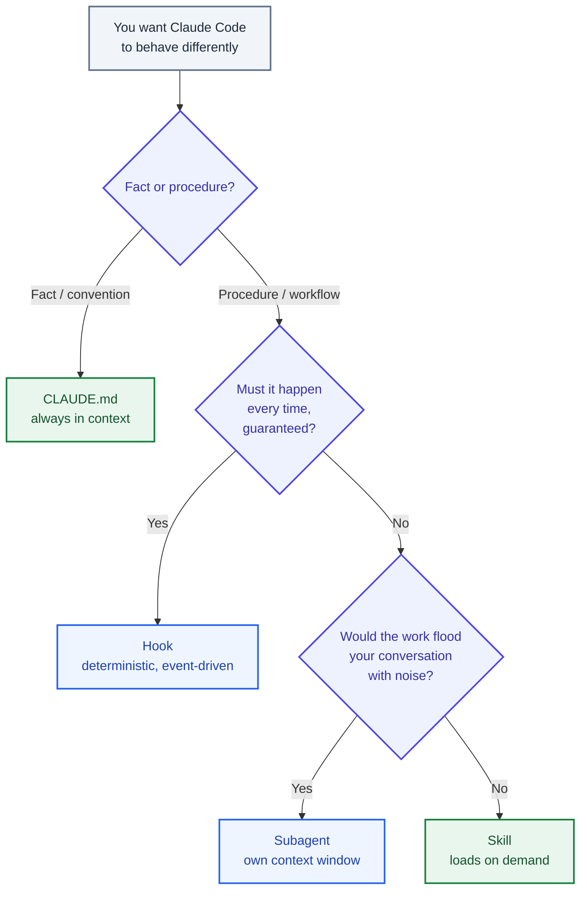

*Everything in this guide is buildable as you read it. Four hands-on builds, one combined workflow you can commit to any repo, and a map of the ecosystem — grounded in Anthropic's official docs and Academy courses (mid-2026).*

---

## How to read this

If you use Claude Code daily but have never opened `~/.claude/`, this guide is for you. It is organized as a series of builds, each one a complete, working artifact:

- **Part I — The extension surfaces:** what skills, subagents, and hooks each solve, and a decision aid for picking between them.
- **Part II — Skills:** the anatomy of `SKILL.md`, plus two builds — a diff summarizer and a release-notes skill with bundled scripts.
- **Part III — Subagents:** custom agents with their own context window, plus a `code-reviewer` build.
- **Part IV — Hooks:** deterministic automation on lifecycle events, plus a formatter and a destructive-command guard.
- **Part V — Putting it together:** a `.claude/` directory that combines all three into a review-and-ship workflow.
- **Part VI — The ecosystem:** popular skill repos on GitHub and Anthropic's free courses for going deeper.

Every file in this guide is complete — nothing is elided. You can copy each snippet into the path shown in its title bar and it will work.

---

### Part I — The extension surfaces

## 1. Agent = model + harness (a quick recap)

In [Engineering the Agentic Harness](/write-up/harness-context-loop-engineering) I argued that everything that is *not the model* is the harness — the prompts, tools, loops, and guardrails wrapped around an LLM. Claude Code is Anthropic's harness for software work, and it exposes four surfaces where you can reshape it without touching a line of its source:

| Surface      | What it is                                            | Where it lives                       | When it loads                                        | Best for                                       |
| ------------ | ----------------------------------------------------- | ------------------------------------ | ---------------------------------------------------- | ---------------------------------------------- |
| **CLAUDE.md** | Plain markdown facts and conventions                  | Project root or `~/.claude/`         | Always, every session                                 | Architecture notes, commands, style rules       |
| **Skill**    | A named procedure with metadata (`SKILL.md`)          | `.claude/skills/` or `~/.claude/skills/` | Description always; full body only when invoked   | Repeatable workflows, domain knowledge          |
| **Subagent** | A separate Claude with its own prompt, tools, context | `.claude/agents/` or `~/.claude/agents/` | When Claude delegates (or you ask it to)          | Context-heavy side work, restricted specialists |
| **Hook**     | A shell command bound to lifecycle events             | `settings.json`                      | Deterministically, on every matching event            | Formatting, guardrails, notifications           |

The distinctions matter because they answer different failure modes. CLAUDE.md content is *always* in context, so it must stay short. A skill's body costs nothing until it is used. A subagent keeps a noisy sub-task from polluting your main conversation. And a hook is the only mechanism of the four that is **deterministic** — it does not rely on the model deciding to follow an instruction; the harness executes it, every time.

## 2. Which one do I need?

> **Rule of thumb:** facts go in CLAUDE.md, procedures become skills, noisy side-tasks become subagents, and anything that must happen *every single time* becomes a hook.



Two signals that a skill is overdue, straight from Anthropic's docs: you keep pasting the same instructions into chat, or a section of your CLAUDE.md has grown into a *procedure* rather than a *fact*. Unlike CLAUDE.md, a skill's body loads only when it's used — long reference material costs almost nothing until you need it.

> [!TIP]
> The fastest way to build any of these is to ask Claude Code itself: *"Create a skill in `.claude/skills/` that…"* or *"Create a code-reviewer subagent in `~/.claude/agents/`…"*. Claude writes the file, and because Claude Code watches these directories, the new skill or agent is live within seconds — no restart. This guide writes everything by hand so you understand what Claude is generating for you.

---

### Part II — Skills

## 3. What a skill actually is

A skill is a directory containing a `SKILL.md` file. That's the whole format:

```text
my-skill/
├── SKILL.md           # Main instructions (required)
├── template.md        # Optional: a template for Claude to fill in
├── examples/
│   └── sample.md      # Optional: example output
└── scripts/
    └── validate.sh    # Optional: a script Claude can execute
```

`SKILL.md` has two parts: **YAML frontmatter** between `---` markers that tells Claude *when* to use the skill, and a **markdown body** with the instructions Claude follows when it runs. The directory name becomes the slash command you type (`.claude/skills/deploy-staging/` → `/deploy-staging`).

The economics are what make skills powerful. In a session, only each skill's `description` sits in context — a line or two. The full body loads when the skill is invoked, either by you typing `/skill-name` or by Claude deciding the description matches your request. Anthropic calls this **progressive disclosure**: you can have dozens of skills with detailed instructions, and pay for one description each until the moment one is needed.

Claude Code skills follow the [Agent Skills](https://agentskills.io) open standard, so the same skill folder works across multiple AI tools — and Claude.ai, the Claude API, and Claude Code all consume the same format.

> [!NOTE]
> **Custom slash commands have been merged into skills.** A file at `.claude/commands/deploy.md` and a skill at `.claude/skills/deploy/SKILL.md` both create `/deploy` and work the same way. Old command files keep working; skills add supporting files, invocation control, and automatic loading.

## 4. Build #1 — a diff summarizer

This is Anthropic's own first-skill example, and it is a genuinely useful one: a skill that summarizes your uncommitted changes and flags anything risky. It demonstrates the single most interesting skill feature — **dynamic context injection** — so it's the right place to start.

Create the directory (personal scope, so it works in every project):

```bash
mkdir -p ~/.claude/skills/summarize-changes
```

Then write the skill file:

```yaml:~/.claude/skills/summarize-changes/SKILL.md
---
description: Summarizes uncommitted changes and flags anything risky. Use when the user asks what changed, wants a commit message, or asks to review their diff.
---

## Current changes

!`git diff HEAD`

## Instructions

Summarize the changes above in two or three bullet points, then list any
risks you notice such as missing error handling, hardcoded values, or tests
that need updating. If the diff is empty, say there are no uncommitted changes.
```

The `` !`git diff HEAD` `` line is the trick. Before Claude sees the skill content, Claude Code **executes the command and replaces the line with its output**. Claude receives the rendered prompt with your actual diff already inlined — it doesn't have to decide to run the command, and it can't get it wrong. This is preprocessing, not delegation.

Test it two ways. Open any git project with uncommitted edits and either ask naturally — *"what did I change?"* — and watch Claude load the skill because the request matches the description, or invoke it directly:

```text
/summarize-changes
```

For multi-line setup you can use a fenced injection block instead of the inline form:

````markdown
## Environment
```!
node --version
git status --short
```
````

> [!WARNING]
> Injected commands run *before* the model sees anything, with your permissions. Treat project-level skills from a repo you just cloned the way you'd treat its `Makefile`: read them before trusting them. Claude Code gates project skills behind the workspace trust dialog for exactly this reason, and organizations can disable injection entirely with the `disableSkillShellExecution` setting.

## 5. Where skills live

Where you put the folder decides who gets the skill:

| Location   | Path                                     | Applies to                     |
| ---------- | ---------------------------------------- | ------------------------------ |
| Enterprise | Managed settings directory               | All users in your organization |
| Personal   | `~/.claude/skills/<skill-name>/SKILL.md` | All your projects              |
| Project    | `.claude/skills/<skill-name>/SKILL.md`   | This project only              |
| Plugin     | `<plugin>/skills/<skill-name>/SKILL.md`  | Wherever the plugin is enabled |

When names collide, enterprise beats personal, and personal beats project. A skill at any level also overrides a bundled skill of the same name — drop a `code-review` skill into `.claude/skills/` and it replaces the built-in `/code-review`. Plugin skills are namespaced (`plugin-name:skill-name`), so they never collide.

Two practical details worth knowing:

- **Live reload.** Claude Code watches skill directories. Edit or add a skill mid-session and it takes effect within seconds. The only restart case: creating a top-level skills directory that didn't exist when the session started.
- **Monorepos.** Skills also load from nested `.claude/skills/` directories — `packages/frontend/.claude/skills/` activates when Claude works on files in that package, and a name clash surfaces as a directory-qualified command like `/packages/frontend:deploy`.

## 6. The frontmatter reference

Everything in the frontmatter is optional — only `description` is *recommended*, because it's how Claude decides when to load the skill. The fields you'll actually reach for:

| Field                      | What it does                                                                                                     |
| -------------------------- | ---------------------------------------------------------------------------------------------------------------- |
| `name`                     | Display name in listings. Defaults to the directory name (which is what sets the `/command` you type).           |
| `description`              | What the skill does *and when to use it*. Claude matches your requests against this text.                        |
| `disable-model-invocation` | `true` = only you can trigger it. Use for side-effectful workflows: deploys, commits, sending messages.          |
| `user-invocable`           | `false` = hidden from the `/` menu; only Claude can load it. Use for background knowledge.                       |
| `allowed-tools`            | Tools Claude may use *without asking permission* while the skill is active, e.g. `Bash(git add *)`.              |
| `disallowed-tools`         | Tools removed from Claude's pool while the skill is active.                                                       |
| `model` / `effort`         | Override the model or effort level for the rest of the turn.                                                     |
| `context: fork`            | Run the skill in an isolated subagent instead of your conversation (§8).                                          |
| `agent`                    | Which agent type executes a forked skill (`Explore`, `Plan`, `general-purpose`, or any custom agent).            |
| `argument-hint`            | Autocomplete hint, e.g. `[issue-number]`.                                                                        |
| `paths`                    | Glob patterns — auto-load the skill only when Claude works on matching files.                                     |

The two invocation-control fields deserve a picture, because together they form a clean 2×2:

| Frontmatter                      | You can invoke | Claude can invoke | Typical use                                  |
| -------------------------------- | -------------- | ----------------- | -------------------------------------------- |
| *(default)*                      | Yes            | Yes               | Most skills                                  |
| `disable-model-invocation: true` | Yes            | No                | `/deploy`, `/commit` — you control timing    |
| `user-invocable: false`          | No             | Yes               | Background knowledge, not a meaningful action |

You don't want Claude deciding to deploy just because your code looks ready — that's `disable-model-invocation: true`. And `/legacy-system-context` isn't something a human would ever *type*, but Claude should know it when relevant — that's `user-invocable: false`.

### Arguments and substitutions

Skills accept arguments, available through placeholders in the body:

```yaml:~/.claude/skills/fix-issue/SKILL.md
---
description: Fix a GitHub issue by number
disable-model-invocation: true
argument-hint: [issue-number]
---

Fix GitHub issue $ARGUMENTS following our coding standards.

1. Read the issue with `gh issue view $ARGUMENTS`
2. Implement the fix
3. Write tests
4. Create a commit that references the issue
```

Running `/fix-issue 123` replaces every `$ARGUMENTS` with `123`. Positional access works too — `$0`, `$1` (or `$ARGUMENTS[0]`, `$ARGUMENTS[1]`) — so `/migrate-component SearchBar React Vue` can feed a body like *"Migrate the `$0` component from `$1` to `$2`."* Beyond arguments, the harness substitutes a handful of environment values, the two most useful being `${CLAUDE_SKILL_DIR}` (the directory containing the running `SKILL.md` — how you reference bundled scripts portably) and `${CLAUDE_PROJECT_DIR}` (the project root).

## 7. Build #2 — release notes with bundled scripts

The second build uses the two features that separate skills from "a prompt in a file": **supporting files** and **executable scripts**. The skill drafts release notes from the commits since your last tag, using a bundled script for the git archaeology and a template for the output format.

```bash
mkdir -p .claude/skills/release-notes/scripts
```

Three files. First the skill itself:

```yaml:.claude/skills/release-notes/SKILL.md
---
name: release-notes
description: Draft release notes from commits since the last tag. Use when the user asks for release notes, a changelog entry, or what's in this release.
allowed-tools: Bash(git log *) Bash(git describe *)
---

## Commits since the last tag

!`${CLAUDE_SKILL_DIR}/scripts/recent-commits.sh`

## Instructions

Draft release notes for the commits above:

1. Group changes into the sections defined in [template.md](template.md).
2. Write for users, not contributors — describe behavior, not file names.
3. Put anything that looks like a breaking change in a bolded note at the top.
4. If a commit message is too vague to classify, list it under "Needs description"
   instead of guessing.
```

Then the template it references:

```markdown:.claude/skills/release-notes/template.md
## vX.Y.Z — YYYY-MM-DD

### Added
- ...

### Changed
- ...

### Fixed
- ...
```

And the script that gathers the raw material:

```bash:.claude/skills/release-notes/scripts/recent-commits.sh
#!/bin/bash
last_tag=$(git describe --tags --abbrev=0 2>/dev/null)
if [ -n "$last_tag" ]; then
  echo "Commits since ${last_tag}:"
  git log "${last_tag}"..HEAD --oneline --no-merges
else
  echo "No tags found; last 20 commits:"
  git log --oneline --no-merges -20
fi
```

Make it executable (`chmod +x .claude/skills/release-notes/scripts/recent-commits.sh`), and `/release-notes` now produces a grounded draft: the script's output is injected before Claude reads anything, the template keeps the format stable, and `${CLAUDE_SKILL_DIR}` means the skill keeps working whether it's installed at project, personal, or plugin scope.

This structure is the whole design philosophy of skills in miniature: **`SKILL.md` stays a short navigation layer, detail lives in files that load only when needed, and scripts do the deterministic work**. Anthropic's guidance is to keep `SKILL.md` under 500 lines and push everything else into referenced files — Claude reads `template.md` when it needs the format, and never pays for it otherwise.

Because this one lives in `.claude/skills/` inside the repo, committing it puts the skill in every teammate's Claude Code the next time they pull. That's the entire distribution story for project skills: `git add`.

## 8. Running a skill in isolation, and testing your skills

Two advanced moves round out the skills toolkit.

**`context: fork`** runs the skill in a subagent instead of your conversation. The skill body becomes the subagent's task; it executes in a fresh context window and returns a summary. This is the right shape for self-contained research tasks whose intermediate output you don't want in your session:

```yaml:~/.claude/skills/deep-research/SKILL.md
---
name: deep-research
description: Research a topic thoroughly across the codebase
context: fork
agent: Explore
---

Research $ARGUMENTS thoroughly:

1. Find relevant files using Glob and Grep
2. Read and analyze the code
3. Summarize findings with specific file references
```

The `agent` field picks the executor — here the built-in read-only `Explore` agent (more on these in Part III). One warning from the docs worth repeating: fork only makes sense for skills that contain an actual *task*. A conventions-style skill with no instructions forked into a subagent returns nothing useful, because the subagent gets guidelines but no work.

**Evaluating skills.** Seeing a skill trigger tells you Claude *found* it, not that it *worked*. Anthropic ships a `skill-creator` plugin that automates the honest comparison — with-skill vs. without-skill on the same prompts:

```text
/plugin install skill-creator@claude-plugins-official
```

It stores test prompts in `evals/evals.json` inside your skill directory, runs each in a fresh subagent, grades assertions, and benchmarks pass rate, latency, and token cost for both arms. It also does description tuning: generating should-trigger and should-not-trigger prompts and measuring the hit rate. If you plan to share a skill with more people than yourself, this is the difference between a skill and a hope.

---

### Part III — Subagents

## 9. What a subagent is, and when to reach for one

A subagent is a separate Claude with its own context window, its own system prompt, and its own tool restrictions. When the main conversation delegates a task to it, the subagent does the work in isolation and returns only its final summary. The intermediate mess — search results, file dumps, failed attempts — never enters your session.

That gives you four distinct levers:

1. **Context preservation** — a research task that would burn 50k tokens of your window instead costs you a one-paragraph result.
2. **Constraint enforcement** — a reviewer that *cannot* edit files, because it doesn't have the Edit tool.
3. **Cost control** — route mechanical work to a faster, cheaper model like Haiku.
4. **Specialization** — a focused system prompt outperforms a general one on a narrow task.

Claude Code ships with built-ins you already use without noticing: **Explore** (fast, read-only codebase search), **Plan** (research during plan mode), and **general-purpose** (full-capability worker for multi-step tasks). Explore and Plan deliberately skip your CLAUDE.md and git status to stay cheap; everything else loads them.

The delegation trigger is the `description` field. Claude reads every available subagent's description and delegates when a task matches — so the description is not documentation, it is a *routing rule*. Write it like one: say what the agent does *and when to use it*, and include the word "proactively" if you want Claude to reach for it without being asked.

> [!NOTE]
> As of Claude Code v2.1.198, the interactive `/agents` wizard is gone. The two ways to create a subagent are asking Claude to write the file, or writing it yourself — which is what we'll do, because the file is ten lines.

## 10. Build #3 — a code reviewer

A subagent is a markdown file: YAML frontmatter for configuration, body as the system prompt. Save this as a personal agent so it's available everywhere:

```markdown:~/.claude/agents/code-reviewer.md
---
name: code-reviewer
description: Reviews code for bugs, security issues, and maintainability. Use proactively after writing or modifying code, or whenever the user asks for a review.
tools: Read, Grep, Glob, Bash
model: sonnet
---

You are a senior code reviewer. You cannot edit files — you report.

When invoked:
1. Run `git diff HEAD` to see recent changes. If the diff is empty, review
   the files the caller named.
2. Read enough surrounding code to judge each change in context, not in
   isolation.

For every finding, report:
- **Severity**: blocker / should-fix / nitpick
- **Location**: file and line
- **Problem**: what breaks or degrades, concretely — not style preference
- **Fix**: the specific change you'd make, with a code snippet

Prioritize: correctness bugs, security issues (injection, secrets, unsafe
deserialization), error-handling gaps, then maintainability. Do not pad the
report — if the code is fine, say so in one line.

End with a verdict: SHIP, SHIP WITH FIXES, or NEEDS WORK.
```

The interesting line is `tools: Read, Grep, Glob, Bash`. Tools not on the list don't exist for this agent — it structurally cannot edit a file, which is a much stronger guarantee than a prompt instruction saying "don't edit files." The prompt line "you cannot edit files" is there so the agent *knows* its role; the frontmatter is what *enforces* it.

Try it:

```text
Use the code-reviewer agent to review my current changes
```

Claude spawns the subagent, which runs its review in its own context and returns the report. And because the description says "use proactively after writing or modifying code," Claude will start delegating reviews on its own after substantial edits.

Like skills, agent files hot-reload: edit the file and the next delegation uses the new definition. The one restart case is the same too — a brand-new `agents/` directory that didn't exist at session start.

## 11. The configuration surface

Only `name` and `description` are required. The rest of the frontmatter, at a glance:

| Field                      | What it does                                                                                          |
| -------------------------- | ------------------------------------------------------------------------------------------------------ |
| `tools`                    | Allowlist. Omit to inherit everything from the main conversation.                                       |
| `disallowedTools`          | Denylist, applied against the inherited set — e.g. `disallowedTools: Write, Edit` for a no-writes agent. |
| `model`                    | `sonnet`, `opus`, `haiku`, a full model ID, or `inherit` (the default).                                  |
| `permissionMode`           | `default`, `acceptEdits`, `plan`, `bypassPermissions`, …                                                 |
| `maxTurns`                 | Hard cap on agentic turns before the subagent stops.                                                     |
| `skills`                   | Skills to **preload** into the subagent's context at startup — full content, not just descriptions.      |
| `mcpServers`               | MCP servers available to this agent, including ones the main session doesn't have.                       |
| `hooks`                    | Lifecycle hooks scoped to this agent alone.                                                              |
| `memory`                   | Persistent memory scope (`user`, `project`, or `local`) for cross-session learning.                      |
| `isolation: worktree`      | Run in a temporary git worktree — an isolated copy of the repo, auto-cleaned if unchanged.               |
| `background`               | `true` = always run as a background task.                                                                |

Where you save the file sets its scope, same idea as skills: `.claude/agents/` for the project (commit it — your team gets the agent), `~/.claude/agents/` for all your projects, plugins for distribution. Same-name collisions resolve toward the more specific scope.

### Skills × subagents: two directions

These two systems compose, and the docs are explicit that the composition runs both ways:

| Approach                     | System prompt        | Task                          | Mental model                        |
| ---------------------------- | -------------------- | ----------------------------- | ----------------------------------- |
| Skill with `context: fork`   | From the agent type  | The `SKILL.md` content        | *The skill is the task; the agent executes it* |
| Subagent with `skills:` field | The agent's own body | Claude's delegation message   | *The agent is the worker; skills are its reference manual* |

So a `deep-research` skill forked onto `Explore` is a task looking for an executor, while a `code-reviewer` agent preloading a `security-checklist` skill is a worker that carries its manual. Pick the direction by asking which part varies: fixed task with interchangeable workers → forked skill; fixed worker with accumulating knowledge → agent with preloaded skills.

---

### Part IV — Hooks

## 12. Deterministic automation

Everything so far still depends on a model deciding to do the right thing. Hooks don't. A hook is a shell command the harness itself runs at a lifecycle event — the model isn't consulted, can't forget, and can't be talked out of it.

The events you'll use most:

| Event              | Fires                                        | Canonical use                                  |
| ------------------ | -------------------------------------------- | ----------------------------------------------- |
| `PreToolUse`       | Before every tool call                       | Block dangerous commands, require approvals     |
| `PostToolUse`      | After every successful tool call             | Auto-format edited files, run linters           |
| `UserPromptSubmit` | When you submit a prompt                     | Inject context, validate prompts                |
| `SessionStart`     | Once, at session start                       | Load environment, warm caches                   |
| `Stop`             | When Claude finishes a turn                  | Enforce "did you run the tests?" checks         |
| `Notification`     | When Claude Code needs your attention        | Desktop / Slack notifications                   |
| `SubagentStart` / `SubagentStop` | Around subagent runs           | Telemetry, per-agent setup                      |

Hooks are configured in the same settings files you already have — `~/.claude/settings.json` (personal), `.claude/settings.json` (project, committable), or `.claude/settings.local.json` (project, gitignored). The structure is three levels: event → matcher → handlers. A hook command receives the event as **JSON on stdin** and answers with its **exit code**: `0` means proceed, `2` means block — with stderr fed back to Claude so it knows *why* and can adjust.

## 13. Build #4 — a formatter and a guard

Two hooks, one settings file. The first runs Prettier on any file Claude edits or writes — the classic PostToolUse hook. The second refuses `rm -rf` against absolute or home paths before the command ever executes.

```json:.claude/settings.json
{
  "hooks": {
    "PostToolUse": [
      {
        "matcher": "Edit|Write",
        "hooks": [
          {
            "type": "command",
            "command": "jq -r '.tool_input.file_path' | xargs -r npx prettier --write --ignore-unknown"
          }
        ]
      }
    ],
    "PreToolUse": [
      {
        "matcher": "Bash",
        "hooks": [
          {
            "type": "command",
            "command": "${CLAUDE_PROJECT_DIR}/.claude/hooks/guard-rm.sh"
          }
        ]
      }
    ]
  }
}
```

The matcher filters which tool calls trigger the hook — `Edit|Write` is a regex over tool names, and MCP tools match patterns like `mcp__github__.*`. The guard script:

```bash:.claude/hooks/guard-rm.sh
#!/bin/bash
command=$(jq -r '.tool_input.command // ""')

if echo "$command" | grep -qE 'rm\s+(-[a-zA-Z]*\s+)*-[a-zA-Z]*[rf][a-zA-Z]*\s+(/|~)'; then
  echo "Blocked: rm -rf against absolute or home paths is not allowed." >&2
  exit 2
fi
exit 0
```

Walk through the mechanics once and every other hook makes sense: the harness pipes the pending tool call to the script as JSON; `jq` extracts the command string; on a match the script exits `2`, the tool call is **blocked before executing**, and the stderr message is shown to Claude, which will explain the block and find another approach. Exit `0` and the call proceeds untouched.

For richer control than exit codes, hooks can emit JSON on stdout — a `permissionDecision` of `allow`/`deny`/`ask`, extra context to inject into the conversation, or a message for the user. Hooks can also be async (`"async": true`), run as HTTP endpoints instead of shell commands, and carry per-hook timeouts. One `chmod +x .claude/hooks/guard-rm.sh` and both hooks in this build are live.

> [!WARNING]
> Hooks execute arbitrary shell commands with your credentials, automatically. The same trust rule as skills applies, doubled: review the `hooks` section of any `.claude/settings.json` in a repo you didn't write.

---

### Part V — Putting it together

## 14. A review-and-ship workflow

The issue that prompted this write-up asked for a worked example combining all three. Here is a `.claude/` directory you can commit to any repo — it wires the pieces from Parts II–IV into one workflow:

```text
.claude/
├── settings.json               # Build #4: format-on-edit + rm -rf guard
├── hooks/
│   └── guard-rm.sh
├── agents/
│   └── code-reviewer.md        # Build #3: read-only reviewer
└── skills/
    └── ship/
        └── SKILL.md            # New: the /ship orchestrator
```

The only new file is the skill that ties it together:

```yaml:.claude/skills/ship/SKILL.md
---
name: ship
description: Run tests, get a code review, and commit the current changes
disable-model-invocation: true
allowed-tools: Bash(npm test*) Bash(git add *) Bash(git commit *) Bash(git status*) Bash(git diff*)
---

Ship the current changes:

1. Run the test suite. If anything fails, stop and report — do not commit.
2. Use the code-reviewer agent to review the working-tree diff.
3. Fix any blockers it reports, then re-run the tests.
4. Stage the relevant files and commit with a clear, imperative message.
5. Show the final `git status` and the commit hash.
```

Now trace what happens when you type `/ship`:

```mermaid
flowchart LR
    U["/ship"]:::start --> S["ship skill loads<br/>(user-only trigger)"]:::blue
    S --> T["npm test<br/>(pre-approved via allowed-tools)"]:::amber
    T --> R["code-reviewer subagent<br/>reviews diff in its own context"]:::violet
    R --> F["fix blockers<br/>(every edit auto-formatted<br/>by PostToolUse hook)"]:::amber
    F --> C["git commit<br/>(rm -rf guard watching<br/>every Bash call)"]:::teal

    classDef start fill:#f1f5f9,stroke:#64748b,color:#1e293b,stroke-width:2px
    classDef blue fill:#eff6ff,stroke:#2563eb,color:#1e3a8a,stroke-width:2px
    classDef amber fill:#eef2ff,stroke:#4338ca,color:#312e81,stroke-width:2px
    classDef teal fill:#f0fdfa,stroke:#0d9488,color:#134e4a,stroke-width:2px
    classDef violet fill:#f5f3ff,stroke:#7c3aed,color:#4c1d95,stroke-width:2px
```



Each mechanism is doing the one job it's built for:

- **The skill** owns the *procedure* — and `disable-model-invocation: true` means shipping happens when *you* say so, never because Claude judged the code ready. `allowed-tools` pre-approves exactly the commands the workflow needs, so `/ship` runs without permission-prompt friction and without a blanket grant.
- **The subagent** owns the *judgment* — the review happens in a separate context window (your session doesn't fill with file contents re-read for review), on an agent that structurally cannot edit what it's reviewing.
- **The hooks** own the *invariants* — formatting isn't in anyone's instructions because it doesn't need to be; it happens on every edit, deterministically. The guard doesn't care whether the skill, the subagent, or a plain conversation issued the command.

Notice what's *absent*: no instruction says "remember to format" and none says "be careful with rm." Instructions that must always hold shouldn't be instructions at all — they should be hooks. That division — model decides, harness enforces — is the core design idea behind all of Claude Code's extension surfaces.

---

### Part VI — The ecosystem

## 15. Popular skills on GitHub

You don't have to write everything yourself. The skills ecosystem grew explosively after the format became an open standard, and a few repositories anchor it:

**[anthropics/skills](https://github.com/anthropics/skills)** — the official public repository, and at ~160k stars one of the most-starred AI tooling repos on GitHub. It contains the **document skills** that power Claude's own document handling — `docx`, `pptx`, `xlsx`, `pdf` — plus example skills showing the range of the format: `skill-creator` (a skill for writing skills), `mcp-builder` (scaffolds MCP servers), `webapp-testing`, `artifacts-builder`, and `canvas-design`. It also hosts the Agent Skills spec and a template for new skills. Install directly from Claude Code:

```text
/plugin marketplace add anthropics/skills
/plugin install document-skills@anthropic-agent-skills
/plugin install example-skills@anthropic-agent-skills
```

**[anthropics/claude-plugins-official](https://github.com/anthropics/claude-plugins-official)** — Anthropic's managed plugin directory, where skills ship bundled with agents, hooks, and MCP servers as installable plugins. The `skill-creator` plugin with its eval workflow (§8) lives here.

**[obra/superpowers](https://github.com/obra/superpowers)** — the best-known community library: dozens of battle-tested workflow skills covering test-driven development, systematic debugging, planning, and collaboration patterns. Worth reading even if you don't install it, as a study in how experienced practitioners encode process into skills.

**Curated lists** — [travisvn/awesome-claude-skills](https://github.com/travisvn/awesome-claude-skills) and [ComposioHQ/awesome-claude-skills](https://github.com/ComposioHQ/awesome-claude-skills) track the wider ecosystem: community skills, tooling, and registries.

Because skills follow the [agentskills.io](https://agentskills.io) open standard, a skill folder is portable — the same directory works in Claude Code, Claude.ai, the Claude API, and a growing set of non-Anthropic tools. The skill you commit to your repo today isn't locked to one harness.

> [!IMPORTANT]
> A skill is instructions your agent will follow and, sometimes, scripts it will run. Installing one from the internet is installing software. Prefer official and well-reviewed sources, and read `SKILL.md` — it's short by design.

## 16. Going deeper: courses and docs

Anthropic Academy ([anthropic.skilljar.com](https://anthropic.skilljar.com/)) has free, certificate-granting courses that cover this guide's material with videos and exercises. The relevant ones:

- **[Introduction to Agent Skills](https://anthropic.skilljar.com/introduction-to-agent-skills)** — writing `SKILL.md` from scratch, directory design for context efficiency, tool restrictions, and team sharing.
- **[Introduction to Subagents](https://anthropic.skilljar.com/introduction-to-subagents)** — delegation, context management, and specialized workflows.
- **[Claude Code 101](https://anthropic.skilljar.com/claude-code-101)** and **[Claude Code in Action](https://anthropic.skilljar.com/claude-code-in-action)** — the surrounding workflow: plan mode, CLAUDE.md, permissions, MCP.
- **[Introduction to Model Context Protocol](https://anthropic.skilljar.com/introduction-to-model-context-protocol)** and the [advanced follow-up](https://anthropic.skilljar.com/model-context-protocol-advanced-topics) — for when your extensions need to talk to external systems.

And the primary sources, which this guide tracked closely:

- [Skills](https://code.claude.com/docs/en/skills), [Subagents](https://code.claude.com/docs/en/sub-agents), and [Hooks](https://code.claude.com/docs/en/hooks) in the Claude Code docs
- [Skill authoring best practices](https://platform.claude.com/docs/en/agents-and-tools/agent-skills/best-practices) on the platform docs
- The [Agent Skills specification](https://agentskills.io)

## 17. Closing

The pattern across all three mechanisms is the same one that runs through harness engineering generally: **move behavior out of the conversation and into the system**. A convention you keep repeating becomes a skill. A worker you keep re-briefing becomes a subagent. A rule that must never be broken becomes a hook. Each move makes the agent's behavior less dependent on prompt phrasing and more dependent on artifacts you can version, review, diff, and share.

Start with one skill — the `/summarize-changes` build takes five minutes — and let the rest follow from friction: the next time you paste the same instructions twice, you'll know exactly which file to write instead.

---

*Also in this series: [Engineering the Agentic Harness](/write-up/harness-context-loop-engineering) — the wider view of loops, context engineering, and the systems that turn a model into an agent.*
