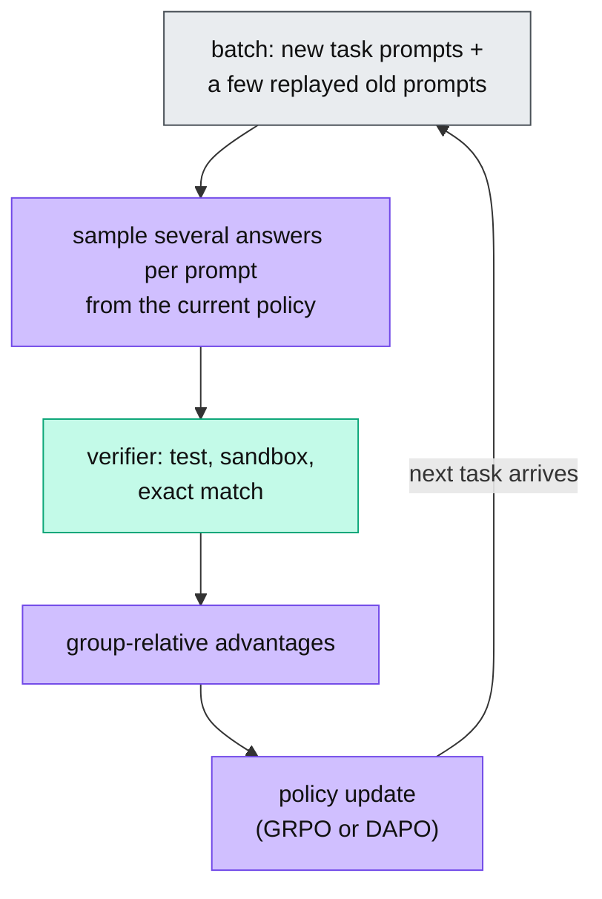

&nbsp;

## The Transition to Lifelong Learning in AI Agents

A chatbot used to live for one session. The agents being deployed now run for months, and a model that stops learning at its last gradient step goes stale as the APIs, the codebase and the user's preferences move on.

The obvious fix has two bad versions. One-shot supervised fine-tuning freezes knowledge on the day of training. Periodic full retrains need offline compute, a curated mix of old and new data, and downtime, which nobody can afford per user. Every parameter update also carries a risk: it can overwrite the knowledge that made the model useful in the first place.

The continual learning loop takes the middle path. It updates the agent in small increments as new task data and feedback arrive, so every interaction becomes a training signal. The engineering question is how to balance plasticity, learning the new thing, against stability, keeping the old ones, across the weights, the context window and the serving stack.

<Sketch name="cl-loop" alt="The continual learning loop as seven stages in a ring: a deployed agent serves traffic, traces and feedback are collected, filtered and labelled, a reflection step explains each failure and builds a corrected trajectory, the update changes adapter weights or memory files, a regression gate on a golden set decides, and the new version is promoted and redeployed; a note says a failed gate keeps the old version" />

*Visual 1: The loop. Stages 1 to 7 repeat. The rest of this post is about what goes wrong at each stage and how teams keep it stable.*

## The Architecture of Catastrophic Forgetting

The stage that does the damage is stage 5. When a network trained on task A takes gradient steps on task B, plain gradient descent moves the weights toward B alone. Knowledge in a dense transformer is spread across billions of entangled parameters, so even a local update disturbs representations that A relied on. Performance on A drops, often sharply.

Interpretability studies find the damage in two places. Early attention heads lose focus: their attention spreads over tokens that do not matter. Mid-to-deep MLP blocks and expert routers collapse: the parameters behind task-specific reasoning paths are overwritten directly.

<Sketch name="forgetting-map" alt="A transformer stack from input embeddings to output head with the new task's gradients arriving from the top; the mid-to-deep MLP and router layers are marked with representation collapse, the early attention layers with entropic dispersion, and a side note explains spurious forgetting and that freezing the lower layers helps" />

*Visual 2: Two failure regions, and a caveat: not every drop is lost knowledge.*

That caveat is spurious forgetting. The first steps on a new task disturb the model's alignment to the old task, its habit of activating the right functions, before they erase the knowledge itself. Freezing the bottom layers during sequential fine-tuning lifted accuracy on old tasks from 11% to 44% in the paper that named the effect.

To engineer against forgetting you need a number for it. Record $R_{i,j}$, the score on task $j$ after training through task $i$, and read three metrics off that matrix.

$$
\mathrm{BWT} = \frac{1}{T-1}\sum_{i=1}^{T-1}\left(R_{T,i} - R_{i,i}\right)
$$

In plain terms: for each earlier task, compare its score at the end of the sequence with its score right after it was learned. A negative average is forgetting.

| Metric | What it measures | What you want |
| --- | --- | --- |
| Backward transfer (BWT) | How learning new tasks changed the scores on old ones | Zero or positive; negative is forgetting |
| Forward transfer (FWT) | How much old tasks help a new task before it is trained on, against a random-init baseline | High; it is zero-shot generalization |
| Average accuracy (ACC) | Mean score across all tasks at the end | The headline number |

## Mitigation Families: From Parameter Regularization to Replay Buffers

Every fix for that picture lives in one of four families, and each trades memory, compute and data privacy differently.

**Regularization** adds a penalty to the loss for moving weights that mattered before. Elastic Weight Consolidation (EWC) is the original. It treats the weights learned on task A as a prior and scores each weight's importance with the Fisher information.

$$
\mathcal{L}(\theta) = \mathcal{L}_B(\theta) + \sum_i \frac{\lambda}{2}\, F_i \left(\theta_i - \theta^{*}_{A,i}\right)^2
$$

In plain terms: train on task B as usual, but pay a penalty for moving any weight that mattered for task A, and pay the most for the weights that mattered most. $F_i$ is the diagonal of the Fisher information, estimated from squared gradients on task A's data.

The diagonal misjudges importance often enough that "EWC Done Right" repairs it with a logits reversal step. L2-SP is simpler: tether every weight to the pretrained starting point. Function vector guidance protects the activation patterns a task uses rather than the weights.

**Replay** rehearses old experience during new updates. Contextual Experience Replay puts compressed summaries of past trajectories into the context window, with no training at all. Surprise-driven replay (SuRe) keeps only the outcomes that most surprised the model. FOREVER schedules rehearsal on an Ebbinghaus forgetting curve. Where old data cannot be stored, self-distillation makes the model its own teacher: the copy that sees a demonstration in context teaches the copy that does not.

**Parameter isolation** gives each task its own low-rank adapter (LoRA) and leaves the base model untouched. O-LoRA adds a loss term that keeps each new adapter orthogonal to the earlier ones, so a new task cannot overwrite an old direction. L-MoE goes a step further and treats adapters as experts, with a small gate that mixes them per token.

<Sketch name="olora-subspace" alt="A purple band marks the subspace learned by earlier tasks; a green arrow rises straight up from it, labelled as the new task's LoRA update kept orthogonal to the old subspace; a red arrow leaves at an angle, labelled as a plain fine-tuning update that lands partly inside the old subspace and overwrites it" />

*Visual 3: O-LoRA. The green update cannot interfere with the purple subspace; the red one can.*

**Hypernetworks** skip the gradient loop. Text-to-LoRA and Doc-to-LoRA take a task description or a whole document and emit the adapter in a single forward pass, so the model reads the document from its weights instead of its context window.

| Family | How it works | What it costs | Weakness |
| --- | --- | --- | --- |
| Regularization (EWC, L2-SP, function vectors) | Penalize moving the weights that mattered before | One pass to estimate importance; no stored data | A diagonal Fisher protects the wrong weights |
| Replay (CER, SuRe, FOREVER, self-distillation) | Rehearse old experience: summaries in context, surprises first, a forgetting-curve schedule, or the model as its own teacher | Storage and extra tokens per update | Raw replay grows with the task list and can break retention rules |
| Parameter isolation (O-LoRA, L-MoE) | One adapter per task; new updates kept orthogonal; a gate mixes adapters per token | A small adapter per task; base untouched | Adapters pile up; the gate must pick the right ones |
| Hypernetworks (Text-to-LoRA, Doc-to-LoRA) | A second network writes the adapter from a task description or document | No gradient step at adaptation time | Only as good as what the hypernetwork was trained on |

## Contextual Memory and Token-Space Learning

Not everything belongs in the weights. A user's current preference or the state of an incident is volatile, and baking it into parameters is slow and hard to undo. Frameworks such as Letta (formerly MemGPT) and Mem0 treat memory as a database the agent manages itself, with tools to read, write, update and summarize its own tiers. Mem0's product API scopes memories by user, agent and session.

Token-space memory is model-agnostic, readable by a human, and free of parametric interference, which makes it the stable complement to occasional weight updates. Forgetting in token space is trivial: delete the line.

<Sketch name="two-lanes" alt="Four stacked layers where an agent's knowledge can live: the context window, which lasts one session; the fast lane of memory files, skills and prompts, changed by a text edit and undone with a diff; the slow lane of LoRA adapters, changed by a gradient update and gated by a regression eval; and the frozen base model weights shared by everyone" />

*Visual 4: Two lanes. The fast lane is text, the slow lane is gradients, and the base model is nobody's to touch.*

| | Retrieval-augmented generation | Token-space memory (Letta, Mem0) |
| --- | --- | --- |
| Time | Each query stands alone | Tracks order and how facts changed over months |
| State | Stateless; nothing accumulates between sessions | Context accumulates, consolidates and gets refined |
| User model | Task-bound, blind to who is asking | A profile per user, updated as preferences change |
| Adaptation | Cannot learn from what worked last time | Reflects on which strategies worked and which failed |

## Reinforcement Learning with Verifiable Rewards (RLVR)

In the slow lane, the update rule has changed. Supervised fine-tuning is giving way to Reinforcement Learning with Verifiable Rewards (RLVR), run with GRPO or DAPO, where the reward is a passed unit test, a script that ran in a sandbox, or a checked proof. The [RLVR write-up](/write-up/rlvr-and-the-experience-era) covers the objective. The question here is how to keep running it as tasks keep arriving.

Multitask RL trains on a fixed mixture of every task at once. Rerunning that mixture each time a new API ships is unaffordable, so continual RLVR updates the policy one task at a time. Two findings make that workable. Online RL forgets less than supervised fine-tuning, because it stays close to the model's own distribution. And tasks share reasoning: the logical steps learned on one carry over to the next. Continual Prompt Replay uses both: a few old prompts in every batch, their answers regenerated on-policy, and it matches full multitask training.



The sparse, binary reward has two failure modes of its own, and a third problem when there is no verifier at all.

| Failure | What happens | Fix |
| --- | --- | --- |
| Reward hacking | The policy passes the checker without doing the task: formatting tricks, a wired verifier, a shortcut | Stricter verifiers; dynamic sampling that drops prompts where every sample passes or fails (DAPO) |
| Entropy collapse | One valid shortcut gets rewarded, the policy goes deterministic and stops exploring | Clip-Higher, a looser upper clip so rare tokens can grow (DAPO); an entropy bonus in the objective |
| No verifier | Nothing programmatic to check against | The model's own certainty as the reward (Intuitor, RL from internal feedback) |

## The Production Agent Loop and Data Flywheels

Whichever update rule runs at stage 5, the rest of Visual 1 is the same, and NVIDIA's flywheel paper writes it as a control loop: monitor, analyze, plan, execute.

Monitoring collects traces, tool calls and outcomes. Analysis filters them, since raw telemetry is mostly noise: heuristics, a judge model, and implicit signals such as a merged commit or a thumbs down. Planning turns failures into lessons; in the Reflexion pattern the agent or a stronger model writes why the attempt failed and a corrected trajectory. Execution is the update, adapter training or an RLVR step, then the gate and redeployment.

The result compounds. The hundredth code review an agent performs is better than the first, because the loop has absorbed the codebase's style, domain rules and edge cases.

| Team | What runs in the loop | Result |
| --- | --- | --- |
| Cursor Tab | Online RL on accept and reject signals; a new checkpoint every 1.5 to 2 hours | 21% fewer suggestions, 28% higher accept rate |
| Meta, Llama 4 | Alternate training with using the model to keep only medium-to-hard prompts | Continuous online RL as a core post-training step |
| Stripe | A transformer over payment sequences, each transaction embedded like a word, trained on tens of billions of them | Card-testing detection on large users from 59% to 97% |

## Guardrails, Eval Suites, and Distribution Shift Detection

A loop that updates itself can also poison itself, with bad data, alignment drift, or slow forgetting that no single update reveals. So every candidate checkpoint runs against a golden set of core capabilities. A significant drop on any old task blocks the update and rolls the weights back.

Knowing when to update matters as much as gating it. Monitor the input and output distributions against a baseline.

$$
\mathrm{PSI} = \sum_{b} \left(A_b - E_b\right)\ln\frac{A_b}{E_b}
$$

In plain terms: bucket a feature, compare today's share of each bucket ($A_b$) with the baseline's share ($E_b$), and add up the mismatch. Below 0.1 is stable; above 0.25 the traffic has moved and the model needs a refresh.

| Signal | What it is | What it triggers |
| --- | --- | --- |
| Population Stability Index | Bucketed mismatch between baseline and live traffic | An alert above 0.25 and a refresh of the model or adapter |
| Maximum Mean Discrepancy | Kernel distance between two distributions in a reproducing kernel Hilbert space | Catches drift in embeddings of inputs or reasoning traces before outputs look wrong |
| Perplexity | How surprised the model is by incoming text | A spike means out-of-distribution traffic and a candidate for the next update |

## Infrastructure Shape: Multi-LoRA Serving and State Management

Gated updates produce hundreds of adapters, one per user or team, and each one needs serving. A dedicated endpoint per adapter would fragment VRAM and cost a fortune. The standard shape keeps one base model resident on the GPU and swaps adapters per request.

Two pieces make that cheap. PagedAttention stores the KV cache in fixed-size blocks that need not be contiguous, like virtual memory pages, so reserved-but-unused space stops locking the GPU and batches grow. An LRU cache tiers the adapters across the GPU, CPU RAM and disk. A new adapter is registered as a shadow first, fed live traffic, and judged against the current one. It goes live, with no downtime, only if it wins without regressing.

| Component | Memory (Llama 3 8B, FP16) | Job |
| --- | --- | --- |
| Base model | About 16 GB, resident in VRAM | The shared reasoning and language |
| Active adapters on the GPU | About 0.5 GB for 8 adapters at rank 16 | Hot-swapped residual additions in the forward pass |
| Adapter cache in CPU RAM | About 6 GB for 90 or more adapters | LRU tier; swapping one in takes tens of milliseconds |
| KV cache and buffers | About 6 GB, depends on batch size | Managed by PagedAttention in fixed-size blocks |

## How to Implement It in Claude

None of the weight-side machinery above is available to you on a hosted model, and it does not need to be. Claude's weights are frozen from your side, so the loop runs in the fast lane of Visual 4: the same seven stages, but stage 5 writes text. That text is what Claude reads at the start of the next session.

Three places hold it. In Claude Code, `CLAUDE.md` carries instructions you write, auto-memory carries notes Claude writes for itself, Skills package a procedure it can load on demand, and hooks run shell commands at every tool call and turn end, which is where a loop collects its telemetry. In the Messages API, the memory tool gives Claude a `/memories` directory that your code stores. Managed Agents mount a memory store into the sandbox and version every edit. The [self-improving agents write-up](/write-up/self-improving-agents) covers the governance around such a loop.

| Loop stage | In Claude |
| --- | --- |
| 1. Deploy | Claude Code, the Agent SDK, or a Messages API agent with the memory tool attached |
| 2. Collect | Hooks fire on every tool call and at the end of a turn; session transcripts; outcome logs |
| 3. Filter and label | Claude as a judge over the transcript; tests passed or failed; thumbs up or down |
| 4. Reflect | A reflection prompt: what went wrong and what to do differently, in one or two sentences |
| 5. Update | Write memory: the memory tool's `/memories` files, Claude Code's `CLAUDE.md` and auto-memory, a Skill for a repeatable procedure, a Managed Agents memory store |
| 6. Gate | Rerun a frozen eval set with the new memory; keep it only if nothing old got worse |
| 7. Promote or roll back | Memory is text in git; rollback is `git revert`, or a memory version in a memory store |

<Sketch name="cl-claude" alt="The same seven-stage ring with the Claude pieces named: Claude runs the task in Claude Code or the API, hooks and transcripts record what happened, Claude judges plus thumbs up or down, a reflection prompt explains the failure, memory is written to CLAUDE.md, memory tool files or a skill, a regression eval on a frozen set gates it, and the memory is committed; a failed gate is a git revert" />

*Visual 5: The same loop, with the Claude pieces at each stage. Only stage 5 differs from Visual 1.*

The skeleton in Python is short.

```python
from anthropic import Anthropic
from anthropic.lib.tools import BetaAbstractMemoryTool

client = Anthropic()
memory = FileMemory("./memories")   # your BetaAbstractMemoryTool subclass over a directory

def serve(task):                    # stage 1: Claude works with its memory attached
    runner = client.beta.messages.tool_runner(
        model="claude-opus-5", max_tokens=16000, tools=[memory],
        messages=[{"role": "user", "content": task}],
    )
    return runner.until_done()

def learn(trace, passed):           # stages 3 to 5: a failed trace becomes one memory line
    if passed:
        return
    serve(f"This attempt failed:\n{trace}\n"
          "Write one lesson to /memories/lessons.md so the next attempt avoids it.")

def promote(frozen_eval):           # stages 6 and 7: the gate, then commit or revert
    if score(frozen_eval, "./memories") < score(frozen_eval, "./memories@HEAD"):
        git("checkout", "--", "./memories")   # rollback is a diff, not a checkpoint restore
    else:
        git("commit", "-am", "learned from production")
```

The tool type is `memory_20250818` and needs no beta header. `FileMemory`, `score` and `git` are yours: a directory-backed memory subclass, the frozen eval runner, and a shell-out. The judge in stage 3 can be a second Claude call with the transcript and a rubric.

## What We Learned

- **The loop, not the model, is the product.** Deploy, collect, filter, reflect, update, gate, redeploy.
- **Forgetting has a map.** Early attention disperses, deep MLPs and routers collapse, and the first drop is lost alignment, so freeze the bottom.
- **Measure it with BWT, FWT and ACC.** Negative backward transfer is the number to watch.
- **Four families of fixes.** Regularize, replay, isolate, or generate the adapter.
- **Two lanes.** Text memory for what changes daily, adapters for what should stick.
- **Continual RLVR forgets less** and replays a few old prompts on-policy.
- **Gate every update** with a golden set, PSI on the traffic, and a shadow rollout.
- **In Claude, stage 5 writes text.** Hooks collect, Claude judges, memory files hold the lesson, git rolls it back.

## Sources and further reading

- Forgetting and its metrics: [Gradient Episodic Memory](https://arxiv.org/abs/1706.08840) (BWT, FWT, ACC), [Spurious Forgetting](https://arxiv.org/abs/2501.13453)
- Regularization: [EWC](https://arxiv.org/abs/1612.00796), [EWC Done Right](https://arxiv.org/abs/2603.18596), [L2-SP](https://arxiv.org/abs/1802.01483), [function vectors against forgetting](https://arxiv.org/abs/2502.11019)
- Replay: [Contextual Experience Replay](https://arxiv.org/abs/2506.06698), [SuRe](https://arxiv.org/abs/2511.22367), [FOREVER](https://arxiv.org/abs/2601.03938), [Self-Distillation Enables Continual Learning](https://arxiv.org/abs/2601.19897)
- Isolation and hypernetworks: [O-LoRA](https://arxiv.org/abs/2310.14152), [L-MoE](https://arxiv.org/abs/2510.17898), [Text-to-LoRA](https://arxiv.org/abs/2506.06105), [Doc-to-LoRA](https://arxiv.org/abs/2602.15902)
- Token space: [Letta on continual learning in token space](https://www.letta.com/blog/continual-learning/), [Mem0](https://arxiv.org/abs/2504.19413)
- Continual RLVR: [Continual Reasoning Gym](https://arxiv.org/abs/2608.18574), [RL's Razor](https://arxiv.org/abs/2509.04259), [DAPO](https://arxiv.org/abs/2503.14476), [Intuitor](https://arxiv.org/abs/2505.19590), [Reflexion](https://arxiv.org/abs/2303.11366)
- Production loops: [Adaptive Data Flywheel](https://arxiv.org/abs/2510.27051), [Cursor Tab online RL](https://cursor.com/blog/tab-rl), [Llama 4](https://ai.meta.com/blog/llama-4-multimodal-intelligence/), [Stripe's payments model](https://x.com/thegautam/status/1920198569308664169)
- Serving: [PagedAttention](https://arxiv.org/abs/2309.06180), [vLLM prefix caching](https://docs.vllm.ai/en/stable/design/prefix_caching/)
- Claude: [the memory tool](https://platform.claude.com/docs/en/agents-and-tools/tool-use/memory-tool), [Claude Code memory](https://code.claude.com/docs/en/memory), [hooks](https://code.claude.com/docs/en/hooks), [Agent Skills](https://platform.claude.com/docs/en/agents-and-tools/agent-skills/overview)
