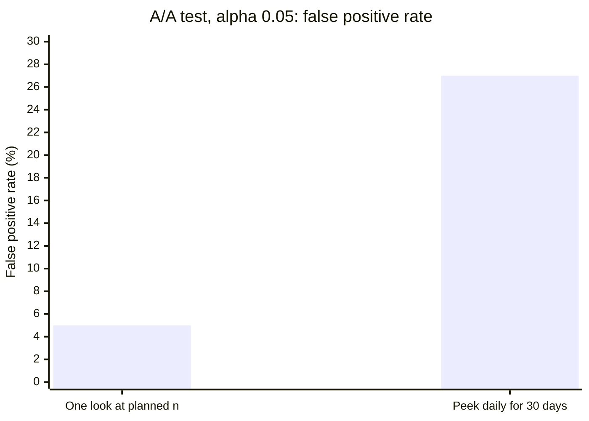
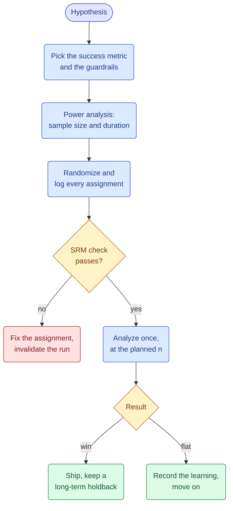
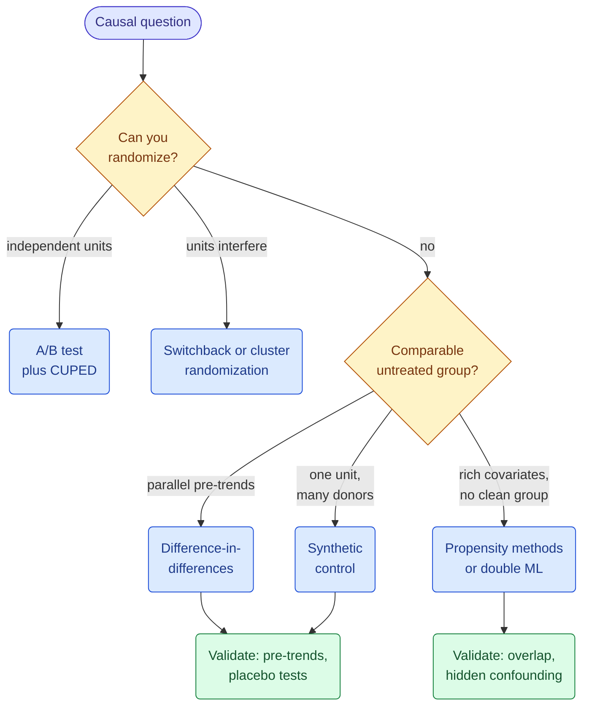
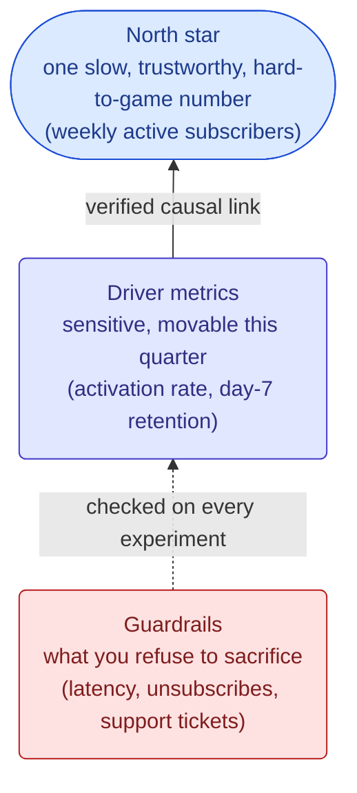
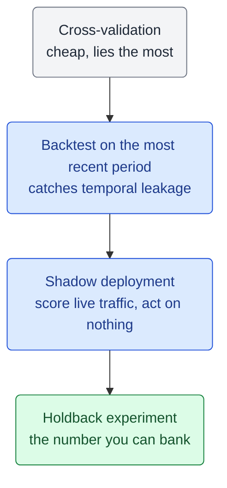
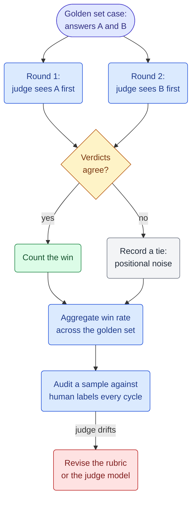
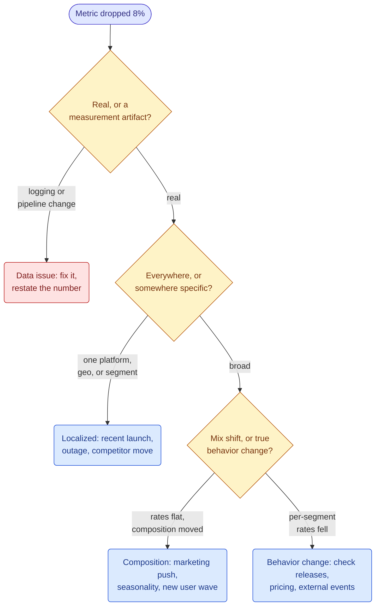

&nbsp;

What a senior data scientist is expected to know cold: statistics, experiment design, causal inference, metric craft, modeling judgment, and evaluation. One section covers the 2026 market, one maps it all onto interview prep.

**Table of Contents**

1. [Statistical Thinking Under Uncertainty](#1-statistical-thinking-under-uncertainty)
2. [Experiment Design](#2-experiment-design)
3. [Causal Inference Beyond the A/B Test](#3-causal-inference-beyond-the-ab-test)
4. [Metric Design and Decision Framing](#4-metric-design-and-decision-framing)
5. [Classical ML That Still Wins](#5-classical-ml-that-still-wins)
6. [Evaluation and Calibration](#6-evaluation-and-calibration)
7. [Bayesian Decision-Making](#7-bayesian-decision-making)
8. [LLM Evaluation as a Measurement Problem](#8-llm-evaluation-as-a-measurement-problem)
9. [LLM as a Judge](#9-llm-as-a-judge)
10. [What Separates a Distinguished Data Scientist from an Average One](#10-what-separates-a-distinguished-data-scientist-from-an-average-one)
11. [What the Market Demands in 2026](#11-what-the-market-demands-in-2026)
12. [Interview Prep for Senior Data Science Roles](#12-interview-prep-for-senior-data-science-roles)

## 1. Statistical Thinking Under Uncertainty

A p-value is the probability of data at least this extreme if the null were true. Not the probability the null is true, not the probability of replication, not an effect size. Most industry damage comes from violating its preconditions, and the biggest violation is peeking:

Same data, same alpha, five times the false ships. The fix is not "never look": either pre-commit the sample size and analyze once, or use methods built for monitoring (sequential tests, or the expected-loss rule in Section 7).

**Power is the neglected half.** Detecting a lift from 4.2% to 4.4% conversion at 80% power needs roughly **81,000 users per arm**. That is the math to run before the test, not the argument to have after a null result.

| Mistake                          | What it looks like                                          | Why it is wrong                                                                  |
| -------------------------------- | ----------------------------------------------------------- | -------------------------------------------------------------------------------- |
| Peeking / optional stopping      | "It went significant on day 6, we shipped"                  | Inflates false positives from 5% to ~27% (chart above)                           |
| Underpowered test read as "no effect" | "We tested it, no significant difference"              | A test powered at 30% misses the true effect 70% of the time                     |
| Multiple comparisons             | 20 metrics, one "significant" at p=0.04                     | At alpha 0.05, one in twenty null metrics goes significant by chance             |
| Survivorship in the data pull    | Churn model trained only on users who completed onboarding  | The filter is correlated with the outcome; the sample no longer represents the population |
| Significance read as importance  | "p=0.001, huge win"                                         | With 10M users, a +0.01% lift is significant and worthless; report the effect size |

## 2. Experiment Design

Running a test is easy; designing it so the answer means something is the craft, and it happens before the first user is assigned.

Three design calls carry most of the weight:

- **Randomization unit.** Per-user metrics need per-user randomization; page-view splits show one user both variants and fake the sample size. When users interfere (marketplaces, social), move up to cluster or switchback.
- **SRM.** A 50/50 split that lands 50.3/49.7 on 200k users means the assignment is broken, not the product. SRM p < 0.001 invalidates the run, whatever the metrics say.
- **CUPED.** Adjusting with each user's pre-experiment value cuts variance by the squared pre/during correlation: at 0.6, a 36% smaller sample. The cheapest speedup in experimentation.

| Pitfall                | Symptom                                                | Fix                                                                    |
| ---------------------- | ------------------------------------------------------ | ---------------------------------------------------------------------- |
| SRM                    | Split is 50.3/49.7 with p < 0.001                      | Audit assignment plumbing; invalidate the run                          |
| Novelty effect         | Big lift week 1, decays to zero by week 3              | Run at least two full weeks; check the effect by cohort day            |
| Interference           | Marketplace test where control keeps "losing" inventory| Cluster or switchback randomization                                    |
| Metric dilution        | Feature only 5% of users see, tested on 100% of traffic| Trigger analysis: measure only exposed users, power accordingly        |
| Weekday seasonality    | Test started Friday, read Monday                       | Always run whole weeks (multiples of 7 days)                           |
| Winner's curse         | Shipped effects consistently smaller than test effects | Shrink estimates; validate with a long-term holdback                   |

The long-term holdback: keep 1 to 5% of users on the old experience for a quarter. It is the only real measure of cumulative shipped impact, and it catches slow harms (ad load, notification fatigue) that two-week tests cannot see.

## 3. Causal Inference Beyond the A/B Test

Most decisions worth real money cannot be randomized: prices in regulated markets, TV campaigns, policies that leak across users, things already shipped. Each rung of the ladder below buys applicability by paying with a stronger assumption.

| Method                  | Identifying assumption                                          | Breaks when                                                        | Production example                              |
| ----------------------- | ---------------------------------------------------------------- | ------------------------------------------------------------------ | ----------------------------------------------- |
| Randomized experiment   | Randomization worked (check SRM)                                 | Interference between units                                         | Everywhere                                      |
| Switchback              | Effects do not carry over between time windows                   | Long carryover (learning, inventory depletion)                     | Uber and DoorDash pricing and dispatch          |
| Difference-in-differences | Treated and control groups would have moved in parallel        | A shock hits one group only (check pre-trends)                     | Netflix cites it in production causal surveys   |
| Synthetic control       | A weighted blend of donor units reproduces the treated unit's pre-history | Too few donors; the treatment leaks into donors           | City or country launches, TV campaigns          |
| Propensity methods / IPW| All confounders are measured                                     | Selection on unobservables, extreme weights                        | Netflix inverse probability weighting survey    |
| Double machine learning | Same, but flexible ML absorbs high-dimensional confounders       | The same hidden-confounding failure, now harder to see             | Netflix Causal Models library, EconML at scale  |
| Uplift / HTE models     | Ignorability plus enough data per segment                        | Segments too thin; effects confused with correlations              | Targeting: who to send the promo to             |

**Diff-in-diff in one example.** A region gets a feature at week 10 and revenue climbs 10 by week 20. The control region climbed 7 on trend and a market shock alone, so the true effect is +3. Everything rests on parallel trends: plot the pre-period, run a placebo test at an earlier fake launch date, confirm nothing else hit one group only.

**Double ML** handles hundreds of confounders: boosted models predict both outcome and treatment, the effect comes from the residuals, cross-fitting keeps overfitting out of the estimate. Its per-segment output is uplift modeling's input, and that is where the money is: promos to users who would convert anyway are pure margin loss.

## 4. Metric Design and Decision Framing

Choosing the metric is the highest-leverage decision in the pipeline, and turning "make the product better" into a number that resists gaming is a technical act.

Every driver metric is a proxy, and every proxy obeys Goodhart's law. The standing question for any proposed metric: what is the cheapest degenerate way to move this number? Some team will eventually find it.

| Anti-pattern            | Real-shaped example                                                      | What went wrong                                                          |
| ----------------------- | ------------------------------------------------------------------------ | ------------------------------------------------------------------------ |
| Goodharted proxy        | Optimize "notifications clicked," ship more notifications, churn rises   | The proxy diverged from the outcome it proxied                           |
| Ratio metric trap       | Revenue per session "improves" because low-intent sessions disappeared   | Both numerator and denominator moved; per-user totals fell               |
| Averages hiding skew    | Mean revenue per user up 4%, driven entirely by 12 whale accounts        | Report medians and quantiles alongside means                             |
| Dashboard metric nobody can move | "Brand health index" reviewed monthly, no team owns it          | A metric with no causal lever and no owner is decoration                 |
| Unpowered guardrail     | "Churn guardrail passed" on a test that could only detect a 30% churn jump | State the detectable effect size for guardrails too                    |

Decision framing: a p-value does not carry a decision, a cost does. The version that works in a leadership meeting is "+0.8% revenue, 95% interval +0.2 to +1.4; at our volume that is $2.1M to $14.6M a year; the downside still clears the engineering cost, so ship."

## 5. Classical ML That Still Wins

For tabular business data the winning tool has not changed: gradient-boosted trees ([Grinsztajn et al., NeurIPS 2022](https://arxiv.org/abs/2207.08815)). [TabPFN v2](https://www.nature.com/articles/s41586-024-08328-6) changed the small-data picture, but the production default remains LightGBM or XGBoost: no GPU, minutes to train, native missing values, monotonic constraints when compliance asks.

| Situation                                   | Default                                            |
| ------------------------------------------- | -------------------------------------------------- |
| Tabular, 10k to 100M rows                   | Gradient boosting (LightGBM, XGBoost, CatBoost)    |
| Tabular, under ~10k rows                    | TabPFN or regularized linear models                |
| Need coefficients a regulator can read      | Logistic regression, monotonic GBM                 |
| Text, images, audio                         | Pretrained deep models, fine-tuned                 |
| Any of the above, day 1                     | A baseline first: mean, last value, or logistic regression |

The baseline tells you how much signal exists, catches broken pipelines, and gives every later improvement a denominator.

**Leakage always flatters you.** The most expensive ML failure is not a weak model but a strong-looking one, because information from outside the prediction window snuck into training.

| Leakage type            | Example                                                                | Detection                                                        |
| ----------------------- | ---------------------------------------------------------------------- | ---------------------------------------------------------------- |
| Target leakage          | "Days since cancellation call" as a churn feature                      | Feature importance dominated by one suspiciously good feature    |
| Temporal leakage        | Random train/test split on time-ordered data                           | Performance collapses when you switch to a time-based split      |
| Preprocessing leakage   | Scaler or encoder fit on the full dataset before splitting             | Fit all preprocessing inside the cross-validation loop           |
| Join leakage            | Feature table snapshotted today, joined onto last year's training rows | Point-in-time joins; this is what feature stores enforce         |

Two habits close most of these: preprocessing lives inside the pipeline so it refits per fold, and time-ordered data always gets time-based splits. If the time-split score is much worse than the random-split score, you found the leak. Feature engineering lives in the [pandas walkthrough](/write-up/from-raw-data-to-ml-ready-a-pandas-walkthrough); infrastructure in the [ML prep guide](/write-up/ml-engineer-comprehensive-technical-prep-guide) and [MLOps write-up](/write-up/mlops-tooling-from-experiment-tracking-to-production).

## 6. Evaluation and Calibration

Accuracy is not a business quantity; every threshold is a decision with asymmetric costs.

- **Thresholds are expected-value choices.** A $5 false-positive review against a $100 false-negative chargeback puts the optimal threshold near 0.05, not 0.5. Two models with equal AUC can differ by millions at the operating threshold. Getting the two costs from finance is data science work.
- **Calibration is whether 0.7 means 70%.** Boosted trees and neural nets are routinely miscalibrated; anything doing arithmetic on scores (expected LTV, cost ranking) inherits the error. Check with a calibration curve, fix with isotonic regression (large data) or Platt scaling (small).

Offline gains shrink online: the world reacts to models, pipelines differ between training and serving, populations drift. Monitor inputs, not just outputs; labels arrive late or never, but feature drift shows in real time. A population stability index on the top features catches most silent failures.

## 7. Bayesian Decision-Making

Netflix runs Bayesian A/B testing in production, and the reason to care is that the Bayesian readout answers what the room is actually asking:

| The room asks                          | Frequentist readout                          | Bayesian readout                                                  |
| -------------------------------------- | -------------------------------------------- | ----------------------------------------------------------------- |
| "Which one is better?"                 | "p = 0.037, reject the null"                 | "98% probability B beats A"                                       |
| "How wrong could we be?"               | A confidence interval, routinely misread     | "If B is actually worse, expected loss is under 0.001pp"          |
| "Can we check it daily?"               | No; peeking inflates false positives         | Yes; the expected-loss rule is built for monitoring               |
| "We only have 8,000 users"             | Wide intervals, swingy point estimates       | A mild prior (last quarter's rate) regularizes the noise          |

The machinery for conversion metrics is a Beta prior per arm, updated by observed conversions; simulate both posteriors and read off the win probability and the expected loss of shipping the loser. On 100k users per arm at 4.12% vs 4.31%, that is ~98% probability B wins, expected loss ~0.0006pp.

- **Ship on expected loss, not p-value.** You are capping regret, not controlling false positives, so checking daily is the intended use.
- **State the prior.** An unstated prior is the Bayesian version of peeking.
- **Feed the posterior to the decision.** Simulate revenue per posterior draw; report the distribution, not a point estimate.

One caveat: platform-scale experimentation still runs frequentist sequential methods because they industrialize better. Bayesian framing wins for bespoke analyses, low traffic, and rooms that act on the number.

## 8. LLM Evaluation as a Measurement Problem

The GenAI wave did not retire these fundamentals; it made them the bottleneck. [MIT's NANDA study](https://www.aigl.blog/state-of-ai-in-business-2025/) found 95% of enterprise GenAI pilots delivered no measurable P&L impact. The models work; the measurement does not.

| Classical concept              | LLM-era equivalent                                             |
| ------------------------------ | -------------------------------------------------------------- |
| Test set                       | Golden set: 50 to 500 curated cases with reference answers      |
| Labeling                       | LLM-as-judge, periodically audited against human labels        |
| Measurement error              | Judge bias: position, verbosity, self-preference               |
| Guardrail metrics              | Refusal rate, latency, cost per interaction, safety flags      |
| Online experiment              | A/B test on task completion, not on "sounds better"            |
| Calibration                    | Does a judge score of 8/10 map to a stable pass rate?          |

The toolkit transfers intact: power analysis sizes the golden set, SRM-style checks catch broken eval pipelines, the Section 7 shipping rule applies to "prompt v2 beats prompt v1." For agents, guardrails (tool-call errors, cost per task, escalations) matter more than the headline score. The production side is in [The AI Engineer's Swiss Knife](/write-up/ai-engineers-swiss-knife) and [Graph Engineering for Agentic AI](/write-up/graph-engineering-for-agentic-ai).

## 9. LLM as a Judge

The judge is a measurement instrument with documented biases ([Zheng et al., MT-Bench](https://arxiv.org/abs/2306.05685)); using it without controls is the GenAI version of peeking.

| Bias            | What happens                                          | Mitigation                                                        |
| --------------- | ----------------------------------------------------- | ----------------------------------------------------------------- |
| Position bias   | The answer shown first wins more often                | Judge every pair twice with positions swapped; only verdicts that survive both orders count |
| Verbosity bias  | Longer answers win regardless of quality              | Instruct the judge to score rubric fit only; spot-check length-vs-score correlation |
| Self-preference | Models rate their own outputs higher                  | Judge with a different model family than the one being evaluated  |

- **Pairwise beats pointwise**: comparisons are anchored by the alternative; absolute 1-to-10 scores drift.
- **A flipped verdict is a tie**: counting positional noise for either side manufactures signal.
- **Cheap judge, expensive audit**: an unaudited judge is an unvalidated instrument.
- **The rubric is the instrument definition**: version it, and treat rubric changes like metric changes.

## 10. What Separates a Distinguished Data Scientist from an Average One

The average column is a competent scientist, not a caricature. The gap is where the work starts and stops:

| Dimension          | Average data scientist                                         | Distinguished data scientist                                                                 |
| ------------------ | -------------------------------------------------------------- | -------------------------------------------------------------------------------------------- |
| Problem framing    | Answers the question as asked                                  | Asks what decision this analysis will change; declines work that changes none                 |
| Metrics            | Optimizes the metric handed down                               | Interrogates the metric first; predicts how it will be gamed                                  |
| Statistics         | Runs the test, reports the p-value                             | Designs for power up front; catches peeking and SRM in review                                 |
| Causality          | "We can't A/B test this, so we can't know"                     | Climbs the methods ladder and states the identifying assumption out loud                      |
| Modeling           | Reaches for the newest architecture                            | Baseline first; treats a suspiciously good result as a leak until proven otherwise            |
| Evaluation         | Reports offline AUC                                            | Prices the errors, calibrates the scores, trusts nothing until shadow mode                    |
| GenAI              | Demos what the model can do                                    | Measures whether it moved the business number                                                 |
| Communication      | Presents the analysis                                          | Presents the decision: recommendation, dollar range, downside case                            |
| Failure handling   | The null result dies in a slide deck                           | Logs the learning where the next team will find it; kills own projects early                  |
| Leverage           | Their output is their own analyses                             | Their output is the standard: templates, review culture, platforms                            |

Three rows do most of the separating:

- **Decisions, not analyses.** Their unit of work is a changed decision; if nobody would act differently on the answer, the project does not start.
- **Assumptions said out loud.** Parallel trends, no hidden confounding, the prior, the judge rubric: stated in the first five minutes, with the test that would break them. That is what makes their number the one the room acts on.
- **Leverage over output.** Their fingerprints are on work they never touched: the review checklist that catches SRM, the metric definitions everyone reuses, the eval harness that made rigor cheaper than sloppiness.

## 11. What the Market Demands in 2026

One caveat: posting studies disagree wildly by job board. [365DataScience](https://365datascience.com/career-advice/career-guides/data-scientist-job-outlook-2025/) got Python at 85% (Glassdoor) and 57% (Monster) in the same month, so trust year-over-year deltas within one methodology, not absolute levels. With that filter, the senior demand stack:

| Rank | Skill                                        | The evidence                                                                                       |
| ---- | -------------------------------------------- | -------------------------------------------------------------------------------------------------- |
| 1    | Experimentation and causal inference         | Causal inference up 17pp YoY, A/B testing up 14pp, the two largest technical gains ([Choo](https://askdatadawn.substack.com/p/how-has-the-data-science-job-market)) |
| 2    | Communication and stakeholder management     | 86% of postings, above SQL and Python; stakeholder mgmt up 13pp (Choo)                             |
| 3    | SQL and warehouse-shaped data work           | 79% of postings, up 18pp; ETL up 18pp, Snowflake up 10pp, dbt up 9pp (Choo)                        |
| 4    | Python plus core ML                          | Python 57 to 85%, ML 62 to 77% across sources; table stakes, not differentiators                   |
| 5    | Metric design and model evaluation           | Core senior interview dimension at Meta, Google, Netflix, Airbnb                                   |
| 6    | GenAI measurement literacy (evals, LLM-as-judge) | ~60% of postings expect "some AI capability" ([Vourakis](https://read.futureproofds.com/p/ai-and-data-scientist-job-market-in-2026)); dedicated LLM-evaluation titles appearing |
| 7    | Cloud and pipelines                          | ~62% mention cloud; AWS 20 to 27%, Azure 14 to 29% (365DataScience)                                |

- **Classical causal skills are outgrowing GenAI skills**: +17pp and +14pp vs LLM engineering +9pp, agentic AI +8pp, RAG +4pp.
- **AI is signaled everywhere, measurement is hired**: 45% of data postings mention AI ([Indeed](https://hiringlab.indeed.com/2026/01/22/january-labor-market-update-jobs-mentioning-ai-are-growing-amid-broader-hiring-weakness/)), yet prompt engineering, RAG, and GPT keywords all sit under 5%.
- **The bar is mid-to-senior**: 73% of AI-mentioning postings target mid or senior; entry level is under 6% (Vourakis).
- **DS decoupled from the tech recession**: tech postings ~34% below peak, DS up ~15% over three years, [BLS projects 34% growth to 2034](https://www.bls.gov/ooh/math/data-scientists.htm).

## 12. Interview Prep for Senior Data Science Roles

Senior interviews test judgment, not formulas. Every stage maps onto a section above:

| Stage                          | What it tests                                             | The senior bar                                                                              |
| ------------------------------ | --------------------------------------------------------- | ------------------------------------------------------------------------------------------- |
| SQL and coding screen          | Fluency, not puzzles                                      | Window functions, cohort queries, clean joins, narrated as you go                            |
| Statistics and probability     | Whether your intuitions survive follow-ups                | Plain-language p-values and power, then catching the trap in the follow-up (Section 1)       |
| Experimentation case           | End-to-end design under constraints                       | Metric, randomization unit, power math, guardrails, SRM, and the no-randomization fallback (Sections 2, 3) |
| Product and metric case        | Business sense wearing a technical coat                   | Metric hierarchy, Goodhart failure modes, decomposition when a number moves (Section 4)      |
| ML case / system design        | Judgment about the boring parts                           | Baseline first, leakage hunting, costed evaluation, monitoring plan (Sections 5, 6)          |
| Behavioral                     | Influence without authority                               | Three stories with measured outcomes: a decision changed, a launch stopped, a standard set   |

| The question as asked                                      | What it actually tests                                  | The strong answer runs through          |
| ---------------------------------------------------------- | ------------------------------------------------------- | --------------------------------------- |
| "Our metric dropped 8% last week. Walk me through it."     | Structured decomposition under ambiguity                | The investigation tree below            |
| "Design an experiment for this feature."                   | Whether you design before you run                       | Section 2, in the lifecycle order       |
| "We can't A/B test this. Now what?"                        | Whether your toolkit ends at randomization              | Section 3's ladder, assumption stated   |
| "How would you measure success for product X?"             | Metric craft and gaming instincts                       | Section 4: north star, drivers, guardrails |
| "Explain this result to a non-technical exec."             | Whether rigor survives translation                      | Effect size, dollar range, downside case; never the p-value alone |
| "Your model is great offline but flat online. Why?"        | Leakage and evaluation maturity                         | Sections 5 and 6: leakage taxonomy, then the ladder |
| "Should we ship it?"                                       | Decision framing under uncertainty                      | Section 7: expected value or expected loss |
| "How would you evaluate our new LLM feature?"              | Whether GenAI enthusiasm comes with measurement         | Sections 8 and 9: golden set, judge protocol, then an A/B |

The metric-drop case is the most common one, and the winning structure is a tree, artifact branch first: a double-digit overnight move is a logging change until proven otherwise.

Five signals that read as senior in the room:

- **State assumptions unprompted**: "this assumes no interference; here is how I would check."
- **Quantify by default**: rough power math, a dollar range, a cost per error type.
- **Drive the scope**: ask what decision the analysis serves; underspecified questions are planted.
- **Say "I don't know, and here is how I would find out."** Bluffing ends more loops than knowledge gaps do.
- **Bring three stories with measured endings.** Senior behavioral rounds are impact audits.

## Takeaways

- **The senior toolkit is rigor applied to decisions**: statistics that survive peeking and power scrutiny, experiments designed before they run, a causal ladder for what cannot be randomized, metrics built to resist gaming, evaluation priced in the business's currency.
- **Peeking, power, and SRM** separate running tests from learning from them: optional stopping turns 5% false positives into ~27%.
- **Say the identifying assumption out loud** on every rung of the causal ladder.
- **Metrics are designed objects**: north star, drivers, guardrails, and "what is the cheapest degenerate way to move this number."
- **Gradient boosting is the tabular default; leakage always flatters you.** Calibrate before doing arithmetic on scores; pick thresholds by expected cost.
- **LLM evaluation is the same fundamentals with a noisy instrument**, and the judge becomes trustworthy only under protocol: position swaps, ties for disagreements, human audits, versioned rubrics.
- **The distinguished gap is not technique**: decisions over analyses, assumptions out loud, leverage over output.
- **Interviews audit judgment**: decompose artifact-first, design before running, quantify unprompted, bring stories with measured endings.

## Sources and further reading

**Market and hiring data**

- [BLS Occupational Outlook: Data Scientists](https://www.bls.gov/ooh/math/data-scientists.htm) (34% projected growth 2024 to 2034)
- [Indeed Hiring Lab, January 2026 US Labor Market Update](https://hiringlab.indeed.com/2026/01/22/january-labor-market-update-jobs-mentioning-ai-are-growing-amid-broader-hiring-weakness/)
- [365DataScience, Data Scientist Job Outlook 2026](https://365datascience.com/career-advice/career-guides/data-scientist-job-outlook-2025/) (Glassdoor, N=1,121)
- [365DataScience, Data Scientist Job Market 2026](https://365datascience.com/career-advice/data-scientist-job-market/) (Monster, N=827)
- [Dawn Choo, 2026 vs 2025 Data Science Job Market](https://askdatadawn.substack.com/p/how-has-the-data-science-job-market) (N=101, best for YoY deltas)
- [Andres Vourakis, AI and Data Scientist Job Market in 2026](https://read.futureproofds.com/p/ai-and-data-scientist-job-market-in-2026) (N=700+)
- [I Analyzed 500 Data Science Job Posts in 2026](https://medium.com/ai-analytics-diaries/i-analyzed-500-data-science-job-posts-in-2026-heres-exactly-what-they-want-eaac5980590b)
- [Lightcast, Beyond the Buzz: AI Skills and Salary Premiums](https://lightcast.io/resources/blog/beyond-the-buzz-press-release-2025-07-23)
- [Burtch Works 2025 AI and Data Science Compensation Report](https://www.burtchworks.com/market-researchers-salary-report-2025/ai-and-data-science-2025compensationreport-introduction)
- [Stack Overflow Developer Survey 2025: AI section](https://survey.stackoverflow.co/2025/ai/)
- [Robert Half 2026 Technology Salary Guide](https://www.roberthalf.com/us/en/insights/salary-guide/technology)
- [LinkedIn Jobs on the Rise 2026](https://www.linkedin.com/pulse/linkedin-jobs-rise-2026-25-fastest-growing-roles-us-linkedin-news-dlb1c)
- [Interview Query: Tech Hiring Collapsed, Data Scientists Were the Exception](https://www.interviewquery.com/p/indeed-tech-hiring-collapse-data-scientists-exception)
- [MIT NANDA, The GenAI Divide: State of AI in Business 2025](https://www.aigl.blog/state-of-ai-in-business-2025/)
- [Kaushik Rajan, The AI Bubble Has a Data Science Escape Hatch](https://towardsdatascience.com/the-ai-bubble-has-a-data-science-escape-hatch/) (Towards Data Science)
- [datanerd.tech, live data scientist skills tracker](https://datanerd.tech/research/data-scientist-skills)

**Methods**

- [Netflix Tech Blog: A Survey of Causal Inference Applications at Netflix](https://netflixtechblog.com/a-survey-of-causal-inference-applications-at-netflix-b62d25175e6f) and [Round 2](https://netflixtechblog.com/round-2-a-survey-of-causal-inference-applications-at-netflix-fd78328ee0bb)
- [Netflix Research: Experimentation and Causal Inference](https://research.netflix.com/research-area/experimentation-and-causal-inference)
- [Deng, Xu, Kohavi, Walker: Improving the Sensitivity of Online Controlled Experiments (CUPED)](https://exp-platform.com/Documents/2013-02-CUPED-ImprovingSensitivityOfControlledExperiments.pdf)
- [Grinsztajn et al., Why do tree-based models still outperform deep learning on tabular data?](https://arxiv.org/abs/2207.08815) (NeurIPS 2022)
- [Hollmann et al., TabPFN v2](https://www.nature.com/articles/s41586-024-08328-6) (Nature 2025)
- [Zheng et al., Judging LLM-as-a-Judge with MT-Bench and Chatbot Arena](https://arxiv.org/abs/2306.05685)
- [EconML documentation](https://econml.azurewebsites.net/) and [DoWhy](https://www.pywhy.org/dowhy/)
- Mine: [From Raw Data to ML-Ready](/write-up/from-raw-data-to-ml-ready-a-pandas-walkthrough), [The AI Engineer's Swiss Knife](/write-up/ai-engineers-swiss-knife), [MLOps Tooling](/write-up/mlops-tooling-from-experiment-tracking-to-production)
