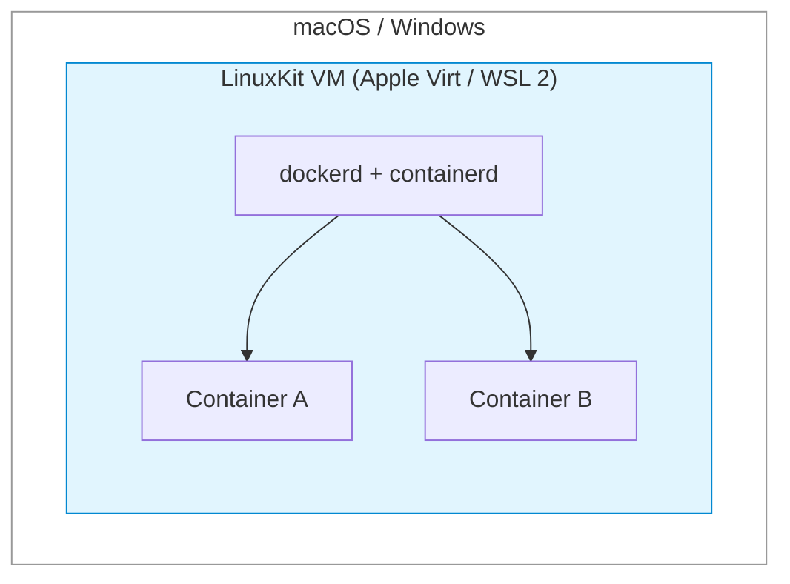
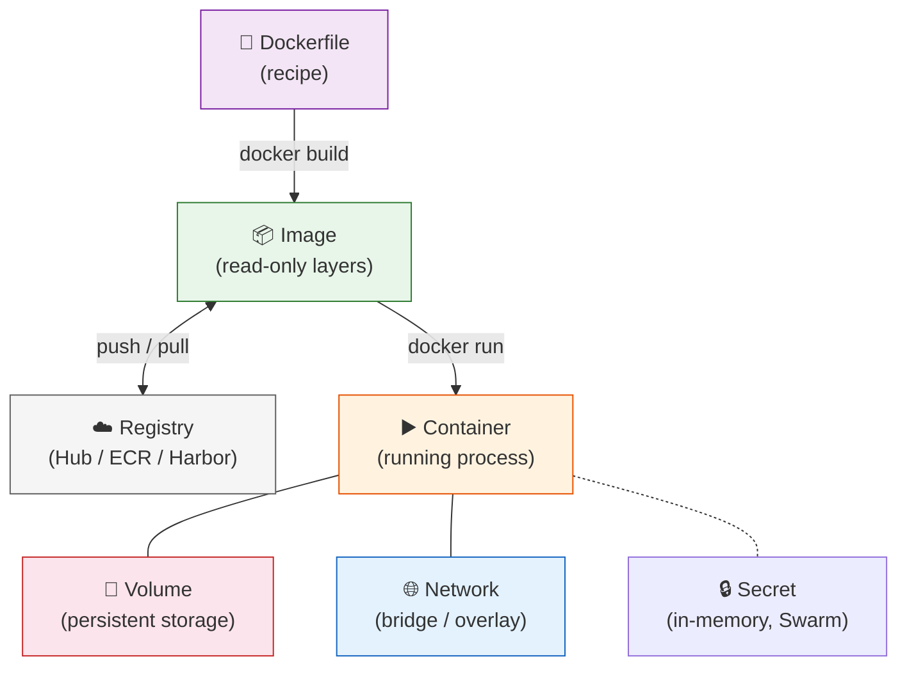
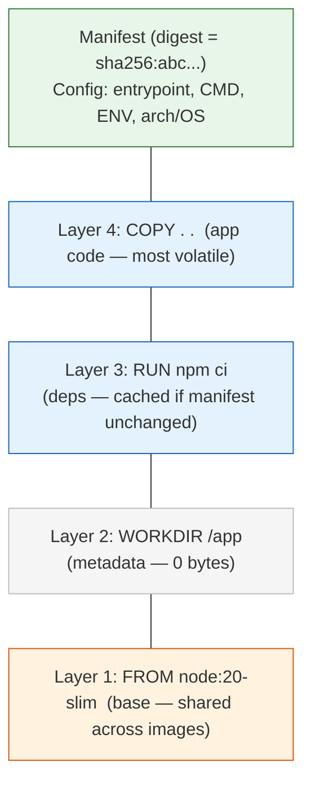
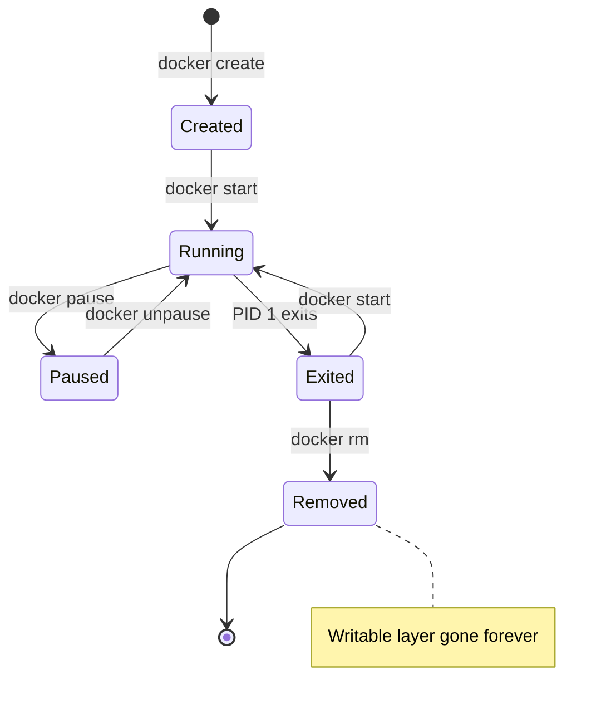
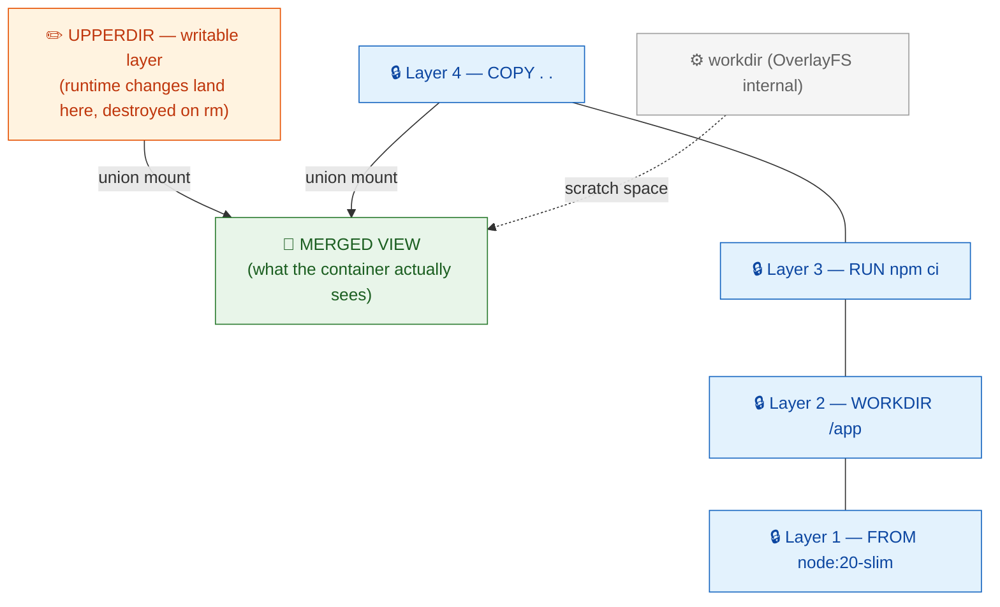
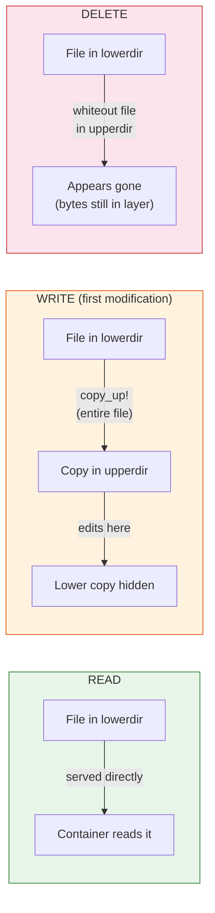
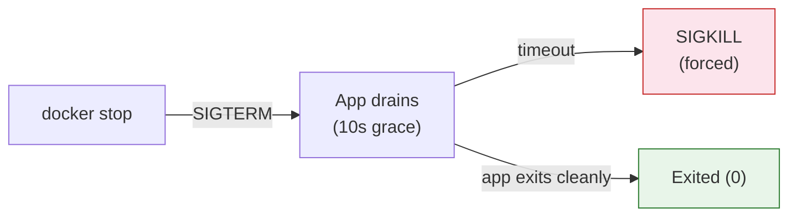

*From basics to internals — architecture, objects, storage, networking, and everything in between.*

## Contents

1. [Quick Primer](#1-quick-primer)
2. [Host OS: How Docker Actually Runs](#2-host-os-how-docker-actually-runs)
3. [Architecture Deep Dive](#3-architecture-deep-dive)
4. [Docker Objects](#4-docker-objects)
5. [Storage Deep Dive](#5-storage-deep-dive)
6. [Networking Deep Dive](#6-networking-deep-dive)
7. [Builds, Multi-Arch & Image Optimization](#7-builds-multi-arch--image-optimization)
8. [Resource Limits & Constraints](#8-resource-limits--constraints)
9. [Logging & Observability](#9-logging--observability)
10. [Security](#10-security)
11. [Kernel Internals: Namespaces & cgroups](#11-kernel-internals-namespaces--cgroups)
12. [Runtime Behavior: PID 1, Signals, Health](#12-runtime-behavior-pid-1-signals-health)
13. [Registry & Day-2 Operations](#13-registry--day-2-operations)
14. [Docker & Kubernetes](#14-docker--kubernetes)
15. [Alternatives](#15-alternatives)
16. [Command Reference](#16-command-reference)
17. [Interview Questions](#17-interview-questions)
18. [References](#18-references)

## 1. Quick Primer

Docker packages an app plus dependencies into an immutable, layered **image** that runs as an isolated process — a **container** — on any host with a compatible kernel. It kills *environment drift* ("works on my machine") and gives a portable distribution format via registries [1].

Workflow: **Build → Ship → Run.**

A container is **just a host process**, constrained in what it can *see* (namespaces) and *use* (cgroups) [2].

| | Virtual Machine | Container |
|---|---|---|
| Virtualizes | Hardware (hypervisor) | OS (shares host kernel) |
| Size / boot | GBs / minutes | MBs / milliseconds |
| Isolation | Strong (own kernel) | Process-level (ns + cgroups) |

### 🗺️ How it all fits together

<style>{`.dk-card{display:block;text-decoration:none;color:inherit;background:#fff;border:1px solid #e0dfdb;border-radius:12px;transition:border-color 0.15s}.dk-card:hover{border-color:#1D9E75}`}</style>
<div style={{fontFamily: "system-ui, -apple-system, sans-serif", maxWidth: "640px"}}>
<a href="#42-dockerfile" className="dk-card" style={{padding: "11px 16px"}}>
  <p style={{fontSize: "14px", fontWeight: "600", margin: "0 0 3px"}}>📄 Dockerfile</p>
  <p style={{fontSize: "12px", color: "#5f5e5a", margin: "0 0 7px", lineHeight: "1.5"}}>Declarative recipe — each instruction creates a layer or sets metadata. The <b>source code</b> of your image.</p>
  <span style={{fontSize: "11px", fontWeight: "500", padding: "2px 9px", borderRadius: "10px", background: "#EAF3DE", color: "#27500A"}}>FROM → RUN → COPY → CMD</span>
</a>
<p style={{textAlign: "center", fontSize: "12px", color: "#888780", margin: "3px 0"}}>↓ docker build ↓</p>
<a href="#43-image--the-immutable-template" className="dk-card" style={{padding: "11px 16px"}}>
  <p style={{fontSize: "14px", fontWeight: "600", margin: "0 0 3px"}}>📦 Image</p>
  <p style={{fontSize: "12px", color: "#5f5e5a", margin: "0 0 7px", lineHeight: "1.5"}}>Read-only, layered, content-addressed template. Layers are deduplicated — 10 images sharing one base store that base <b>once</b> on disk. Identified by <b>tag</b> (mutable) or <b>digest</b> (immutable).</p>
  <span style={{fontSize: "11px", fontWeight: "500", padding: "2px 9px", borderRadius: "10px", background: "#EAF3DE", color: "#27500A"}}>manifest + config + layers</span>
</a>
<p style={{textAlign: "center", fontSize: "12px", color: "#888780", margin: "3px 0"}}>↓ docker run ↓</p>
<a href="#44-container--the-running-instance" className="dk-card" style={{padding: "11px 16px"}}>
  <p style={{fontSize: "14px", fontWeight: "600", margin: "0 0 3px"}}>▶️ Container</p>
  <p style={{fontSize: "12px", color: "#5f5e5a", margin: "0 0 7px", lineHeight: "1.5"}}>A <b>running process</b> = image layers (read-only) + thin writable layer (CoW). Ephemeral — writable layer destroyed on removal. Has its own PID, network, mount namespaces.</p>
  <span style={{fontSize: "11px", fontWeight: "500", padding: "2px 9px", borderRadius: "10px", background: "#E1F5EE", color: "#085041"}}>process + writable layer + namespaces</span>
</a>
<p style={{textAlign: "center", fontSize: "12px", color: "#888780", margin: "3px 0"}}>⇠ connects to ⇢</p>
<div style={{display: "grid", gridTemplateColumns: "1fr 1fr 1fr", gap: "8px"}}>
  <a href="#45-volume" className="dk-card" style={{padding: "10px 12px"}}>
    <p style={{fontSize: "13px", fontWeight: "600", margin: "0 0 3px"}}>💾 Volume</p>
    <p style={{fontSize: "11px", color: "#5f5e5a", margin: "0 0 7px", lineHeight: "1.5"}}>Docker-managed persistent storage. Survives container removal. Supports drivers (NFS, cloud).</p>
    <span style={{fontSize: "10px", fontWeight: "500", padding: "2px 7px", borderRadius: "10px", background: "#FAECE7", color: "#712B13"}}>bypasses OverlayFS</span>
  </a>
  <a href="#6-networking-deep-dive" className="dk-card" style={{padding: "10px 12px"}}>
    <p style={{fontSize: "13px", fontWeight: "600", margin: "0 0 3px"}}>🌐 Network</p>
    <p style={{fontSize: "11px", color: "#5f5e5a", margin: "0 0 7px", lineHeight: "1.5"}}>Virtual network (bridge/host/overlay). User-defined bridges get embedded DNS for name resolution.</p>
    <span style={{fontSize: "10px", fontWeight: "500", padding: "2px 7px", borderRadius: "10px", background: "#E6F1FB", color: "#0C447C"}}>bridge / host / overlay</span>
  </a>
  <a href="#13-registry--day-2-operations" className="dk-card" style={{padding: "10px 12px"}}>
    <p style={{fontSize: "13px", fontWeight: "600", margin: "0 0 3px"}}>☁️ Registry</p>
    <p style={{fontSize: "11px", color: "#5f5e5a", margin: "0 0 7px", lineHeight: "1.5"}}>Stores and distributes images. Docker Hub (public) or private (ECR, Harbor, Artifact Registry).</p>
    <span style={{fontSize: "10px", fontWeight: "500", padding: "2px 7px", borderRadius: "10px", background: "#F1EFE8", color: "#444441"}}>push / pull</span>
  </a>
</div>
</div>

## 2. Host OS: How Docker Actually Runs

Containers are a **Linux kernel** feature. A container shares the host's kernel — it does not ship one.

On **Linux**, everything runs directly on the host kernel — no VM.

On **macOS / Windows**, Docker Desktop runs a hidden **LinuxKit VM**:



Implications: bind mounts cross the VM boundary (slow — prefer volumes), use `host.docker.internal` to reach the host, and an `amd64` image won't run on `arm64` (Apple Silicon) without emulation — hence multi-arch images [3][4].

## 3. Architecture Deep Dive

### 3.1 The Runtime Stack

<div className="flex justify-center my-6"></div>

### 3.2 Tracing `docker run nginx`

1. **`docker` CLI** — parses command, sends JSON to `dockerd` via the socket. Thin client — no container logic [5].
2. **`dockerd`** — resolves the image (local → registry pull), sets up networking (veth, bridge, iptables), prepares volumes, hands to `containerd` [1].
3. **`containerd`** — pulls/unpacks layers, creates writable snapshot, starts the container. K8s talks to this directly via CRI [6].
4. **`containerd-shim`** — one per container. Decouples from daemon so `dockerd` restarts don't kill containers [5].
5. **`runc`** — `clone()` into namespaces, configure cgroups, mount OverlayFS rootfs, drop caps, apply seccomp/AppArmor, `exec()` PID 1 [5].
6. **Linux Kernel** — namespaces isolate; cgroups limit. That's a container.

This decoupling is *why Kubernetes could drop Docker but keep containerd*.

> ⚠️ The socket (`/var/run/docker.sock`) is **root-equivalent** — control of it = control of the host.

### 3.3 OCI

The **Open Container Initiative** defines the image-spec and runtime-spec. OCI compliance is why a Docker/Buildah/Kaniko image runs under containerd/CRI-O/Podman unchanged — no lock-in [7].

## 4. Docker Objects

Everything Docker manages is an object tracked by the daemon, inspectable with `docker inspect`.

### 4.1 How Objects Relate



### 4.2 Dockerfile

Each instruction either creates a **filesystem layer** or sets **metadata**:

| Creates a layer | Metadata only |
|---|---|
| `FROM`, `RUN`, `COPY`, `ADD` | `WORKDIR`, `ENV`, `ARG`, `EXPOSE`, `USER`, `CMD`, `ENTRYPOINT`, `HEALTHCHECK`, `LABEL` |

### 4.3 Image — the Immutable Template



- Layers are **content-addressed by digest** (SHA-256). Identical layers stored once — 10 images on the same base share that base on disk [8].
- **Tags** (`myapp:1.0`) are mutable pointers. **Digests** (`myapp@sha256:...`) are immutable. Pin by digest in production.

### 4.4 Container — the Running Instance



A container = image layers (read-only) + **thin writable layer** (copy-on-write). The writable layer is destroyed on `docker rm`.

What the container gets: own PID namespace (PID 1 = entrypoint), own network namespace (veth pair to bridge), own mount namespace (OverlayFS), and cgroup resource limits.

### 4.5 Volume

Volumes **bypass OverlayFS** — data goes directly to the host filesystem. They survive `docker rm`, support drivers (NFS, cloud block), and can be shared across containers.

### 4.6 Other Objects

| Object | What |
|---|---|
| **Network** | Virtual connectivity (bridge/host/overlay/macvlan) |
| **Secret** (Swarm) | Sensitive data, in-memory at `/run/secrets/` |
| **Config** (Swarm) | Non-sensitive config delivered to services |
| **Plugin** | Extends daemon (volume/network/log drivers) |
| **Service/Stack** (Swarm) | Declarative replicated deployment |

## 5. Storage Deep Dive

### 5.1 OverlayFS — How Layers Become One View



On disk: `/var/lib/docker/overlay2/<id>/` → `diff/` (changes), `link`, `lower`, `work/`.

Here's what's happening in that diagram:

- **lowerdir** (the blue layers) — these are the read-only image layers, stacked bottom-up. Layer 1 is your base image (`FROM node:20-slim`), and each layer above adds changes from a Dockerfile instruction. They are **immutable** — Docker never modifies them.
- **upperdir** (the orange layer) — this is the container's writable layer, created when the container starts. Every file you create, modify, or delete at runtime lands here. It's **ephemeral** — destroyed when you `docker rm` the container.
- **merged** (the green view) — this is what the container process actually sees when it does `ls /`. OverlayFS takes the stack of read-only layers plus the writable layer and presents them as a single, unified filesystem. The container has no idea it's looking at multiple layers.
- **workdir** — internal scratch space OverlayFS uses for atomic operations. You never interact with it directly.

### 5.2 Copy-on-Write



- First write to a large file = **expensive** (entire file copied up).
- Write-heavy workloads **balloon the writable layer** → use a **volume** instead [9].
- Deleting in a later Dockerfile `RUN` doesn't shrink the image — data persists in the earlier layer.

### 5.3 containerd Snapshotter

Docker Engine 29.0+ defaults to the **containerd image store** using snapshotters instead of classic graph drivers. Adds native multi-platform images and attestations. Content moves to `/var/lib/containerd`. Switching hides (doesn't delete) existing overlay2 images [10].

### 5.4 Storage Comparison

| Type | Where | Use for |
|---|---|---|
| **Volume** | `/var/lib/docker/volumes` | Prod data, write-heavy, portable |
| **Bind mount** | Exact host path | Dev (live reload) — slow across VM |
| **tmpfs** | RAM | Secrets, scratch — never persisted |

## 6. Networking Deep Dive

### 6.1 Bridge Internals

<div className="flex justify-center my-6"></div>

> ⚠️ Embedded DNS (name → IP) works **only on user-defined bridges**. The default bridge lacks it. Always create a user-defined network.

### 6.2 Drivers

| Driver | Behavior |
|---|---|
| **bridge** (default) | Private virtual bridge, NAT, per-container IP |
| **host** | Shares host network — no isolation, no port mapping |
| **overlay** | VXLAN across hosts — multi-host / Swarm |
| **macvlan** | Container gets own MAC/IP on physical LAN |
| **none** | No networking |

## 7. Builds, Multi-Arch & Image Optimization

### 7.1 Multi-Stage Builds

```dockerfile
FROM golang:1.22 AS build
WORKDIR /src
COPY . .
RUN go build -o /app/server .

FROM gcr.io/distroless/base-debian12
COPY --from=build /app/server /server
ENTRYPOINT ["/server"]
```

### 7.2 Cache-Friendly Ordering

```dockerfile
COPY package.json .      # rarely changes → cached
RUN npm ci
COPY . .                 # changes often → only this rebuilds
```

Changed layer rebuilds **itself and everything after it**.

### 7.3 Multi-Arch

```bash
docker buildx build --platform linux/amd64,linux/arm64 -t user/app:1.0 --push .
```

### 7.4 Size Checklist

- Minimal base (`-slim` / distroless / Alpine).
- Combine RUN + cleanup **in one layer** — cleaning later doesn't shrink earlier layers.
- Multi-stage to drop build deps; `.dockerignore` to shrink context.
- Alpine caveat: musl libc can break DNS / glibc wheels — distroless often safer.

## 8. Resource Limits & Constraints

```bash
docker run --memory=512m --memory-swap=512m \
           --cpus=1.5 \
           --pids-limit=200 \
           --restart=on-failure:3 myapp
```

Exceeding `--memory` → kernel OOM-kills the process (exit **137**). Always set limits in production.

## 9. Logging & Observability

Default `json-file` driver **doesn't rotate** — classic disk-fill incident. Fix in `/etc/docker/daemon.json`:

```json
{ "log-driver": "json-file", "log-opts": { "max-size": "10m", "max-file": "3" } }
```

Other drivers: `local`, `journald`, `syslog`, `fluentd`, `awslogs`.

## 10. Security

| Control | How |
|---|---|
| Non-root | `USER appuser` |
| Least capability | `--cap-drop=ALL --cap-add=<needed>` |
| Read-only rootfs | `--read-only` + tmpfs |
| No escalation | `--security-opt=no-new-privileges` |
| Kernel confinement | seccomp + AppArmor/SELinux |
| Small surface | distroless / minimal base |
| Supply chain | scan (Trivy) + sign (cosign) + pin by digest |
| Secrets | runtime injection — never bake into layers |
| Daemon | guard the socket; prefer rootless |

## 11. Kernel Internals: Namespaces & cgroups

**Namespaces** (what a process can *see*):

| Namespace | Isolates |
|---|---|
| `pid` | Process IDs |
| `net` | Interfaces, routes, ports |
| `mnt` | Mount points |
| `uts` | Hostname |
| `ipc` | Shared memory |
| `user` | UID/GID mapping |
| `cgroup` | cgroup root view |

**cgroups** (what a process can *use*): CPU, memory, I/O limits.

- **v1**: per-controller hierarchies — inconsistent.
- **v2**: unified hierarchy, better accounting + PSI, required for rootless. Modern default.

## 12. Runtime Behavior: PID 1, Signals, Health



- **PID 1 trap**: PID 1 gets no default signal handlers. Naive PID 1 ignores SIGTERM → gets SIGKILLed. Fix: `docker run --init` (tini).
- **Exec form** (`["bin","arg"]`) — signals reach your process. Shell form wraps in `/bin/sh -c` and swallows them.
- **Exit codes**: `137` = SIGKILL (OOM), `143` = SIGTERM, `125` = daemon error, `126` = not executable, `127` = not found.
- **Restart policies**: `no` | `on-failure[:max]` | `always` | `unless-stopped`.

## 13. Registry & Day-2 Operations

Tags are mutable; digests are immutable. Deploy by digest.

```bash
docker system df                         # what's using disk
docker system prune -a --volumes         # remove everything unused
```

Daemon config: `/etc/docker/daemon.json` (storage, log rotation, mirrors, `data-root`).

## 14. Docker & Kubernetes

Docker Engine isn't CRI-compliant, so K8s maintained **dockershim** — deprecated v1.20, removed v1.24 [11][12]. Images are unaffected (OCI, run on containerd/CRI-O). Only Docker-as-the-node-runtime was removed [13].

## 15. Alternatives

| Tool | What |
|---|---|
| **Podman** | Daemonless, rootless, Docker-compatible CLI |
| **containerd** | High-level runtime under K8s (CNCF) |
| **CRI-O** | Minimal CRI runtime, OpenShift default |
| **Buildah / Kaniko** | Daemonless image builders for CI |
| **Rancher / Colima** | Free Docker Desktop replacements |
| **gVisor / Kata** | Sandboxed runtimes for untrusted code |

## 16. Command Reference

```bash
# Images
docker build -t app:1.0 .       docker images        docker history 
docker pull|push           docker rmi 

# Containers
docker run -d -p 8080:80 --init --memory=512m nginx
docker run -it ubuntu bash      docker ps [-a]       docker exec -it <c> bash
docker stop|start|restart <c>   docker logs -f <c>   docker inspect <c>
docker stats                    docker rm <c>

# Volumes / Networks / System
docker volume create|ls|prune     docker network create|ls
docker system df                  docker system prune -a --volumes
docker info                       docker version

# Compose
docker compose up -d | down | logs -f | ps
```

## 17. Interview Questions

### Beginner

**Q1. What is Docker and what problem does it solve?**

Docker packages an app with all its dependencies into an immutable, layered **image** that runs as an isolated **container** on any compatible host. The core problem: **environment drift** — mismatched libraries between dev and prod. Docker ships the environment with the code, making builds reproducible. It also standardized a distribution format (images + registries) that became the OCI standard [1][7].

**Q2. Image vs. container vs. Dockerfile?**

Dockerfile = recipe (source). Image = built, read-only artifact (binary). Container = running instance (process) — image layers + writable layer. Mental model: *source → binary → process*. Many containers share one image because layers are read-only; only the writable layer differs [8].

**Q3. Container vs. VM — the trade-off?**

VM virtualizes hardware (hypervisor, full guest OS) — strong isolation, GBs, minutes. Container virtualizes the OS, shares host kernel — MBs, milliseconds. Trade-off: VM has a stronger security boundary (separate kernel); container shares the kernel, so a kernel exploit crosses containers. That's why untrusted workloads use Firecracker or Kata.

**Q4. Why does my container run on a Mac?**

Docker Desktop runs a hidden **LinuxKit VM**. Containers share that VM's kernel, not macOS. Bind mounts are slow (cross VM), use `host.docker.internal` to reach the host [3][4].

### Intermediate

**Q5. Walk `docker run` from CLI to kernel.**

CLI → REST over socket → `dockerd` resolves/pulls image → `containerd` (gRPC) → shim → `runc` → `clone()` into namespaces, set cgroups, mount OverlayFS, drop caps, seccomp/AppArmor, exec PID 1. Shim keeps container alive if daemon restarts. This decoupling is why K8s dropped Docker but kept containerd [5][6].

**Q6. How does copy-on-write work?**

overlay2 does a `copy_up` on first write: entire file copied from lowerdir to upperdir, edits happen there. Deletes create whiteout files. Write-heavy workloads balloon the writable layer → use volumes [9].

**Q7. Volumes vs. bind mounts vs. tmpfs.**

Volumes = Docker-managed, portable, bypasses OverlayFS, prod data. Bind mounts = exact host path, dev convenience, slow across VM. tmpfs = RAM, secrets, never persisted.

**Q8. Container-to-container name resolution?**

User-defined bridge → embedded DNS at `127.0.0.11` resolves names to IPs. Default bridge **lacks this**. Always use user-defined networks.

**Q9. CMD vs ENTRYPOINT; COPY vs ADD.**

ENTRYPOINT = fixed executable; CMD = default args (overridable). Always exec form — shell form wraps in `/bin/sh -c`, breaks signal delivery. COPY just copies; ADD also fetches URLs + extracts tarballs — prefer COPY.

**Q10. Container lifecycle and restart policies.**

created → running → paused → exited → removed. PID 1 exits → container stops. PID 1 nuance: no default signal handlers, must reap orphans — use `--init`/tini.

### Advanced

**Q11. overlay2 vs. containerd snapshotter.**

overlay2 = classic graph driver. Engine 29.0+ defaults to containerd image store using snapshotters — native multi-platform images, attestations, content in `/var/lib/containerd`. Switching hides existing images [10].

**Q12. Shrink images / speed builds.**

Multi-stage; minimal base; cache-friendly ordering (deps before code); combine RUN+cleanup in one layer; `.dockerignore`; BuildKit cache mounts. Alpine/musl caveat.

**Q13. Secure a container in production.**

Non-root; drop caps; read-only rootfs; `no-new-privileges`; seccomp/AppArmor; scan + sign + pin by digest; runtime secrets; guard socket / go rootless; gVisor/Kata for untrusted code.

**Q14. cgroups v1 vs v2.**

v1 = per-controller, inconsistent. v2 = unified, better accounting + PSI, required for rootless. Probes whether you've debugged OOM/throttling in prod.

**Q15. Why did K8s remove dockershim?**

Docker isn't CRI-compliant; shim duplicated work. Removed in 1.24. Images are fine (OCI); only Docker-as-runtime went [11][12][13].

**Q16. Debug a CrashLoopBackOff.**

`docker logs` → `docker inspect` (exit code, `OOMKilled`) → check limits → `docker run --entrypoint sh`. Exit codes: 137=OOM, 143=SIGTERM, 125/126/127. Reproduce against exact digest.

**Q17. Why do containers get SIGKILLed?**

`docker stop` → SIGTERM → 10s → SIGKILL. Failures: shell-form ENTRYPOINT (signal hits sh), naive PID 1 (no handler). Fix: exec form + `--init`.

**Q18. Docker socket + log disk problem.**

Socket is root-equivalent; prefer rootless. Default json-file logging doesn't rotate → set `max-size`/`max-file` or ship logs off-box.

## 18. References

<div style={{fontSize: "0.82em", lineHeight: "1.7"}}>

1. Docker Docs — *Docker overview.* https://docs.docker.com/get-started/overview/
2. R. Rosen — *Namespaces and Cgroups* (CMU). https://www.andrew.cmu.edu/course/14-712-s20/applications/ln/Namespaces_Cgroups_Conatiners.pdf
3. Docker Blog — *The Magic Behind Docker Desktop.* https://www.docker.com/blog/the-magic-behind-the-scenes-of-docker-desktop/
4. Microsoft Learn — *Docker containers on WSL.* https://learn.microsoft.com/en-us/windows/wsl/tutorials/wsl-containers
5. Srinivasa — *Inside Docker: CLI to Kernel.* https://dev.to/srinivasamcjf/inside-docker-the-complete-architecture-explained-from-cli-to-kernel-4mf1
6. Huu Phan — *Docker Alternatives (containerd).* https://www.huuphan.com/2026/03/top-docker-alternatives-2026.html
7. Red Hat — *The History of Containers.* https://www.redhat.com/en/blog/history-containers
8. OneUptime — *Docker UnionFS and Overlay2.* https://oneuptime.com/blog/post/2026-02-08-how-to-understand-docker-unionfs-and-overlay2/view
9. Docker Docs — *Storage drivers.* https://docs.docker.com/engine/storage/drivers/
10. Docker Docs — *containerd image store.* https://docs.docker.com/engine/storage/containerd/
11. Kubernetes Blog — *Moving on From Dockershim.* https://kubernetes.io/blog/2022/01/07/kubernetes-is-moving-on-from-dockershim/
12. Kubernetes Blog — *Ready for v1.24?* https://kubernetes.io/blog/2022/03/31/ready-for-dockershim-removal/
13. TechPlained — *Container Runtime Comparison.* https://www.techplained.com/container-runtime-comparison

</div>