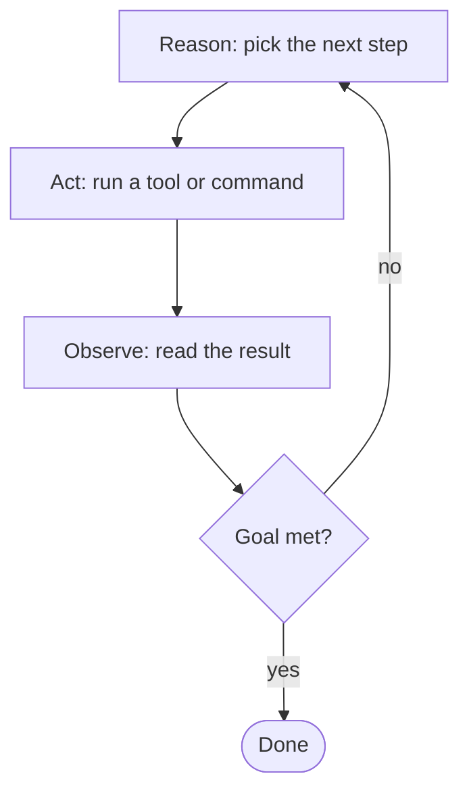

*Why the industry moved from writing the perfect prompt to engineering the cycle that runs it.*

Two years ago the skill everyone wanted was prompt engineering. In 2026, the people shipping real AI systems talk about **loops** instead: the repeating cycle of act, observe, and decide that runs until a goal is verifiably met. Boris Cherny, the creator of Claude Code, calls this shift as big as the jump from writing code by hand to using agents.

This post covers why the shift happened, the main types of loops, and what using them looks like in practice. For deep internals like durable execution and harness architecture, see [Engineering the Agentic Harness](/write-up/harness-context-loop-engineering).

## Why prompting stopped being enough

A single prompt gives the model one chance, with only the context you thought to include, and no way to react to what happens next.

That is fine for classification, summarization, and extraction. It breaks when the task requires learning something along the way. Fix a failing test, research a topic, migrate a config: the right second step depends on the result of the first, which you cannot know when you write the prompt.

So the field built layers, each wrapping the last:

1. **Prompt engineering**: the words in one request.
2. **Context engineering**: what information the model sees at each step.
3. **Harness engineering**: the tools, sandboxes, and permissions around the model.
4. **Loop engineering**: the cycle itself. When to iterate, when to stop, how to verify.

Each layer became important when the one before it stopped being the bottleneck. By 2026, models recover from their own mistakes well enough that the differentiator is no longer what you feed them. It is how you structure the cycle they run in.

## What a loop is

A loop needs three things:

- **A goal.** "Make the test suite pass," not "write this function."
- **A trigger.** A person, an event, or a schedule.
- **A stop condition you can verify.** A check, ideally outside the model, that says done or stop trying.

Between trigger and stop condition, the loop cycles:



The key property: **failure is input, not the end.** When a prompt produces broken output, the interaction is over and you re-prompt. When a loop produces broken output, the error message feeds the next iteration. The [ReAct paper](https://arxiv.org/abs/2210.03629) measured what this buys: a 34% improvement on ALFWorld over models that act without observing.

## Types of loops

| Loop | How it works | Use it when |
|---|---|---|
| **Prompt chain** | Fixed sequence of calls, each feeding the next | The steps are known in advance |
| **Tool loop (ReAct)** | Model calls tools, reads results, repeats until done | The default for most tasks |
| **Reflection** | Model critiques and revises its own output | Quality matters and no external check exists |
| **Evaluator loop** | A separate model grades output against criteria | You can write down what "good" means |
| **Plan and execute** | Plan first, run the steps, replan on failure | Many independent subtasks |
| **Multi-agent** | A lead agent splits work among others | Work too big for one context window. Costs about 15x the tokens |
| **Ralph loop** | An outer script reruns the agent until tests pass | Unattended runs with a hard definition of done |
| **Heartbeat** | Wake on a schedule, check, act, sleep | Monitoring and recurring tasks |

The real difference between these is who checks the work: the model itself, a second model, or a test that cannot be argued with. As the stakes rise, move the check away from the model.

Also: most production loops are short. Surveys of deployed agents find the majority run about ten steps before a human checks in. Start small.

## Goal-driven loops in practice

The core move of loop engineering: stop scripting steps, start declaring goals. You write the goal, the check, and the limits. The loop machinery owns the iteration. Here is one example, a repo with a failing test suite, at four levels of autonomy.

### Level 1: a goal command

Coding agents have this built in. In Claude Code, instead of directing every turn, you set a goal for the run:

```text
/goal Make the test suite pass: `pytest -q` exits 0.
      Don't weaken, skip, or delete tests to get there.
      Stop and ask before changing any public API behavior.
```

Every goal has the same three parts:

- the **destination**: tests pass
- the **check**: `pytest -q` exits 0, a command rather than an opinion
- the **limits**: no gutting tests, ask before API changes

The agent loops internally (edit, run, read failures, edit again) and checks against the goal instead of handing control back after every step.

### Level 2: an outer shell loop (Ralph)

On long tasks an agent's context fills with failed attempts and it may declare victory early. The Ralph pattern fixes both with a shell loop that reruns the agent with fresh context until an external check passes:

```bash
# rerun until tests pass, at most 10 attempts
for attempt in $(seq 1 10); do
  pytest -q && exit 0
  claude -p "The test suite is failing. Run 'pytest -q', find the root
             cause, and fix it. Verify by re-running the tests.
             Read NOTES.md for what earlier attempts tried, and append
             what you learn this round."
done
echo "10 attempts, still failing. Needs a human."; exit 1
```

The model checks its work inside the run. The shell checks it again after, with an exit code the model cannot argue with. Each attempt starts with clean context, and `NOTES.md` carries what was learned between attempts. State lives in files and git, not in the context window.

### Level 3: an outcome API

Platforms now ship this pattern directly. On the Claude API's Managed Agents surface, you define an **outcome**: a description of done plus a rubric. The platform runs the loop and a separate grader model scores each round against your rubric:

```python
client.beta.sessions.events.send(
    session_id=session.id,
    events=[{
        "type": "user.define_outcome",
        "description": "Fix the failing test suite in the mounted repo.",
        "rubric": {"type": "text", "content": """
- `pytest -q` exits 0.
- No test was deleted, skipped, or weakened to force a pass.
- The diff touches only files implicated by the failing tests.
"""},
        "max_iterations": 5,
    }],
)
```

The grader has fresh context and your criteria, and feeds gaps back to the agent each round until the rubric passes or iterations run out. Write rubric lines a grader can actually check ("`pytest -q` exits 0"), not vague ones ("code quality is good").

### Level 4: a standing goal

Attach a schedule and a one-off task becomes a standing goal:

```text
Every weekday at 07:00: triage the repo's new issues. Reproduce each one,
label severity, and draft a fix PR for anything with a failing-test repro.
Done when every issue since the last run has a label and a comment.
```

The schedule fires, the loop runs to its stop condition, everything sleeps until tomorrow.

Across all four levels the work is the same: **you write the goal, the check, and the limits. The loop itself is somebody else's code.**

## Keeping loops under control

The gap between a demo and production is control. One documented failure this year: an agent called a broken tool 400 times in five minutes because nothing told it to stop.

- **Cap iterations.** Always.
- **Cap spend.** Track tokens and wall-clock time, and stop at a threshold.
- **Detect no progress.** Same failing test twice in a row means the loop is stuck. Stop and escalate.
- **Set timeouts** per tool call and per task.
- **Ask a human before irreversible actions.** Deploys, deletes, sends, payments.

## When a loop is the wrong tool

- **The goal cannot be checked.** "Improve the UX" has no stop condition, so the loop runs until the budget ends it. If you cannot write the check, fix the goal first.
- **The problem needs a redesign.** Andrej Karpathy has observed that agents iterating on hard problems make timid small adjustments instead of bold restructuring. Some problems need a human willing to throw the design away.
- **Nobody will read the output.** A loop that changes hundreds of lines overnight produces code no one on the team has read. That is a real cost, budget for it.
- **A single prompt already works.** Classification, extraction, one-shot summarization. A loop adds cost and failure modes for nothing.

The rule: one well-defined step, use a prompt. Known steps, use a chain. Unknown steps that need adaptation, use a loop.

## Where this is heading

Goal commands, outcome APIs, schedulers: each moves more of the iteration out of your hands and more of the specification into them. The prompt is not disappearing. It is becoming one component in a system whose real design surface is the cycle: what starts it, what it can touch, and what evidence lets it stop.

Prompts ask the model to be right. Loops build the machinery to check.

## Further reading

- [Engineering the Agentic Harness](/write-up/harness-context-loop-engineering): my deep dive on the systems around the loop.
- [Demystifying loop engineering](https://bdtechtalks.com/2026/06/22/ai-loop-engineering/) (TechTalks)
- [Agentic Loops: From ReAct to Loop Engineering](https://datasciencedojo.com/blog/agentic-loops-explained-from-react-to-loop-engineering-2026-guide/) (Data Science Dojo)
- [ReAct: Synergizing Reasoning and Acting in Language Models](https://arxiv.org/abs/2210.03629)
- [Building Effective Agents](https://www.anthropic.com/research/building-effective-agents) (Anthropic)
