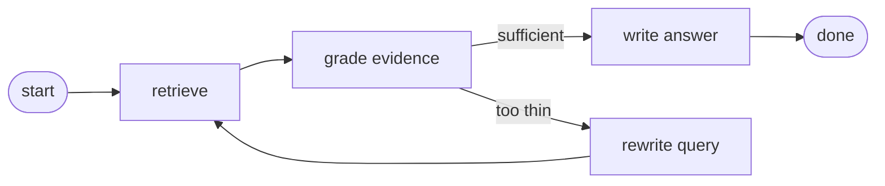
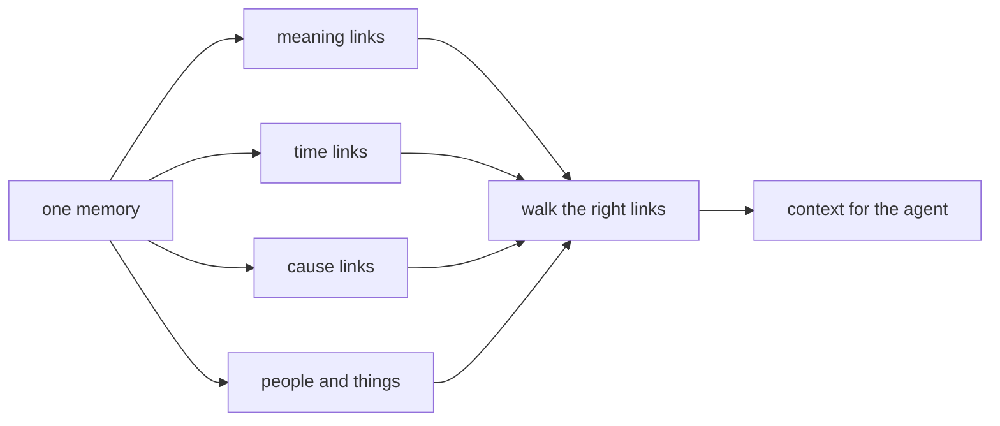
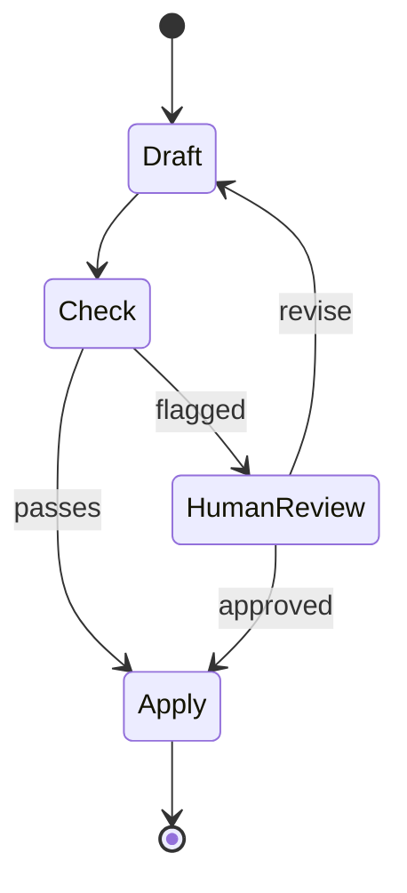
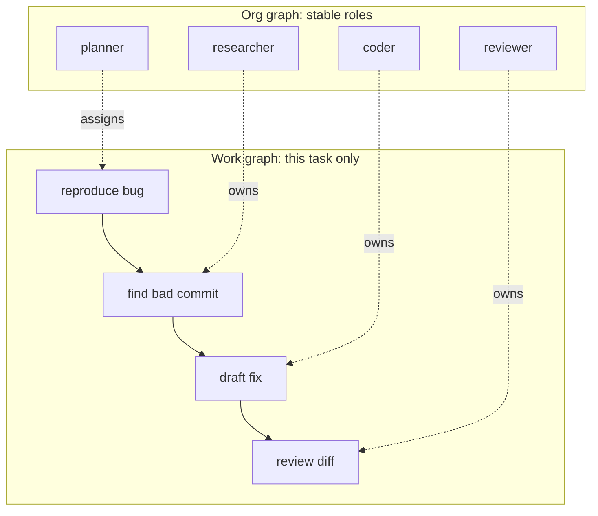

*The skill after prompt, context, and loop engineering: wiring multiple agents together.*

[From Prompting to Loops](/write-up/from-prompting-to-loops) covered the cycle one agent runs, and [Engineering the Agentic Harness](/write-up/harness-context-loop-engineering) covered the machinery around it. **Graph engineering**, the term that took off in mid-2026, is the layer above both: deciding how several agents work together as one system.

## The lineage

| Layer                 | Years        | What you design                  |
| --------------------- | ------------ | -------------------------------- |
| Prompt engineering    | 2022 to 2024 | the words in one request         |
| Context engineering   | 2024 to 2025 | what the model gets to see       |
| Loop engineering      | 2025 to 2026 | one agent's cycle of act and check |
| **Graph engineering** | mid-2026 on  | how many agents work together    |

Each layer got a name when the one below stopped being the bottleneck. Agents now run whole tasks reliably on their own, so the hard part moved to the wiring between them.

## What it is

Three decisions, written down instead of buried in a prompt:

- **Nodes:** the workers. A searcher, a checker, a writer.
- **Edges:** the arrows. Which result goes where next, including "not good enough, go back."
- **State:** what travels along the arrows. A few named fields, not one giant chat history.

None of this is a new idea. What changed recently is what fits inside a box:

|                | Before       | Now                                  |
| -------------- | ------------ | ------------------------------------ |
| A node held    | one model call | a whole agent with its own tools    |
| So the graph wired | prompts  | coworkers                            |

That is the whole argument for the new name: once every box is a full agent, drawing the boxes and arrows stops being plumbing and becomes org design.

## Graph or loop?

The rule of thumb: **if you can draw the steps before you start, wire a graph. If the steps only become clear as you go, run a loop.**

|                        | Loop (one agent)          | Graph (many nodes)                    |
| ---------------------- | ------------------------- | ------------------------------------- |
| Next step chosen by    | the model, every turn     | your arrows                           |
| History lives in       | the chat context          | a few named fields plus the route     |
| Pausing for a human    | freezes the whole run     | waits at one box, resumes later       |
| Audit trail            | a long transcript         | the exact path the work took          |

Step the same task through both shapes here:

<LoopVsGraphSim />

## What the recent papers add

The name came from social media, but the ideas underneath have real papers. Newest first:

| Paper                                                                              | Date     | In one line                                                                     |
| ---------------------------------------------------------------------------------- | -------- | ------------------------------------------------------------------------------- |
| [Graph-Based Agentic AI with LangGraph](https://arxiv.org/abs/2607.19297)          | Jul 2026 | Three real workflows where pauses and audit trails are features, not hacks       |
| [Context Graphs](https://arxiv.org/abs/2607.07721)                                 | Jul 2026 | A graph of company events lets agents flag issues in seconds, not 47 minutes     |
| [MAGMA](https://arxiv.org/abs/2601.03236) (ACL 2026)                               | Jan 2026 | Memory stored as four linked graphs beats plain vector search on long-term tests |
| [Agint](https://arxiv.org/abs/2511.19635)                                          | Nov 2025 | Turns instructions into typed, checkable task graphs for coding agents           |
| [Graph-Augmented LLM Agents survey](https://arxiv.org/abs/2507.21407)              | Jul 2025 | Maps the field: graphs help planning, memory, tool use, and coordination         |
| [Graphs Meet AI Agents](https://arxiv.org/abs/2506.18019)                          | Jun 2025 | The other survey: graphs helping agents, and agents working on graphs            |
| [Agentic Deep Graph Reasoning](https://arxiv.org/abs/2502.13025)                   | Feb 2025 | An agent that grows its own knowledge graph as it thinks                         |

Two ideas are worth a closer look.

### Memory as a graph

[MAGMA](https://arxiv.org/abs/2601.03236) stores each memory in four linked views at once, and picks which links to walk based on the question:

"What broke after the config change?" walks the cause and time links. "What do we know about service X?" walks the meaning and entity links. That beats dumping everything into one vector store.

### Pauses that survive

The [LangGraph paper](https://arxiv.org/abs/2607.19297) shows why graphs win when a human sits inside the flow. A paused graph is a bookmark: it can wait days for an approval, then continue exactly where it stopped, and the path it took is the audit log.

A paused loop, by contrast, is just a frozen chat that dies with its context window.

## Two graphs: the org and the work

In practice you design two graphs with different lifespans: a stable **org graph** of roles, and a throwaway **work graph** for the task at hand.

Common shapes: one smart planner routing cheap workers, specialists owning fixed domains, or several models answering in parallel with a judge merging. One warning from [the loops post](/write-up/from-prompting-to-loops) still applies: splitting work across agents costs roughly 15x the tokens of one agent.

## Is this actually new?

LangChain's answer is [no](https://ai-engineering-trend.medium.com/is-graph-engineering-here-langchain-says-its-nothing-new-17a35a2bad37): their LangGraph framework has built exactly this for three years, and a loop is itself just a graph with one box and a back-arrow. The honest verdict: the name is new, the practice is not, but the boxes now hold whole agents, and that makes the wiring the skill worth learning.

## Takeaways

- Graph engineering = writing down the **nodes, edges, and state** of a multi-agent system instead of hiding them in prompts.
- **Steps known up front: graph. Steps discovered as you go: loop.** Most real systems are graphs whose boxes contain loops.
- The two practical wins are pauses that survive restarts and routes that double as audit trails.
- Ignore the branding cycle, learn the design decisions.

## Sources and further reading

- The seven papers in the table above
- [Graph Engineering: Wire Multi-Agent Orgs After Loops](https://explainx.ai/blog/graph-engineering-ai-agents-multi-agent-organizations-2026) (explainx)
- [Is Graph Engineering Here? LangChain Says It's Nothing New](https://ai-engineering-trend.medium.com/is-graph-engineering-here-langchain-says-its-nothing-new-17a35a2bad37) (Medium)
- Mine: [From Prompting to Loops](/write-up/from-prompting-to-loops) and [Engineering the Agentic Harness](/write-up/harness-context-loop-engineering)
