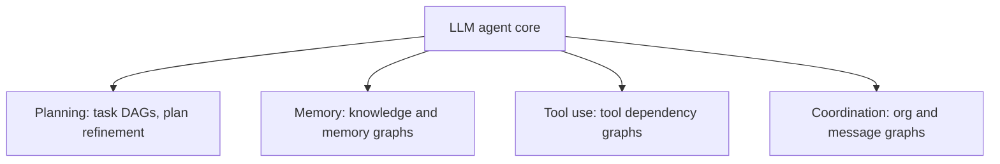
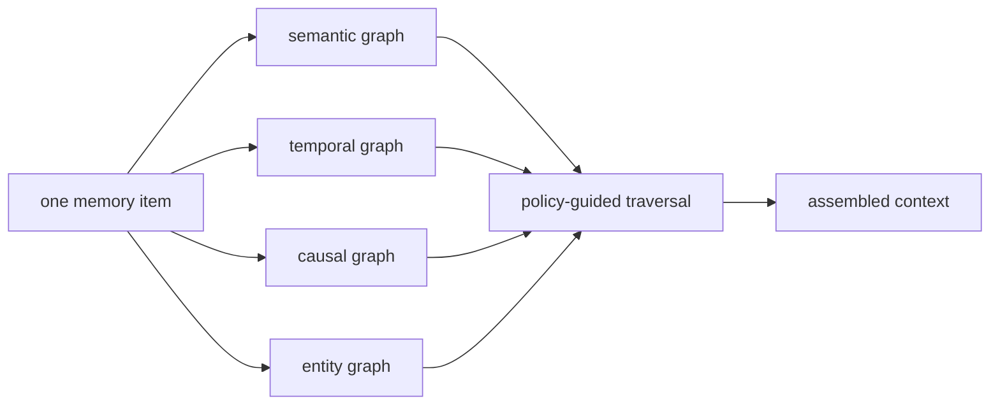
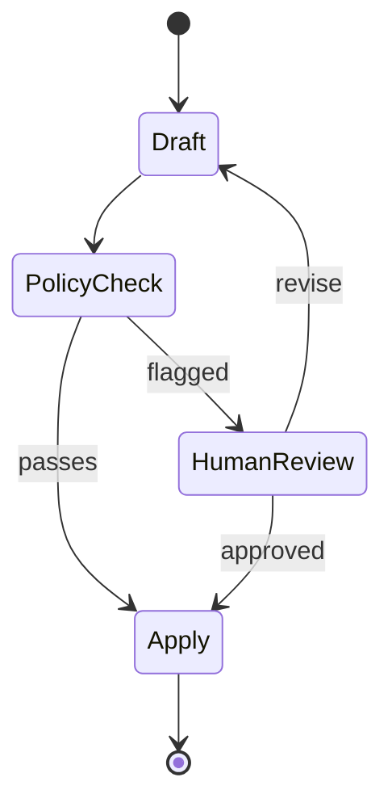

*The design surface is moving again: from the cycle one agent runs to the wiring between many.*

[From Prompting to Loops](/write-up/from-prompting-to-loops) covered why the unit of AI work became the loop, and [Engineering the Agentic Harness](/write-up/harness-context-loop-engineering) covered the machinery around it. In mid-2026 the conversation moved up one more level: **graph engineering**, the practice of designing the structure your agents run in. Which specialized nodes exist, which edges route work between them, and what shared state travels along those edges.

## The lineage

| Layer                  | Peak years   | What you design                          | Unit of control             |
| ---------------------- | ------------ | ---------------------------------------- | --------------------------- |
| Prompt engineering     | 2022 to 2024 | the words in one request                 | one model response          |
| Context engineering    | 2024 to 2025 | what the model sees at each step         | the context window          |
| Loop engineering       | 2025 to 2026 | the cycle: iterate, verify, stop         | one agent's run             |
| **Graph engineering**  | mid-2026 on  | nodes, edges, and shared state           | the multi-agent organization|

Same pattern as every previous layer: it got a name when the layer below stopped being the bottleneck. Models now run whole loops reliably, so the differentiator moved to how you wire the loops together.

## What graph engineering is

Three decisions, made explicitly instead of buried in a prompt:

1. **Nodes:** which specialized workers exist (a retriever, a grader, a coder, a reviewer).
2. **Edges:** which results route where, including conditional branches and back-edges.
3. **State:** the typed data that travels between nodes, instead of one ever-growing transcript.


The same graph in code, LangGraph-style. Note that the model decides things *inside* nodes, but the routes between them are yours:

```python
from typing import Literal, TypedDict
from langgraph.graph import StateGraph, START, END
from langgraph.checkpoint.memory import MemorySaver

class State(TypedDict):
    question: str
    docs: list[str]
    verdict: str        # "sufficient" | "too_thin"
    answer: str

def route(state: State) -> Literal["answer", "rewrite"]:
    return "answer" if state["verdict"] == "sufficient" else "rewrite"

g = StateGraph(State)
g.add_node("retrieve", retrieve)      # each node: State -> partial State
g.add_node("grade", grade)
g.add_node("rewrite", rewrite)
g.add_node("answer", answer)
g.add_edge(START, "retrieve")
g.add_edge("retrieve", "grade")
g.add_conditional_edges("grade", route)   # your routing rule, not the model's
g.add_edge("rewrite", "retrieve")
g.add_edge("answer", END)

app = g.compile(checkpointer=MemorySaver())  # every hop is recorded and resumable
```

None of this syntax is new. What changed in 2026 is **what fits inside a node**:

| | 2023 graph | 2026 graph |
| --- | --- | --- |
| A node is | one LLM call | a whole agent: its own loop, tools, and context |
| An edge carries | a string | typed state, artifacts, verdicts |
| You are wiring | prompts | coworkers |

That is the actual claim behind the term: once a node can be a full coding agent or research agent, graph design stops being plumbing and becomes org design.

## Graph or loop?

| Question | Loop (one agent) | Graph (many nodes) |
| --- | --- | --- |
| Is the path known up front? | No, discovered while running | Mostly yes, declared as edges |
| Who picks the next step? | The model, every turn | Your edges; the model decides within nodes |
| Where does state live? | The context window | Typed state passed on edges |
| Parallel work? | Sequential by default | Fan-out branches natively |
| Human checkpoints? | Interrupt the whole run | Pause at a named node, resume from checkpoint |
| Audit trail? | A transcript | The route plus state at every hop |

The working rule: **if you can draw the path before you run it, wire a graph; if the path has to be discovered, run a loop.** And remember a loop is itself a graph with one node and one back-edge, which is exactly the argument the skeptics make below.

Step the same task through both shapes here:

<LoopVsGraphSim />

## The recent papers, consolidated

The term is from practitioner discourse, but the load-bearing ideas have papers behind them. The recent ones, newest first:

| Paper | Date | One-line contribution |
| --- | --- | --- |
| [Graph-Based Agentic AI with LangGraph](https://arxiv.org/abs/2607.19297) | Jul 2026 | Three production recipes where routes, pauses, and audit trails are explicit product behavior, not hidden prompt logic |
| [Context Graphs for Proactive Enterprise Agents](https://arxiv.org/abs/2607.07721) | Jul 2026 | Context graph over enterprise events: precision@5 of 0.83 and issue surfacing from 47 minutes to under 30 seconds |
| [MAGMA](https://arxiv.org/abs/2601.03236) (ACL 2026) | Jan 2026 | Agent memory as four orthogonal graphs; retrieval as policy-guided traversal; state of the art on LoCoMo and LongMemEval |
| [Agint: Agentic Graph Compilation](https://arxiv.org/abs/2511.19635) | Nov 2025 | Compiles natural-language instructions into typed, effect-aware code DAGs for software agents |
| [Graph-Augmented LLM Agents (GLA)](https://arxiv.org/abs/2507.21407) | Jul 2025 | Survey: graphs strengthen the four weak agent modules (planning, memory, tools, coordination) |
| [Graphs Meet AI Agents](https://arxiv.org/abs/2506.18019) | Jun 2025 | Taxonomy of the whole space: graphs-for-agents and agents-for-graphs |
| [Agentic Deep Graph Reasoning](https://arxiv.org/abs/2502.13025) | Feb 2025 | An agent that grows its own self-organizing knowledge graph while reasoning |

Three of these are worth a closer look.

### Where graphs plug into an agent

The [GLA survey](https://arxiv.org/abs/2507.21407) is the cleanest map: LLMs are weak at exactly four agentic procedures, and each has a graph answer.



Graph engineering as practiced today is mostly the bottom-right box. The survey's bet is that the other three converge with it: the same graph substrate ends up carrying plans, memory, and tool wiring too.

### Memory as graphs, not a vector pile

[MAGMA](https://arxiv.org/abs/2601.03236) stores every memory item in four graph views at once, and makes retrieval a traversal policy rather than a similarity lookup:



A "what broke after the config change" query walks the causal and temporal views; a "what do we know about service X" query walks the entity and semantic views. Decoupling how memory is stored from how it is walked is what beats flat vector stores on LoCoMo and LongMemEval.

### Workflows with pauses you can ship

The [LangGraph practitioner paper](https://arxiv.org/abs/2607.19297) is three recipes (SQL analytics with repair loops, agentic RAG with evidence gating, human-in-the-loop policy review). The third shows why graphs win when a human must sit inside the flow:



```python
app = g.compile(checkpointer=saver, interrupt_before=["apply"])

config = {"configurable": {"thread_id": "review-142"}}
app.invoke({"draft": doc}, config)   # runs until "apply", then parks
# ...a human approves in some UI, minutes or days later...
app.invoke(None, config)             # resumes from the checkpoint, state intact
```

An interrupted loop is a lost context window. An interrupted graph is a checkpoint with a thread id: the pause survives restarts, and the route taken is the audit trail.

The other papers push the same move into different layers: [Agint](https://arxiv.org/abs/2511.19635) compiles instructions into typed code DAGs instead of letting an agent freestyle, and [Context Graphs](https://arxiv.org/abs/2607.07721) wires enterprise events into a graph so agents act proactively instead of waiting to be asked.

## Org graphs and work graphs

Practitioner posts split the design into two graphs with different lifetimes: a stable **org graph** of long-lived roles, and an ephemeral **work graph** of tasks that exists only for the current job.


| Pattern | Shape | Use it when |
| --- | --- | --- |
| Advisor-orchestrator | A strong planner model routes; cheap workers execute | Cost matters and planning is the hard part |
| Zone defense | Specialists own fixed domains; edges follow domain lines | The domains are stable (frontend, infra, data) |
| Council | Several models answer in parallel; a judge merges | High-stakes answers worth the token multiple |

The multi-agent caveat from [the loops post](/write-up/from-prompting-to-loops) still applies: fan-out costs roughly 15x the tokens of a single agent. A graph makes delegation cheap to express, not cheap to run.

## "Isn't this just LangGraph?"

The term sparked a genuine argument in July 2026. Both sides, honestly stated:

| The hype | The pushback |
| --- | --- |
| "Everyone will orchestrate self-improving agents through graphs; prompts will be a thing of the past" (a widely shared claim from an Anthropic engineer, per [the recap](https://ai-engineering-trend.medium.com/is-graph-engineering-here-langchain-says-its-nothing-new-17a35a2bad37)) | LangChain: ["Graph engineering isn't actually new"](https://ai-engineering-trend.medium.com/is-graph-engineering-here-langchain-says-its-nothing-new-17a35a2bad37); LangGraph has shipped exactly this for three years at 65M+ monthly downloads |
| A new discipline with new primitives | "A loop is just a directed cyclic graph" (David Khourshid); nodes and edges predate the name |
| Peter Steinberger's mid-July "loops or graphs?" post framed it as the next fork | Each naming wave (prompt, context, loop, harness, graph) is marketing for the current production bottleneck |

Verdict: the pushback is right about the history and the hype is right about the pressure. The primitives are old, but nodes that contain whole agents are new, and that is what turns graph design from a framework detail into the actual skill.

## Takeaways

- Graph engineering = choosing the **nodes, edges, and state** of a multi-agent system, explicitly, in code.
- The decision rule: **path known up front, wire a graph; path discovered at runtime, run a loop.** Most real systems are graphs whose nodes contain loops.
- The academic base is real: graphs patch the four weak agent modules (planning, memory, tools, coordination), and graph memory beats vector piles on long-horizon benchmarks.
- Checkpoints and interrupts are the practical win: pauses that survive restarts, routes that double as audit trails.
- The name is new, the practice is not. Learn the design decisions, ignore the branding cycle.

## Sources and further reading

- [Graph-Based Agentic AI with LangGraph](https://arxiv.org/abs/2607.19297) (arXiv, Jul 2026)
- [Graph-Augmented LLM Agents: Current Progress and Future Prospects](https://arxiv.org/abs/2507.21407) (arXiv, Jul 2025)
- [MAGMA: A Multi-Graph based Agentic Memory Architecture](https://arxiv.org/abs/2601.03236) (ACL 2026)
- [Graphs Meet AI Agents](https://arxiv.org/abs/2506.18019) (arXiv, Jun 2025)
- [Agint: Agentic Graph Compilation for Software Engineering Agents](https://arxiv.org/abs/2511.19635) (arXiv, Nov 2025)
- [Context Graphs for Proactive Enterprise Agents](https://arxiv.org/abs/2607.07721) (arXiv, Jul 2026)
- [Graph Engineering: Wire Multi-Agent Orgs After Loops](https://explainx.ai/blog/graph-engineering-ai-agents-multi-agent-organizations-2026) (explainx)
- [Is Graph Engineering Here? LangChain Says It's Nothing New](https://ai-engineering-trend.medium.com/is-graph-engineering-here-langchain-says-its-nothing-new-17a35a2bad37) (Medium)
- [Graph Engineering for Multi-Agent Systems](https://www.truefoundry.com/blog/graph-engineering-enterprise-guide) (TrueFoundry)
- Mine: [From Prompting to Loops](/write-up/from-prompting-to-loops) and [Engineering the Agentic Harness](/write-up/harness-context-loop-engineering)
