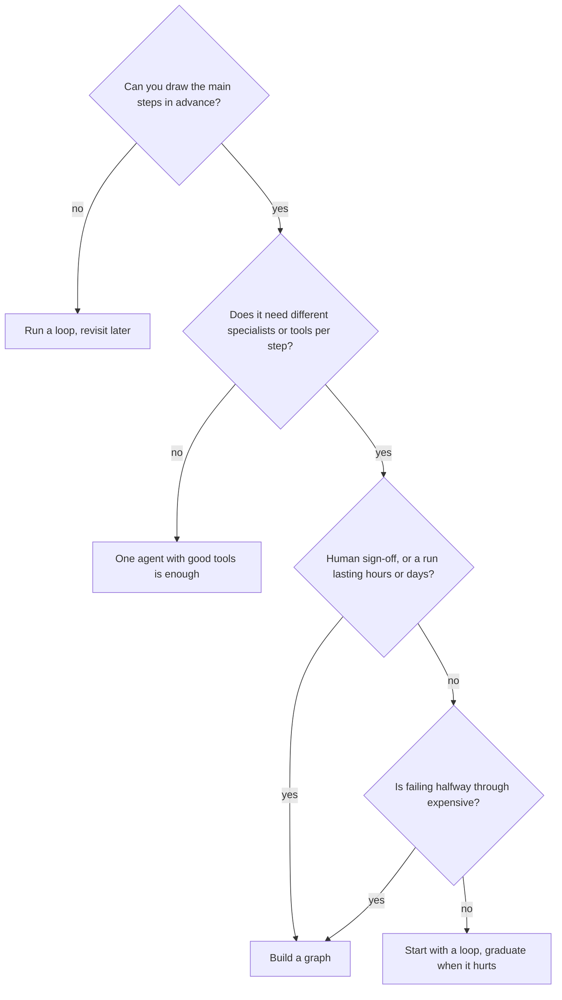
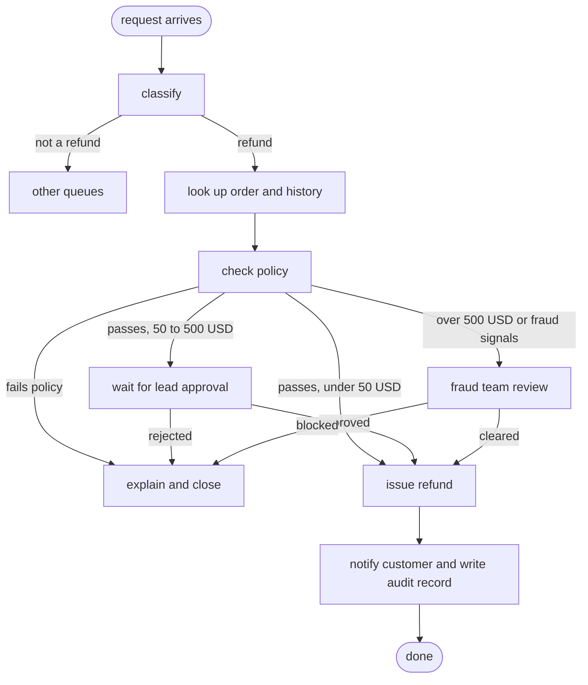
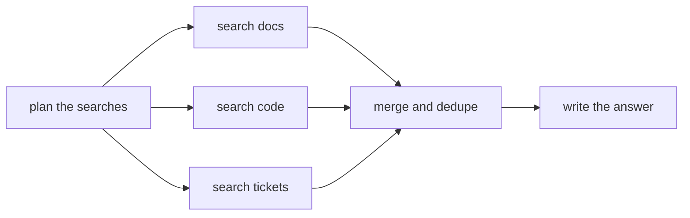
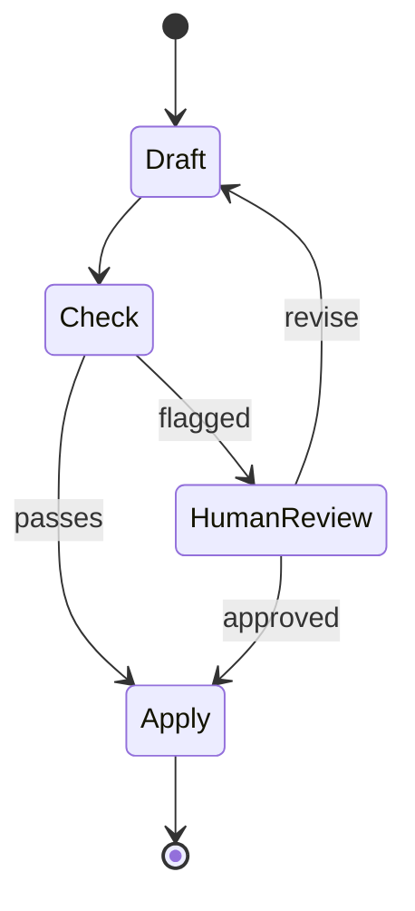
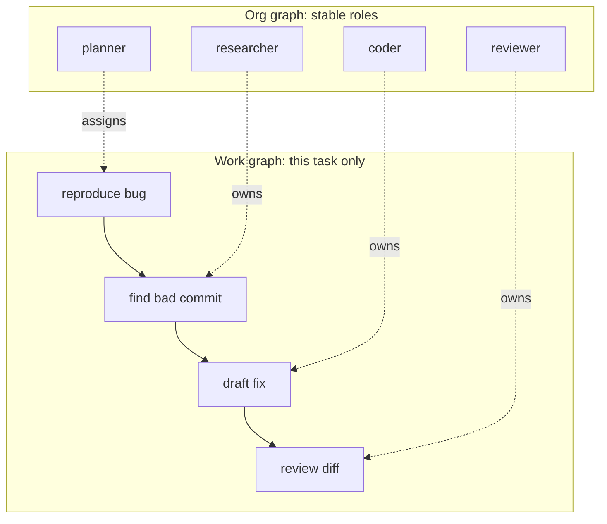
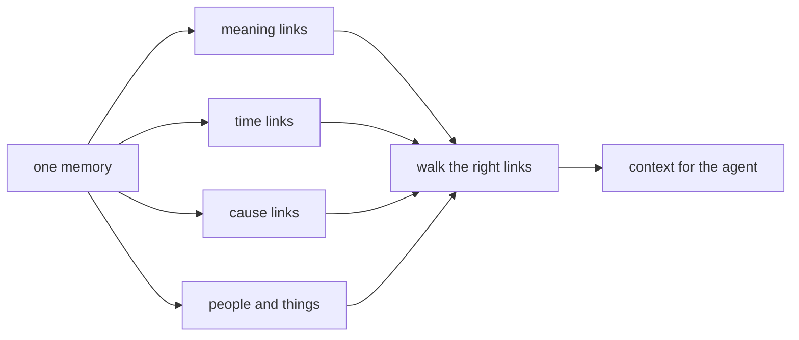

_The skill after prompt, context, and loop engineering: wiring multiple agents into one system._

[From Prompting to Loops](/write-up/from-prompting-to-loops) covered the cycle one agent runs, and [Engineering the Agentic Harness](/write-up/harness-context-loop-engineering) covered the machinery around it. **Graph engineering**, the term that took off in mid-2026, is the layer above both: deciding how several agents work together, who hands what to whom, and what the system does when a step fails.

## The lineage

| Layer                 | Years        | What you design                    | The failure it fixes                     |
| --------------------- | ------------ | ---------------------------------- | ---------------------------------------- |
| Prompt engineering    | 2022 to 2024 | the words in one request           | the model misunderstands the ask         |
| Context engineering   | 2024 to 2025 | what the model gets to see         | the model lacks the facts                |
| Loop engineering      | 2025 to 2026 | one agent's cycle of act and check | the model gives up or never stops        |
| **Graph engineering** | mid-2026 on  | how many agents work together      | the work is too big for one agent's head |

Each layer got a name when the one below stopped being the bottleneck. Agents now finish whole tasks on their own, so the hard part moved to the wiring between them.

## What it is

Three decisions, written down instead of buried in a prompt:

- **Nodes:** the workers. A searcher, a checker, a writer. Each one owns a job and nothing else.
- **Edges:** the arrows. Which result goes where next, including "not good enough, go back and try again."
- **State:** what travels along the arrows. A few named fields that every node reads and writes, instead of one giant chat history.

The important detail is who decides what. Inside a box, the model is free: it picks its own words, tools, and sub-steps. Between boxes, **you** decide, and that decision is code you can read, test, and change without touching a prompt.

None of this is a new idea. What changed recently is what fits inside a box:

|                    | Before         | Now                              |
| ------------------ | -------------- | -------------------------------- |
| A node held        | one model call | a whole agent with its own tools |
| So the graph wired | prompts        | coworkers                        |

Once every box is a full agent, drawing the boxes and arrows stops being plumbing and becomes org design. That is the argument behind the new name.

## How it differs from the things it resembles

Graph engineering sits between two familiar worlds: rigid pipelines that never surprise you, and free-roaming agents that surprise you constantly.

| Approach                            | Who picks the next step                     | Handles the unexpected | You can predict the cost | Good at                        |
| ----------------------------------- | ------------------------------------------- | ---------------------- | ------------------------ | ------------------------------ |
| Prompt chain (fixed pipeline)       | you, entirely                               | badly                  | yes                      | simple, known, repeated jobs   |
| Workflow engine (Airflow, Temporal) | you, entirely                               | badly                  | yes                      | reliable data and service jobs |
| **Agent graph**                     | you set routes, the model works inside them | fairly well            | roughly                  | messy jobs with known stages   |
| Single agent loop                   | the model, every turn                       | well                   | no                       | open-ended, exploratory work   |
| Free-form multi-agent chat          | the agents, by talking                      | unpredictably          | no                       | demos, brainstorming           |

Two comparisons deserve more than a table row.

**Versus a workflow engine.** A graph looks like a DAG in Airflow, but a workflow engine assumes every step is deterministic: same input, same output, retry on crash. In an agent graph the steps are judgment calls, so you need a different kind of safety net. You are not retrying a failed API call, you are grading an answer and deciding whether to try a different approach.

**Versus free-form multi-agent chat.** In a chat-style system, agents message each other and the conversation decides what happens. It demos well and operates badly: nobody can say why a run cost 40 USD, took 11 minutes, and produced the wrong answer. A graph gives up some flexibility to get back the thing you need in production, which is a route you can point at afterwards.

## When to build one

The rule of thumb: **if you can draw the steps before you start, wire a graph. If the steps only become clear as you go, run a loop.** Most real systems end up being graphs whose boxes contain loops.

Here is the same task run both ways, so you can watch where the history ends up in each:

<LoopVsGraphSim />

Signals you have outgrown a single loop:

- The agent keeps rereading its own earlier mistakes and getting confused by them.
- Different stages need different tools, models, or permissions.
- Someone has to approve something in the middle, and approval takes days.
- You cannot answer "where did this run spend its money?" after the fact.
- The same three or four stages appear in every run, in the same order.

Signals you do not need one yet:

- One agent already finishes the job over 90% of the time.
- The stages change with every request, so any graph you draw is wrong tomorrow.
- Nobody has yet written down what "done" means. Fix that first; a graph will not save an undefined goal.

The most common failure in this whole discipline is **over-graphing**: freezing a workflow into boxes and arrows before you understand it, then spending months maintaining a rigid structure that a plain loop handled better.

## Where graphs fit

The pattern behind all of these: several distinct stages, at least one quality gate, and a real cost to getting it wrong.

| Use case                     | The nodes                                                         | Why a graph                                                            |
| ---------------------------- | ----------------------------------------------------------------- | ---------------------------------------------------------------------- |
| Retrieval with quality gates | retrieve, grade evidence, rewrite query, answer, cite             | The grader can send work back; you can prove what evidence was used    |
| Support ticket triage        | classify, look up account, draft reply, policy check, send        | The policy check must run before sending, every single time            |
| Code migration at scale      | scan repo, plan change, edit, run tests, review, open PR          | Tests gate the next stage, and failures loop back to the editor        |
| Document or contract review  | extract clauses, flag risks, human review, apply, archive         | The human step can take days, and the run must survive that            |
| Incident response            | detect, gather logs, form theory, verify, propose fix, page human | Different tools and permissions per stage; escalation must be explicit |
| Research and reporting       | plan, parallel searches, merge, fact-check, write                 | Parallel work with a merge point, plus a check before publishing       |
| Data analysis and reporting  | write query, run it, repair on error, interpret, chart            | Broken queries loop back automatically instead of failing the run      |

All of them share two things: a step where something is checked, and a defined thing that happens when the check fails.

## One example end to end: approving a refund

Here is a case where the graph is clearly the right shape: **a customer asks for a refund, and money is about to move.**

Every box has one job, one set of permissions, and one thing it contributes to the shared state:

| Node               | Its one job                     | What it is allowed to touch                      | What it writes to state             |
| ------------------ | ------------------------------- | ------------------------------------------------ | ----------------------------------- |
| classify           | is this even a refund request?  | nothing                                          | intent                              |
| look up            | fetch the order and past claims | order API, read only                             | order id, amount, date, past claims |
| check policy       | is this eligible?               | the policy documents, read only                  | verdict, reason, policy version     |
| lead approval      | a human decides                 | the approvals queue                              | approver, decision, timestamp       |
| fraud review       | a specialist decides            | fraud tooling                                    | cleared or blocked                  |
| issue refund       | move the money                  | the payment API, and it is the only box that can | confirmation id                     |
| notify and archive | tell the customer, record it    | email and the audit log                          | message id, audit row               |

Here is one real run, a 240 USD refund on a nine-day-old order:

| When         | What happens                                                                 | State afterwards                      |
| ------------ | ---------------------------------------------------------------------------- | ------------------------------------- |
| 0s           | classify: this is a refund request                                           | intent = refund                       |
| 2s           | look up: order 8812, 240 USD, bought 9 days ago, no prior claims             | order details filled in               |
| 6s           | check policy: inside the 30 day window, item is eligible                     | verdict = eligible, policy = v14      |
| 6s           | the amount lands in the middle band, so the graph **stops and saves itself** | waiting on = lead approval            |
| 2 days later | a support lead approves it from their queue                                  | decision = approved, approver = named |
| +3s          | refund issued, customer emailed, audit row written                           | confirmation id, done                 |

The two day gap in the middle is what makes this a graph problem. Run it as a single agent in a loop and five things go wrong:

- **The pause kills it.** A loop waiting two days is a chat session someone has to keep alive. The graph stopped between two boxes and resumed later with its state intact.
- **The blast radius is wrong.** A single agent needs payment permissions for the entire run, including while it is doing harmless lookups. In the graph, exactly one box can move money.
- **You cannot safely retry.** If the email fails after the refund goes out, rerunning a loop risks refunding twice. In the graph you replay the notify box alone, because the refund already recorded its confirmation id in state.
- **The audit answer is unconvincing.** A compliance reviewer asking "which policy version was applied, and who approved it?" gets a named field and a route through named boxes, not a 4,000 word transcript to read.
- **You overpay.** Classification is trivial and can run on a cheap model; only the policy call needs your best one. In a loop, one model does everything at one price.

The flip side: if every refund under 20 USD were auto-approved with no human, no fraud path, and no compliance requirement, this whole diagram collapses to one agent with two tools, and that is the correct design. The graph is worth its complexity here because of the pause, the permissions, and the audit.

## The patterns that keep showing up

Almost every production graph is a mix of six shapes.

| Pattern            | Shape                                                           | Use it when                               |
| ------------------ | --------------------------------------------------------------- | ----------------------------------------- |
| Router             | one classifier sends work down one of several branches          | Requests fall into a few clear categories |
| Generate and check | a worker produces, a grader judges, failures loop back          | Quality matters and you can define "good" |
| Fan out and merge  | split into parallel branches, combine the results               | Independent subtasks and speed matters    |
| Human gate         | the graph pauses at a named box until a person approves         | Sending, spending, deleting, publishing   |
| Escalate           | a cheap model tries first, a stronger one takes over on failure | Most cases are easy, a few are not        |
| Supervisor         | a planner assigns work to specialists who own fixed domains     | Stable domains like frontend, infra, data |

Fan out and merge is the one people underestimate, because it is where a graph beats a loop on wall-clock time rather than quality:

A loop would run those three searches one after another, each one filling up the same context window. The graph runs them at once and merges only what matters. The catch is cost: parallel agents burn roughly 15x the tokens of a single agent, so fan out where the speed is worth it, not everywhere.

## Designing the state is most of the work

The nodes and arrows are the easy part. What decides whether the graph works in production is what you let travel between the boxes.

| Belongs in shared state                      | Should stay inside a node                     |
| -------------------------------------------- | --------------------------------------------- |
| The goal or question                         | The model's internal reasoning chatter        |
| Decisions and verdicts, like "approved"      | Raw tool output nobody downstream reads       |
| Pointers to artifacts: file paths, IDs, URLs | Full documents that will bloat every hop      |
| Counters and attempts so far                 | Retry bookkeeping local to that step          |
| Errors that later nodes must react to        | Debug logs, which belong in your tracing tool |

Three rules worth following from day one:

- **Name every field.** If state is a free-form bag, you have rebuilt the chat transcript with extra steps.
- **Decide overwrite versus append per field.** Evidence usually accumulates; a verdict should replace the old one. Getting this backwards is the most common source of confusing runs.
- **Cap the loops.** Any arrow that points backwards needs a maximum attempt count, or you have built an expensive way to run forever.

## Pauses, replays, and other operational wins

Because progress lives in named state rather than a chat window, a run can be saved between any two boxes.

What that gets you in practice:

- **Pauses that survive.** A run can wait days for an approval, then continue exactly where it stopped. A paused loop is a frozen chat that dies with its context window.
- **Replays.** When something goes wrong, restart from the failing box with fixed inputs instead of rerunning the whole job.
- **An audit trail for free.** The route taken is the explanation: which boxes ran, in what order, and what each decided.
- **Per-node costs.** You can finally answer which stage is burning the budget, and swap a cheaper model into just that box.
- **Targeted permissions.** Only the box that needs to write to production gets those credentials, instead of one agent holding every key.

## The failure modes

These come up again and again.

- **Over-graphing.** Structure added before understanding. If you are editing the graph every week to fit new cases, the work wanted a loop.
- **State bloat.** Everything gets stuffed into shared state until every hop carries far more than the next box needs. Pass pointers, not payloads.
- **Runaway cycles.** A retry arrow with no attempt limit, quietly spending money.
- **The mega-node.** One box that "handles the hard part" and slowly absorbs the whole system. Split it.
- **Silent quality drift.** The grader passes everything because nobody ever checked the grader. Test the checkers, not just the workers.
- **Versioning in flight.** You change the graph while runs are paused mid-flow. Decide up front whether old runs finish on the old shape.

## Two graphs: the org and the work

A useful split from practitioners: a stable **org graph** of long-lived roles, and a throwaway **work graph** for the task in front of you.

The org graph changes when your team's shape changes, maybe monthly. The work graph is built and thrown away per task. Keeping them separate is what stops "we need a new kind of task" from turning into "we need to redesign the system."

## What the research backs up

The term came from social media, but the load-bearing ideas have papers behind them.

| Paper                                                                     | Date     | What it supports                                                                   |
| ------------------------------------------------------------------------- | -------- | ---------------------------------------------------------------------------------- |
| [Graph-Based Agentic AI with LangGraph](https://arxiv.org/abs/2607.19297) | Jul 2026 | Pauses, retries, and audit trails as product features, across three real workflows |
| [Context Graphs](https://arxiv.org/abs/2607.07721)                        | Jul 2026 | A graph of company events cut issue surfacing from 47 minutes to seconds           |
| [MAGMA](https://arxiv.org/abs/2601.03236) (ACL 2026)                      | Jan 2026 | Memory as linked graphs beats flat vector search on long-term tasks                |
| [Agint](https://arxiv.org/abs/2511.19635)                                 | Nov 2025 | Turning instructions into checkable task graphs for coding agents                  |
| [Graph-Augmented LLM Agents survey](https://arxiv.org/abs/2507.21407)     | Jul 2025 | Graphs help all four weak spots: planning, memory, tools, coordination             |
| [Graphs Meet AI Agents](https://arxiv.org/abs/2506.18019)                 | Jun 2025 | The wider map: graphs helping agents, and agents working on graphs                 |
| [Agentic Deep Graph Reasoning](https://arxiv.org/abs/2502.13025)          | Feb 2025 | An agent growing its own knowledge graph as it reasons                             |

The memory result is the one most likely to change what you build. [MAGMA](https://arxiv.org/abs/2601.03236) stores each memory in four linked views and picks which links to follow based on the question:

"What broke after the config change?" walks the cause and time links. "What do we know about service X?" walks the meaning and entity links. Same stored memories, different paths through them, and better answers than a single flat vector store.

## Is this actually new?

LangChain's answer is [no](https://ai-engineering-trend.medium.com/is-graph-engineering-here-langchain-says-its-nothing-new-17a35a2bad37): their LangGraph framework has done exactly this for three years, and a loop is itself just a graph with one box and a back-arrow. They are right about the history. The counter-argument is that the boxes now hold whole agents rather than single model calls, which changes what the wiring is worth thinking about.

Both can be true. The primitives are old, the pressure is new, and the branding will be replaced within a year by whatever the next bottleneck is called.

## Takeaways

- Graph engineering is writing down the **nodes, edges, and state** of a multi-agent system instead of hiding them in prompts.
- **Steps known up front: graph. Steps discovered as you go: loop.** Most real systems are graphs whose boxes contain loops.
- Build one when there are distinct stages, a quality gate, a human approval, or an expensive halfway failure. Not before.
- Designing the shared state is most of the work. Pass pointers and decisions, not transcripts.
- The wins that matter operationally are pauses that survive restarts, replays from the failing step, per-stage costs, and a route you can audit.
- The most common mistake is building a graph too early, not too late.

## Sources and further reading

- The seven papers in the table above
- [Graph Engineering: Wire Multi-Agent Orgs After Loops](https://explainx.ai/blog/graph-engineering-ai-agents-multi-agent-organizations-2026) (explainx)
- [Is Graph Engineering Here? LangChain Says It's Nothing New](https://ai-engineering-trend.medium.com/is-graph-engineering-here-langchain-says-its-nothing-new-17a35a2bad37) (Medium)
- [Graph Engineering for Multi-Agent Systems](https://www.truefoundry.com/blog/graph-engineering-enterprise-guide) (TrueFoundry)
- Mine: [From Prompting to Loops](/write-up/from-prompting-to-loops) and [Engineering the Agentic Harness](/write-up/harness-context-loop-engineering)
