*A practical field guide to the systems that wrap an LLM and turn it into a reliable agent — with patterns, worked examples, real deployments, and where the field is heading (mid-2026).*

---

## How to read this

This guide is organized so you can skim the decision aids first and drill into any layer you need.

- **Part I — Foundations:** the vocabulary and the core "Agent = Model + Harness" idea.
- **Part II — Loop engineering:** the run loop, the menu of agentic patterns, concurrency, durable execution, and loop control (retries/timeouts/gates).
- **Part III — Harness engineering:** the stack, guides & sensors, context engineering, eval-driven development, and the newest techniques.
- **Part IV — Applications & use cases:** what real production agents actually look like.
- **Part V — Observability & reliability.**
- **Part VI — Recent trends + open problems.**

### Two decision aids to start

**1. Do you even need an agent loop?** Most teams reach for a loop too early.

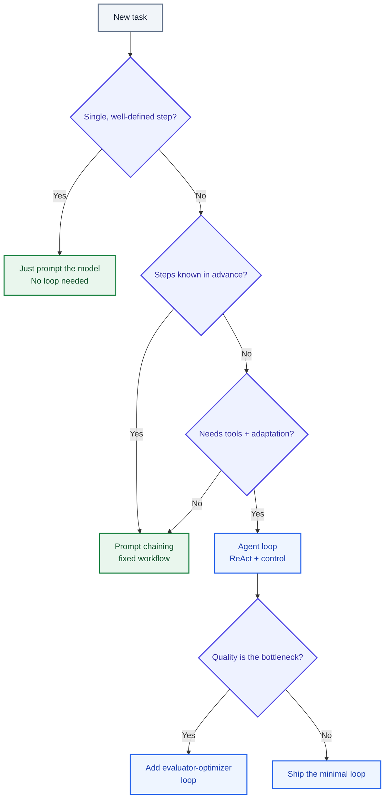

> **Reality check (2026 production data):** a survey of 306 practitioners across 26 domains found ~68% of production agents run **10 steps or fewer** before a human steps in. The systems that work are small and supervised, not autonomous swarms. Agents trade latency and cost for capability — only make that trade when the task actually needs it.

**2. The harness in one picture.** Everything that is *not the model* is the harness.

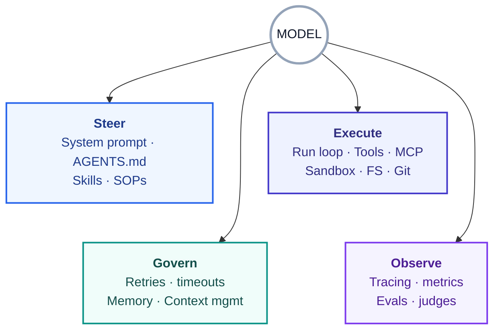

---

### Part I — Foundations

## 1. Three nested disciplines

These terms get conflated; they actually nest, each wider than the last.

| Discipline | Scope | Question it answers | Era it dominated |
|---|---|---|---|
| **Prompt engineering** | One inference | *What do I say right now?* | 2022–2024 |
| **Context engineering** | What's in the window over time | *What should the model see — and not see?* | 2025 |
| **Harness engineering** | The whole running system | *What should the system enable, constrain, measure, and repair while the agent runs unsupervised?* | 2026 |

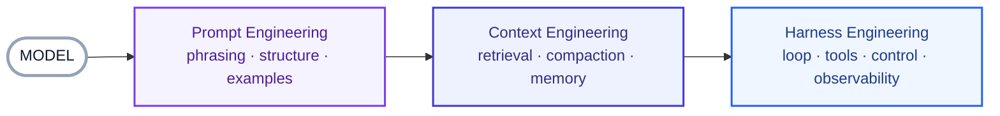

Andrej Karpathy popularized the move from "prompt" to "context" engineering in mid-2025, arguing the former understates the work. Harness engineering (named in early 2026) goes one level wider: prompt and context shape what the model *perceives*; the harness also governs what it can *do*, what happens *after* it acts, and what the system does when things break over hours of operation. "Vibe coding" — prompt-and-pray with no surrounding system — is what you get when you skip the harness.

A useful frame from Martin Fowler / Birgitta Böckeler: the harness is a **cybernetic governor**, combining *feedforward* (steer before acting) and *feedback* (correct after acting) to regulate the system toward a desired state. The horse metaphor in the name is apt: a harness — reins, blinders, saddle — directs raw power toward useful work.

## 2. Agent = Model + Harness

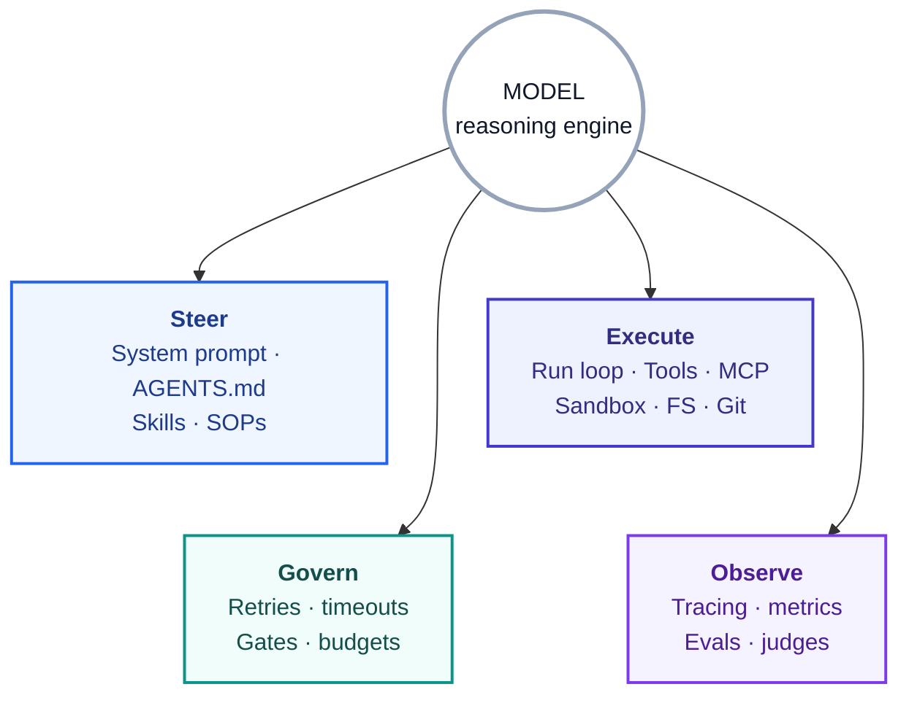

A raw model takes text (plus images/audio/video) and emits text. Out of the box it **cannot** maintain durable state, execute code, access post-cutoff knowledge, or set up an environment. Those are all *harness-level features*. Even basic "chat" is a harness: a `while` loop tracking prior messages.

**Where the term came from (early 2026):** Mitchell Hashimoto (HashiCorp, Terraform, Ghostty) named it in a blog post: every time an agent makes a mistake, engineer a permanent fix into its environment so that mistake becomes *structurally impossible*. Within weeks, OpenAI published *Harness engineering: leveraging Codex in an agent-first world*, Martin Fowler / Birgitta Böckeler published their guides/sensors analysis, LangChain formalized the formula, and Anthropic had already shipped the foundational reliability work (*Effective harnesses for long-running agents*, Nov 2025).

**The core cultural stance — internalize this one:** *treat every agent failure as an engineering problem to fix permanently, not a prompt to retry.* First update the instruction file with a rule preventing the known failure; better, change the environment so it can't recur (a hook that **forces** the linter to run, not a doc line that **asks** the agent to). The difference is "almost every time" vs. "every time without exception."

**Harness vs. framework vs. orchestrator vs. platform:**

| Term | What it is |
|---|---|
| **Framework** | Provides components (LangChain, LlamaIndex, Vercel AI SDK) |
| **Orchestrator** | Decides the *sequence* of model calls |
| **Harness** | Assembles components into a running system + provides capabilities (tools, memory, context) |
| **Platform** | Runs many harnesses across many teams over time |

---

### Part II — Loop Engineering

## 3. The base run loop (ReAct)

The dominant pattern is **ReAct**: the model **reasons**, takes an **action** via a tool call, **observes** the result, repeats — inside a `while` loop the harness controls. Modern harnesses use **native tool calling**: the model returns structured `tool_call` objects, not free text to parse.

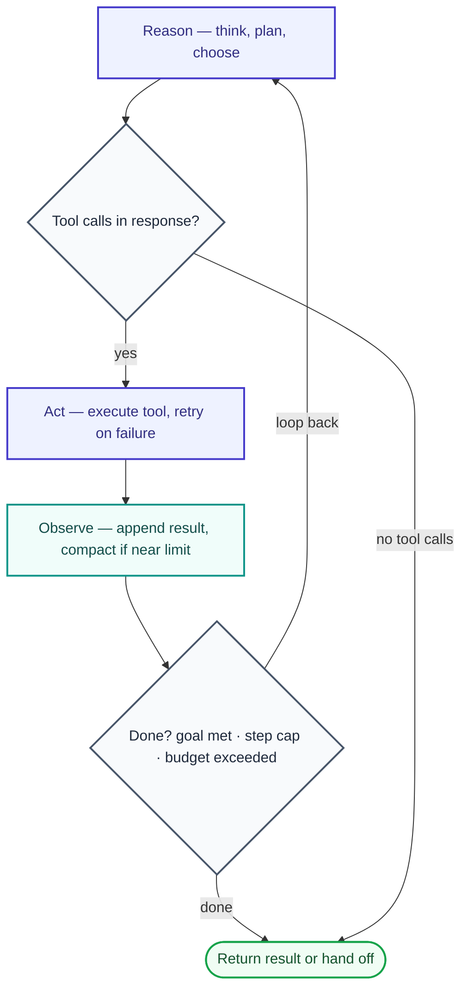

The same loop viewed as a message exchange between the parts of the system:

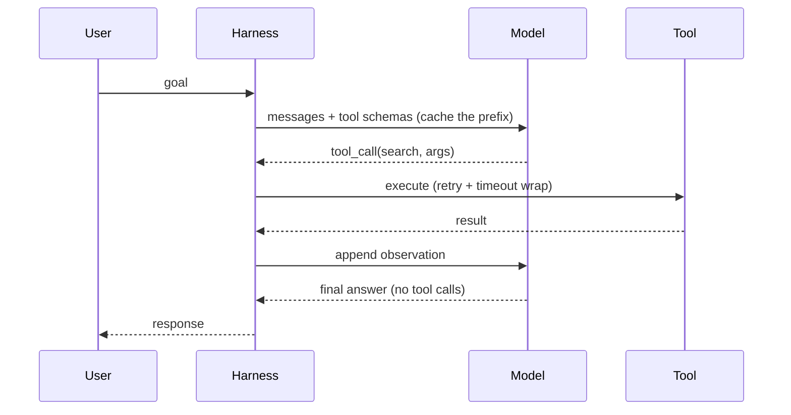

```python
# The canonical loop — annotated with the control points that matter
def run(goal, tools, max_steps=12, budget):
    messages = [system_prompt(), user(goal)]
    for step in range(max_steps):              # <- hard iteration cap
        resp = model(messages, tools=tools)    # <- prompt-cache the prefix
        if not resp.tool_calls:
            return resp                         # <- natural completion
        results = execute(resp.tool_calls)      # <- retries/timeouts live here
        messages += results
        if budget.exceeded() or no_progress(messages):
            break                               # <- budget / no-progress gates
        messages = maybe_compact(messages)      # <- context management
    return finalize_or_escalate(messages)       # <- explicit fallback
```

The loop's per-turn question is binary: *tool calls present → execute and loop; none → final answer*. Everything interesting in loop engineering is the **annotations** above: where caps, gates, retries, and compaction attach.

## 4. The menu of agentic patterns (loop topologies)

This is the part most teams under-engineer. "The loop" isn't one shape — it's a menu, largely codified by Anthropic's *Building Effective Agents* (Dec 2024) and now the industry's default vocabulary. Real systems compose several.

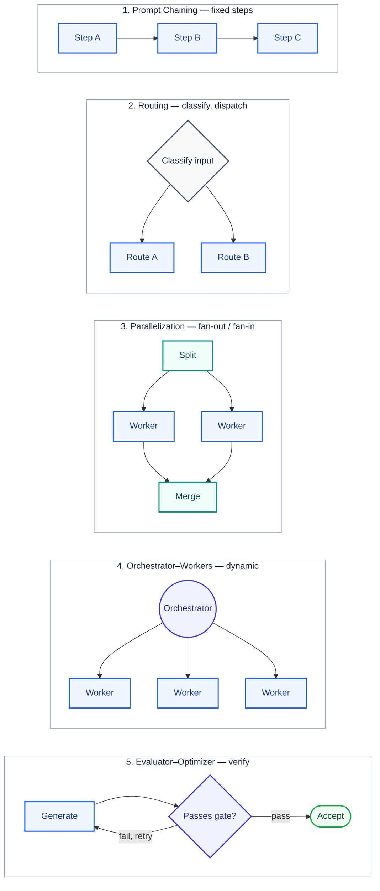

The decision logic for picking one:

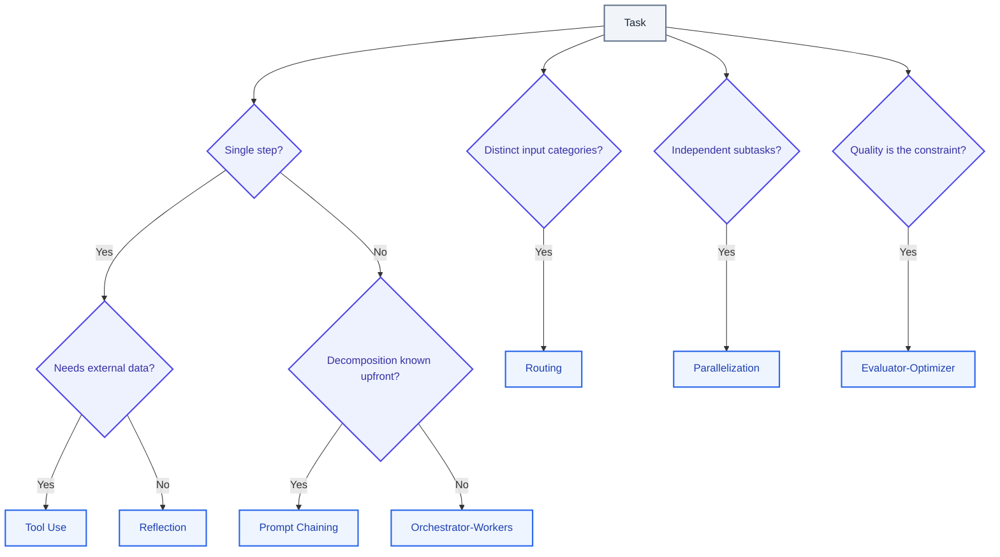

| Pattern | Shape | Use when | Classic failure mode | Real example |
|---|---|---|---|---|
| **Prompt chaining** | Linear pipeline; output → input | Steps decompose cleanly and are fixed | Brittle to inputs that don't fit the fixed shape | Doc → outline → draft → polish |
| **Routing** | Classify, then dispatch | Distinct input categories need different handling | Mis-routing; needs a good classifier | Support triage: billing vs. bug vs. sales |
| **Parallelization** | Fan-out / fan-in (sectioning or voting) | Independent subtasks, or repeat-for-consensus | Aggregation logic, cost multiplies | Map over 200 files; N-way vote on a risky call |
| **Orchestrator–workers** | Lead delegates dynamic subtasks, synthesizes | Subtasks emerge from the input, not known ahead | Coordination overhead; token blow-up | Coding agent deciding which files to change; deep research |
| **Evaluator–optimizer** | Generate → critique → revise, loop | Output quality is the bottleneck *and* you can judge it | Adds a "second optimist" if the check isn't objective | Code that must pass tests; translation refinement |
| **Reflection / Reflexion** | Single agent critiques its own output | Self-contained quality task | Uncritically trusts its own critique | Self-debugging a failing function |

### Pseudocode sketches

```python
# Routing
category = classify(input)                 # cheap model is fine here
return PIPELINES[category](input)

# Parallelization (sectioning + fan-in)
chunks = split(task)
results = await gather(*[worker(c) for c in chunks])  # concurrent
return aggregate(results)

# Orchestrator-workers (dynamic decomposition)
plan = orchestrator.plan(task)             # subtasks NOT hardcoded
outs  = await gather(*[worker(s) for s in plan.subtasks])
return orchestrator.synthesize(outs)

# Evaluator-optimizer (the quality loop)
draft = generator(task)
for _ in range(max_rounds):
    verdict = evaluator(draft, criteria)   # MUST be an objective gate
    if verdict.passed: break
    draft = generator(task, feedback=verdict.critique)
return draft
```

> **Anthropic's own guidance, worth repeating:** if a task can be solved with prompt chaining or a single well-prompted call, do that. Reach for agentic loops only when the task genuinely requires adaptation.

## 5. The objective-gate principle (promote this to a rule)

An evaluator/reflection loop only works if the gate **fails objectively** — a failing test, a type error, a non-zero build, a schema-validation error. A second LLM told to "review this" with no hard signal is just **a second optimist**: it rubber-stamps, the loop "converges," and you ship a confident wrong answer while burning tokens.

This is the failure behind the **"Ralph Wiggum loop,"** documented by Geoffrey Huntley: an agent meant to emit a completion token only when finished emits it early, and the loop exits on a half-done job. Without a hard gate, loops fail *quietly* and keep spending.

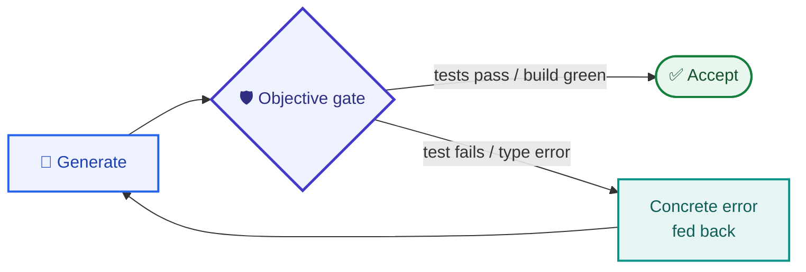

**Worked example — code generation:**

```python
for attempt in range(6):
    code = generate(spec, feedback=last_error)
    result = run_tests(code)          # objective: pytest exit code + failures
    if result.passed:
        return code
    last_error = result.failures      # exact tracebacks, not "looks wrong"
raise Escalate("6 attempts, tests still red")  # hand to a human, don't loop forever
```

Maker–checker, generator–verifier, critic loops, reflection loops — all names for the same shape. The non-negotiable is: **clear acceptance criteria + an iteration cap + a defined fallback** when the cap is hit (escalate, or return best-effort with a warning).

## 6. Event loop vs. run loop, and parallelism

Two "loops" get confused:

- The **event loop** is the runtime concurrency mechanism (e.g. Python `asyncio`) that lets the harness await many I/O-bound operations — model calls, tool HTTP requests, sandbox commands — concurrently. Infrastructure, not agent logic.
- The **agent run loop** is the *semantic* reason→act→observe loop. It rides *on top of* the event loop.

The practical payoff is **parallelism**, an underused lever:

- **Parallel tool calls within one turn** — when the model emits several independent tool calls, execute them concurrently rather than serially. Big latency win.
- **Parallel workers / subagents** — fan out independent subtasks. Anthropic's multi-agent researcher reported isolated-context subagents *outperforming* a single agent on breadth tasks — at up to ~15× the tokens of a chat. Parallelism buys quality and speed; it costs money.

## 7. Graph-based & durable execution

A more structured alternative models the agent as a **graph of discrete steps** (e.g. LangGraph):

- **Nodes** = units of work (call model; run tools; deterministic logic).
- **Edges** = control flow, incl. conditional branches.
- **State** = a typed object flowing through nodes, with **reducers** merging updates.
- **Checkpointing** at step boundaries (a "superstep") enables **resume-after-interruption** and **time-travel debugging**.

Why this matters for long or high-stakes work:

- **Durable execution / resumability:** a task running for hours that hits an unrecoverable error shouldn't restart from zero. Checkpoints let you resume from the last good step (the Temporal-style "durable workflow" idea applied to agents).
- **Human-in-the-loop as a first-class primitive:** the graph can *pause* at an approval gate, surface the proposed action, and wait for a human `yes/no` before continuing — essential when actions are consequential and hard to reverse.

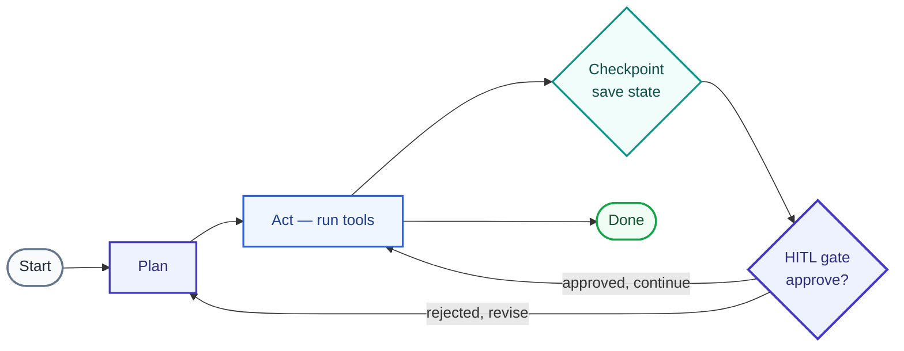

## 8. Long-horizon loops

When work exceeds one context window, two patterns dominate.

**The Ralph loop (brute force).** A hook intercepts the model's exit attempt and **re-injects the original goal into a fresh, clean context window**, forcing continuation against a completion target. Each iteration starts clean but reads accumulated state (progress files, git history) from the filesystem.

**The structured initializer/coding-agent split (Anthropic).** Detailed in Part IV's coding-agent case study — an *initializer* sets up the environment once; a *coding agent* makes incremental, one-feature-at-a-time progress every session, leaving a clean, mergeable state behind.

## 9. Loop control: retries, timeouts, gates, compensation

The happy path is easy; the error-handling boilerplate that survives production is often longer than the business logic. Four primitives, best owned by the engine (not hand-rolled in every node):

| Primitive | Handles | Key knobs | Gotcha |
|---|---|---|---|
| **Stopping conditions** | When to end the loop | natural completion, goal met, max-steps, budget, no-progress, human interrupt | Early-stopping ("declares victory") and non-convergence |
| **Retries** | Transient failures (5xx, resets) | exponential backoff, jitter, `max_attempts`, `retry_on` | Don't retry bugs (`ValueError`/`TypeError`); guard non-idempotent side effects |
| **Timeouts** | Hung calls | `run_timeout` (wall-clock), `idle_timeout` (no progress) + heartbeats | A streaming call isn't "hung"; use idle, not wall-clock, for it |
| **Error handlers** | Retry *exhaustion* | runs only after retries fail; failure context attached | Make the transition atomic; no handler-for-the-handler (recursion) |

```python
# Representative per-step policy (LangGraph style)
RetryPolicy(initial_interval=0.5, backoff_factor=2.0, max_interval=128,
            max_attempts=3, jitter=True,
            retry_on=(ConnectionError, TimeoutError))   # conservative
TimeoutPolicy(run_timeout=30, idle_timeout=5, refresh_on="auto")
```

**Compensation (SAGA) for side-effecting workflows.** If `reserve_seat` succeeded but `process_payment` failed, retrying the whole thing leaves a stuck reservation. The SAGA pattern: retry each step individually; track which steps actually completed; on exhaustion, run **compensation** that undoes only the completed steps in reverse order — keeping the operation all-or-nothing. This matters more every month as agents take high-consequence actions (booking, payments, internal API calls). A 1% transient failure rate is a demo nuisance; across dozens of consequential steps it compounds fast.

## 10. When *not* to loop

Loop engineering includes knowing when to stop looping:

- If prompt chaining or a single call solves it, don't build an agent.
- Cap autonomy: ~10 supervised steps beats 100 unsupervised ones for most current tasks.
- Prefer an objective gate + human handoff over "let it run."
- Background/async agents (Slack-task → PR) work precisely because there's a human review gate at the end.

---

### Part III — Harness Engineering

## 11. The harness stack

A useful layering (synthesized from OpenClaw's public architecture, LangChain's anatomy, and MongoDB's component model):

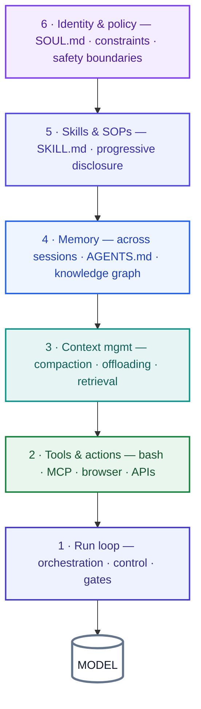

## 12. Guides & sensors (the feedforward/feedback model)

Böckeler's mental model is the cleanest way to organize a harness:

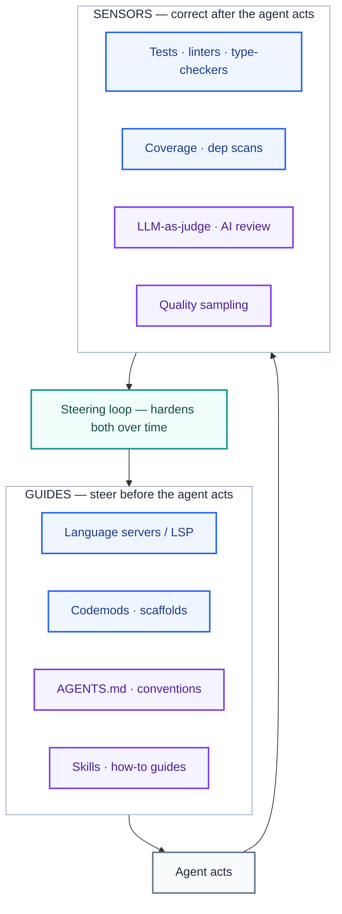

Feedforward-only → encodes rules but never learns if they worked. Feedback-only → repeats the same mistakes. You need both, plus a **steering loop**: when an issue recurs, harden the guides/sensors so it becomes less probable — or impossible.

**Keep quality left.** Distribute checks by cost and speed: PostToolUse hook (ms) → pre-commit (s) → CI (min) → human review (hrs). The faster the layer, the more effectively the agent self-corrects. Separately, **continuous drift sensors** run *outside* the change lifecycle to catch gradual decay.

## 13. Infrastructure primitives

| Primitive | Why it exists | Unlocks |
|---|---|---|
| **Filesystem** | Models only operate on the context window | Workspace, context offload, durable cross-session state, multi-agent collaboration surface |
| **Git** | Versioning on top of the filesystem | Rollback, branch experiments, fast onboarding for the next session |
| **Bash + code exec** | Can't pre-build a tool for everything | Agent designs its own tools on the fly ("give the model a computer") |
| **Sandbox** | Local execution is unsafe and doesn't scale | Isolated, on-demand envs; allow-listed commands; network isolation; fan-out scale |
| **Memory + search** | Knowledge cutoff + finite weights | `AGENTS.md` injected at start (continual learning); web/docs search for fresh facts |

## 14. Context engineering (write / select / compress / isolate)

Context is a scarce resource and the window is bounded. Two failure modes drive everything: **context rot** (reasoning degrades as the window fills) and **hard overflow** (the API would error).

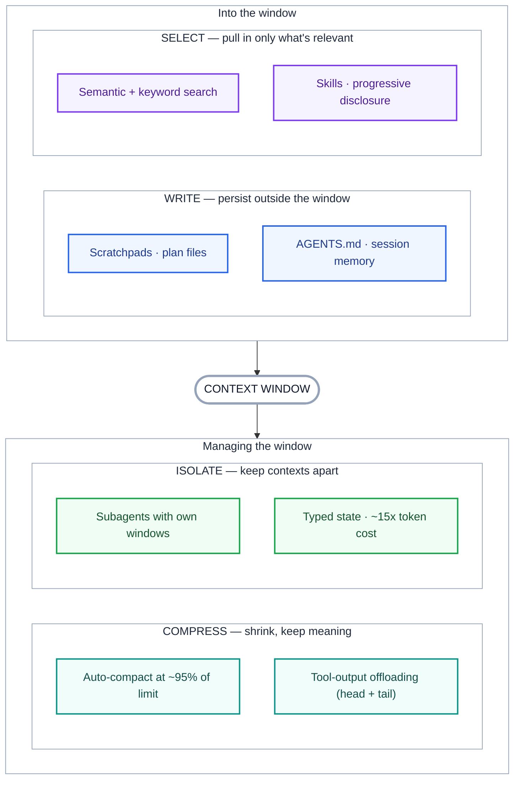

The four strategies in practice:

- **Write** — scratchpads, plan files, `AGENTS.md`. Anthropic's LeadResearcher saves its plan to memory so it survives truncation.
- **Select** — hybrid semantic + keyword search; **Skills** via progressive disclosure (only front-matter loads at start, full instructions on demand).
- **Compress** — **compaction** is the first lever. Claude Code triggers auto-compact near ~95% of the limit, summarizing history while preserving architecture decisions and open bugs. **Tool-output offloading** keeps head+tail in context, writes the full blob to disk.
- **Isolate** — split across subagents (own tools, instructions, window). Anthropic reported isolated-context subagents outperforming a single agent on breadth tasks — at up to ~15× the tokens.

> Live debate: Anthropic (multi-agent, isolated contexts) vs. Cognition/Devin (single agent + long-context compression for stability and lower cost). Both are arguing about the *same* problem.

## 15. Eval-driven harness development (NEW)

The most underweighted harness discipline. If you don't measure, every regression is a blind debug across prompt × retrieval × model × tools. Treat evals as a **first-class harness component**, not an afterthought:

- **Evals in CI** — write assertions like unit tests; run them on every change to catch regressions before they ship. Agent-specific metrics that matter: **task completion, tool-call correctness, argument correctness, step efficiency** (libraries like DeepEval expose these; LangChain shipped **Rubrics** for agents that evaluate and correct their own work).
- **LLM-as-judge as a gate, not décor** — useful, but only with explicit criteria; pair with computational checks so the gate can fail objectively.
- **Trace-based eval** — score real production traces (sampled) for quality, not just synthetic test sets.
- **Synthetic edge-case generation** — auto-generate the hard cases you can't easily collect.

The loop closes: evals feed the steering loop; failing evals become new guides/sensors.

## 16. Newer harness techniques (NEW)

| Technique | What it is | Why it matters |
|---|---|---|
| **Prompt caching** | Cache the stable prompt prefix (system + tools + history) across turns | Major cost & latency reduction in any multi-turn loop — often the single biggest cost lever |
| **Code-execution tool orchestration** | Model calls tools by *writing code* that invokes them, rather than many direct tool calls | Fewer round-trips, composable tool use, less context bloat from tool schemas |
| **Just-in-time tool/context assembly** | Harness loads the right tools + context per task instead of pre-wiring everything | Beats context rot from dozens of always-loaded tool definitions |
| **Model routing / cascades** | Cheap model for easy turns; escalate to a strong model for hard ones | Cuts cost without tanking quality; routing is itself a pattern (§4) |
| **Middleware / hooks** | Deterministic interceptors around model/tool calls (compaction, lint, guardrails, redaction) | Where "engineer the failure away" rules physically attach |
| **Skills & SOPs** | `SKILL.md` (and OpenClaw's `SOUL.md`) encode role, constraints, and standard operating procedures | Stable, repeatable behavior; the more precise the SKILL.md, the more stable the output |
| **MCP (Model Context Protocol)** | Open standard (Anthropic, Nov 2024) connecting an agent to tools/data over JSON-RPC | The vertical interop layer of the harness (see §17) |
| **A2A (Agent2Agent)** | Open standard (Google → Linux Foundation) for agents to discover and delegate to each other | The horizontal interop layer for multi-agent systems (see §17) |

## 17. Interoperability protocols: MCP & A2A

As soon as you have many agents and many tools, you hit an **N×M integration problem** — every agent-to-tool and agent-to-agent pair wants a bespoke connector. Two open protocols collapse that into N+M along two different axes:

- **MCP (Model Context Protocol)** — the **vertical** axis: how one agent connects *down* to tools and data.
- **A2A (Agent2Agent)** — the **horizontal** axis: how agents talk *across* to each other as peers.

They're complementary, not competing.

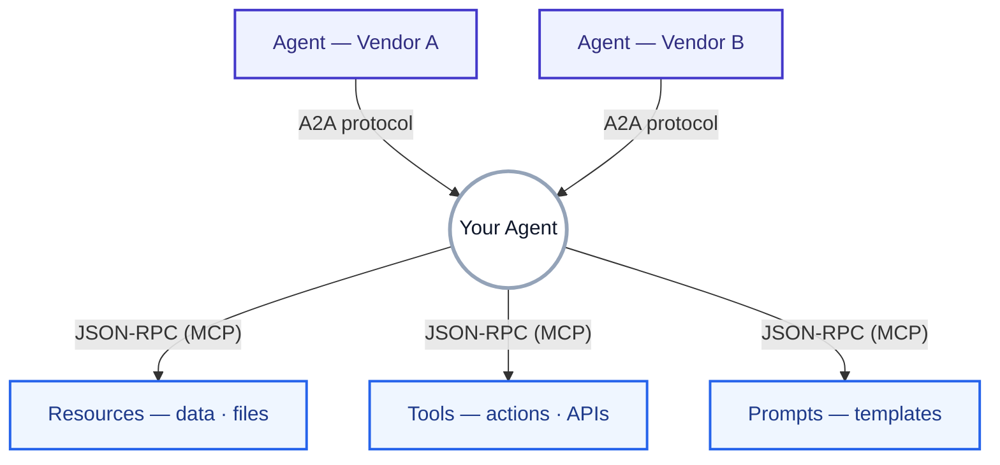

### MCP — agent ↔ tools/data

Open standard from **Anthropic (Nov 2024)**, built on **JSON-RPC 2.0** — often called *"the USB-C of AI applications."* Architecture: **host → client → servers**. An MCP Host (Claude Desktop, Cursor, ChatGPT, a custom agent) runs a Client that connects to one or more Servers, each exposing **Tools** (callable actions), **Resources** (readable data), and **Prompts** (reusable templates). Transports: STDIO (local process) and HTTP/SSE (remote). Mid-2026: thousands of public servers, 100M+ SDK downloads.

### A2A — agent ↔ agent

Announced by **Google (Apr 9, 2025)** and donated to the **Linux Foundation (June 2025**, Apache-2.0, vendor-neutral governance under the Agentic AI Foundation). By April 2026, 150+ organizations back it (Microsoft, AWS, Salesforce, SAP, ServiceNow, IBM…), with native integration in Azure AI Foundry, Amazon Bedrock AgentCore, and Google Cloud. It uses a **client–remote model**: a client agent discovers a suitable remote agent, delegates a **Task**, and gets back **Artifacts** plus status updates — *without either side exposing its internal logic, memory, or tools*. Four core objects:

- **Agent Card** — a public JSON doc (at `/.well-known/agent-card.json`) advertising skills, endpoint, and auth.
- **Task** — a unit of work with a unique ID whose status updates over multiple rounds.
- **Message** — a turn in the exchange (role: user or agent).
- **Artifact** — the produced output.

**A2A v1.0** (early 2026) made it production-grade: **signed Agent Cards** (cryptographic domain verification to stop card-forgery), **multi-tenancy** (one endpoint hosts many agents), **multi-protocol bindings** (JSON-RPC *and* gRPC), and **version negotiation**; v1.2 extends signed-card verification. The **AP2** extension adds an agent-payments layer.

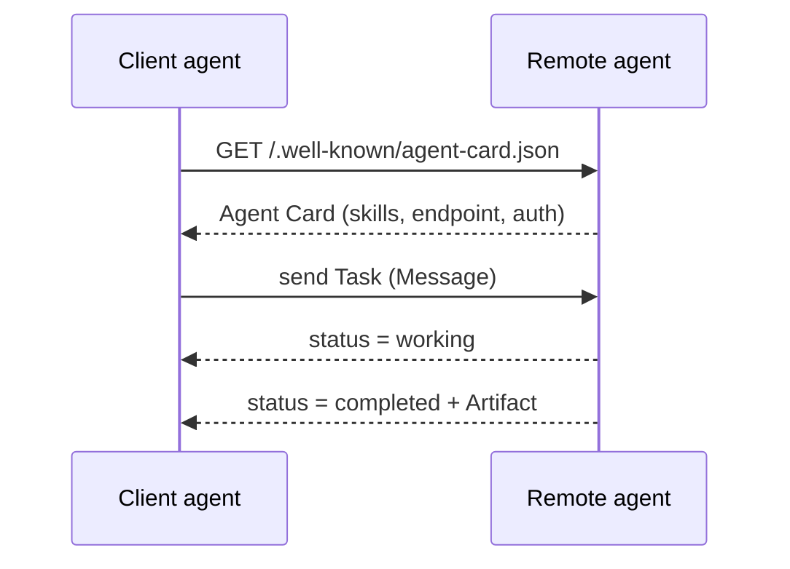

### How they compose

In a real multi-agent system the two stack: an orchestrator uses **A2A** to delegate across specialist agents (possibly different clouds/vendors), and each agent uses **MCP** to reach its own tools and data — exactly the vertical+horizontal axes in the diagram above.

### MCP vs. A2A at a glance

| | MCP | A2A |
|---|---|---|
| Axis | Vertical: agent → tools/data | Horizontal: agent ↔ agent |
| Origin | Anthropic, Nov 2024 | Google, Apr 2025 → Linux Foundation |
| Transport | JSON-RPC over STDIO / HTTP-SSE | JSON-RPC / gRPC over HTTP |
| Core objects | Tools, Resources, Prompts | Agent Card, Task, Message, Artifact |
| Discovery | server config / registry | Agent Card at a well-known URL |
| Answers | "what can this agent *use*?" | "who can this agent *delegate to*?" |

### Security — the open wound (mid-2026)

Both protocols ship a **permissive default trust model**, and it's biting. The headline attack is **tool poisoning** — malicious instructions hidden in a tool's description/schema that the model reads but the user can't inspect (OWASP 2026 Agentic Top 10: **ASI01 — Agent Goal Hijack**). Related vectors: rug-pull updates, cross-server tool shadowing, STDIO RCE (OX Security's April 2026 disclosure showed 9 of 11 MCP registries were poisonable). Auth adoption is still thin (~8.5% using OAuth in one analysis).

The practical posture: **treat every server as hostile until proven otherwise.** Gateway → scope tokens (OAuth 2.1 + PKCE) → sandbox the runtime → sign Agent Cards → log and diff tool descriptions between sessions. In multi-agent chains, compromise propagates along **delegation edges** where per-agent sensors are blind — exactly why harness-level tracing matters.

## 18. Harnessability, templates, Ashby's Law

Not every codebase is equally **harnessable**. Strong typing gives you a type-checker as a free sensor; clear module boundaries afford architecture rules; opinionated frameworks abstract away whole classes of mistakes. Ned Letcher's term **"ambient affordances"** names this — structural properties that make an environment legible to agents. Greenfield can bake it in; legacy faces the cruel irony that the harness is hardest to build where it's needed most.

**Ashby's Law of Requisite Variety:** a regulator must have at least as much variety as the system it governs, and can only regulate what it has a model of. Committing to a known **topology** (a CRUD service, an event processor) is a deliberate variety-reduction move that makes a comprehensive harness achievable — hence emerging **harness templates** (reusable bundles of guides + sensors per topology).

---

### Part IV — Applications & Use Cases

The patterns above aren't theoretical. Here's what production agents actually look like in mid-2026.

## 18. Coding agents (the proving ground)

**Anthropic — the `claude.ai` clone experiment.** Out of the box, even a frontier model in a loop fails to build a production web app: it *one-shots* (runs out of context mid-feature) or *declares victory early*. The harness fix:

- **Initializer agent** (first session): writes `init.sh`, a progress log, an initial git commit, and a **200+ feature JSON list** (each `"passes": false`). JSON chosen deliberately — the model is less likely to overwrite it than Markdown.
- **Coding agent** (every later session): work **one feature at a time** → commit → update progress → leave a clean state.
- **Orientation ritual**: `pwd` → read progress + `git log` → pick highest-priority unfinished feature → smoke-test before new work.
- **Test as a real user**: browser automation (Puppeteer MCP) for e2e verification — huge accuracy gain over unit tests alone.

**Production deployments at scale (early 2026 reports):**

| Org / tool | What | Reported numbers |
|---|---|---|
| **Stripe "Minions"** | Slack task → agent writes code → passes CI → opens PR for human review, no interaction between | 1,000+ merged PRs/week; pre-push hooks run relevant linters by heuristic ("shift feedback left") |
| **OpenAI Codex team** | Built a ~1M-line internal product, 3 engineers, ~5 months | Zero hand-written lines by design; ~3.5 PRs/engineer/day, rising with team size |
| **OpenClaw** (Peter Steinberger) | Personal coding harness running Claude/GPT under the hood | Creator reports shipping code he doesn't read; 6,600+ commits in a month, 5–10 agents in parallel |
| **LangChain coding agent** | Changed *only* the harness on TerminalBench 2.0 | 52.8% / outside top-30 → **rank 5**, same model weights |
| **Codex Security** (Mar 2026) | App-security agent that finds and fixes vulnerabilities | A harness specialized for a verification-heavy task |

The common thread: the **harness**, not the model, is what made these production-grade. A widely-discussed MBZUAI finding (Apr 2026) noted four competing teams independently converging on nearly the *same* harness design — evidence that the harness is the durable engineering surface (and arguably the moat).

## 19. Deep research agents

Pattern: **orchestrator–workers + context isolation**. A lead agent plans the investigation and spawns subagents, each exploring a different facet **in parallel with its own context window**, then synthesizes. This is where isolation pays for its ~15× token cost — breadth tasks genuinely benefit from parallel, focused contexts. Guides: search tools, source-quality rules. Sensors: citation-validity checks, an evaluator pass on the synthesis.

## 20. Customer support & ops agents

Pattern: **routing → tool use → HITL gate**. A router classifies the ticket (billing / bug / sales) and dispatches to a specialized pipeline; the agent uses tools (order lookup, refund API); consequential actions (issue a refund) pass through a human-in-the-loop approval gate or a maker–checker loop with clear acceptance criteria. Stopping conditions and budgets keep cost bounded; SAGA-style compensation guards multi-step actions with side effects.

## 21. Personal agents

OpenClaw's rapid adoption (hundreds of thousands of users, connecting to email/calendar/messaging/files) proved users need far more than a capable model — they need reliable multi-step execution, **safety boundaries**, and knowledge that accumulates across sessions. Its harness layers: identity/constraints (`SOUL.md`), memory (including a "Dreaming" consolidation step modeled on sleep), an always-on agent loop, and `SKILL.md` SOPs. As agents take *consequential actions* on a user's behalf, the harness's safety and memory layers become the product.

## 22. The open-source harness ecosystem

Reusable harnesses: **OpenHarness** (HKUDS), **goose** (Linux Foundation), **Superpowers** (skills library), cross-agent memory like **Supermemory** and **Cognee**. The category has matured from "write a pile of bash" to "the pieces ship inside the tools."

---

### Part V — Observability & Reliability

## 23. Tracing with OpenTelemetry GenAI

You can't operate what you can't see, and agent telemetry is harder than microservice telemetry: prompts are large blobs, tool params vary every call, and you care about tokens, cost, and *quality*, not just latency.

The de-facto standard is **OpenTelemetry's GenAI Semantic Conventions** (GenAI SIG, formed Apr 2024; still moving fast — every release in the v1.37–v1.41 range touched GenAI):

- **Standard `gen_ai.*` attributes** — model, token counts, cost, provider. Portable across any OTel backend.
- **A span tree mirroring the agent's structure:**

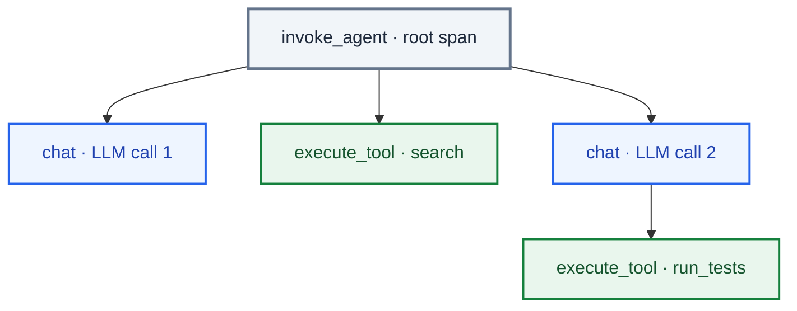

- **Content capture is three-mode.** Default captures **only metadata** (model, tokens, durations) — no prompt content or tool args. Opt-in adds full prompts/results. Best practice: store content as **span events** (filterable/droppable at the Collector), *not* attributes (always indexed, PII risk); cap content length; redact at the Collector.

**Tooling:** intent-side observability — LangSmith, Langfuse, Datadog LLM Observability, and OTel-native backends — increasingly ingests standard GenAI spans directly. Complementary **action-side / system-level** observability (e.g. eBPF tools like AgentSight) watches syscalls to see what an agent *actually did*, closing the intent-vs-behavior gap (matters for debugging and security). Umbrella term: **AgentOps**.

**Track:** per-step + total latency; tokens & cost per call/run; tool success/silent-failure rates; loop metrics (iterations, retries, timeout hits); quality signals (eval scores, rubric pass rates, judge sampling); the full trace tree for replay.

## 24. Failure-mode catalog

| Failure | Where it bites | Primary mitigation |
|---|---|---|
| One-shotting (runs out mid-feature) | Long-horizon | Feature list + one-feature-at-a-time |
| Premature victory | Multi-session | Hard-to-overwrite spec/feature list (JSON) |
| "Done" without testing | Verification | Browser/e2e self-verification; objective gate |
| Context rot | Any long run | Compaction, offloading, Skills/progressive disclosure |
| Hard overflow | Any long run | Compaction; clean reset + handoff (Ralph loop) |
| Transient provider/network errors | Production | RetryPolicy: backoff + jitter, conservative `retry_on` |
| Hung tool / frozen subprocess | Production | `run_timeout` + `idle_timeout` (heartbeats) |
| Retry exhaustion on side-effects | High-consequence actions | Error handler + SAGA compensation |
| Endless loop / no convergence | Any agent | Max-steps, budget caps, no-progress detection |
| Quiet "Ralph Wiggum" exit | Reflection loops | Objective gate (test/build), not "review this" |
| Forgets across sessions | Multi-session | Filesystem + git + progress files |
| Architectural drift / entropy | Living codebases | Continuous drift sensors, "garbage-collection" agents |
| Repeats the same mistake | Any agent | Steering loop: add a guide/sensor or change the environment |
| Silent tool failures, opaque latency | Production | OTel tracing, tool success metrics |

---

### Part VI — Recent Trends & Open Problems

## Recent trends (mid-2026)

- **The harness is the moat.** Same model, different harness → up to ~6× performance swings (Stanford/Tsinghua); LangChain's top-30→top-5 jump; a research project hit a 76.4% benchmark pass rate by having an LLM *optimize the harness infrastructure* itself, beating hand-designed systems. The MBZUAI "four teams, one harness" convergence reinforces that this is where durable engineering lives.
- **Model–harness co-evolution.** Coding products (Claude Code, Codex) are now post-trained *with* their harness in the loop, so models get natively better at the actions designers expose (filesystem ops, bash, planning, subagents). Side effect: overfitting — changing tool logic can *degrade* a model — and the best harness for *your* task isn't necessarily the one a model trained with.
- **Self-improving harnesses.** An active frontier: agents that **analyze their own traces** to identify and fix harness-level failure modes — observability feeding directly back into harness design.
- **Async / background agents.** Slack-task → autonomous work → PR-ready-for-review is now a real production pattern (Stripe, others), built around a final human gate.
- **Capability is outrunning scaffolding — but slowly.** Reports put the task length a model can reliably complete as doubling roughly every ~4 months; yet most production agents still run ≤10 supervised steps. The gap between demo autonomy and trustworthy autonomy is exactly the harness.
- **Harnesses are reshaping infrastructure.** Because harnesses turn transactional API calls into long, stateful, tool-heavy sessions, they're changing how teams think about inference, caching, and even CPU/GPU provisioning (per industry reporting).
- **Standardization is arriving — on two axes.** **MCP** (Anthropic) for agent↔tools and **A2A** (Google → Linux Foundation, 150+ orgs) for agent↔agent are converging into a default interop stack, alongside OTel GenAI conventions for telemetry and `AGENTS.md`/`SKILL.md` as de-facto instruction/skill formats. A2A reaching production v1.0/v1.2 with signed Agent Cards is the quiet-but-significant 2026 milestone.
- **Protocol security is the new frontier.** As MCP and A2A wire agents into mission-critical systems, the permissive default trust model is biting: tool poisoning (OWASP ASI01), rug-pulls, STDIO RCE (OX Security, Apr 2026), and contagion along multi-agent delegation edges. Expect gateways, signed cards, OAuth 2.1, and "treat every server as hostile" to become standard harness hygiene.
- **JIT and dynamic harnesses.** Moving from pre-wired tools/context toward harnesses that assemble the right tools and context just-in-time per task.

## Open problems

- **Behaviour harnesses.** Sensing whether an app *functionally* does what the user wants is still largely faith in AI-generated tests. No general answer yet.
- **Harness coherence at scale.** As guides/sensors multiply, keeping them in sync and non-contradictory is unsolved — we lack a "code coverage for harnesses." (If sensors never fire, is that quality or blindness?)
- **Single vs. multi-agent.** Open question whether one general agent or a team of specialists wins long tasks, traded against multi-agent token cost.
- **Reflection's attack surface.** Reflection loops uncritically trust the feedback they're given — a real safety concern as agents act in the world.
- **Orchestrating hundreds of agents** on a shared codebase without collisions.

> **The through-line:** the model contains the intelligence; the harness is the system that makes that intelligence useful, reliable, and safe. **Context engineering** decides what the model sees; **loop engineering** decides how it acts and when it stops; **harness engineering** is the whole governing system that wraps both — and treats every failure as something to engineer away for good.

---

## Reference: a pragmatic build order

Start with the instruction file and grow. You don't need all of this at once.

1. **Instruction file** (`AGENTS.md`/`CLAUDE.md`): structure, build/test commands, conventions, growing anti-pattern list (one rule per repeated mistake).
2. **Run loop** — ReAct with native tool calling; a graph engine if you need branching, checkpointing, or HITL.
3. **Tools + a general escape hatch** (bash/code exec) in a **sandbox** with command/network guardrails.
4. **Filesystem + git** for durable state, rollback, cross-session handoff.
5. **Context strategy** — compaction near the limit, tool-output offloading, Skills, subagents where they pay off.
6. **Loop control** — explicit stop conditions, per-step retries (backoff + jitter, conservative predicate), run + idle timeouts, error handlers, SAGA for side effects.
7. **Sensors** — fast computational checks shifted left, inferential review where semantic judgment is needed, continuous drift sensors.
8. **Eval harness** — agent metrics (completion, tool correctness, step efficiency) in CI; rubrics/judge as objective gates.
9. **Long-horizon scaffolding** — initializer vs. coding-agent split, structured feature list, progress file, `init.sh`, orientation ritual, e2e self-verification.
10. **Observability** — OTel GenAI instrumentation (standard attributes, content as governed span events), token/cost/latency/quality metrics, full trace trees.
11. **Cost levers** — prompt caching, model routing/cascades, JIT tool loading.
12. **The steering loop** — review failures; harden guides/sensors; where possible, change the environment so the failure is structurally impossible.

---

<div style={{fontSize: "13px", lineHeight: "1.7", color: "inherit", opacity: 0.75}}>

## Sources

Primary and notable sources (2024–2026):

- Mitchell Hashimoto — *My AI Adoption Journey* (origin of "engineer the harness"), mitchellh.com
- OpenAI (Ryan Lopopolo) — *Harness engineering: leveraging Codex in an agent-first world*, openai.com
- Anthropic — *Building Effective Agents* (the workflow-pattern taxonomy), anthropic.com/engineering
- Anthropic — *Effective harnesses for long-running agents* (Nov 2025); *Effective context engineering for AI agents*, anthropic.com/engineering
- Martin Fowler / Birgitta Böckeler — *Harness engineering for coding agent users*, martinfowler.com
- LangChain (Vivek Trivedy) — *The Anatomy of an Agent Harness*; (Long/Runkle) — *Fault Tolerance in LangGraph*; *Context Engineering for Agents*; *Rubrics for deepagents* — langchain.com/blog
- MongoDB — *The Agent Harness: Why the LLM Is the Smallest Part of Your Agent System*
- AlphaSignal — *Most Developers Do Not Need Agent Loops Yet* (production-step survey; Ralph Wiggum loop)
- The Pragmatic Engineer / ignorance.ai — *The Emerging Harness Engineering Playbook* (Stripe Minions, OpenClaw, Codex numbers)
- Microsoft Learn — *AI Agent Orchestration Patterns* (maker-checker / evaluator-optimizer)
- OpenTelemetry — *GenAI Observability with OpenTelemetry* + GenAI Semantic Conventions (GenAI SIG); Greptime, Uptrace, Datadog write-ups
- arXiv — *SemaClaw* (2604.11548), *AgentSight* (2508.02736), *Toward a Safe Internet of Agents* (2512.00520)
- A2A: Google Cloud — *Announcing the Agent2Agent Protocol* + v0.3/v1.0 release notes; Linux Foundation — *A2A Protocol Project* launch; *Agentic Web* (arXiv 2507.21206) for the Agent Card / Task / Message / Artifact model
- MCP & protocol security: OX Security STDIO disclosure (Apr 2026); Cloud Security Alliance *Agentic MCP Security Best Practices*; OWASP *Top 10 for Agentic Applications (2026, ASI01)*; SentinelOne / General Analysis MCP threat-model guides
- Sitepoint / Augment Code — 2026 agentic design-pattern catalogs; DEV — *Open Source Toolkit for Building AI Agents in 2026*
- The Register — *How AI agent harnesses like OpenClaw are changing LLMs, inference, and CPUs*

*Caveat: this is a fast-moving area. Terminology — especially multi-agent OTel conventions, code-execution tool calling, and specific framework APIs — is still consolidating; verify exact attribute names and signatures against current docs before building.*

</div>
