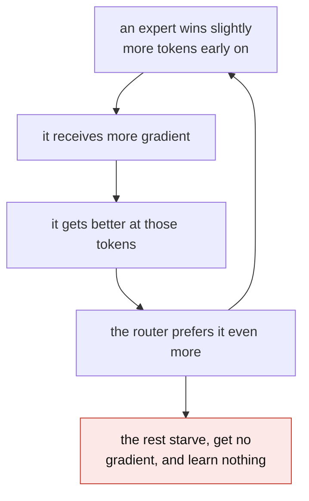
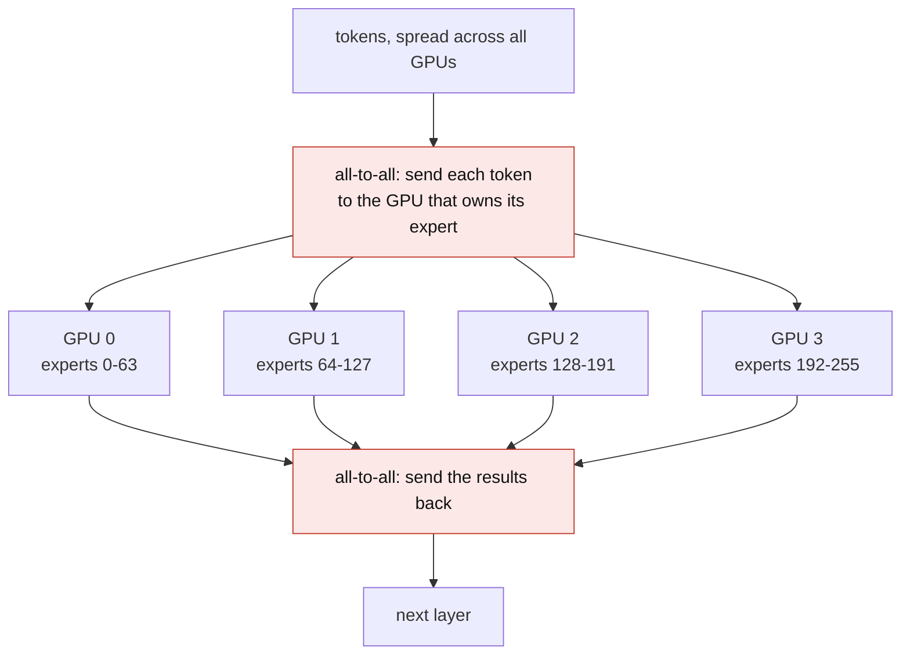

&nbsp;

Almost every large open model of the last two years is a Mixture of Experts. DeepSeek, Qwen, Kimi, Llama 4, gpt-oss. The pitch is one sentence: hundreds of billions of parameters, only a few billion used per token.

I nodded along at that sentence for a while, then spent a week learning that most of what I assumed was wrong in ways that cost money. So this is a chain of questions, each one what you would actually ask after hearing the answer before it.

## Why does a 671 billion parameter model only cost 37 billion to run?

Every transformer block has two big pieces. Attention, which lets tokens look at each other, and a feed forward network, which holds most of the weights. Normally every token goes through the same feed forward network.

An MoE model replaces that one network with many smaller copies, called experts, and puts a small chooser in front of them. Each token uses a few and skips the rest.

DeepSeek-V3 has 256 experts per layer. A token picks 8, plus one shared expert that every token uses. The file holds 671 billion parameters. A single token touches about 37 billion.

<MoELayerDiagram />

## So which parts of the model got cheaper?

Only the feed forward part. This gets dropped from every summary, and it is the line that decides your hardware bill.

Attention is untouched. Every token still attends over the whole context, and the KV cache still grows with sequence length and with the number of users.

| Thing | What MoE does to it |
| --- | --- |
| Feed forward compute | Cuts it hard, this is the whole trick |
| Attention compute | Nothing |
| KV cache memory | Nothing |
| Weight memory | Nothing, you hold every expert whether it runs or not |
| Network traffic | Makes it worse, see question twelve |

That last row is why DeepSeek shipped sparse experts and Multi-head Latent Attention together. Two problems, two fixes, and neither one solves the other.

## What is the router, exactly?

Smaller than you expect. One linear layer per MoE layer, turning the token vector into one score per expert. Softmax, keep the best few, run those, add their outputs weighted by their scores.

```python
scores = x @ W_gate                             # [tokens, n_experts], the whole router
weight, idx = scores.softmax(-1).topk(k, -1)    # keep the k best experts per token
weight = weight / weight.sum(-1, keepdim=True)  # renormalise over the survivors

out = torch.zeros_like(x)
for slot in range(k):
    for e in range(n_experts):
        sel = idx[:, slot] == e                 # tokens whose slot-th pick is expert e
        if sel.any():
            out[sel] += weight[sel, slot, None] * experts[e](x[sel])
```

Ten lines. This tiny matrix decides which billions of parameters run, and that imbalance of power explains most of the trouble below.

<MoERouterSim />

## Do the experts specialize? One for code, one for French?

That is the natural picture and it is mostly wrong.

Mistral checked in the Mixtral paper. They measured which experts fired across slices of The Pile and found only limited specialization by subject. What routing does track is syntax and position, with experts repeating across neighbouring tokens and the effect growing in higher layers.

Nothing assigns experts to topics. The model splits work however lowers loss, and that split ignores human categories. Treat them as 256 slightly different networks the router learned to choose between.

Two design ideas came from noticing this. A **shared expert** every token uses, so common knowledge lives in one place instead of being copied 256 times. And **fine grained experts**, sliced thinner so you can pick more of them: 8 of 256 gives a huge number of combinations, 2 of 8 gives 28. DeepSeekMoE combined both, and that layout is now standard.

## What stops every token from picking the same expert?

Nothing, unless you add something. Left alone it collapses.



The classic fix is an auxiliary loss punishing uneven load. It works, but it pulls against the real objective and needs tuning.

DeepSeek-V3 dropped the loss and used a bias. Keep one number per expert, add it to the score when picking, nudge it after each step.

```python
load = tokens_per_expert / tokens_per_expert.mean()   # 1.0 is a fair share
bias -= gamma * torch.sign(load - 1.0)                # busy experts get pushed down
scores = x @ W_gate + bias                            # bias steers the pick, nothing else
```

The bias changes who gets chosen. It never touches the weights that combine the outputs, so balancing pressure never leaks into predictions. That is why it spread so fast.

## Is MoE training less stable than dense training?

Yes, and the reason is small numbers. Router scores pass through an exponential, so a tiny numerical wobble flips which expert wins, and a flipped choice sends gradient into entirely different weights. Dense models have nothing to flip.

ST-MoE's fix is a router z-loss that penalizes large logits entering the gate. Smaller logits, smaller rounding errors. Cheap, harmless to quality, now near universal.

One older problem you will still read about: early MoE gave each expert a fixed capacity and simply dropped tokens that arrived at a full one. That was a training-era artifact of the TPU implementations. Modern serving stacks do not drop tokens.

## How sparse should a model be?

Sparser every year.

| Model | Total | Active per token | Active share |
| --- | --- | --- | --- |
| Mixtral 8x7B (2023) | 46.7B | 12.9B | 27.6% |
| Qwen3-235B-A22B | 235B | 22B | 9.4% |
| DeepSeek-V3 | 671B | 37B | 5.5% |
| gpt-oss-120b | 117B | 5.1B | 4.4% |
| Llama 4 Maverick | 400B | 17B | 4.3% |
| Kimi K2 | 1T | 32B | 3.2% |
| DeepSeek-V4-Pro | 1.6T | 49B | 3.1% |

The scaling law work says bigger models should be sparser, up to a point. Zoph and colleagues found gains flattening past roughly 256 experts, and the granularity papers find the same shape: slicing helps, then stops, while coordination cost keeps climbing. Read that last row as a direction of travel, since DeepSeek published V4-Pro's totals but not its expert count or routing policy.

## Can you turn a dense model into an MoE?

Yes, and it is much cheaper than starting over. Upcycling copies a trained model's feed forward network several times, adds a fresh router, and keeps training. The catch is that the copies start identical, so nothing distinguishes them until the balancing pressure from the last question drives them apart.

## Why is fine-tuning one harder?

Because sparse models overfit small datasets more readily. Many parameters, and for any given example only a few are on the hook.

ST-MoE ran the experiment and got a useful result: updating only the non-expert parameters worked about as well as updating everything, while updating only the expert parameters was clearly worse, despite those being most of the model. So on a modest dataset, freeze the experts and the router and tune attention, the norms, and the dense layers.

## Does the sparsity make serving cheaper?

Per token, yes. Per batch, far less than advertised, and this is the most expensive misunderstanding in the subject.

One token picks 8 experts of 256. Two hundred tokens, between them, pick nearly all 256, and the GPU loads every expert's weights for that step anyway. Per-token FLOPs fell. Memory traffic did not. The saving is real at batch size 1 on your laptop and thins out as concurrency rises, which is where a production server lives.

The weights are a separate bill. DeepSeek-V3 at FP8 is roughly 671 GB. Eight H100s give you 640 GB, so it does not fit before a single byte of KV cache. You need H200s or a second node. Active parameters describe compute and say nothing about what you have to buy.

## Then why is the expert layer usually the slow part?

Because batching, the trick that makes everything else fast, works much worse here. In a dense layer a bigger batch means you load the weights once and reuse them across every token. In an MoE layer the batch splits across experts first, so each expert sees about batch times k over n. For DeepSeek-V3 that is 8 over 256, one thirty-second of your batch.

The benchmarks are blunt about it. In one measurement a batch of 821 tokens left most experts holding under 200 tokens each, while the expert kernels only reach good efficiency somewhere around 256 to 512. You load a large weight matrix to do a small multiply. Grouped matrix multiplication recovers some of this, but expert layers stay memory bound at batch sizes where dense layers are comfortably compute bound.

## How do people actually serve these?

With expert parallelism. Rather than slicing every layer across every GPU, you give each GPU a subset of the experts and move tokens to wherever their expert lives.



Two all-to-all exchanges per MoE layer, every layer, every step. So this only works on fast interconnect, NVLink inside a node and InfiniBand between them. Over ordinary ethernet it is a known way to end up slower than the tensor parallel setup you were trying to beat.

Done properly it pays. The SGLang team ran DeepSeek-V3 on 96 H100s with expert parallelism and prefill split from decode, and measured 3.3 times the prefill throughput and 5.2 times the decode throughput of a tensor parallel baseline on the same hardware.

## What does uneven expert load actually cost?

The all-to-all is a synchronization point, so every GPU waits for the slowest. When a few experts are popular this hour, the GPUs holding them set the pace.

In that same run, the load balancer was worth 1.49 times on prefill and 2.54 times on decode. Without it they sat about 20 percent behind DeepSeek's published profile; with balancing simulated perfectly the gap fell to 6 percent. Balancing beat most kernel work.

So tokens per expert belongs on the dashboard next to latency and queue depth. It shifts when your traffic mix shifts, and the first symptom is p99 drifting up while the average looks fine.

## Does quantization work differently here?

Yes, and in your favour. Expert weights tolerate low precision better than the rest of the model. MoQE held quality with experts at 2 and 3 bits, in cases where a dense feed forward network at 3 bits lost around 23 percent of its score.

Shipped models follow this. gpt-oss-120b quantizes MoE weights to MXFP4, which is how 117 billion parameters fit on one 80 GB card. DeepSeek-V4-Pro runs experts at FP4 and most everything else at FP8. Quantize the experts hard, since that is where the memory is, and go gently on attention.

## Can I run one on my own machine?

This is where per-token sparsity genuinely pays, because at batch size 1 you really do touch few experts.

Split the model by role rather than by layer. Attention, embeddings, norms and the shared expert go on the GPU, since every token needs them. The routed experts go to system RAM, since any one is used rarely. In llama.cpp that is `--n-cpu-moe`, which keeps expert tensors for the first N layers in RAM. Lower N until your VRAM is nearly full, then stop. The cost is a PCIe transfer when a token needs an offloaded expert, usually worth it, because experts are the biggest and least frequently used thing you own.

## So should you use one?

| Reach for MoE when | Stay dense when |
| --- | --- |
| You want frontier quality and can hold all the weights | Your VRAM budget is the binding constraint |
| You have fast interconnect, or it fits in one node | You are serving from scattered or cheap networking |
| You serve enough traffic to keep experts fed | You fine-tune often on modest datasets |
| You run locally at batch 1 and can offload | You need predictable p99 above all else |

Most people are not really choosing. You pick the best open model for the task, and in 2026 that model is sparse. Understanding the architecture is not about the choice, it is about getting the capacity plan, the interconnect, the quantization and the monitoring right the first time.

## Four things worth keeping

Sparsity is per token, not per batch, and serving is batching. The savings are in compute, never in the weights you hold. Load imbalance costs more than most kernel optimizations return. And the experts are not experts in anything you would recognize, so do not design around specializations that were never there.

## Sources and further reading

- [Outrageously Large Neural Networks: The Sparsely-Gated Mixture-of-Experts Layer](https://arxiv.org/abs/1701.06538), Shazeer et al., 2017. The layer this all descends from.
- [Mixtral of Experts](https://arxiv.org/abs/2401.04088), Jiang et al., 2024. Section 5 is the expert specialization analysis.
- [DeepSeekMoE: Towards Ultimate Expert Specialization](https://arxiv.org/abs/2401.06066), 2024. Fine grained experts and shared expert isolation.
- [DeepSeek-V3 Technical Report](https://arxiv.org/abs/2412.19437), 2024. Auxiliary-loss-free balancing, 671B over 37B active.
- [ST-MoE: Designing Stable and Transferable Sparse Expert Models](https://arxiv.org/abs/2202.08906), Zoph et al., 2022. Router z-loss and the fine-tuning experiments.
- [MegaScale-Infer](https://arxiv.org/abs/2504.02263), 2025. Why expert layers stay memory bound at scale.
- [MoE-Inference-Bench](https://arxiv.org/abs/2508.17467), 2025. Measured per-expert batch sizes and kernel efficiency.
- [Deploying DeepSeek with PD Disaggregation and Large-Scale Expert Parallelism](https://lmsys.org/blog/2025-05-05-large-scale-ep/), LMSYS, 2025. The 96 GPU numbers.
- [Mixture of Quantized Experts](https://arxiv.org/abs/2310.02410), 2023. Expert weights at 2 and 3 bits.
- [Mixture of Experts Explained](https://huggingface.co/blog/moe), Hugging Face. Still the best free introduction.
