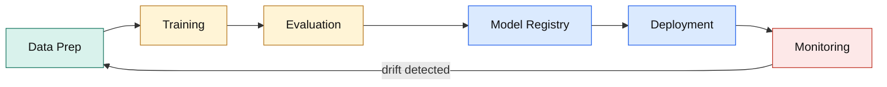
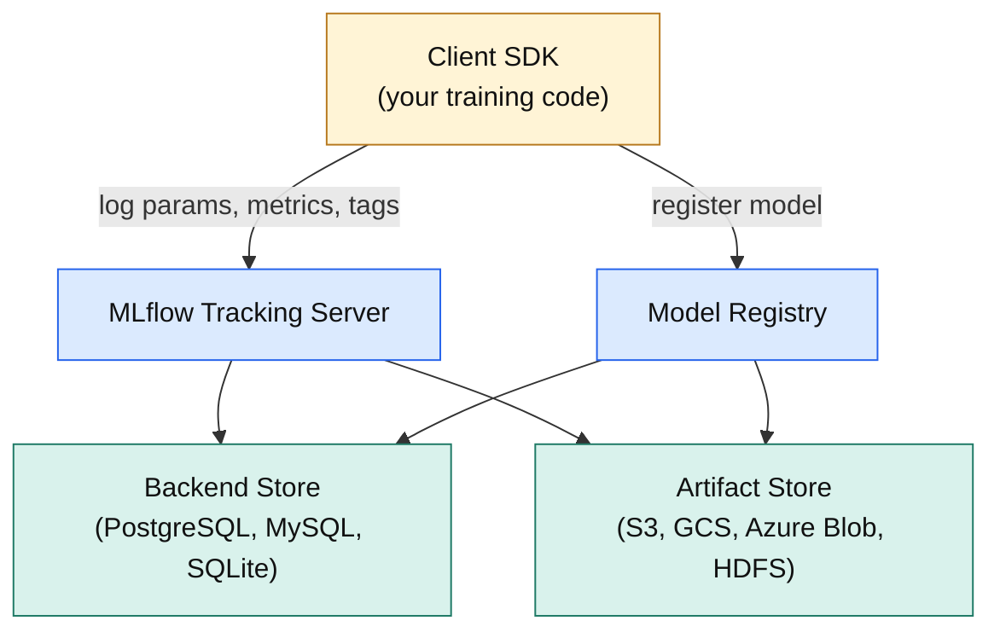
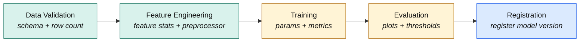
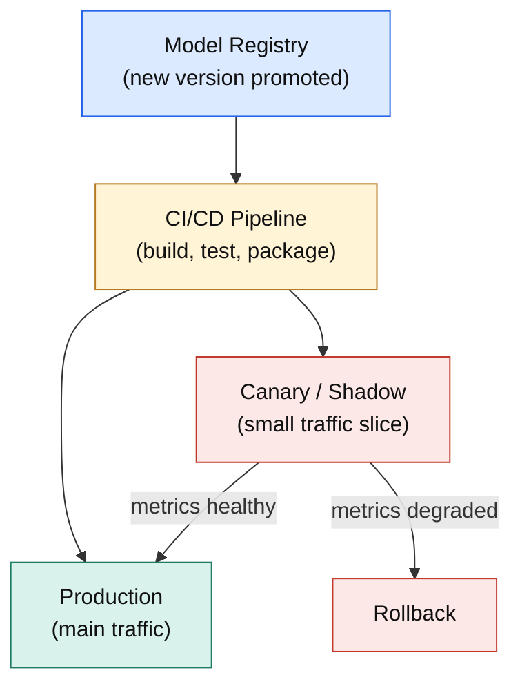
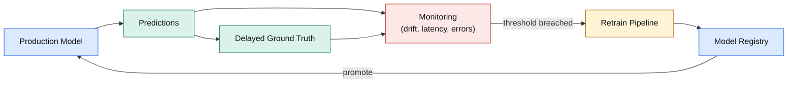

*How the tooling works under the hood, from logging your first experiment to serving, monitoring, and improving models in production.*

&nbsp;

> **The 30-second version.** Production ML is a loop, not a pipeline. MLflow records what you trained (tracking), stores it so it can be reloaded anywhere (artifacts), and tracks which version is live (registry). Data-versioning tools like DVC cover what MLflow doesn't. Once deployed, models drift, so you watch inputs, not just accuracy, and feed problems back into retraining.

&nbsp;

**Table of Contents**

1. [Why MLOps Exists](#1-why-mlops-exists)
2. [MLflow: The Core Platform](#2-mlflow-the-core-platform)
3. [ML Artifacts and How to Version Them](#3-ml-artifacts-and-how-to-version-them)
4. [Pipelines and Reproducibility](#4-pipelines-and-reproducibility)
5. [Framework Integration: PyTorch, TensorFlow, HuggingFace](#5-framework-integration-pytorch-tensorflow-huggingface)
6. [Alternatives: W&B, DVC, Neptune](#6-alternatives-wb-dvc-neptune)
7. [Production: Serving, Evaluation, and Improvement](#7-production-serving-evaluation-and-improvement)

---

## 1. Why MLOps Exists

A model that hits state-of-the-art accuracy on your laptop means nothing if you can't reproduce how it was trained, deploy it reliably, or tell when it starts failing on real data. Without tooling, teams hit the same three failure modes over and over:

- **Lost experiments** — great results, but nobody remembers which hyperparameters, data version, or commit produced them.
- **Manual deployment** — models shipped by copying weight files to a server. No versioning, no rollback, no audit trail.
- **Silent degradation** — the model drifts as input data shifts, and nobody notices until a customer complains.

The core insight: **production ML is a continuous loop, not a one-way pipeline.** Every arrow below is a place where something can be lost, corrupted, or become untraceable. The rest of this guide is about the tools that make each transition recorded, versioned, and auditable.

---

## 2. MLflow: The Core Platform

MLflow is an open-source platform for the end-to-end ML lifecycle. Built by Databricks in 2018, now an Apache project. It's **framework-agnostic** — it treats a model as an opaque set of files plus metadata, so PyTorch, TensorFlow, HuggingFace, scikit-learn, and XGBoost all work the same way.

Four cooperating pieces:

| Component | Answers the question |
|---|---|
| **Tracking** | What did I run, and what happened? |
| **Artifacts** | Where are the files, and can I reload them anywhere? |
| **Registry** | Which model version is official, and where is it in its lifecycle? |
| **Projects** | Can someone else re-run this and get the same result? |

### 2.1 Architecture Overview

The heart of MLflow is the **Tracking Server**, sitting between your training code and *two separate* storage systems. Understanding why there are two is the key to the whole design.

Metadata and artifacts have opposite access patterns, so they live in different places:

- **Backend Store** — small, structured, queried constantly. Params, metric time series, tags, registry entries. You filter and sort it ("every run with lr = 3e-5, ranked by val accuracy"), which is a database's job. PostgreSQL/MySQL in production, SQLite locally.
- **Artifact Store** — large, opaque blobs written once and read whole. Weights, datasets, plots, preprocessors. You never SQL-query a 2 GB weights file; you fetch it by path. That's what object stores (S3, GCS, Azure Blob) are for.

The payoff: the database stays small and fast even after you've logged terabytes of checkpoints, and the two scale independently. Your code talks only to the tracking server and never needs to know where a file physically landed.

### 2.2 Experiment Tracking

The component teams reach for first. It's a **structured, permanent log of everything that happened during training**, organized in three levels: an **Experiment** (a project like "text-classifier") contains **Runs** (each training attempt), and each run records four things:

| What | Example | Nature |
|---|---|---|
| **Parameters** | learning rate, batch size, architecture | Fixed before the run |
| **Metrics** | loss, accuracy, F1 | Change over time, logged *with a step* → stored as time series |
| **Tags** | git commit, author, "prod-candidate" | Free-form labels for search |
| **Artifacts** | the model, a confusion matrix, a config | Files the run produced |

Because every run shares the same schema, the UI presents them all as one **searchable, sortable table** — filter by any param, sort by any metric, select several runs and overlay their loss curves. The moment "my best result" becomes "the run from last Tuesday with these exact settings," reproducing it is trivial. The spreadsheet-and-memory era ends.

### 2.3 Model Registry

Tracking answers *"what have we run?"* The registry answers *"which model is official, and where is it in its lifecycle?"*

- **Register** a promising model → it gets a **named entry** and a **sequential version** (v1, v2, …), each permanently linked to the run that made it. From any live model you can trace back to its exact params, metrics, and commit.
- **Stages** layer on top: `Staging` → `Production` → `Archived`. Promotion is a *metadata move*, not a file copy.
- Serving references models **by stage** ("serve whatever is in Production"), so deploying = one transition, and **rollback = moving the old version back**.
- The registry becomes the home for governance: approvals, descriptions, and an audit trail of who promoted what, when.

> **Note:** MLflow 2.9+ adds an **aliases** system alongside fixed stages — arbitrary named pointers like `champion` or `eu-region` attached to specific versions, for flexible routing when you serve several variants at once.

### 2.4 Artifact Store

This is where the heavy, reproducibility-critical files live. The design goal: a logged model should be **self-describing and portable** — loadable months later by someone who knows nothing about how it was trained.

So logging a model saves more than raw weights. It writes a small structured directory:

- **Weights** — the serialized parameters.
- **Flavor** — what kind of model it is (PyTorch, sklearn pipeline, …).
- **Signature** — the expected input/output schema.
- **Environment** — the exact Python dependencies and versions. *This is the quiet hero of reproducibility* — the difference between a clean load and a cryptic version-mismatch crash.

The store is **pluggable**: point the tracking server at S3, GCS, Azure Blob, HDFS, or a shared filesystem once, and every client inherits it. "Log this model" is the same call regardless of where the bytes go. Cloud object stores win by default — cheap, durable, and governed by the same IAM as everything else.

---

## 3. ML Artifacts and How to Version Them

### 3.1 What Counts as an Artifact

An artifact is **any file needed to reproduce a result or serve a prediction.** The classic mistake is thinking that means "the weights." It doesn't — weights are meaningless without the architecture that shapes them, and predictions are wrong without the exact preprocessing used in training.

| Artifact | Examples | Why version it |
|---|---|---|
| Model weights | Network parameters | The core of the prediction pipeline |
| Model config | Architecture, tokenizer config | Weights mean nothing without the architecture reading them |
| Training data | Processed datasets, feature tables | Change the data, change the model — can't reproduce without it |
| Preprocessing objects | Scalers, encoders, tokenizers | Train/serve skew is one of the nastiest, hardest-to-spot prod bugs |
| Environment spec | Dependencies, container image | "Works on my machine" *is* an artifact-versioning failure |
| Evaluation outputs | Metrics, confusion matrices | The audit trail justifying release |

**The rule:** if changing a file would change predictions, or you'd need it to rebuild the model exactly, it's an artifact and it needs a version.

### 3.2 Versioning Strategies

Three approaches, each covering a different sub-problem. Mature teams **combine them.**

| Strategy | Example tools | Versions by | Best at | Weak at |
|---|---|---|---|---|
| **Registry-based** | MLflow registry | Sequential model versions | Models, linked to runs | Data + intermediate artifacts |
| **Git-based** | DVC | Content hash + git pointer | Making data a git citizen | Real-time dashboards |
| **Data-lake** | LakeFS, Delta Lake | Commits over a dataset | Branch/merge on data | Simplicity, setup cost |

The reason to mix them: "versioning an ML system" is really three problems — versioning the **model**, the **data**, and the **environment** — and no single tool nails all three.

### 3.3 Storage Backends

Underneath any strategy, the bytes need a durable, shared home:

- **Cloud object storage** (S3, GCS, Azure Blob) — the cloud-native default: cheap, durable, permission-aware.
- **HDFS** — still common in on-prem Hadoop/Spark shops.
- **Shared NFS** — simplest for a small team, but no lifecycle management, weaker durability, no real access control.

The tradeoff is always convenience now vs. operational pain later. A shared folder works right up until the team grows.

---

## 4. Pipelines and Reproducibility

### 4.1 Why Reproducibility Breaks

It's almost never model randomness (a fixed seed handles that). It's the **environment around** the model, in three flavors:

- **Environment drift** — different library/CUDA versions produce subtly different numbers. The run "worked" but was never recorded, so it can't be recreated.
- **Data mutation** — a schema change, a backfill, or a label cleanup silently alters "the data." Same code, different model.
- **Implicit dependencies** — an uncommitted config, an env var, a hub model pulled without pinning its revision. Invisible inputs that make a run impossible to reproduce six months later.

### 4.2 How Reproducibility Is Enforced

Make **every input explicit and recorded** — the job of MLflow "Projects." A project bundles three things:

1. **Code**
2. **A declarative environment spec** (exact deps, or a container image)
3. **Named entry points** with typed parameters

The behavioral difference is what matters: running a project doesn't just execute a script in whatever environment happens to be around. It **materializes the declared environment first** (fresh conda env or container), injects the parameters, runs the code, and auto-logs to tracking. Launch it from a laptop, a CI server, or a git URL and you get the same result. Reproducibility stops being discipline and becomes a property of *how the run is launched*.

### 4.3 An End-to-End Pipeline

A production pipeline is a chain of stages, each consuming the last one's output and recording what it did and produced:

- **Validation** fingerprints the incoming data so you can prove which version fed the run.
- **Feature engineering** saves the *fitted* preprocessors as artifacts — those exact objects must be reused at serving time.
- **Training** records hyperparameters and metric curves.
- **Evaluation** produces the plots and thresholds that justify release.
- **Registration** promotes to the registry only if evaluation passes.

Each stage is a nested run under one parent, so the whole lineage — raw-data fingerprint to registered version — is one connected record.

> **Warning:** The #1 cause of "it worked last month" is loose dependency pinning. A version *range* lets a background upgrade silently change results. Pin everything exactly — framework, numerical backend, and the CUDA/accelerator toolkit.

---

## 5. Framework Integration: PyTorch, TensorFlow, HuggingFace

A tracker is only useful if capturing data is nearly free. MLflow does this with **autologging** — hook into training, record params/metrics/model automatically, no manual instrumentation. *How much* it can grab depends on how much the framework standardizes its training loop:

| Framework | Training loop | Autolog captures | You still control |
|---|---|---|---|
| **PyTorch** | Hand-written | Least automatic — via Lightning or manual logging | Everything: per-batch grad norms, custom metrics, arbitrary artifacts |
| **Keras / TF** | Framework-owned `fit()` | Most automatic — optimizer, full metric history, architecture, saved model | Little needed |
| **HF Transformers** | `Trainer` abstraction | In between — full config, per-step eval metrics, checkpoint + tokenizer | Callback-level tweaks |

- **PyTorch** gives you a hand-written loop, so there's no single `fit()` to intercept. Autologging leans on higher-level frameworks (Lightning) or on you emitting metrics. Most manual, most flexible — pure PyTorch philosophy.
- **Keras** runs through one framework-owned `fit()` with a rich callback system. Autologging plugs straight in and captures nearly everything without touching your code.
- **HuggingFace** integrates through `Trainer`'s callback interface (MLflow is a built-in reporter). Especially valuable because transformer training has *so many* interacting hyperparameters — capturing them all kills the "which config made this checkpoint?" confusion. The saved artifact bundles **model + tokenizer**, so it's a complete, loadable unit.

**The through-line:** the more a framework owns its training loop, the more can be captured for free. PyTorch trades automation for control; Keras trades control for automation; HuggingFace lands in the middle.

---

## 6. Alternatives: W&B, DVC, Neptune

MLflow is the most-deployed open-source option, but the alternatives are interesting because they make *different architectural bets*.

- **Weights & Biases** — *hosted-first, UX-first.* A polished real-time dashboard as a managed service, plus shareable reports and managed hyperparameter **sweeps**. Downside: by default your data lives on W&B's servers — frictionless for most, a non-starter in regulated environments. Self-hosting is an enterprise feature.
- **DVC** — *git for data, not a tracking server.* Stores tiny pointer files in git, pushes the real bytes to a remote. Check out an old commit, sync, and you get the exact code *and* data from that moment. No live dashboard — which is why it's usually paired *with* MLflow, not instead of it.
- **Neptune** — *a flexible metadata store*, philosophically between MLflow and W&B. Hosted with a strong UI, API-first, arbitrary nested namespaces, engineered to stay fast across huge numbers of runs. For high-volume, programmatic experimentation.

| Dimension | MLflow | W&B | DVC | Neptune |
|---|---|---|---|---|
| **Core bet** | Open, self-hosted lifecycle | Hosted UX + collaboration | Git-native data versioning | Flexible metadata store |
| **Hosting** | Self-host / Databricks | SaaS (enterprise self-host) | Local, git-based | SaaS (enterprise self-host) |
| **Experiment tracking** | Yes | Best-in-class | Limited | Highly flexible |
| **Data versioning** | Artifacts only | W&B Artifacts | Core strength | Artifacts |
| **Model registry** | Stages + aliases | Via Artifacts | None built-in | Yes |
| **Data privacy** | You host it | Vendor by default | Your own remote | Vendor by default |
| **Best for** | Control / on-prem | UX + collaboration | Data-centric, git-driven | High-volume, API-driven |

**Takeaway:** these aren't strictly competitors. A common real stack is **DVC (data) + MLflow (tracking + registry)** — because versioning an ML system is several problems, and different tools win different ones.

---

## 7. Production: Serving, Evaluation, and Improvement

Training a good model is half the job. The other half is serving it reliably, knowing how it behaves on real data, and improving it on purpose.

### 7.1 Serving

Because a logged model is a **self-describing bundle** (weights + flavor + signature + environment), the *same* bundle serves through several mechanisms with no repackaging:

- **Local REST server** — bundle behind an HTTP endpoint. Great for testing and low volume.
- **Container image** — bake the bundle in; runs identically anywhere containers run.
- **Managed cloud** — SageMaker, Azure ML, or KServe/Seldon on Kubernetes, adding autoscaling, health checks, and load balancing.

The crucial property in all three: **the environment travels with the model**, so the serving container is built from the same environment it trained in — closing the train/serve gap. In a mature setup, CI/CD sits between registry and production and rolls out *gradually*:

### 7.2 Safe Rollout

Sending a new model 100% of traffic immediately is the riskiest possible move. Three patterns de-risk it, each answering a different question:

| Pattern | Question | How it works | Best for |
|---|---|---|---|
| **Canary** | Is it *safe*? | ~5% of live traffic to the new model; watch latency/errors; ramp up or roll back | Most routine deploys |
| **Shadow** | How would it behave, risk-free? | New model sees a *copy* of traffic; predictions never reach users; compared offline | High-stakes (medical, financial) |
| **A/B** | Is it actually *better*? | Deterministic user buckets, held long enough for significance on a real outcome | Measuring business impact |

Canary asks whether the model is *safe*; A/B asks whether it's *better*. They're not the same test.

### 7.3 Evaluation and Monitoring

An accurate model can silently degrade in production because the world changed while the model stayed frozen. Three things to watch — **and the order they become visible matters:**

1. **Data drift** *(earliest)* — input distribution moves from training. Detectable immediately; only needs inputs.
2. **Prediction drift** *(next)* — the model's output distribution shifts (e.g. suddenly favoring one class). Flags trouble before you know if predictions were right.
3. **Performance degradation** *(latest, most definitive)* — real accuracy/F1/AUC drop, but only measurable once **ground-truth labels arrive**, often days or weeks later.

> **Warning:** Data drift *leads*; performance degradation *lags*. Wait for accuracy to drop and the model has already served bad predictions for as long as labels take to arrive. Alert on input drift *before* you have ground truth — exactly what tools like Evidently and WhyLabs are built for.

### 7.4 Feedback Loops and Improvement

Monitoring only matters if it drives action. Four ways to turn problems into better models, differing in **what triggers a new model:**

- **Scheduled retraining** — fixed cadence (daily/weekly). Simple and predictable; either wastes compute or reacts too slowly.
- **Drift-triggered retraining** — retrain when a drift metric crosses a threshold. Spends compute exactly when the data justifies it; needs trustworthy drift detection.
- **Champion/Challenger** — a challenger trains continuously in the background and is promoted *only if it beats* the current champion on recent data. Continuous improvement that structurally can't ship a worse model by accident.
- **Human-in-the-loop** — route low-confidence predictions to reviewers; their corrections fix the case *and* become labeled training data. Standard in moderation, medical, and document processing.

**The one idea to keep:** production ML is a **loop, not a pipeline.** Predictions shape user behavior → behavior shifts the data → shifted data demands a new model → the system is never "done." Everything here — MLflow for tracking and registry, DVC for data, drift monitoring for detection, disciplined rollout for safe change — exists to make that loop **recorded, auditable, and automated** instead of a chain of manual, forgettable, unreproducible steps.
