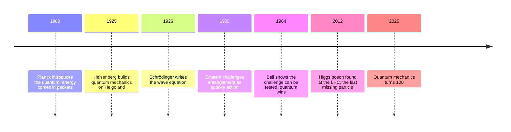
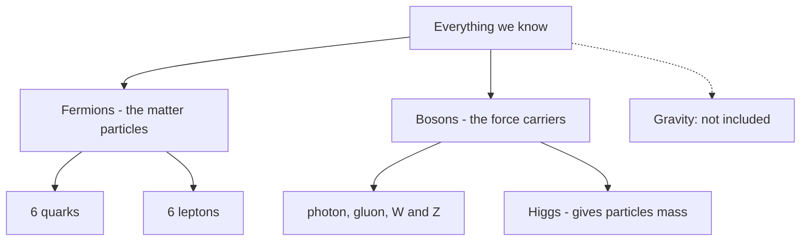
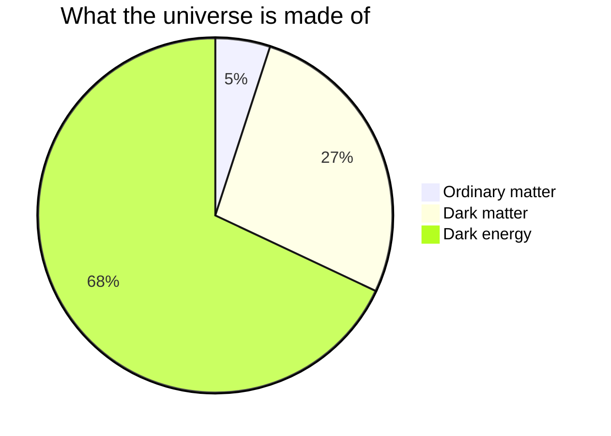

*A hundred years after a 23-year-old on a windswept island worked out the strangest theory in science, here is what it actually says. The math is kept to two famous equations, shown but never solved.*

In June 1925, Werner Heisenberg fled his hay fever to the treeless island of Helgoland and came back with the first working version of quantum mechanics. A century later the theory has never made a wrong prediction, it powers every chip and laser you own, and physicists still argue about what it means. This is a tour of the whole territory: the core ideas, the full catalog of particles they lead to, and the questions that remain wide open.

## Superposition: the chord, not the note

A quantum object does not have to be in one state or the other. Before measurement it holds several possibilities at once, each with its own weight. Think of a piano chord: press three keys and the air carries all three notes at the same time, as one sound.

<QubitCollapse />

**Where the analogy breaks:** you can hear every note in a chord. A measurement never gives you the chord, it always returns exactly one note, at random, with odds set by the weights. And unlike sound, quantum possibilities can interfere and cancel each other, which no mixture of ordinary ingredients can do.

The full list of weights is called the **wavefunction**: the universe's probability bookkeeping for a system. One famous equation says how that bookkeeping flows in time:

$$i\hbar\,\frac{\partial}{\partial t}\,\Psi \;=\; \hat{H}\,\Psi$$

That is the Schrödinger equation. Read it as a sentence: "the way the possibilities change from moment to moment is set by the system's energy." Nothing in it ever throws dice. Randomness only enters when you measure.

## The double slit: watching changes the answer

Fire particles one at a time at a wall with two openings and record where each one lands. Every particle arrives as a single dot, like a tiny bullet. But wait, and the dots organize into stripes: the signature of a wave passing through both openings at once and interfering with itself.

<DoubleSlit />

| What you see                            | What it means                                                        |
| --------------------------------------- | -------------------------------------------------------------------- |
| Dots arrive one at a time               | Each particle is detected whole, at one point                        |
| Stripes emerge from many dots           | Each particle travelled as a wave, through both slits, and interfered with itself |
| Detector on: stripes vanish             | Recording the path makes "which slit" a fact, and facts do not interfere |

**Where the analogy breaks:** this is not a water wave made of stuff. It is a wave of probability. Nothing splashes against the screen; each particle still lands whole, in one spot. Only the odds of where it lands behave like a wave.

## What quantum words don't mean

Quantum mechanics suffers more from its vocabulary than from its math. Four corrections:

| Term                  | What people think                            | What it actually is                                                                 |
| --------------------- | -------------------------------------------- | ----------------------------------------------------------------------------------- |
| Uncertainty principle | Our instruments are too clumsy               | A hard limit built into nature: the sharper a particle's position, the blurrier its momentum, no matter the equipment |
| Spin                  | The particle rotates like a tiny top         | An intrinsic label, like charge. Nothing is spinning                                |
| "Observation"         | A conscious mind has to watch                | Any interaction that records the outcome. A stray photon counts; no eyes required   |
| Collapse              | The particle secretly knew its state all along | Before measurement there was no hidden answer. Bell's theorem rules that out (see below) |

## Entanglement: the coins that always agree

Prepare two particles together in the right way, ship them to labs light-years apart, and their measurement results stay perfectly correlated: like two coins that always land the same way, no matter how far apart they are flipped.

<EntangledPair />

**Where the analogy breaks, twice:**

1. **It is not a message.** Each lab alone sees pure randomness. The agreement is only visible when the results are compared later, over an ordinary channel. Nothing usable travels faster than light.
2. **It is not a pair of pre-matched socks.** "The coins were secretly stamped identically at the start" feels like the obvious explanation. In 1964 John Bell proved that no such pre-arranged story can reproduce what entangled particles actually do when you measure them along different directions, and half a century of experiments agrees. The correlation is real, and it has no classical explanation.

## The Standard Model: the universe's parts list

Zoom in far enough and everything you have ever touched is built from 17 kinds of particle. The catalog is called the **Standard Model**, and it splits cleanly in two: matter particles (**fermions**) and force carriers (**bosons**).

The fermions come in three "generations", each a heavier copy of the last. Everything in your body uses only the first column:

|                     | Generation 1      | Generation 2  | Generation 3   |
| ------------------- | ----------------- | ------------- | -------------- |
| **Quarks**          | up, down          | charm, strange | top, bottom    |
| **Charged leptons** | electron          | muon          | tau            |
| **Neutrinos**       | electron neutrino | muon neutrino | tau neutrino   |

A proton is two ups and a down. A neutron is two downs and an up. Add electrons and you have every atom in the periodic table. Generations 2 and 3 exist, are made routinely in colliders and cosmic rays, and decay almost instantly. Nobody knows why nature keeps three copies.

The forces are what the bosons carry:

| Force           | Carrier        | Relative strength | Range         | Where you feel it                              |
| --------------- | -------------- | ----------------- | ------------- | ---------------------------------------------- |
| Strong          | gluon          | 1                 | inside nuclei | holds protons, neutrons, and nuclei together   |
| Electromagnetic | photon         | ~1/137            | infinite      | light, chemistry, electronics, all of touch    |
| Weak            | W and Z bosons | ~10⁻⁶             | sub-nuclear   | radioactive decay, the fusion powering the Sun |
| Gravity         | none found     | ~10⁻³⁸            | infinite      | falling. Not part of the Standard Model        |

**Where the analogy breaks:** the Standard Model is often called the periodic table of physics, but its entries are not tiny balls. Each particle is a ripple in a field that fills all of space; an electron here and an electron in Andromeda are ripples in the same ocean. And the table has a famous empty seat: gravity.

The 17th particle, the **Higgs boson**, is the odd one out: it carries no force. Its field fills space like a crowd fills a room, and particles get mass from how strongly the crowd tugs at them as they cross. A celebrity (top quark) is mobbed and moves sluggishly, which is what "heavy" means; a nobody (photon) walks through untouched and stays massless. **Where this breaks:** the Higgs only gives mass to fundamental particles. About 99% of your mass is not Higgs at all, it is the energy of the strong force rattling around inside protons and neutrons, courtesy of the second famous equation:

$$E = mc^2$$

Mass is concentrated energy. Run it backwards and it explains colliders: slam particles together with enough energy and new, heavier particles condense out of the collision. That is literally how the LHC produced Higgs bosons from protons 130 times lighter.

## What physics still cannot explain

The Standard Model is the most precisely tested theory ever built, and it describes about 5% of the universe.

| Problem             | What we know                                                       | Leading ideas                                   | Status                                    |
| ------------------- | ------------------------------------------------------------------ | ----------------------------------------------- | ----------------------------------------- |
| Dark matter         | Galaxies spin too fast for their visible mass; something unseen adds gravity | Undiscovered particles (axions, WIMPs), or modified gravity | Decades of detectors, no direct catch yet |
| Dark energy         | The universe's expansion is accelerating                           | An energy of empty space itself                 | DESI's 15-million-galaxy map hints it may be weakening over time |
| Quantum gravity     | Quantum theory and general relativity both work, and refuse to combine | String theory, loop quantum gravity             | No experimental test of either yet        |
| Measurement problem | The math never says when "collapse" actually happens               | Copenhagen, many-worlds, other interpretations  | Still argued, 100 years in                |

"Dark" does not mean dim, it means invisible: dark matter ignores light completely, which is how we know it is not ordinary gas, dust, or black-hole leftovers alone.

## The recent scoreboard

The second quantum century opened with a run of results worth knowing:

| Result                                                    | Who and where                    | Why it matters                                                        |
| --------------------------------------------------------- | -------------------------------- | --------------------------------------------------------------------- |
| Nobel Prize 2025: quantum tunneling in a circuit you can hold | Clarke, Devoret, Martinis        | Quantum rules survive at chip scale; the foundation of superconducting qubits |
| First coherent spin spectroscopy of a single antiproton   | BASE collaboration, CERN         | A 16× sharper test of matter-antimatter symmetry                       |
| Muon g-2 mystery resolved                                 | Fermilab plus new lattice calculations | The theory prediction moved, the "anomaly" evaporated, and the Standard Model now agrees with experiment to remarkable precision |
| First one-dimensional anyons observed                     | Cold-atom labs                   | A third family of particle behavior beyond fermions and bosons         |
| Superfluid molecular hydrogen                             | Cluster experiments              | Quantum flow without friction, now seen in a molecule                  |
| A protein qubit grown inside living cells                 | Quantum biosensing teams         | Quantum sensors assembled by biology itself                            |

One pattern across the list: the weirdness is becoming machinery. Superposition, tunneling, and entanglement stopped being philosophical puzzles and started being components, in quantum computers, in atomic clocks, in sensors inside living cells.

A hundred years ago the question was whether nature could really work this way. The experiments have answered that beyond doubt. The open question now is the one Heisenberg left on the island: what, exactly, is the universe keeping in its books between one measurement and the next?
