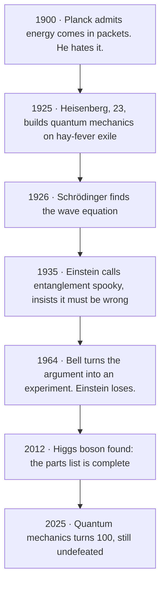
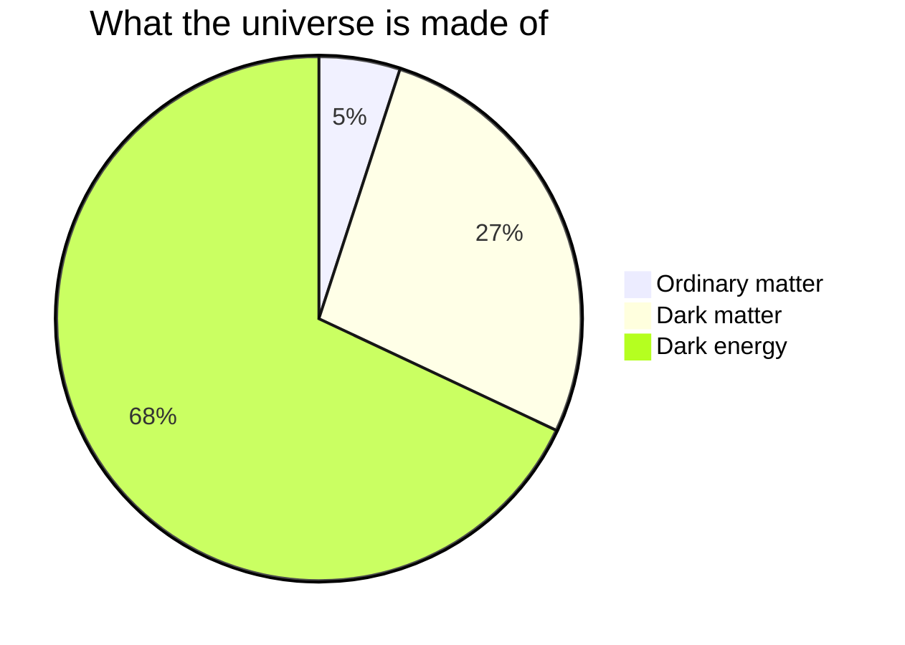

*The physics of atoms turned 100 last year. It has never failed a test, it built the device you are reading this on, and nobody agrees on what it means. Here is the whole story, in plain language.*

**Quantum mechanics is the rulebook for very small things**: atoms, and the particles inside them. At that scale, the comfortable rules of everyday objects stop working. Things can be in several states at once, walls can be crossed without climbing, and looking at something changes what it does. None of this is speculation. It is the most rigorously confirmed science humans have ever produced, with some predictions checked to eleven decimal places.

The story starts with a sneeze. In June 1925, a 23-year-old German physicist named Werner Heisenberg was miserable: his hay fever had swollen his face so badly he could hardly work. He asked his professor for two weeks off and took a boat to Helgoland, a small, rocky island far out in the North Sea where the constant sea wind keeps the air almost free of pollen.

Physics, at that moment, was stuck. The best picture of the atom, tiny electrons circling the nucleus like planets around a sun, kept predicting the wrong answers for the light atoms give off, and after twenty years nobody could repair it. Recovering on the island, with little to do but walk the cliffs and swim, Heisenberg made a daring decision. He would stop trying to imagine the electron's invisible orbit, since nobody can actually watch an electron loop around a nucleus, and build his theory using only quantities you can genuinely measure: the exact colors and brightnesses of the light the atom emits.

That rule led him somewhere strange. To make the numbers work, he had to invent a new way of multiplying grids of measurements, and it had a bizarre feature: A times B did not equal B times A, something no ordinary numbers do. Late one night, around three in the morning, he ran the final test, checking that energy stayed properly conserved in his new scheme, and it passed. Everything fit. He was too electrified to sleep. As he told it years later, he left the house in the dark, walked to the southern tip of the island, climbed a rock jutting out over the sea, and sat there until the sun came up.

Back on the mainland, he showed his messy notes to his mentor Max Born, who stared at the odd multiplication and recognized it: mathematicians already had a name for those grids, matrices, and a whole toolkit for them. Within a few months Born, Heisenberg, and a student named Pascual Jordan had turned two hay-fever weeks on a barren island into the first complete version of quantum mechanics. Heisenberg was 23, and he won the Nobel Prize for it before he turned 32.

This post is the tour of what the hundred years since taught us: what light really is, the handful of core ideas, the complete parts list of the universe, the gadgets in your pocket that secretly run on all this, and the mysteries that are still wide open.

```mermaid
flowchart TD
    A["1900 · Planck admits energy comes in packets. He hates it."] --> B["1925 · Heisenberg, 23, builds quantum mechanics on hay-fever exile"]
    B --> C["1926 · Schrödinger finds the wave equation"]
    C --> D["1935 · Einstein calls entanglement spooky, insists it must be wrong"]
    D --> E["1964 · Bell turns the argument into an experiment. Einstein loses."]
    E --> F["2012 · Higgs boson found: the parts list is complete"]
    F --> G["2025 · Quantum mechanics turns 100, still undefeated"]
```

## Light: the argument that started everything

For 200 years, physics argued about what light is. Newton said particles. Everyone after him said waves, and they had proof: light spreads, bends around corners, and when two beams overlap they make stripes of bright and dark, exactly like ripples on a pond crossing each other. Crest meets crest: extra bright. Crest meets trough: they cancel, darkness. Only waves do that.

Then the 1900s ruined it. Light also arrives in indivisible packets of energy, now called **photons**. You cannot receive half a photon. And each photon's energy depends only on the light's color, not its brightness.

The animation below shows both faces of light, and the compromise nature actually runs on:

<WaveParticleAnimation />

The middle scene is worth a second look, because it is the everyday proof. A violet photon carries enough energy to knock an electron out of a metal, or to damage a molecule in your skin. A red photon carries less, and photons do not pool their energy: a million weak packets are still a million individual failures. **That is why ultraviolet light sunburns you in minutes while a red heat lamp, run at any brightness for any length of time, never will.** Einstein explained this in 1905, and it is what his Nobel Prize was actually for, not relativity.

One more twist, and it is the big one: this dual behavior is not special to light. Electrons, whole atoms, even molecules of thousands of atoms have all been caught traveling like waves and arriving like particles. **Everything is like this.** The universe runs on wave-particle duality all the way down; big objects just hide it well (we will see why later).

## Superposition: a coin that is both

Now take that seriously. If an electron travels as a spread-out wave, then before you detect it, it does not have one position. It has a *blend* of positions, each carrying its own weight. Physicists call a blend like that a **superposition**, and it is not limited to position. Any property can be blended.

The cleanest way to feel it is a coin. An ordinary coin is heads or tails. A quantum coin can be genuinely both at once, in whatever proportions you choose: 50/50, 70/30, anything. Here is one you can play with:

<QubitCollapse />

Two rules, and you have the whole idea:

1. **Looking always gives one answer.** You never see the blend itself. The coin shows heads or tails, complete, every time.
2. **The blend was still real.** Look a hundred times (make a fresh coin each time) and the percentages come out exactly where the slider was set. The weights were really there; only statistics can reveal them.

The complete list of weights for a system is called its **wavefunction**: the universe's probability bookkeeping. One famous equation runs the books:

$$i\hbar\,\frac{\partial}{\partial t}\,\Psi \;=\; \hat{H}\,\Psi$$

That is the Schrödinger equation. In words: "the weights flow smoothly from moment to moment, steered by the system's energy." Notice something odd: there are no dice in it. The evolution is perfectly predictable. Randomness enters only when you look. Why looking is special is a genuinely open question, a century later.

## The double slit: the experiment with everything in it

Feynman called this the experiment that contains the *only* mystery of quantum mechanics. You now have all the pieces to enjoy it.

Fire electrons one at a time at a wall with two openings, and record where each lands on a screen behind it. Each electron lands as a single dot (particle). But the dots slowly build up stripes (wave interference), which means each electron's wave went through **both slits at once** and interfered with itself.

So far, that is duality and superposition doing their thing. The shock is the detector. Try it below:

<DoubleSlit />

**What the detector button actually does.** "Which-slit detector: ON" places a tiny sensor at the openings. It does not block anything, deflect anything, or slow anything down. It only *records* which slit each electron used.

- **Detector OFF:** no record of the path exists anywhere. The electron's wave uses both slits, interferes with itself, and the stripes build up.
- **Detector ON:** a record now exists. Each electron behaves as if it went through exactly one slit. The stripes vanish, leaving two plain heaps, one behind each opening.

| What you see                  | What it means                                                                     |
| ----------------------------- | --------------------------------------------------------------------------------- |
| Dots arrive one at a time     | Each electron is detected whole, at one point                                      |
| Stripes emerge from many dots | Each electron travelled as a wave, through both slits, and interfered with itself  |
| Detector on: stripes vanish   | Recording the path makes "which slit" a fact, and facts do not interfere           |

Here is the part people get wrong: nobody has to *read* the record. There is no role for human eyes or consciousness anywhere in this. An "observation," in quantum mechanics, just means any interaction that leaves a trace of the outcome somewhere in the universe. A stray photon bouncing off the electron counts. The universe keeping a receipt is enough to kill the stripes.

## Spin: seeing is misbelieving

Particles carry a property called **spin**, and the name is a 100-year-old marketing accident. An electron has real, measurable angular momentum, the same quantity a gyroscope or a figure skater has. Physicists even draw it as a little arrow that wobbles (*precesses*) around magnetic fields, exactly like a tilted spinning top. But an electron, as far as anyone can tell, has no size and no surface. There is nothing there that *can* rotate. The angular momentum is just... built in, like its charge.

And spin saves its best trick for last: rotate a spin-½ particle's state one full turn, 360°, and it does not come back to itself. It comes back with its sign flipped. You need **two full turns, 720°,** to truly return it. Nothing in your kitchen behaves like this. Watch all four pictures:

<SpinAnimation />

That precessing arrow is not just a cartoon, by the way. Hospitals photograph the inside of your body by flipping exactly those arrows in your hydrogen atoms and listening to them wobble back. The machine is called an MRI.

## Tunneling: how to be on the other side of a wall you can't climb

Because a particle is a smeared cloud of probability rather than a point, the cloud does not stop dead at a barrier. A faint tail of it leaks *into* the wall, and if the wall is thin enough, out the other side. Which means the particle has a small but real chance of simply being past an obstacle it absolutely does not have the energy to cross. No hole is made. Nothing "breaks through." It is just, occasionally, over there.

This sounds like a party trick. It is why you exist:

| Where it happens     | What sneaks through                        | What you get                                                              |
| -------------------- | ------------------------------------------ | ------------------------------------------------------------------------- |
| The Sun's core       | Protons, through their electric repulsion  | Sunshine. Classically, the Sun is not hot enough to fuse at all           |
| Your USB drive       | Electrons, through an insulating layer     | Saved files. Flash memory is written by deliberate tunneling               |
| A chip-sized circuit | Billions of paired electrons, all together | The 2025 Nobel Prize: quantum tunneling scaled up to an object you can hold |
| DNA (maybe)          | Protons, hopping within base pairs         | A suspected source of spontaneous mutations. Still being argued about      |

The Sun one deserves a second of awe. Two protons repel each other ferociously, and the Sun's core, at fifteen million degrees, is still far too cold to slam them together. Every photon of sunlight exists because protons cheat: they tunnel through a barrier they cannot climb, about 10³⁸ times per second.

## Entanglement: the coins that always agree

Prepare two particles together in the right way, then ship them to labs on opposite sides of the galaxy. Measure them, and the results stay perfectly correlated: like two coins that always land the same way, no matter how far apart they are flipped. Einstein hated this, called it "spooky action at a distance," and spent years insisting there had to be a trick. Watch it happen:

<EntanglementAnimation />

**Where the analogy breaks, twice:**

1. **It is not a walkie-talkie.** Each lab alone sees pure noise, a fair coin. The perfect agreement is only visible when the two labs compare notebooks afterward, over an ordinary, slower-than-light channel. Entanglement has never sent a message and never will.
2. **It is not a pair of pre-matched socks.** "The coins were stamped identically at the factory" feels like the obvious trick, and it was Einstein's. In 1964 John Bell proved that any factory-stamping story makes statistical predictions that quantum mechanics violates, and every experiment since (the 2022 Nobel went to the definitive ones) sides with quantum mechanics. The correlation is real and has no classical explanation. Einstein was wrong, in the most interesting way anyone has ever been wrong.

## Why you never catch a chair being in two places

Fair question: if electrons can be in superpositions and chairs are made of electrons, where are the two-places-at-once chairs?

The answer is that the chair is being watched, relentlessly, and not by you. Remember the double-slit lesson: an "observation" is any interaction that leaves a record, and eyes are optional. Every air molecule that bounces off the chair, every photon of lamplight, carries away a tiny record of exactly where the chair is. Trillions of these micro-measurements happen every nanosecond. Any budding superposition is exposed almost before it starts. Physicists call the process **decoherence**, and its speed scales brutally with size: an electron can stay quantum for ages, a dust grain for a trifling fraction of a second, a chair for effectively no time at all.

This is also why quantum computers are kept in vacuum chambers colder than deep space: not to make them quantum, but to keep the universe from peeking.

## The Standard Model: the universe's complete parts list

Zoom in far enough and everything you have ever touched, eaten, or been is built from **17 kinds of particle**. That is the entire inventory. The animation below assembles them the way nature does, starting from the parts that make you, then fading in the full set:

<StandardModelAnimation />

What the animation shows, worth remembering:

- **You are the dashed column.** Up and down quarks build protons (two ups, one down) and neutrons (two downs, one up). Electrons wrap around them and do all of chemistry. That is the whole recipe for the periodic table, and for you.
- **Columns 2 and 3 are photocopies.** Same charges, same behavior, just heavier, and they decay almost instantly. When the muon (a heavy electron) was discovered, physicist I. I. Rabi's entire review was: "Who ordered that?" Seventy years later, still no answer.
- **Neutrinos are the ghosts.** About a hundred trillion of them, mostly from the Sun, will pass through your body while you read this sentence. In your entire life, roughly one will actually hit you.
- **Fermions are antisocial, and it matters.** No two matter particles can share the same quantum state (the Pauli exclusion principle). That refusal is why atoms have electron shells, why chemistry exists, and why your hand does not pass through the table. Solidity is not atoms touching. It is electrons declining to share.

The four tiles on the right carry the forces:

| Force           | Carrier        | Relative strength | Range         | Where you feel it                              |
| --------------- | -------------- | ----------------- | ------------- | ---------------------------------------------- |
| Strong          | gluon          | 1                 | inside nuclei | holds protons, neutrons, and nuclei together   |
| Electromagnetic | photon         | ~1/137            | infinite      | light, chemistry, electronics, all of touch    |
| Weak            | W and Z bosons | ~10⁻⁶             | sub-nuclear   | radioactive decay, the fusion powering the Sun |
| Gravity         | none found     | ~10⁻³⁸            | infinite      | falling. Not part of the Standard Model        |

One caution about the card: the tiles are not tiny balls. Each particle is a ripple in a field that fills all of space. Every electron in the universe is a ripple in the *same* electron field, which is why they are all perfectly identical: same product, same factory.

And the odd tile out, the **Higgs boson**, carries no force. Its field fills space like a crowd fills a room, and particles get mass from how much the crowd tugs at them as they cross. A celebrity (the top quark) gets mobbed and can barely move: that is what "heavy" means. A nobody (the photon) strolls through untouched and stays massless. **The fine print:** the Higgs only prices the fundamental particles. About 99% of *your* mass is not Higgs at all. It is the raw energy of the strong force thrashing around inside your protons and neutrons, wearing mass as a disguise, courtesy of the second famous equation:

$$E = mc^2$$

Mass is concentrated energy. Run it backwards and you get the business model of every particle collider: slam things together hard enough and brand-new, heavier particles condense out of the crash. That is literally how the LHC manufactured Higgs bosons from protons 130 times lighter than a Higgs.

## The quantum stuff you already own

None of this is exotic. You bought most of it years ago:

| In your...              | The quantum physics inside                                                        |
| ----------------------- | --------------------------------------------------------------------------------- |
| Phone and laptop chips  | Electrons confined to allowed energy bands: the on/off of a transistor is quantum bookkeeping |
| Laser pointer, barcode scanner | Stimulated emission: atoms persuaded to release identical photons in lockstep |
| LED bulbs               | Electrons dropping between energy levels, paying out exactly one photon per hop    |
| USB drives and SSDs     | Tunneling, on purpose, billions of times a day                                     |
| Hospital MRI            | The precessing spin arrows from the animation, flipped by radio waves in your body's hydrogen |
| GPS                     | Atomic clocks counting 9,192,631,770 quantum oscillations of cesium per second     |
| Hard drive read heads   | Giant magnetoresistance, a spin effect (Nobel Prize 2007)                          |

An old estimate says a third of the world economy now depends on devices that would not work without quantum mechanics. The weirdness pays rent.

## What physics still cannot explain

Time for humility. The Standard Model is the most precisely tested theory in the history of science, and it describes about 5% of the universe.

```mermaid
pie
    title What the universe is made of
    "Ordinary matter" : 5
    "Dark matter" : 27
    "Dark energy" : 68
```

| Problem             | What we know                                                                 | Leading ideas                                                | Status                                                            |
| ------------------- | ---------------------------------------------------------------------------- | ------------------------------------------------------------ | ----------------------------------------------------------------- |
| Dark matter         | Galaxies spin too fast for their visible mass; something unseen adds gravity | Undiscovered particles (axions, WIMPs), or modified gravity  | Decades of underground detectors, no direct catch yet              |
| Dark energy         | The universe's expansion is speeding up                                      | An energy of empty space itself                              | DESI's 15-million-galaxy map hints it may be *weakening* over time ⁷ |
| Missing antimatter  | The Big Bang should have minted matter and antimatter 50/50, then annihilated both | A small bias in the laws (CP violation), so far far too small | Why anything exists is, technically, unexplained                   |
| Quantum gravity     | Quantum theory and general relativity both work flawlessly, and refuse to combine | String theory, loop quantum gravity                          | No experimental test of either. A century of trying                |
| Measurement problem | The math never says when "collapse" actually happens, or why                 | Copenhagen, many-worlds, other interpretations               | The 2025 centennial conference argued about it. Still.             |

A note on "dark," because the word undersells it: dark matter does not merely fail to glow. It ignores light *completely*, passing through it, and through itself, and through you. Whatever it is, several of these particles-or-something are probably drifting through your room right now, which is either unsettling or great company, depending on your mood.

## The recent scoreboard

The second quantum century opened with a hot streak:

| Result                                                        | Who and where                          | Why it matters                                                                                                     |
| ------------------------------------------------------------- | -------------------------------------- | ------------------------------------------------------------------------------------------------------------------ |
| Nobel Prize 2025: quantum tunneling in a circuit you can hold ¹ | Clarke, Devoret, Martinis              | Quantum rules survive at chip scale; the founding trick behind superconducting qubits                               |
| First coherent spin spectroscopy of a single antiproton ²     | BASE collaboration, CERN               | A 16× sharper test of matter-antimatter symmetry (see "missing antimatter," above)                                  |
| Muon g-2 mystery resolved ³                                   | Fermilab plus new lattice calculations | The final measurement (127 parts per billion) agrees with the updated theory: the famous "anomaly" evaporated       |
| First one-dimensional anyons observed ⁴                       | University of Innsbruck and collaborators | A third family of particle behavior beyond fermions and bosons                                                      |
| Superfluid molecular hydrogen ⁵                               | Cluster experiments                    | Frictionless quantum flow, now seen in a molecule                                                                   |
| A protein qubit grown inside living cells ⁶                   | Quantum biosensing teams               | Quantum sensors assembled by biology itself                                                                         |

Notice the pattern: almost every entry is the weirdness becoming *machinery*. Superposition, tunneling, entanglement, and spin spent their first century as philosophical scandals. They are spending their second as components: in qubits, in clocks, in sensors threaded into living cells.

**Sources:**
1. [The Nobel Prize in Physics 2025](https://www.nobelprize.org/prizes/physics/2025/) — Clarke, Devoret, and Martinis, macroscopic quantum tunneling.
2. [Physics World: Top 10 breakthroughs of 2025](https://physicsworld.com/a/top-10-breakthroughs-of-the-year-in-physics-for-2025-revealed/) — also the source for the superfluid hydrogen ⁵ and protein qubit ⁶ entries.
3. [Fermilab: Muon g-2 announces its most precise measurement](https://news.fnal.gov/2025/06/muon-g-2-most-precise-measurement-of-muon-magnetic-anomaly/)
4. [University of Innsbruck: Observing one-dimensional anyons](https://www.uibk.ac.at/en/newsroom/2025/observing-one-dimensional-anyons/) — published in Nature.
7. [Quanta Magazine: The Year in Physics](https://www.quantamagazine.org/the-year-in-physics-20251217/) — DESI's dark-energy hints and the quantum centennial.

A hundred years ago, the question was whether nature could really work like this. That one is settled; the experiments have been merciless. The question Heisenberg left on that island is still open, though, and it is a good one to end on: between one measurement and the next, what exactly is the universe keeping in its books?

Nobody knows. Century two should be fun.
