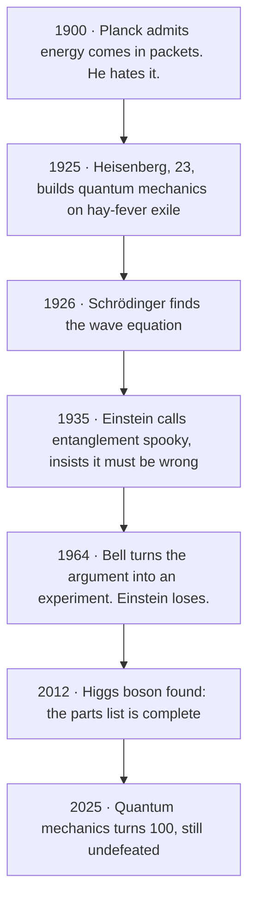
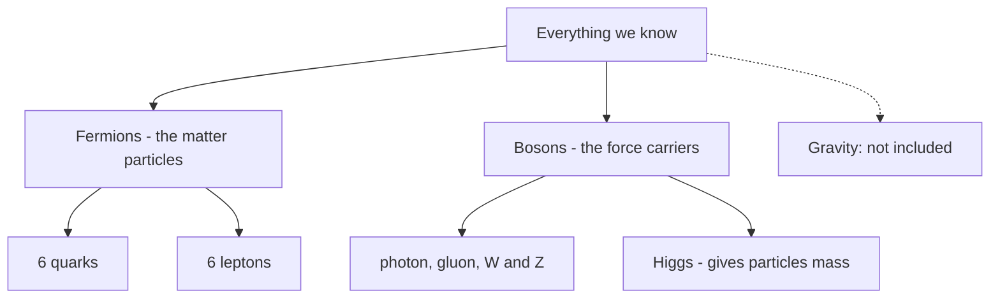
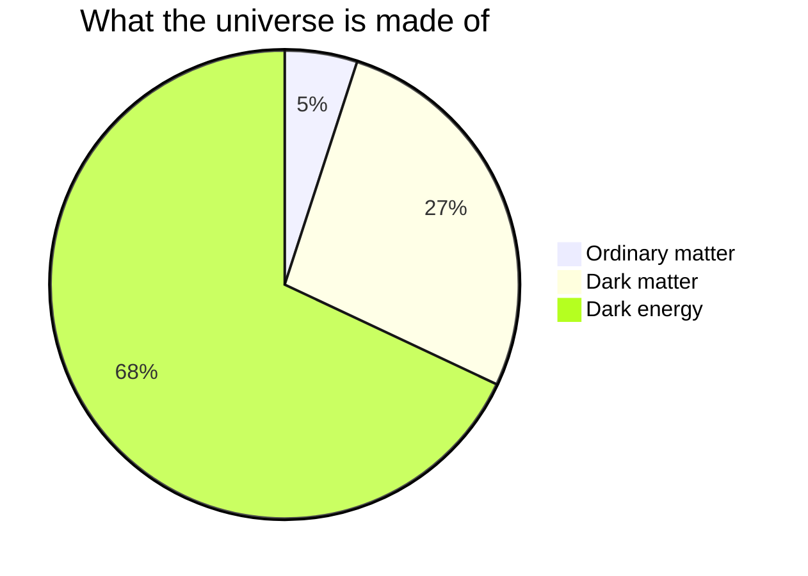

*A hundred years ago a 23-year-old with terrible hay fever invented the strangest theory in science. It has never once been wrong, it built the device you are reading this on, and physicists still argue about what it means.*

In June 1925, Werner Heisenberg's allergies got so bad he fled to Helgoland, a bare rock in the North Sea with almost no pollen. Two weeks later he came back with quantum mechanics. He was 23. He later said that on the island, staring at the math at three in the morning, he felt he was "looking through the surface of atomic phenomena into a strangely beautiful interior," and became almost dizzy.

He was right to be dizzy. A century on, the theory he started has passed every test we have ever thrown at it, some to eleven decimal places. It also still refuses to tell us what it is actually saying about reality. This post is the full tour: the ideas, the complete parts list of the universe, the gadgets in your pocket that secretly run on the weirdness, and the mysteries that are still wide open.

```mermaid
flowchart TD
    A["1900 · Planck admits energy comes in packets. He hates it."] --> B["1925 · Heisenberg, 23, builds quantum mechanics on hay-fever exile"]
    B --> C["1926 · Schrödinger finds the wave equation"]
    C --> D["1935 · Einstein calls entanglement spooky, insists it must be wrong"]
    D --> E["1964 · Bell turns the argument into an experiment. Einstein loses."]
    E --> F["2012 · Higgs boson found: the parts list is complete"]
    F --> G["2025 · Quantum mechanics turns 100, still undefeated"]
```

## Superposition: the chord, not the note

A quantum object does not have to make up its mind. Before you measure it, it holds several possibilities at once, each with its own weight. The best everyday analogy is a chord: press three piano keys and the air carries all three notes at the same time, as one sound.

<QubitCollapse />

**Where the analogy breaks:** you can hear every note in a chord. A measurement never gives you the chord. It returns exactly one note, at random, with odds set by the weights, and it does this every single time. Worse, quantum possibilities can interfere and *cancel*, which no mixture of ordinary things can do. Two ways of happening can add up to not happening at all.

The full list of weights is called the **wavefunction**, and it is best understood as the universe's probability bookkeeping. One famous equation says how the bookkeeping flows:

$$i\hbar\,\frac{\partial}{\partial t}\,\Psi \;=\; \hat{H}\,\Psi$$

That is the Schrödinger equation. Read it as a sentence: "the possibilities change from moment to moment according to the system's energy." Notice what is missing: dice. The equation is perfectly deterministic. Randomness only shows up when you look. Why looking is special is, no exaggeration, still an open question, and we will get to it.

## The double slit: reality checks whether you're looking

Here is the experiment Feynman said contains the *only* mystery. Fire particles one at a time at a wall with two openings and record where each lands. Each particle arrives as a single dot, like a tiny bullet. But let the dots pile up and they organize into stripes: the unmistakable signature of a wave that went through both openings at once and interfered with itself.

So which slit did the particle really use? Try to find out, and the universe calls your bluff.

<DoubleSlit />

| What you see                  | What it means                                                                     |
| ----------------------------- | --------------------------------------------------------------------------------- |
| Dots arrive one at a time     | Each particle is detected whole, at one point                                      |
| Stripes emerge from many dots | Each particle travelled as a wave, through both slits, and interfered with itself  |
| Detector on: stripes vanish   | Recording the path makes "which slit" a fact, and facts do not interfere           |

**Where the analogy breaks:** this is not a water wave made of stuff. It is a wave of probability. Nothing splashes. Each particle still lands whole, in one spot; only the *odds* of where it lands behave like a wave.

## What quantum words don't mean

Quantum mechanics suffers more from its vocabulary than from its math. Four corrections worth pinning to the wall:

| Term                  | What people think                              | What it actually is                                                                                                   |
| --------------------- | ---------------------------------------------- | --------------------------------------------------------------------------------------------------------------------- |
| Uncertainty principle | Our instruments are too clumsy                 | A hard limit built into nature: the sharper a particle's position, the blurrier its momentum, with any equipment, ever |
| Spin                  | The particle rotates like a tiny top           | An intrinsic label, like charge. Nothing is rotating                                                                   |
| "Observation"         | A conscious mind has to watch                  | Any interaction that records the outcome. A stray photon counts; no eyes required                                      |
| Collapse              | The particle secretly knew its state all along | Before measurement there was no hidden answer. Bell's theorem rules that out (see below)                               |

"Spin" is the most misleading word in that table, and also the most fun to fix. Electrons carry real, measurable angular momentum, the same quantity a gyroscope has, and physicists genuinely draw it as an arrow that wobbles (the technical word is *precesses*) around magnetic fields. What electrons do not have is a surface, so there is nothing that can be turning. And then it gets properly strange: rotate a spin-½ state by a full 360° and it comes back subtly wrong, its sign flipped. You need 720°, two complete turns, to get it truly back. Nothing in your kitchen behaves like this. Watch:

<SpinAnimation />

That precessing arrow is not just a cartoon, by the way. Hospitals photograph the inside of your body by flipping exactly those arrows in your hydrogen atoms and listening to them wobble back. The machine is called an MRI.

## Tunneling: how to be on the other side of a wall you can't climb

Because a particle is a smeared cloud of probability rather than a point, the cloud does not stop dead at a barrier. A faint tail of it leaks *into* the wall, and if the wall is thin enough, out the other side. Which means the particle has a small but real chance of simply being past an obstacle it absolutely does not have the energy to cross. No hole is made. It does not "break through." It is just, occasionally, over there.

This sounds like a party trick. It is why you exist:

| Where it happens     | What sneaks through                        | What you get                                                              |
| -------------------- | ------------------------------------------ | ------------------------------------------------------------------------- |
| The Sun's core       | Protons, through their electric repulsion  | Sunshine. Classically, the Sun is not hot enough to fuse at all           |
| Your USB drive       | Electrons, through an insulating layer     | Saved files. Flash memory is written by deliberate tunneling               |
| A chip-sized circuit | Billions of paired electrons, all together | The 2025 Nobel Prize: quantum tunneling scaled up to an object you can hold |
| DNA (maybe)          | Protons, hopping within base pairs         | A suspected source of spontaneous mutations. Still being argued about      |

The Sun one deserves a second of awe. Two protons repel each other ferociously, and the Sun's core, at fifteen million degrees, is still far too cold to slam them together. Every photon of sunlight exists because protons cheat: they tunnel through a barrier they cannot climb, about 10³⁸ times per second.

## Entanglement: the coins that always agree

Prepare two particles together in the right way, then ship them to labs on opposite sides of the galaxy. Measure them, and the results stay perfectly correlated: like two coins that always land the same way, no matter how far apart they are flipped. Einstein hated this, called it "spooky action at a distance," and spent years insisting there had to be a trick.

<EntangledPair />

**Where the analogy breaks, twice:**

1. **It is not a walkie-talkie.** Each lab alone sees pure noise, a fair coin. The perfect agreement is only visible when the two labs compare notebooks afterward, over an ordinary, slower-than-light channel. Entanglement has never sent a message and never will.
2. **It is not a pair of pre-matched socks.** "The coins were stamped identically at the factory" feels like the obvious trick, and it was Einstein's. In 1964 John Bell proved that any factory-stamping story makes statistical predictions that quantum mechanics violates, and every experiment since (the 2022 Nobel went to the definitive ones) sides with quantum mechanics. The correlation is real and has no classical explanation. Einstein was wrong, in the most interesting way anyone has ever been wrong.

## Why you never catch a chair being in two places

Fair question: if atoms can be in superpositions and chairs are made of atoms, where are the two-places-at-once chairs?

The answer is that the chair is being watched, relentlessly, and not by you. Remember the table above: an "observation" is any interaction that records which-path information. Every air molecule that bounces off the chair, every photon of lamplight, carries away a tiny record of exactly where the chair is. Trillions of these micro-measurements happen every nanosecond. Any budding superposition is exposed almost before it starts. Physicists call the process **decoherence**, and its speed scales brutally with size: an electron can stay quantum for ages, a dust grain for a trifling fraction of a second, a chair for effectively no time at all.

This is also why quantum computers are kept in vacuum chambers colder than deep space: not to make them quantum, but to keep the universe from peeking.

## The Standard Model: the universe's complete parts list

Zoom in far enough and everything you have ever touched, eaten, or been is built from **17 kinds of particle**. That is the entire inventory. The catalog is called the Standard Model, and it splits cleanly in two: matter particles (**fermions**) and force carriers (**bosons**).

```mermaid
flowchart TD
    U["Everything we know"] --> F["Fermions - the matter particles"]
    U --> B["Bosons - the force carriers"]
    F --> Q["6 quarks"]
    F --> L["6 leptons"]
    B --> G["photon, gluon, W and Z"]
    B --> HB["Higgs - gives particles mass"]
    U -.-> X["Gravity: not included"]
```

The fermions come in three "generations," each a heavier photocopy of the last. Everything you are made of uses only the first column:

|                     | Generation 1      | Generation 2   | Generation 3  |
| ------------------- | ----------------- | -------------- | ------------- |
| **Quarks**          | up, down          | charm, strange | top, bottom   |
| **Charged leptons** | electron          | muon           | tau           |
| **Neutrinos**       | electron neutrino | muon neutrino  | tau neutrino  |

A proton is two ups and a down. A neutron is two downs and an up. Add electrons and you have the whole periodic table, every element, every molecule, you. Generations 2 and 3 are made routinely in colliders and cosmic-ray showers and decay almost instantly. Nobody knows why nature ordered three of everything. When the muon was discovered, physicist I. I. Rabi's entire review was: "Who ordered that?" Seventy years later, still no answer.

Some inventory items worth knowing personally:

- **The top quark** weighs about as much as an entire gold atom, 173 protons' worth of heft in a single supposedly fundamental particle. It survives for 5×10⁻²⁵ seconds.
- **Neutrinos** barely interact with anything. Around a hundred trillion of them, mostly from the Sun, will pass through your body while you read this sentence. In your entire life, roughly one will actually hit you.
- **Fermions are antisocial**, and it matters: no two can share the same quantum state (the Pauli exclusion principle). That refusal is why atoms have electron shells, why chemistry exists, and why your hand does not pass through the table. Solidity is not atoms touching. It is electrons declining to share.

The forces are what the bosons carry:

| Force           | Carrier        | Relative strength | Range         | Where you feel it                              |
| --------------- | -------------- | ----------------- | ------------- | ---------------------------------------------- |
| Strong          | gluon          | 1                 | inside nuclei | holds protons, neutrons, and nuclei together   |
| Electromagnetic | photon         | ~1/137            | infinite      | light, chemistry, electronics, all of touch    |
| Weak            | W and Z bosons | ~10⁻⁶             | sub-nuclear   | radioactive decay, the fusion powering the Sun |
| Gravity         | none found     | ~10⁻³⁸            | infinite      | falling. Not part of the Standard Model        |

**Where the analogy breaks:** the Standard Model gets called the periodic table of physics, but its entries are not tiny balls. Each particle is a ripple in a field that fills all of space. Every electron in the universe is a ripple in the *same* electron field, which is why they are all perfectly identical: same product, same factory.

And the 17th particle, the **Higgs boson**, is the odd one out: it carries no force. Its field fills space like a crowd fills a room, and particles get mass from how much the crowd tugs at them as they cross. A celebrity (the top quark) gets mobbed and can barely move: that is what "heavy" means. A nobody (the photon) strolls through untouched and stays massless. **Where this breaks:** the Higgs only prices the fundamental particles. About 99% of *your* mass is not Higgs at all. It is the raw energy of the strong force thrashing around inside your protons and neutrons, wearing mass as a disguise, courtesy of the second famous equation:

$$E = mc^2$$

Mass is concentrated energy. Run it backwards and you get the business model of every particle collider: slam things together hard enough and brand-new, heavier particles condense out of the crash. That is literally how the LHC manufactured Higgs bosons from protons 130 times lighter than a Higgs.

## The quantum stuff you already own

None of this is exotic. You bought most of it years ago:

| In your...              | The quantum physics inside                                                        |
| ----------------------- | --------------------------------------------------------------------------------- |
| Phone and laptop chips  | Electrons confined to allowed energy bands: the on/off of a transistor is quantum bookkeeping |
| Laser pointer, barcode scanner | Stimulated emission: atoms persuaded to release identical photons in lockstep |
| LED bulbs               | Electrons dropping between energy levels, paying out exactly one photon per hop    |
| USB drives and SSDs     | Tunneling, on purpose, billions of times a day                                     |
| Hospital MRI            | The precessing spin arrows from the animation, flipped by radio waves in your body's hydrogen |
| GPS                     | Atomic clocks counting 9,192,631,770 quantum oscillations of cesium per second     |
| Hard drive read heads   | Giant magnetoresistance, a spin effect (Nobel Prize 2007)                          |

An old estimate says a third of the world economy now depends on devices that would not work without quantum mechanics. The weirdness pays rent.

## What physics still cannot explain

Time for humility. The Standard Model is the most precisely tested theory in the history of science, and it describes about 5% of the universe.

```mermaid
pie
    title What the universe is made of
    "Ordinary matter" : 5
    "Dark matter" : 27
    "Dark energy" : 68
```

| Problem             | What we know                                                                 | Leading ideas                                                | Status                                                            |
| ------------------- | ---------------------------------------------------------------------------- | ------------------------------------------------------------ | ----------------------------------------------------------------- |
| Dark matter         | Galaxies spin too fast for their visible mass; something unseen adds gravity | Undiscovered particles (axions, WIMPs), or modified gravity  | Decades of underground detectors, no direct catch yet              |
| Dark energy         | The universe's expansion is speeding up                                      | An energy of empty space itself                              | DESI's 15-million-galaxy map hints it may be *weakening* over time |
| Missing antimatter  | The Big Bang should have minted matter and antimatter 50/50, then annihilated both | A small bias in the laws (CP violation), so far far too small | Why anything exists is, technically, unexplained                   |
| Quantum gravity     | Quantum theory and general relativity both work flawlessly, and refuse to combine | String theory, loop quantum gravity                          | No experimental test of either. A century of trying                |
| Measurement problem | The math never says when "collapse" actually happens, or why                 | Copenhagen, many-worlds, other interpretations               | The 2025 centennial conference argued about it. Still.             |

A note on "dark," because the word undersells it: dark matter does not merely fail to glow. It ignores light *completely*, passing through it, and through itself, and through you. Whatever it is, several of these particles-or-something are probably drifting through your room right now, which is either unsettling or great company, depending on your mood.

## The recent scoreboard

The second quantum century opened with a hot streak:

| Result                                                        | Who and where                          | Why it matters                                                                                                     |
| ------------------------------------------------------------- | -------------------------------------- | ------------------------------------------------------------------------------------------------------------------ |
| Nobel Prize 2025: quantum tunneling in a circuit you can hold | Clarke, Devoret, Martinis              | Quantum rules survive at chip scale; the founding trick behind superconducting qubits                               |
| First coherent spin spectroscopy of a single antiproton       | BASE collaboration, CERN               | A 16× sharper test of matter-antimatter symmetry (see "missing antimatter," above)                                  |
| Muon g-2 mystery resolved                                     | Fermilab plus new lattice calculations | The theory prediction moved, the "anomaly" evaporated, and the Standard Model now matches experiment to remarkable precision |
| First one-dimensional anyons observed                         | Cold-atom labs                         | A third family of particle behavior beyond fermions and bosons                                                      |
| Superfluid molecular hydrogen                                 | Cluster experiments                    | Frictionless quantum flow, now seen in a molecule                                                                   |
| A protein qubit grown inside living cells                     | Quantum biosensing teams               | Quantum sensors assembled by biology itself                                                                         |

Notice the pattern: almost every entry is the weirdness becoming *machinery*. Superposition, tunneling, entanglement, and spin spent their first century as philosophical scandals. They are spending their second as components: in qubits, in clocks, in sensors threaded into living cells.

A hundred years ago, the question was whether nature could really work like this. That one is settled; the experiments have been merciless. The question Heisenberg left on that island is still open, though, and it is a good one to end on: between one measurement and the next, what exactly is the universe keeping in its books?

Nobody knows. Century two should be fun.
