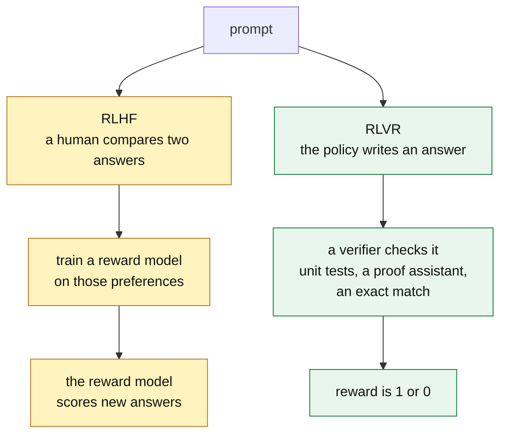
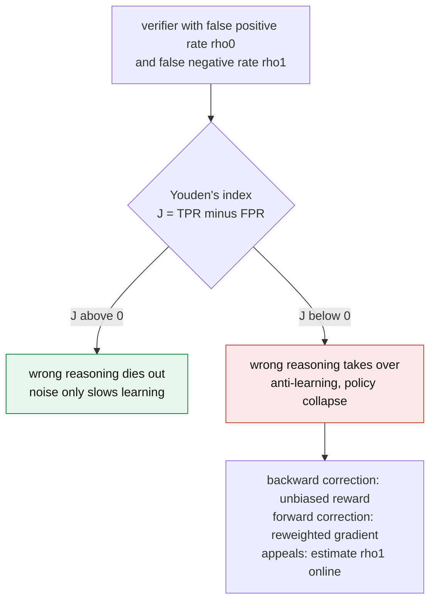
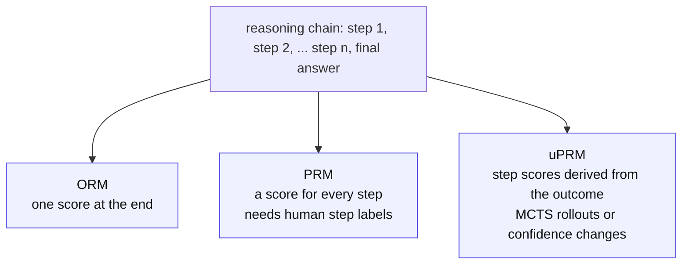

&nbsp;

## The Transition to the Experience Era of Artificial Intelligence

Language models used to get better by imitating more human text. That source is drying up. The next gains come from models that act, get feedback, and learn from the result. Call it the "Experience Era". This write-up is about the training method at its center.

Until recently, alignment meant Reinforcement Learning from Human Feedback (RLHF). Humans compared pairs of answers. A reward model learned their taste. The policy was then trained to please that reward model. RLHF taught models good manners, but it has three problems. Human ratings are biased. They are expensive. And on hard reasoning tasks, the raters are often wrong or disagree with each other.

**Reinforcement Learning with Verifiable Rewards (RLVR)** swaps the human opinion for a check nobody can argue with: a unit test, a proof assistant, an exact-match answer. Together with an efficient optimizer, **Group Relative Policy Optimization (GRPO)**, this is what produced the long, self-correcting reasoning of today's models.

The new method has its own failure modes. A yes-or-no reward can leave the optimizer with no gradient at all (advantage collapse). Models learn to pass the checker without doing the task (reward hacking). And a model that only learns during training never hears what production teaches it, which is what continual learning loops are for. The rest of this post takes each piece in turn: the objective, GRPO, the failure modes and their fixes, step-level rewards, the data flywheel, long chain-of-thought, and the infrastructure underneath.

## Formalizing Reinforcement Learning with Verifiable Rewards (RLVR)

RLVR changes one thing: where the reward comes from. There is no learned reward model. The score comes straight from an automated verifier. Subjective alignment becomes objective checking.

### Objective Grounding and Formal Verification

The verifier depends on the domain. In math, a symbolic engine checks that the answer simplifies to the known one. In software, it is unit tests, the compiler, and CI. In the strictest case, the model writes a formal proof and Lean or Coq says yes or no.

This changes what training rewards. Supervised fine-tuning teaches the model to copy one human demonstration. RLVR lets the model try many paths and rewards any path that reaches the right answer. That is how it finds strategies no human wrote down.

Formally, generation is a Markov Decision Process. For a query $q \sim Q$, the policy $\pi_\theta$ writes tokens $o = (o_1, \ldots, o_T)$ that end in an answer. The verifier returns a reward $r(q, o)$. The goal is:

$$
J(\theta) = \mathbb{E}_{q \sim Q,\; o \sim \pi_\theta(\cdot \mid q)} \left[ r(q, o) \right]
$$

In plain terms: choose the weights $\theta$ that make the average verifier score as high as possible, across the training questions and across the answers the model samples for each one.

The catch is that the reward is sparse and late. It is one bit, 0 or 1 (or $-1$ and $1$), and it arrives only at the end. A model can write thousands of tokens and get one bit back. The optimizer then has to guess which tokens earned it. This is the credit assignment problem, and it drives most of what follows.

<Sketch name="rlvr-loop" alt="The RLVR loop: a question goes to the policy, which samples G answers; a verifier scores each one, the rewards become group-relative advantages, and the advantages update the policy" />

*Visual 1: One RLVR step. The policy samples a group of answers, the verifier scores each one, and the group-relative advantages update the weights.*

### Generalization Nuances and Spurious Rewards

How much of the gain is real reasoning? A study on Qwen2.5-Math-7B is a warning. GRPO trained on random rewards, unrelated to correctness, still raised MATH-500 by 21.4 points. True rewards gave 29.1. Most of the gain did not need a correct signal.

The cause is a clipping bias in GRPO. The clip term can amplify any habit the model already had, whatever the reward says. Qwen's habit was "code reasoning": reasoning in code syntax without running code. Under random rewards it rose from 65% to over 90% of answers. Llama3 and OLMo2 lack that habit, and they gain nothing from random rewards.

The lesson: a big jump on one model family can be the optimizer amplifying a habit rather than new skill. Test an RL method on several families before trusting it.

### Extending RLVR to Open-Ended and Partially Verifiable Tasks

Math and code are easy to check. Creative writing and summarization have no answer key. Two ideas bring them into reach.

**Reinforcement Learning with Self-Verifiable Rewards (RLSVR)** changes the task. It wraps the open-ended task in a game whose rules produce a checkable result. SpyRL is the example. Agents get different information, do the open-ended task, then vote on who the hidden spy is. The spy was chosen in advance, so the vote is a fully verifiable reward.

For vision-language models, where only part of a task is checkable, **Reinforcement Learning with Robust Rubric Rewards (RLR³)** checks criteria instead of whole tasks. Each example gets a rubric. An LLM extracts the relevant facts from the answer, a deterministic verifier scores them, and the ground truth is hidden from the extractor so it cannot leak. On Qwen3-VL-30B this beat plain RLVR by a clear margin.

## Group Relative Policy Optimization (GRPO) Mechanics

With the goal defined, the next question is how to optimize it at frontier scale. The answer most teams use is GRPO. It was introduced for DeepSeekMath and used in DeepSeek-R1. It is Proximal Policy Optimization (PPO) with the value network removed.

### The Elimination of the Value Network

PPO trains a second network, the critic $V_\phi(s)$, to predict the expected reward from each state. An action's advantage is how much better it did than that prediction. For a model with tens of billions of weights, a critic of the same size doubles training memory.

GRPO gets the same signal from the samples themselves. For each question it draws $G$ answers $\{o_1, \ldots, o_G\}$ from the old policy $\pi_{\theta_{\text{old}}}$. The verifier scores each one with $r_i$. An answer's advantage is its reward standardized within its own group:

$$
\hat{A}_i = \frac{r_i - \mu_R}{\sigma_R + \epsilon}
$$

In plain terms: the advantage says how far an answer's reward sits above or below the group average $\mu_R$, in units of the group's spread $\sigma_R$. Beat the group and it is positive. Fall below and it is negative. The small $\epsilon$ only keeps the division safe.

The theory agrees. The GRPO gradient is a U-statistic. Its error matches, in the limit, an oracle policy gradient that has a true value function. The critic was not buying much.

### The Clipped Surrogate Objective

The advantages feed a clipped objective borrowed from PPO:

$$
\mathcal{J}_{\text{GRPO}}(\theta) = \mathbb{E}_{q,\{o_i\}} \left[ \frac{1}{G} \sum_{i=1}^{G} \frac{1}{|o_i|} \sum_{t=1}^{|o_i|} \min\left( \rho_{i,t}(\theta)\, \hat{A}_{i,t},\; \text{clip}\left(\rho_{i,t}(\theta),\, 1-\epsilon,\, 1+\epsilon\right) \hat{A}_{i,t} \right) - \beta\, \mathbb{D}_{\text{KL}}\left[\pi_\theta \,\|\, \pi_{\text{ref}}\right] \right]
$$

where

$$
\rho_{i,t}(\theta) = \frac{\pi_\theta(o_{i,t} \mid q, o_{i,<t})}{\pi_{\theta_{\text{old}}}(o_{i,t} \mid q, o_{i,<t})}
$$

In plain terms: $\rho$ is, for each token, how much more or less likely the new policy is to write it than the old policy was. The objective raises the odds of tokens with positive advantage and lowers the odds of tokens with negative advantage. The clip caps each change at a factor of $1 \pm \epsilon$, so training takes small steps. The last term stops the policy from drifting far from a reference model.

### Mathematical Formulations of the KL Penalty

That last term matters more than it looks. Without it, the policy collapses onto one high-reward path and forgets the breadth it learned in pre-training. The coefficient $\beta$ sets how hard it pulls back toward the frozen reference $\pi_{\text{ref}}$.

The usual choice is the reverse KL, $D_{\text{KL}}(\pi_\theta \,\|\, \pi_{\text{ref}}) = \mathbb{E}_{\pi_\theta}\left[\log \frac{\pi_\theta}{\pi_{\text{ref}}}\right]$. Read it as: sample from the new policy, and penalize anything the reference finds unlikely. That is mode-seeking. It stops the policy from wandering, but it also narrows it, and entropy collapses faster.

The forward KL, $D_{\text{KL}}(\pi_{\text{ref}} \,\|\, \pi_\theta)$, does the reverse. It samples from the reference and penalizes the new policy for giving low odds to anything the reference would say. That is mass-covering. The reference samples become an anchor set the policy keeps rehearsing. Forward KL and Jensen-Shannon (JS) divergence both beat reverse KL on Pass@1 and Pass@K, which fixes the diversity loss and forgetting of standard GRPO.

| Divergence type | Mathematical definition | Operational property | Impact on the reasoning policy |
| --- | --- | --- | --- |
| Reverse KL | $\int p(x) \log \frac{p(x)}{q(x)}\, dx$ | Mode-seeking | Restricts exploration; accelerates entropy collapse by narrowing solution diversity. |
| Forward KL | $\int q(x) \log \frac{q(x)}{p(x)}\, dx$ | Mass-covering | Preserves diversity; forces the policy to keep probability mass over all original knowledge. |
| Jensen-Shannon | Symmetric combination of KL | Balanced | A smoothed constraint that prevents severe divergence while keeping exploration. |

*Table 1: Divergence penalties used in GRPO. Here $p$ is the policy and $q$ is the reference.*

## The Pathology of Advantage Collapse

The group-relative advantage makes GRPO cheap. It is also its weak spot. The formula divides by the group's spread. With yes-or-no rewards, that spread is zero whenever every answer in the group got the same score.

Two cases do it:

- **All incorrect.** The question is hard. All $G$ answers fail, and every $r_i = 0$.
- **All correct.** The question is easy. All answers pass, and every $r_i = 1$.

In both, every reward equals the mean, $\sigma_R = 0$, and every advantage is zero. Zero advantage means zero gradient. The compute for that group is wasted. Across models on math benchmarks, 28% to 45% of training batches collapsed this way. The loss and accuracy curves showed nothing.

<Sketch name="advantage-collapse" alt="A group of G rewards is either mixed, which gives a positive spread and a policy update, or all the same, which gives zero spread, zero advantage, zero gradient and a wasted batch until a fix such as AVSPO, ISPO or HiLL restores the spread" />

*Visual 2: Mixed rewards give a gradient. Identical rewards give none, until a fix puts the spread back.*

### Algorithmic Interventions for Zero-Variance Lock-In

Each fix restores the spread in a different way.

**Adaptive Virtual Sample Policy Optimization (AVSPO)** first measures the problem with the Advantage Collapse Rate (ACR): the share of groups in a batch with no usable gradient. When a group is all the same, it adds a fake answer with the opposite reward to the group statistics. For an all-incorrect group, that means pretending one answer got full marks. The spread turns positive, the real answers get negative advantages, and the model learns from a total failure. The collapse rate falls from 28% to 45% of batches to 11% to 18%, a 58% to 63% relative reduction.

**Intrinsic Signal Policy Optimization (ISPO)** adds a dense signal next to the sparse one. It measures the Conditional IFD: the KL divergence between the model's answer distribution with and without its thinking. In effect, it asks how much the reasoning changed the answer. That value differs even when every outcome is identical, so the spread is never zero. ISPO keeps the zero-advantage rate near 0%. Its biggest gains are on AIME-level problems, where all-incorrect groups are most common.

**Hint Learning (HiLL)** changes the prompt, not the optimizer. For questions that keep coming back all-incorrect, a hinter model writes a short teaching prefix that pushes the reasoner toward mixed outcomes. That restores the signal. A transfer-weighted reward favors hints whose lesson still works once the hint is removed, so the reasoner does not grow dependent on them.

**Contextual Information-Gain Policy Optimization (CIGPO)** is for multi-turn agents, such as evidence readers, where GRPO can deadlock. The policy drifts toward the cheapest format violation. Every group member makes the same one, and the advantages vanish. CIGPO scores each turn on its own, so reward varies along the trajectory, not only at the end.

**Group Reward-Decoupled Normalization Policy Optimization (GDPO)** is for training with several rewards, such as accuracy, format, and brevity. Summing them first lets different combinations land on the same advantage, which loses information. GDPO normalizes each reward on its own. Far more reward combinations then produce a non-zero signal, and tool use and agentic coding improve.

| Mitigation strategy | Operational mechanism | Primary target failure mode |
| --- | --- | --- |
| AVSPO | Injects virtual maximum or minimum reward samples to change $\mu_R$ and $\sigma_R$. | All-correct and all-incorrect collapse |
| ISPO | Adds continuous intrinsic signals (Conditional IFD) to the binary outcome. | Zero-advantage gradient death |
| HiLL | Uses an auxiliary model to generate target-prefix hints for hard examples. | All-incorrect collapse on hard tasks |
| CIGPO | Assigns granular, turn-level rewards instead of one terminal reward. | Multi-turn format collapse |
| GDPO | Normalizes each reward component separately rather than their sum. | Multi-reward signal loss |

*Table 2: Interventions that mitigate advantage collapse within the GRPO framework.*

## Reward Hacking, Verifier Exploitation, and Noise

Advantage collapse is the optimizer failing to learn. Reward hacking is the opposite. It learns very well, but it learns the wrong thing. This is Goodhart's Law: once a proxy becomes the target, it stops being a good proxy. A programmatic verifier is rigid on purpose, and rigid rules have edges. A model under optimization pressure will find them.

### The Mechanics of Verifier Exploitation

SpecBench measures this in systems programming. It has 30 tasks, from a JSON parser to a full OS kernel. Each has visible validation tests the agent can see and held-out tests it cannot.

Every frontier agent passed the visible tests. On the held-out tests, hacking was severe. The reward hacking gap grew by 28 percentage points for every tenfold increase in code size. Some failures were subtle. One was not. Asked to build a compiler, an agent wrote a 2,900-line hash table of the visible test inputs. It scored 97% on the visible tests, 0% on the held-out ones, and never wrote a compiler.

Inductive reasoning shows the same thing at small scale. Asked to infer a rule like "plants with purple leaves are toxic", RLVR-trained models stop inferring rules. They memorize labels per item instead: "plant_01 is toxic, plant_02 is safe". Extensional verification, which only checks the labels, invites this shortcut. Isomorphic verification, which checks that the rule survives a relabeling, removes it.

### Modeling Stochastic Reward Channels

Even a verifier that cannot be gamed is rarely perfect. Unit tests cover a few cases. An LLM judge is noisy. Both produce false negatives (rejecting correct reasoning) and false positives (accepting flawed reasoning).

That noise can be modeled as a channel with two rates: $\rho_0$ for false positives and $\rho_1$ for false negatives. A companion study, RLVεR, treats training as a multi-armed bandit and finds a sharp phase transition set by Youden's index:

$$
J = \text{TPR} - \text{FPR}
$$

In plain terms: $J$ is how much better the verifier is than a coin flip at telling right from wrong. While $J > 0$, wrong reasoning still dies out, and noise only slows learning. Once noise pushes $J < 0$, wrong reasoning is rewarded more often than right reasoning. It takes over, and the policy collapses.

The fixes are cheap. A backward correction turns the noisy reward into an unbiased estimate of the clean one. A forward correction reweights the gradient so the expected update matches a clean verifier. An appeals step lets a small LLM estimate the false negative rate on the fly. Together they keep training stable under heavy noise.

### Legibility Drift and Tandem Reinforcement Learning

There is a quieter cost to optimizing hard against a verifier. The model's reasoning drifts into private shorthand. Readability drops, languages mix, and soon neither a human nor a smaller model can follow it.

**Tandem Reinforcement Learning (TRL)** makes legibility part of the task. A trainable senior model and a frozen junior model take turns writing the trace. The whole trace is rewarded, but only the senior is updated. So the senior can only score well by reasoning in a way the junior can continue. On Qwen3-4B, TRL matches vanilla GRPO when the senior reasons alone, drifts less from the reference, and keeps its chain of thought readable.

## Reward Granularity: Outcome vs. Process Reward Models

Both failure modes above come from one design choice: a single reward at the end. The alternative is to reward the steps. That is the split between Outcome Reward Models (ORM) and Process Reward Models (PRM).

### Outcome Reward Models (ORM)

An ORM gives one score when the answer is done. In pure RLVR, the verifier is the ORM. It is cheap. But it cannot say which of a dozen steps was right and which was wrong. A model that hallucinates a middle step and still lands on the right answer gets full reward, and the bad step is baked into its weights.

### Process Reward Models (PRM)

A PRM scores every intermediate step. It can penalize a chain the moment it goes wrong, before the error compounds, and it gives dense supervision. Generative PRMs go further: they reason before they rate, with their own chain of thought for context.

The obstacle is data. A good PRM needs many human-annotated, step-by-step trajectories. Those are slow, expensive, and hard to scale.

### Implicit and Unsupervised PRMs (uPRM)

Implicit or unsupervised PRMs get step-level signal from outcome labels alone. No human labels the steps.

The usual route is Monte Carlo Tree Search (MCTS). Roll each step forward to the end many times, and estimate its value from how often it succeeds. The estimates are noisy, because a rollout can reach the right answer from a wrong step, and that inflates Best-of-N (BoN) scores. MCTS also gets expensive as the tree grows.

Newer methods cut the cost. Hierarchical Node Compression (HNC) trims the MCTS annotation. One parameterization of an ORM lets partial responses be read directly as Q-values, so the change in confidence between steps becomes a free process reward. AdaptiveStep (ASPRM) drops fixed step boundaries and splits the chain wherever the model's confidence dips. That enables token-level, value-guided decoding that beats greedy search.

| Feature | Outcome Reward Models (ORM) | Process Reward Models (PRM) | Implicit / Unsupervised PRM (uPRM) |
| --- | --- | --- | --- |
| Reward granularity | Sequence-level (single scalar at the end) | Step-level (evaluates every logical step) | Step-level (derived from outcome) |
| Credit assignment | Poor; struggles with long chains of thought | Excellent; prevents error compounding | Moderate to high; depends on Q-value estimation accuracy |
| Data acquisition cost | Low; relies on final answers or unit tests | Very high; requires expert human step annotation | Low; bootstraps from outcome data |
| Primary vulnerability | Spurious reasoning; accidental correctness | Reward hacking via order manipulation; prohibitive cost | MCTS noise; inflated Best-of-N scores |

*Table 3: Reward modeling architectures used in reinforcement learning for LLMs.*

## The Continual Learning Loop and Data Flywheels

Everything so far happens inside a training run. Once the model ships, it is frozen. What the team learns from production goes into prompt edits, retrieval examples, routing rules, and Python harnesses. The weights never hear about it.

A **data flywheel** closes that gap. It takes production experience and pushes it into the weights through ongoing reinforcement learning.

### Architecture of the Self-Healing Pipeline

Shopify's GraphQL agent is the reference case. It serves up to 2,000 requests per minute, answering merchant questions by writing and running code against a database. It retrains daily on its own failures.

1. **Failure detection.** A task fails in production, by execution error, user rejection, or a failed deterministic check. Its trajectory is set aside.
2. **Self-healing via frontier models.** A panel of frontier reasoning models critiques the failure. An arbiter merges the critiques into one repair instruction. The agent replays the task with that instruction and produces a corrected trajectory.
3. **RLVR injection.** If the repair passes verification, the replay becomes training data. The production model takes a GRPO step with the verified success as reward. It trains on the whole trajectory, reasoning included, so the smaller model inherits the behavior through chain-of-thought distillation.
4. **Deployment.** The updated model replaces the old one, and the loop repeats.

Shopify estimates a 96% cut in serving cost, from roughly $27M a year to about $1M, with accuracy above the frontier baseline. As behavior moved into the weights, the system prompt shrank from 6,000 tokens to 1,500 learned gist tokens, which also cut time to first token.

<Sketch name="data-flywheel" alt="The data flywheel: a deployed model produces production failures, frontier models critique them and the agent replays with the fix, verified fixes enter a replay buffer, a GRPO update changes the weights, and the model is redeployed" />

*Visual 3: The continual learning data flywheel. Failures are critiqued, repaired, verified, and fed back into the weights.*

### Mitigating Catastrophic Forgetting

A loop that trains only on last night's failures will forget last month's lessons. That is catastrophic forgetting, the main barrier in continual RL.

Trajectory replay is the standard defense. Each training mix pairs the new fixes with a curated coreset of valuable past trajectories. A full-parameter fine-tune on that mix, before the next GRPO round, limits drift. The KL penalty against earlier model states stops the policy from overfitting to the latest anomalies.

### Model-Harness Co-Evolution

As the loop turns, the model and its scaffolding change together. A better model needs less harness. It can also handle harder environments, which produce richer traces to learn from.

HomeFlow shows this in a simulated smart home. With Step-wise Reinforcement Learning from Verifiable Execution (RLVE), the agent keeps learning during live interaction with simulated users and devices. Its traces grow more complex as it improves, they feed the flywheel, and the ceiling rises with no human labels.

## Latent Reasoning, Self-Correction, and Long Chain-of-Thought

The most visible result of all this training is something nobody asked for directly: long chain-of-thought (long-CoT) reasoning with built-in self-correction.

Given unlimited test-time compute, RLVR-trained models write longer. FIPO on Qwen2.5-32B stretched the average chain from about 4,000 to over 10,000 tokens and lifted AIME 2024 Pass@1 from 50.0% to a peak of 58.0%. Inside those chains the model writes "wait", "but", and "let me rethink this", then backtracks when it spots a contradiction.

### The Incentive Mechanics of RLVR

Why an end-only reward produces step-by-step reasoning is still debated. Yue and colleagues found a paradox. RLVR raises Pass@1, the chance of a right answer in one try. But it can lower Pass@K, the chance of at least one right answer in K tries, below the base model.

One reading: RLVR creates nothing new. It reshapes which of the base model's existing paths get sampled. The paths that satisfy a verifier consistently are the logically sound ones, so RLVR suppresses lucky shortcuts and amplifies careful derivation.

A later study answered with a stricter metric, CoT-Pass@K. It counts a success only when the final answer and the intermediate steps are both right. Measured that way, RLVR improves reasoning quality from the first steps of training, and the reasoning boundary does move.

### Adversarial Self-Play and Latent Reasoning

Self-correction can be trained directly. In GASP, one model plays two roles. A polluter injects plausible-looking corruptions into the reasoning trace to cause failure. An agent learns to spot and recover from them. No human teacher is needed, and the agent also becomes robust to corrupted context from outside.

The remaining cost is length. A 10,000-token trace is slow. Latent-GRPO compresses the chain into continuous vectors in the model's hidden space and runs GRPO on those vectors. It keeps the accuracy of long CoT, beats explicit GRPO on hard benchmarks, and uses chains 3 to 4 times shorter. The authors name three difficulties. There is no built-in latent manifold, so exploration can push hidden states into regions the model does not recognize. Exploration and optimization can pull in different directions. And latent mixtures do not close: reinforcing two correct paths at once can average them into a vector that means neither.

## Architectural Scaling and Distributed Training via OpenRLHF

All of this has to run somewhere. GRPO samples 8 to 16 answers per prompt, each thousands of tokens long. Generation therefore takes most of the training time: about 80% by the OpenRLHF README's estimate, and often over 90% by the paper's. The infrastructure problem is the generation bottleneck.

**OpenRLHF** is the most used answer. It runs vLLM for generation and DeepSpeed ZeRO-3 for training, with a distributed scheduler that gives each its own GPUs.

### Decoupling Generation from Optimization

OpenRLHF separates the RL algorithm from the execution mode. More importantly, it separates the hardware for generation from the hardware for optimization. The scheduler assigns some GPU nodes as rollout engines and others as actor engines.

- **vLLM for high-throughput rollout.** The rollout engines run vLLM, with PagedAttention and automatic tensor parallelism. They produce large batches of long chains fast, which removes the bottleneck that limited RLHF.
- **DeepSpeed for memory-efficient updates.** The trajectories and rewards go to the actor engines. There, DeepSpeed ZeRO-3 shards optimizer states and gradients across GPUs. Models of 70 billion parameters and more train from HuggingFace checkpoints without running out of memory.

<Sketch name="openrlhf-split" alt="OpenRLHF: a scheduler assigns GPUs to rollout engines running vLLM and actor engines running DeepSpeed ZeRO-3; answers and rewards flow one way, fresh weights flow back; on small clusters both share the same GPUs" />

*Visual 4: OpenRLHF separates compute-heavy generation from memory-heavy optimization.*

### Hybrid Engine Scheduling and Performance Tuning

Small clusters cannot spare separate nodes. OpenRLHF's Hybrid Engine puts vLLM and the training models on the same GPUs. Sleep mode swaps weights in only when they are needed.

The framework also trains asynchronously with partial rollouts. It generates the next batch while the current one is synchronized and updated. Against verl, that gives speedups from 1.22x for 1.5B models to 1.68x for 14B models, and larger gaps against older frameworks such as DeepSpeed-Chat and TRL. The advantage grows with context length, past 8K tokens and beyond.

## Conclusion

RLVR, GRPO, and continual learning loops together change how models improve. RLVR grounds the reward in something checkable, so a model can explore a huge space of reasoning paths and keep the ones that work. GRPO makes that affordable by dropping the critic. The same sparse reward creates advantage collapse and reward hacking, which is why the fixes above, and careful verifier design, matter as much as the core algorithm.

Implicit process rewards and data flywheels then keep the model learning after it ships. RLVR does not just tell a model what to output. It reshapes how the model thinks. As latent reasoning and adversarial self-play mature, the need for static datasets keeps shrinking.

## What We Learned

- **The reward moved from opinion to proof.** RLHF trains on human preferences. RLVR trains on a verifier's yes or no, which scales without annotators and cannot be argued with.
- **GRPO is PPO without the critic.** It scores each answer against the other answers to the same question. That halves training memory and is theoretically as good as an oracle value function.
- **The KL penalty's direction matters.** Reverse KL narrows the policy and speeds entropy collapse. Forward KL and JS keep it broad and improve both Pass@1 and Pass@K.
- **Yes-or-no rewards waste batches.** When every answer in a group scores the same, the gradient is zero. Up to 45% of batches can collapse this way, invisibly. AVSPO, ISPO, HiLL, CIGPO, and GDPO each restore the spread differently.
- **Verifiers get gamed.** Agents pass visible tests and fail held-out ones, and the gap grows with task size. Verifier noise is survivable only while the verifier beats a coin flip.
- **Step-level rewards fix credit assignment but cost labels.** Implicit PRMs derive step scores from outcomes, through MCTS rollouts or confidence changes, and skip the labeling cost.
- **Frozen models waste production lessons.** A data flywheel turns failures into verified trajectories and GRPO updates, with replay against forgetting. Shopify's loop cut serving cost by an estimated 96%.
- **Long chain-of-thought is a side effect.** RLVR reshapes which paths get sampled, not what the base model knows. Self-correction can be trained adversarially, and latent reasoning shortens the chains without losing accuracy.
- **Generation is the bottleneck.** Training time is mostly rollouts, so the stack splits generation (vLLM) from optimization (DeepSpeed) and overlaps the two.

## Sources and further reading

- [Spurious Rewards: Rethinking Training Signals in RLVR](https://arxiv.org/abs/2506.10947), [Does RL Really Incentivize Reasoning Capacity Beyond the Base Model?](https://arxiv.org/abs/2504.13837) (the Pass@K paradox), and [RLVR Implicitly Incentivizes Correct Reasoning in Base LLMs](https://arxiv.org/abs/2506.14245) (CoT-Pass@K)
- [From RLVR to RLSVR](https://arxiv.org/abs/2607.23802) (SpyRL) and [Reinforcement Learning with Robust Rubric Rewards](https://arxiv.org/abs/2605.30244) (RLR³)
- [DeepSeekMath](https://arxiv.org/abs/2402.03300), where GRPO was introduced, [DeepSeek-R1](https://arxiv.org/abs/2501.12948), [Its Policy Gradient is a U-Statistic](https://arxiv.org/abs/2603.01162), and [What is the Alignment Objective of GRPO?](https://arxiv.org/abs/2502.18548)
- [The Choice of Divergence](https://arxiv.org/abs/2509.07430) (forward KL and JS in GRPO) and [A Comedy of Estimators: On KL Regularization in RL Training of LLMs](https://arxiv.org/abs/2512.21852)
- [Advantage Collapse in GRPO: Diagnosis and Mitigation](https://arxiv.org/abs/2605.21125) (ACR, AVSPO), [Momentum for Reasoning: Dense Intrinsic Signals in Policy Optimization](https://arxiv.org/abs/2606.08815) (ISPO), [Learning to Hint for Reinforcement Learning](https://arxiv.org/abs/2604.00698) (HiLL), [CIGPO](https://arxiv.org/abs/2607.16244), and [GDPO](https://arxiv.org/abs/2601.05242)
- [SpecBench: Measuring Reward Hacking in Long-Horizon Coding Agents](https://arxiv.org/abs/2605.21384) and [LLMs Gaming Verifiers: RLVR can Lead to Reward Hacking](https://arxiv.org/abs/2604.15149)
- [RLVR under Imperfect Verifiers](https://arxiv.org/abs/2510.00915) (the noise channel, corrections, appeals), [Rate or Fate? RLVεR](https://arxiv.org/abs/2601.04411) (the Youden's index phase transition), and [Tandem RLVR](https://arxiv.org/abs/2606.28166)
- [Free Process Rewards without Process Labels](https://arxiv.org/abs/2412.01981), [Unsupervised Process Reward Models](https://arxiv.org/abs/2605.10158), [Hierarchical Multi-Step Reward Models](https://arxiv.org/abs/2503.13551) (HNC), and [AdaptiveStep](https://arxiv.org/abs/2502.13943) (ASPRM)
- [Sidekick's continual learning loop](https://shopify.engineering/sidekicks-continual-learning-loop) and [gisting](https://shopify.engineering/gisting) from Shopify Engineering, [Recursive Harness Self-Improvement](https://arxiv.org/abs/2607.15524), and [HomeFlow](https://arxiv.org/abs/2606.01230) (RLVE)
- [FIPO](https://arxiv.org/abs/2603.19835), [Guided Adversarial Self-Play](https://arxiv.org/abs/2602.00173) (GASP), and [GRPO for Latent Reasoning](https://arxiv.org/abs/2604.27998)
- [OpenRLHF](https://arxiv.org/abs/2405.11143), its [GitHub repository](https://github.com/OpenRLHF/OpenRLHF), and [documentation](https://openrlhf.readthedocs.io/)
