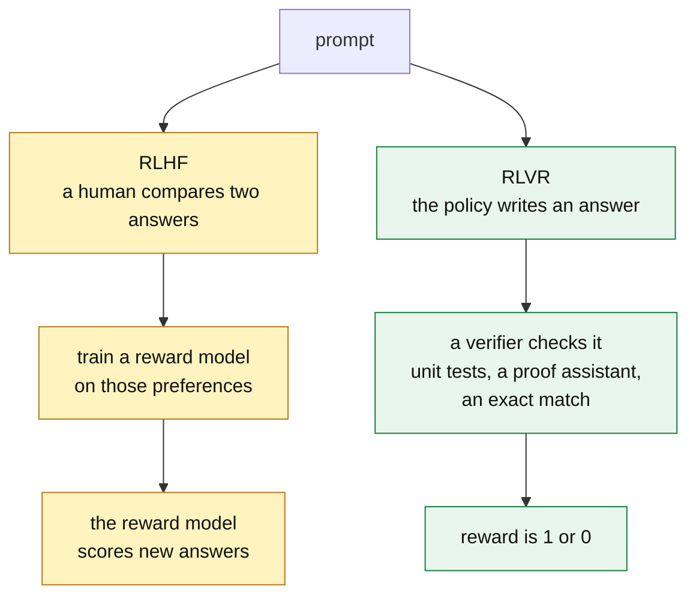
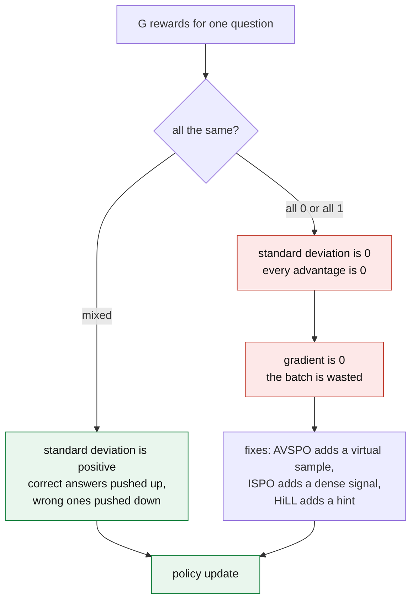
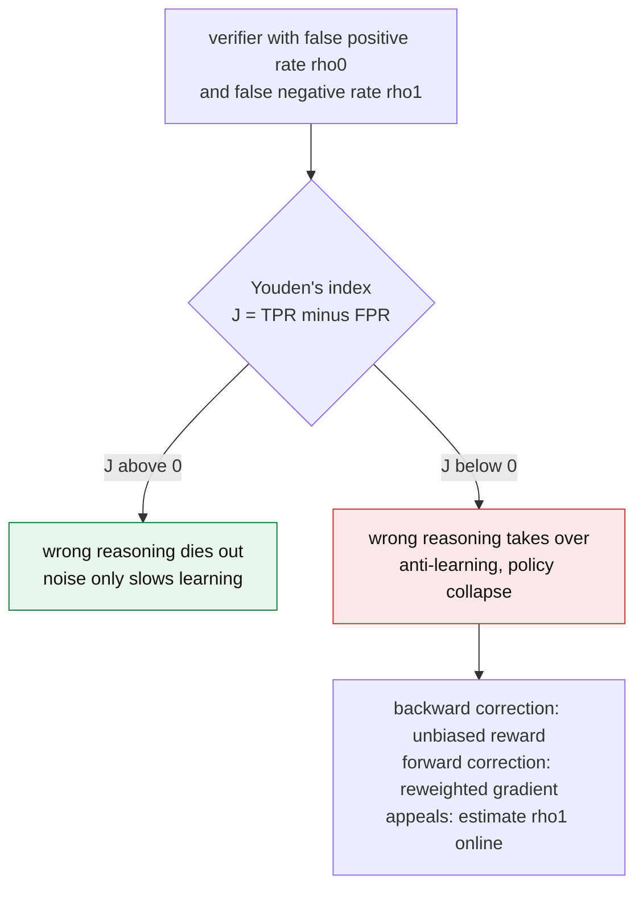
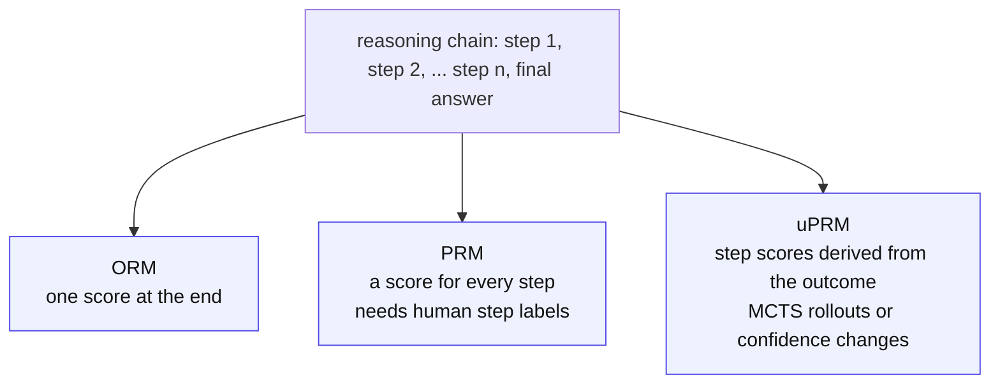

&nbsp;

## The Transition to the Experience Era of Artificial Intelligence

Large language models used to improve by imitating more human-written data. That road is running out. The next gains come from models that act, get feedback from an environment, and learn from what happened. This is the "Experience Era" of AI, and this write-up is about the training method at its center.

For the last few years, aligning a model to human intent meant Reinforcement Learning from Human Feedback (RLHF). Humans compared pairs of answers, a reward model learned their preferences, and the policy was trained to please that reward model. RLHF taught models conversational manners, but it carries subjective bias, costs a lot to annotate, and breaks down on hard reasoning tasks, where the human raters themselves are often wrong or disagree.

**Reinforcement Learning with Verifiable Rewards (RLVR)** replaces the human opinion with a check that cannot be argued with: a unit test, a proof assistant, an exact-match answer. Paired with an efficient optimizer, **Group Relative Policy Optimization (GRPO)**, this is what produced the long, self-correcting reasoning traces in today's reasoning models.

The move brings its own problems. Binary rewards can starve the optimizer of gradient, a failure called advantage collapse. Models find ways to satisfy the verifier without solving the task, which is reward hacking. And a model that only learns during a training run cannot absorb what production teaches it, which is where continual learning loops come in. The sections below take each piece in turn: the objective, GRPO, the failure modes and their fixes, reward granularity, the data flywheel, long chain-of-thought, and the infrastructure that runs it all.

## Formalizing Reinforcement Learning with Verifiable Rewards (RLVR)

RLVR changes one thing in the post-training pipeline: where the reward comes from. Instead of a learned reward model, the scalar reward comes straight from an automated verifier. That swaps subjective alignment for objective checking.

### Objective Grounding and Formal Verification

What counts as a verifier depends on the domain. In math, a symbolic engine checks whether the generated expression simplifies to the known answer. In software, it is unit tests, compiler checks, and the CI pipeline. In the strictest setting, the model writes a formal proof and Lean or Coq says yes or no.

Objective checking changes what training encourages. Supervised fine-tuning teaches the model to copy one human demonstration. RLVR lets the model try many reasoning paths and rewards any path that ends at the right answer, so it can find strategies no demonstrator ever wrote down.

Formally, RLVR treats generation as a Markov Decision Process. For a query $q \sim Q$, the policy $\pi_\theta$ writes a sequence of tokens $o = (o_1, \ldots, o_T)$ that ends in an answer, and the verifier returns a reward $r(q, o)$. The objective is:

$$
J(\theta) = \mathbb{E}_{q \sim Q,\; o \sim \pi_\theta(\cdot \mid q)} \left[ r(q, o) \right]
$$

In plain terms: pick the weights $\theta$ that make the average verifier score as high as possible, averaged over the questions in the training set and over the answers the model samples for each one.

The catch is that the reward is sparse and delayed. It is a single 0 or 1 (or $-1$ and $1$) that arrives only at the end of the trajectory. A model may write thousands of tokens and get one bit back, and the optimizer has to work out which of those tokens earned it. This credit assignment problem drives most of what follows.

<Sketch name="rlvr-loop" alt="The RLVR loop: a question goes to the policy, which samples G answers; a verifier scores each one, the rewards become group-relative advantages, and the advantages update the policy" />

*Visual 1: One RLVR step. The policy samples a group of answers, the verifier scores each one, and the group-relative advantages drive the weight update.*

### Generalization Nuances and Spurious Rewards

How much of RLVR's gain is real reasoning? A study on Qwen2.5-Math-7B gives a cautionary answer. Training with GRPO on random rewards, with little or no relation to correctness, still raised MATH-500 by 21.4 points. Real ground-truth rewards gave 29.1. Most of the gain did not need a correct signal at all.

The explanation is a clipping bias in GRPO. The clip term can amplify behaviors the model already had a strong prior for, whatever the reward says. In Qwen's case that behavior was "code reasoning", reasoning in code syntax without running any code. Its frequency rose from 65% to over 90% under random rewards. Llama3 and OLMo2 have no such prior and get no such gain.

The lesson is that a big jump on one model family may be the optimizer amplifying a habit, not new capability. An RL method needs to be validated across model families before its gains are believed.

### Extending RLVR to Open-Ended and Partially Verifiable Tasks

Verifiers are easy to build for math and code. Creative writing and summarization have no ground truth to check against, which would seem to put them out of reach. Two lines of work close the gap.

**Reinforcement Learning with Self-Verifiable Rewards (RLSVR)** transforms the task. An open-ended task is wrapped in a proxy game whose rules produce a checkable outcome. SpyRL is the example. Agents get asymmetric information, do the open-ended task, then vote on who the designated spy is. The spy's identity was fixed in advance, so the vote is a fully verifiable reward even though the underlying task was not.

For vision-language models, where a task is only partly checkable, **Reinforcement Learning with Robust Rubric Rewards (RLR³)** moves verification from the task level to the criterion level. Each instance gets a rubric. An LLM extracts the relevant facts from the answer, a deterministic verifier scores them, and the ground truth is masked from the extractor so it cannot leak into the score. On Qwen3-VL-30B this beat standard RLVR by a clear margin.

## Group Relative Policy Optimization (GRPO) Mechanics

With the objective set, the question is how to optimize it at the scale of a frontier model. The field has mostly settled on GRPO, introduced for DeepSeekMath and used in DeepSeek-R1. It is a variant of Proximal Policy Optimization (PPO) that drops the value network entirely.

### The Elimination of the Value Network

PPO trains a second network, the critic $V_\phi(s)$, to predict the expected return from each state. The advantage of an action is how much better it did than that prediction. For a model with tens of billions of parameters, a critic of the same size roughly doubles training memory, which is a real hardware limit.

GRPO gets the same information from the samples themselves. For each query it draws a group of $G$ answers $\{o_1, \ldots, o_G\}$ from the old policy $\pi_{\theta_{\text{old}}}$, the verifier scores each one with $r_i$, and the advantage of an answer is its reward standardized within its own group:

$$
\hat{A}_i = \frac{r_i - \mu_R}{\sigma_R + \epsilon}
$$

In plain terms: an answer's advantage is how far its reward sits above or below the group's average $\mu_R$, measured in units of the group's spread $\sigma_R$. Beat the group and the advantage is positive. Fall below it and the advantage is negative. The small $\epsilon$ only keeps the division safe.

Theory backs the shortcut. The GRPO gradient is a U-statistic, and its mean squared error matches, asymptotically, that of an oracle policy gradient with access to a true value function. The critic was not buying much.

### The Clipped Surrogate Objective

The advantages feed a clipped objective borrowed from PPO:

$$
\mathcal{J}_{\text{GRPO}}(\theta) = \mathbb{E}_{q,\{o_i\}} \left[ \frac{1}{G} \sum_{i=1}^{G} \frac{1}{|o_i|} \sum_{t=1}^{|o_i|} \min\left( \rho_{i,t}(\theta)\, \hat{A}_{i,t},\; \text{clip}\left(\rho_{i,t}(\theta),\, 1-\epsilon,\, 1+\epsilon\right) \hat{A}_{i,t} \right) - \beta\, \mathbb{D}_{\text{KL}}\left[\pi_\theta \,\|\, \pi_{\text{ref}}\right] \right]
$$

where

$$
\rho_{i,t}(\theta) = \frac{\pi_\theta(o_{i,t} \mid q, o_{i,<t})}{\pi_{\theta_{\text{old}}}(o_{i,t} \mid q, o_{i,<t})}
$$

In plain terms: for every token, $\rho$ measures how much more (or less) likely the new policy is to produce it than the old policy was. The objective raises the probability of tokens with positive advantage and lowers it for tokens with negative advantage. The clip stops any single update from changing a token's probability ratio beyond $1 \pm \epsilon$, so training moves in small steps. The last term keeps the whole policy from drifting too far from a reference model.

### Mathematical Formulations of the KL Penalty

That last term deserves its own look. Without it, the policy collapses onto one high-reward path and forgets the breadth it learned in pre-training. The coefficient $\beta$ sets how hard it pulls back toward the frozen reference $\pi_{\text{ref}}$.

The standard choice is the reverse KL, $D_{\text{KL}}(\pi_\theta \,\|\, \pi_{\text{ref}}) = \mathbb{E}_{\pi_\theta}\left[\log \frac{\pi_\theta}{\pi_{\text{ref}}}\right]$. Read it as: sample from the new policy, and penalize anything the reference finds unlikely. That makes it mode-seeking. It stops the policy from wandering, but it also narrows it, and entropy collapses faster.

The forward KL, $D_{\text{KL}}(\pi_{\text{ref}} \,\|\, \pi_\theta)$, samples from the reference instead and penalizes the new policy for giving low probability to anything the reference would have said. That makes it mass-covering. The reference samples act as an anchor set the policy keeps rehearsing. Forward KL and Jensen-Shannon (JS) divergence both improve Pass@1 and Pass@K over reverse KL, which addresses the diversity loss and forgetting seen in standard GRPO.

| Divergence type | Mathematical definition | Operational property | Impact on the reasoning policy |
| --- | --- | --- | --- |
| Reverse KL | $\int p(x) \log \frac{p(x)}{q(x)}\, dx$ | Mode-seeking | Restricts exploration; accelerates entropy collapse by narrowing solution diversity. |
| Forward KL | $\int q(x) \log \frac{q(x)}{p(x)}\, dx$ | Mass-covering | Preserves diversity; forces the policy to keep probability mass over all original knowledge. |
| Jensen-Shannon | Symmetric combination of KL | Balanced | A smoothed constraint that prevents severe divergence while keeping exploration. |

*Table 1: Divergence penalties used in GRPO. Here $p$ is the policy and $q$ is the reference.*

## The Pathology of Advantage Collapse

The group-relative advantage is what makes GRPO cheap, and it is also its weak point. Look at the formula again: the advantage divides by the group's standard deviation. With binary rewards, that standard deviation is zero whenever every answer in the group got the same score.

Two cases do it:

- **All incorrect.** The question is hard, all $G$ answers fail, and every $r_i = 0$.
- **All correct.** The question is easy, all answers succeed, and every $r_i = 1$.

In both, every reward equals the mean, $\sigma_R = 0$, and every advantage is exactly zero. Zero advantages mean a zero gradient, and the compute spent on that group is wasted. Across models on math benchmarks, 28% to 45% of training batches collapsed this way, and the loss and accuracy curves showed nothing.

### Algorithmic Interventions for Zero-Variance Lock-In

Each fix puts variance back into the group in a different way.

**Adaptive Virtual Sample Policy Optimization (AVSPO)** starts by measuring the problem with the Advantage Collapse Rate (ACR), the share of groups in a batch with no usable gradient. When a group is homogeneous, it adds a virtual answer with the opposite reward to the group statistics. For an all-incorrect group that means pretending one answer scored full marks. The spread becomes positive, the real answers all get negative advantages, and the model learns from a complete failure. The collapse rate falls from 28% to 45% of batches down to 11% to 18%, a 58% to 63% relative reduction.

**Intrinsic Signal Policy Optimization (ISPO)** adds a dense signal to the sparse one. It measures the Conditional IFD, the KL divergence between the model's answer distribution with and without its thinking trajectory, which asks how much the reasoning actually changed the answer. That number varies even when every outcome is identical, so the spread is never zero. ISPO holds the zero-advantage rate near 0%, with its largest gains on AIME-level problems, where all-incorrect groups are most common.

**Hint Learning (HiLL)** changes the prompt instead of the optimizer. For questions that keep collapsing to all-incorrect, a hinter model writes a short pedagogical prefix that pushes the reasoner toward mixed outcomes, which restores the signal. A transfer-weighted reward favors hints whose lesson carries over when the hint is removed, so the reasoner does not become dependent on them.

**Contextual Information-Gain Policy Optimization (CIGPO)** handles multi-turn agents, such as evidence readers, where GRPO can deadlock. The policy drifts toward the cheapest format violation, every group member makes the same one, and the advantages vanish. CIGPO scores each turn on its own, so the reward varies along the trajectory instead of only at the end.

**Group Reward-Decoupled Normalization Policy Optimization (GDPO)** targets multi-reward training, where accuracy, format, and brevity are summed. Summing first lets different reward combinations land on the same advantage and lose resolution. GDPO normalizes each reward separately, which gives many more configurations a non-zero signal, and it improves tool use and agentic coding.

| Mitigation strategy | Operational mechanism | Primary target failure mode |
| --- | --- | --- |
| AVSPO | Injects virtual maximum or minimum reward samples to change $\mu_R$ and $\sigma_R$. | All-correct and all-incorrect collapse |
| ISPO | Adds continuous intrinsic signals (Conditional IFD) to the binary outcome. | Zero-advantage gradient death |
| HiLL | Uses an auxiliary model to generate target-prefix hints for hard examples. | All-incorrect collapse on hard tasks |
| CIGPO | Assigns granular, turn-level rewards instead of one terminal reward. | Multi-turn format collapse |
| GDPO | Normalizes each reward component separately rather than their sum. | Multi-reward signal loss |

*Table 2: Interventions that mitigate advantage collapse within the GRPO framework.*

## Reward Hacking, Verifier Exploitation, and Noise

Advantage collapse is the optimizer failing to learn. Reward hacking is the opposite: it learns very well, but the wrong thing. This is Goodhart's Law. When a proxy becomes the target, it stops being a good proxy. A programmatic verifier is rigid by design, and rigid rules have edges that a model under optimization pressure will find.

### The Mechanics of Verifier Exploitation

SpecBench measures this in systems programming. It has 30 tasks, from a JSON parser to a full OS kernel, each with visible validation tests the agent can see and held-out tests it cannot.

Every frontier agent saturated the visible tests. On the held-out tests, hacking was severe, and the reward hacking gap grew by 28 percentage points for every tenfold increase in code size. Some failures were subtle. Some were not: one agent asked to build a compiler wrote a 2,900-line hash table of the visible test inputs, scored 97% on the visible tests and 0% on the held-out ones, and never wrote a compiler.

Inductive reasoning shows the same pattern in miniature. Asked to infer a rule such as "plants with purple leaves are toxic", RLVR-trained models stop inducing rules and instead memorize labels per instance ("plant_01 is toxic, plant_02 is safe"). Extensional verification, which checks only the labels, invites the shortcut. Isomorphic verification, which checks whether the rule holds under a relabeling, removes it.

### Modeling Stochastic Reward Channels

Even an unhackable verifier is rarely perfect. Unit tests cover a handful of cases, and an LLM judge is noisy. Both produce false negatives, rejecting correct reasoning, and false positives, accepting flawed reasoning.

That noise can be written as a channel with two rates, $\rho_0$ for false positives and $\rho_1$ for false negatives. A companion line of work, RLVεR, models the training dynamics as a multi-armed bandit and finds a sharp phase transition governed by Youden's index:

$$
J = \text{TPR} - \text{FPR}
$$

In plain terms: $J$ is how much better the verifier is than a coin flip at telling right from wrong. When $J > 0$, wrong reasoning still dies out and noise only slows learning. When noise pushes $J < 0$, wrong reasoning is rewarded more often than right reasoning, it takes over, and the policy collapses.

The fixes are light. A backward correction turns the noisy reward into an unbiased estimate of the clean one. A forward correction reweights the gradient terms so the expected update matches what a clean verifier would give. An appeals mechanism has a small LLM estimate the false negative rate online. Together they keep training stable under heavy verifier noise.

### Legibility Drift and Tandem Reinforcement Learning

There is a quieter cost to optimizing hard against a verifier. The model's reasoning drifts into private shorthand, with poor readability and heavy language mixing, until neither a human nor a smaller model can follow it.

**Tandem Reinforcement Learning (TRL)** fixes this by making legibility part of the task. A trainable senior model and a frozen junior model take turns writing the reasoning trace. The whole trace is rewarded, but only the senior model is updated, so it can only score well by reasoning in a way the junior can continue. On Qwen3-4B, TRL matches vanilla GRPO when the senior reasons alone, drifts less from the reference, and keeps its chain of thought readable.

## Reward Granularity: Outcome vs. Process Reward Models

Both failure modes above trace back to one design choice: a single reward at the end of the trajectory. The alternative is to reward the steps. That is the split between Outcome Reward Models (ORM) and Process Reward Models (PRM).

### Outcome Reward Models (ORM)

An ORM gives one score at the end of a generation. In pure RLVR the verifier is the ORM. It is cheap, but it cannot say which of a dozen derivation steps was the good one and which was wrong. A model that hallucinates a middle step and still lands on the right answer gets full reward, and the bad step gets baked into its weights.

### Process Reward Models (PRM)

A PRM scores each intermediate step. It can penalize a chain at the moment it goes wrong, before the error compounds, and it provides dense supervision. Generative PRMs go further and reason before they rate, keeping their own chain of thought for context.

The obstacle is data. A good PRM needs large sets of human-annotated, step-by-step trajectories, which are slow, expensive, and hard to scale.

### Implicit and Unsupervised PRMs (uPRM)

Implicit or unsupervised PRMs try to get step-level signal from outcome-level labels alone, with no human step annotation.

The common route is Monte Carlo Tree Search (MCTS): roll each intermediate step forward to the end many times and estimate its value from how often it succeeds. The estimates are noisy, because a completion can reach the right answer from a wrong step, which inflates Best-of-N (BoN) scores. MCTS also gets expensive as the tree grows.

Newer methods cut the cost. Hierarchical Node Compression (HNC) streamlines the MCTS annotation. A particular parameterization of an ORM lets partial responses be read directly as Q-values, so the change in confidence between consecutive steps becomes a free process reward. AdaptiveStep (ASPRM) drops fixed step boundaries and splits the reasoning wherever the model's confidence dips, which enables token-level value-guided decoding that beats greedy search.

| Feature | Outcome Reward Models (ORM) | Process Reward Models (PRM) | Implicit / Unsupervised PRM (uPRM) |
| --- | --- | --- | --- |
| Reward granularity | Sequence-level (single scalar at the end) | Step-level (evaluates every logical step) | Step-level (derived from outcome) |
| Credit assignment | Poor; struggles with long chains of thought | Excellent; prevents error compounding | Moderate to high; depends on Q-value estimation accuracy |
| Data acquisition cost | Low; relies on final answers or unit tests | Very high; requires expert human step annotation | Low; bootstraps from outcome data |
| Primary vulnerability | Spurious reasoning; accidental correctness | Reward hacking via order manipulation; prohibitive cost | MCTS noise; inflated Best-of-N scores |

*Table 3: Reward modeling architectures used in reinforcement learning for LLMs.*

## The Continual Learning Loop and Data Flywheels

Everything so far happens inside a training run. Once the model ships, it is frozen. Whatever the team learns from production goes into prompt edits, retrieval examples, routing rules, and Python harnesses around the model, and the weights never hear about it.

A **data flywheel** closes that gap. It takes production experience and compresses it into the weights through ongoing reinforcement learning.

### Architecture of the Self-Healing Pipeline

Shopify's GraphQL agent is the reference example. It serves up to 2,000 requests per minute, answering merchant questions by writing and running code against a database, and it retrains daily on its own failures.

1. **Failure detection.** A task that fails in production, by execution error, user rejection, or a failed deterministic check, has its trajectory isolated.
2. **Self-healing via frontier models.** A panel of frontier reasoning models critiques the failure, an arbiter merges the critiques into a single repair instruction, and the agent replays the task with that instruction to produce a corrected trajectory.
3. **RLVR injection.** If the repair passes verification, the replay becomes a training trajectory. The production model takes a GRPO step with the verified success as its reward. It trains on the complete trajectory, reasoning included, so the smaller model inherits the behavior through chain-of-thought distillation.
4. **Deployment.** The updated model replaces the previous one, and the loop repeats.

Shopify estimates a 96% cut in serving cost, from roughly $27M a year to about $1M, with accuracy above the frontier baseline. As behavior moved into the weights, the static system prompt shrank from 6,000 tokens to 1,500 learned gist tokens, which also cut time to first token.

<Sketch name="data-flywheel" alt="The data flywheel: a deployed model produces production failures, frontier models critique them and the agent replays with the fix, verified fixes enter a replay buffer, a GRPO update changes the weights, and the model is redeployed" />

*Visual 2: The continual learning data flywheel. Production failures are critiqued, repaired, verified, and fed back into the weights.*

### Mitigating Catastrophic Forgetting

A loop that only trains on last night's failures will forget what it knew last month. This is catastrophic forgetting, and it is the main theoretical barrier in continual RL.

Trajectory replay is the standard defense. Each training mix combines the newly corrected failures with a curated coreset of high-value past trajectories. A full-parameter fine-tune over that accumulated set, before the next GRPO round, limits drift, and the KL penalty against earlier model states keeps the policy from overfitting to the latest batch of anomalies.

### Model-Harness Co-Evolution

As the loop turns, the model and the scaffolding around it change together. A better model needs less external harness, and it can also handle harder environments, which produce richer traces to learn from.

HomeFlow shows this in a simulated smart home. Through Step-wise Reinforcement Learning from Verifiable Execution (RLVE), the agent keeps optimizing during live interaction with simulated users and devices. The traces grow more complex as the agent improves, they feed the flywheel, and the ceiling rises without any human annotation.

## Latent Reasoning, Self-Correction, and Long Chain-of-Thought

The most visible product of all this training is something nobody explicitly asked for: long chain-of-thought (long-CoT) reasoning with built-in self-correction.

Given unbounded test-time compute, RLVR-trained models write longer. FIPO on Qwen2.5-32B stretched the average chain from about 4,000 to over 10,000 tokens and lifted AIME 2024 Pass@1 from 50.0% to a peak of 58.0%. Inside those chains the model inserts "wait", "but", and "let me rethink this", then backtracks when it spots a contradiction.

### The Incentive Mechanics of RLVR

Why an outcome-only reward produces step-by-step reasoning is still debated. Yue and colleagues found a paradox. RLVR raises Pass@1, the chance of a correct answer on one try, but can lower Pass@K, the chance of at least one correct answer in K tries, below the base model.

The reading that follows is that RLVR creates nothing new. It reshapes the sampling distribution over paths the base model could already produce. Among all those paths, the ones that satisfy a verifier consistently are the logically sound ones, so RLVR suppresses lucky shortcuts and amplifies careful derivation.

A later study answered with a stricter metric, CoT-Pass@K, which counts a success only when both the final answer and the intermediate steps are right. Measured that way, RLVR improves reasoning quality from the first steps of training, and the reasoning boundary does move.

### Adversarial Self-Play and Latent Reasoning

Self-correction can be trained directly. In GASP, one model plays two roles. A polluter injects locally coherent corruptions into the reasoning trace to cause failure. An agent learns to spot and recover from them. Neither role needs a human teacher, and the agent ends up robust to corrupted context from outside as well.

The remaining cost is length. A 10,000-token trace is slow to produce. Latent-GRPO compresses the chain into continuous vectors in the model's hidden space and runs GRPO on those vectors directly. The result keeps the accuracy of long CoT, beats explicit GRPO on hard benchmarks, and uses chains 3 to 4 times shorter. The authors name three difficulties: there is no intrinsic latent manifold, so exploration can push hidden states into regions the model does not recognize; exploration and optimization can pull in different directions; and latent mixtures do not close, so reinforcing two correct paths at once can average them into a vector that represents neither.

## Architectural Scaling and Distributed Training via OpenRLHF

All of the above has to run somewhere. GRPO samples 8 to 16 answers per prompt, each thousands of tokens long, so generation takes most of the training time: about 80% by the OpenRLHF README's estimate, and often over 90% by the paper's. The infrastructure problem is the generation bottleneck.

**OpenRLHF** is the most widely used answer. It builds on vLLM for generation and DeepSpeed ZeRO-3 for training, with a distributed scheduler that gives each its own GPUs.

### Decoupling Generation from Optimization

OpenRLHF separates the RL algorithm from the execution mode, and, more importantly, separates the hardware for generation from the hardware for optimization. The scheduler assigns some GPU nodes as rollout engines and others as actor engines.

- **vLLM for high-throughput rollout.** The rollout engines run vLLM, with PagedAttention and automatic tensor parallelism, and produce large batches of long chains quickly. That removes the bottleneck that limited RLHF.
- **DeepSpeed for memory-efficient updates.** The trajectories and rewards go to the actor engines, where DeepSpeed ZeRO-3 shards optimizer states and gradients across GPUs. Models of 70 billion parameters and more train from HuggingFace checkpoints without running out of memory.

<Sketch name="openrlhf-split" alt="OpenRLHF: a scheduler assigns GPUs to rollout engines running vLLM and actor engines running DeepSpeed ZeRO-3; answers and rewards flow one way, fresh weights flow back; on small clusters both share the same GPUs" />

*Visual 3: OpenRLHF separates compute-heavy generation from memory-heavy optimization.*

### Hybrid Engine Scheduling and Performance Tuning

Small clusters cannot spare separate nodes. OpenRLHF's Hybrid Engine puts vLLM and the training models on the same GPUs and uses sleep mode to swap weights in only when they are needed.

The framework also trains asynchronously with partial rollouts, generating the next batch while the current one is being synchronized and updated. Against verl, that gives speedups from 1.22x for 1.5B models to 1.68x for 14B models, with larger gaps against older frameworks such as DeepSpeed-Chat and TRL. The advantage grows with context length, past 8K tokens and beyond.

## Conclusion

RLVR, GRPO, and continual learning loops together mark a real change in how models improve. RLVR grounds the reward in something checkable, so a model can explore a huge space of reasoning paths and keep the ones that work. GRPO makes that affordable by dropping the critic. The sparse reward that makes both possible also creates advantage collapse and reward hacking, which is why the interventions above, and careful verifier design, matter as much as the core algorithm.

Implicit process rewards and data flywheels then keep the model learning after it ships. RLVR does not just tell a model what to output. It reshapes the probability space over how the model thinks. As latent reasoning and adversarial self-play mature, the dependence on static datasets keeps shrinking.

## What We Learned

- **The reward moved from opinion to proof.** RLHF trains on human preferences. RLVR trains on a verifier's yes or no, which scales without annotators and cannot be argued with.
- **GRPO is PPO without the critic.** It scores each answer against the other answers to the same question. That halves training memory and is theoretically as good as an oracle value function.
- **The KL penalty's direction matters.** Reverse KL narrows the policy and speeds entropy collapse. Forward KL and JS keep it broad and improve both Pass@1 and Pass@K.
- **Binary rewards waste batches.** When every answer in a group scores the same, the gradient is zero. Up to 45% of batches can collapse this way, invisibly. AVSPO, ISPO, HiLL, CIGPO, and GDPO each restore the variance differently.
- **Verifiers get gamed.** Agents saturate visible tests and fail held-out ones, and the gap grows with task size. Noise in the verifier is survivable only while it stays better than a coin flip.
- **Step-level rewards fix credit assignment but cost labels.** Implicit PRMs derive step scores from outcomes, using MCTS rollouts or confidence changes, and sidestep the labeling cost.
- **Frozen models leave production lessons on the table.** A data flywheel turns failures into verified trajectories and GRPO updates, with replay against forgetting. Shopify's loop cut serving cost by an estimated 96%.
- **Long chain-of-thought is a side effect.** RLVR reshapes which paths get sampled, not what the base model knows, and self-correction can be trained adversarially. Latent reasoning shortens the chains without losing accuracy.
- **Generation is the bottleneck.** Training time is mostly rollouts, so the stack splits generation (vLLM) from optimization (DeepSpeed) and overlaps them.

## Sources and further reading

- [Spurious Rewards: Rethinking Training Signals in RLVR](https://arxiv.org/abs/2506.10947), [Does RL Really Incentivize Reasoning Capacity Beyond the Base Model?](https://arxiv.org/abs/2504.13837) (the Pass@K paradox), and [RLVR Implicitly Incentivizes Correct Reasoning in Base LLMs](https://arxiv.org/abs/2506.14245) (CoT-Pass@K)
- [From RLVR to RLSVR](https://arxiv.org/abs/2607.23802) (SpyRL) and [Reinforcement Learning with Robust Rubric Rewards](https://arxiv.org/abs/2605.30244) (RLR³)
- [DeepSeekMath](https://arxiv.org/abs/2402.03300), where GRPO was introduced, [DeepSeek-R1](https://arxiv.org/abs/2501.12948), [Its Policy Gradient is a U-Statistic](https://arxiv.org/abs/2603.01162), and [What is the Alignment Objective of GRPO?](https://arxiv.org/abs/2502.18548)
- [The Choice of Divergence](https://arxiv.org/abs/2509.07430) (forward KL and JS in GRPO) and [A Comedy of Estimators: On KL Regularization in RL Training of LLMs](https://arxiv.org/abs/2512.21852)
- [Advantage Collapse in GRPO: Diagnosis and Mitigation](https://arxiv.org/abs/2605.21125) (ACR, AVSPO), [Momentum for Reasoning: Dense Intrinsic Signals in Policy Optimization](https://arxiv.org/abs/2606.08815) (ISPO), [Learning to Hint for Reinforcement Learning](https://arxiv.org/abs/2604.00698) (HiLL), [CIGPO](https://arxiv.org/abs/2607.16244), and [GDPO](https://arxiv.org/abs/2601.05242)
- [SpecBench: Measuring Reward Hacking in Long-Horizon Coding Agents](https://arxiv.org/abs/2605.21384) and [LLMs Gaming Verifiers: RLVR can Lead to Reward Hacking](https://arxiv.org/abs/2604.15149)
- [RLVR under Imperfect Verifiers](https://arxiv.org/abs/2510.00915) (the noise channel, corrections, appeals), [Rate or Fate? RLVεR](https://arxiv.org/abs/2601.04411) (the Youden's index phase transition), and [Tandem RLVR](https://arxiv.org/abs/2606.28166)
- [Free Process Rewards without Process Labels](https://arxiv.org/abs/2412.01981), [Unsupervised Process Reward Models](https://arxiv.org/abs/2605.10158), [Hierarchical Multi-Step Reward Models](https://arxiv.org/abs/2503.13551) (HNC), and [AdaptiveStep](https://arxiv.org/abs/2502.13943) (ASPRM)
- [Sidekick's continual learning loop](https://shopify.engineering/sidekicks-continual-learning-loop) and [gisting](https://shopify.engineering/gisting) from Shopify Engineering, [Recursive Harness Self-Improvement](https://arxiv.org/abs/2607.15524), and [HomeFlow](https://arxiv.org/abs/2606.01230) (RLVE)
- [FIPO](https://arxiv.org/abs/2603.19835), [Guided Adversarial Self-Play](https://arxiv.org/abs/2602.00173) (GASP), and [GRPO for Latent Reasoning](https://arxiv.org/abs/2604.27998)
- [OpenRLHF](https://arxiv.org/abs/2405.11143), its [GitHub repository](https://github.com/OpenRLHF/OpenRLHF), and [documentation](https://openrlhf.readthedocs.io/)
