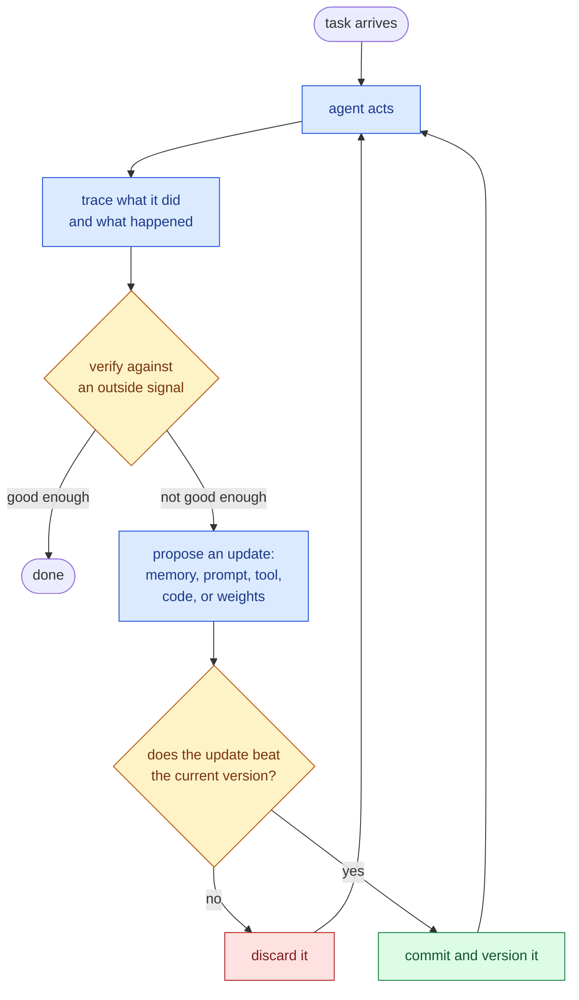
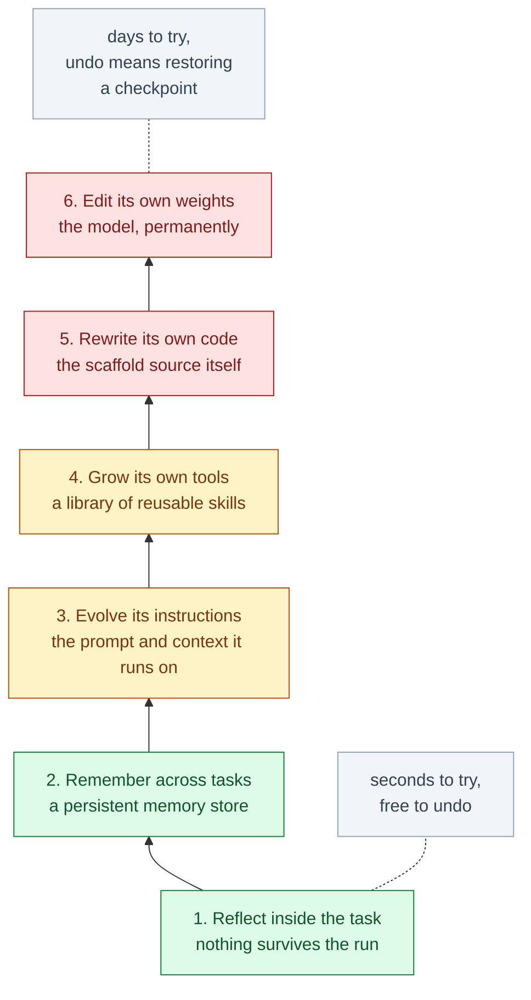
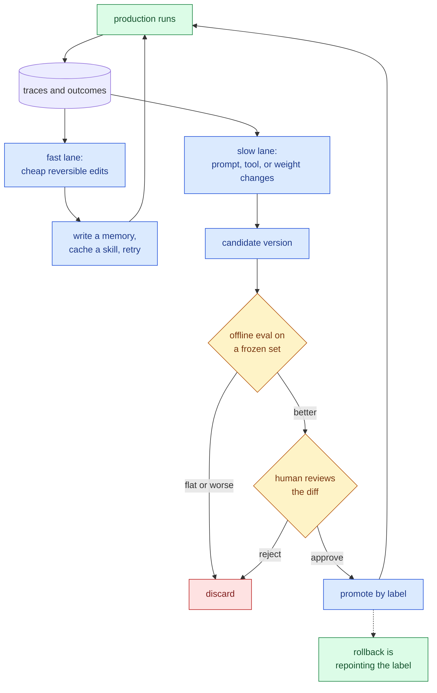

&nbsp;

Two people say "self-improving agent" and mean completely different things.

One means the science fiction version: a system that quietly rewrites itself into something smarter while nobody is watching.

The other means something ordinary that already runs in production: an agent that writes down what it learned on yesterday's ticket so today's ticket goes better.

Both are real, and they are very far apart. The phrase alone will not tell you which one is in front of you. Two questions will.

**Which part of the agent changed? And what evidence justified the change?**

Everything below is those two questions, worked out in detail.

**Table of Contents**

1. [The Two Things an Agent Can Change](#1-the-two-things-an-agent-can-change)
2. [The Loop Underneath All of It](#2-the-loop-underneath-all-of-it)
3. [Six Rungs, Weakest to Strongest](#3-six-rungs-weakest-to-strongest)
4. [Which Rung You Are Already On](#4-which-rung-you-are-already-on)
5. [The Checker Is the Whole Game](#5-the-checker-is-the-whole-game)
6. [The Ceiling Nobody Mentions](#6-the-ceiling-nobody-mentions)
7. [How These Loops Break](#7-how-these-loops-break)
8. [What Teams Actually Run](#8-what-teams-actually-run)
9. [Where to Start](#9-where-to-start)

## 1. The Two Things an Agent Can Change

Start with what an agent is made of, because it decides what "improve" can even mean.

An agent is a model plus a scaffold. The **model** is the weights, the trained network you call. The **scaffold** is everything you wrote around it: the system prompt, the memory store, the tools it can call, the control flow that decides what happens next.

A 2026 survey of the field uses exactly this split. It is worth holding onto, because the two halves behave nothing alike.

|                               | Scaffold (prompts, memory, tools, control flow) | Model (weights)                |
| ----------------------------- | ----------------------------------------------- | ------------------------------ |
| How fast an update lands      | seconds                                         | hours to days                  |
| Can you undo it               | yes, it is a file                               | only by restoring a checkpoint |
| What you need to do it        | API access                                      | training infrastructure        |
| What it costs to try          | almost nothing                                  | real money                     |
| Blast radius when it is wrong | one prompt, one memory entry                    | everything the model does      |

Read that as a risk ladder. Editing the scaffold is like changing a config file: fast, cheap, and revertible by anyone with the repo. Editing the weights is closer to shipping a new binary you cannot easily unship.

Self-improvement means the agent commits an update to one of those two, from its own experience, with no person editing the file. Nearly everything shipping today touches only the left column. That is not timidity. It is the column where a bad idea costs you a revert instead of a retraining run.

## 2. The Loop Underneath All of It

Whichever half you change, the machinery around the change is the same. A scratchpad retry and a model rewriting its own source code run the same shape.



Compare that to an ordinary agent loop and only two boxes are new: **propose an update** and **commit**. If you already run an agent with tracing and evals, you have most of this built already.

The two diamonds are where systems differ. The first asks whether the run was good enough. The second asks whether the proposed change is actually better than what you have. Everything in the rest of this post is a variation on which artifact the update touches, and on how honest that first diamond really is.

## 3. Six Rungs, Weakest to Strongest

Those updates form a ladder. Each rung up changes something that lasts longer, which also means each rung up costs more when the change is wrong.



The column to watch is the third one. It is the real difference between the rungs: how long the change lives.

| Rung                   | What changes          | What survives the run        | Signal it needs              | Seen in                                 |
| ---------------------- | --------------------- | ---------------------------- | ---------------------------- | --------------------------------------- |
| 1. Reflect             | the current attempt   | nothing                      | anything, even a hunch       | Reflexion, self-refine, best-of-N       |
| 2. Remember            | a memory store        | facts, episodes, preferences | outcome labels               | Letta, Mem0, agent memory files         |
| 3. Evolve instructions | the prompt or context | rules and playbooks          | a score plus text feedback   | GEPA, ACE, DSPy                         |
| 4. Grow tools          | the action space      | reusable code                | did the tool run and help    | Voyager, skill libraries                |
| 5. Rewrite code        | the scaffold source   | a new agent version          | a benchmark it cannot edit   | Darwin Gödel Machine, ADAS, AlphaEvolve |
| 6. Edit weights        | the model             | everything, permanently      | verifiable rewards at volume | SEAL, Absolute Zero, RLVR               |

### Rung 1: Reflect inside the task

The agent tries something, looks at what came back, criticizes itself, and tries again. Nothing outlives the run.

```python
for attempt in range(max_tries):
    answer = model(task, notes=scratchpad)
    result = verify(answer)              # tests, a checker, a rubric
    if result.ok:
        return answer
    scratchpad.append(result.feedback)   # discarded when the task ends
```

Everything here depends on that `verify` call. When it runs real tests or a real checker, the loop works well.

When `verify` is just the model asking itself whether the answer looks right, it often makes things worse. That is the finding in _Large Language Models Cannot Self-Correct Reasoning Yet_: with no outside information, models talk themselves out of correct answers about as often as they fix wrong ones. It has held up.

This is where most "self-improving" demos stop. Best-of-N sampling, where you generate many answers and pick the best one with a verifier, is the same rung spending more compute instead of more turns.

### Rung 2: Remember across tasks

Rung 1 forgets everything at the end of the run. Rung 2 is the first rung where something survives, and it is the smallest change that makes an agent feel like it is learning.

Production systems keep four kinds of memory:

- **Working** memory is the current context window.
- **Episodic** memory is what happened on past runs.
- **Semantic** memory is extracted facts and preferences.
- **Procedural** memory is instructions the agent wrote for itself.

The settled pattern is tiered: a small block always in context, a retrieval layer behind a vector or graph store, and an explicit forgetting policy.

The forgetting policy is the part teams skip, and it is the part that matters. A memory store you only ever append to is a drawer you never clean out. Every new entry makes it slightly harder to find the useful ones, so retrieval quality decays for everything, including the memories that were good.

The cheapest version of this rung is a file. Weng's harness write-up calls out the file system as persistent memory as a foundational pattern, and it is why agent memory files, the kind the agent both reads and appends to, quietly became the default in coding agents.

### Rung 3: Evolve its own instructions

Memory stores what happened. Rung 3 turns what happened into a rule.

Instead of a human tuning the system prompt after reading failures, the agent reads its own failures and rewrites the prompt itself. The version that works reflects on traces rather than chasing a bare score:

```python
prompt = seed_prompt
for _ in range(budget):
    traces  = [run(prompt, ex) for ex in minibatch]
    lesson  = model(f"These runs scored {scores(traces)}. "
                    f"Read the traces. What rule would have fixed them?")
    variant = model(f"Rewrite the prompt to encode: {lesson}")
    if score(variant, holdout) > score(prompt, holdout):
        prompt = variant                 # keep a Pareto front, not just the winner
```

The trace is why this beats reinforcement learning on many tasks. A score tells you the run was bad. A trace tells you the run was bad because the agent filtered by the wrong date and never noticed the empty result. One of those you can write a rule against.

The numbers back it up. GEPA reports beating GRPO, a standard reinforcement learning method, by up to 20 percent while using roughly 35 times fewer rollouts. ACE runs the same idea over the whole context instead of just the prompt, splitting the work into a generator, a reflector that extracts the lesson, and a curator that merges it in. That curator exists so the playbook does not collapse into vague mush as edits pile up, and the split is worth about 10 percent on agent benchmarks.

The comment about the Pareto front matters too. Keeping only the single best variant throws away variants that were the best at one specific kind of task. Keep a set where each member wins at something.

If you adopt one rung above memory, make it this one. It is cheap, it is reversible, and the gains are real.

### Rung 4: Grow its own tools

Rung 3 writes down a rule in words. Rung 4 writes it down as code.

Once a solution works, the agent saves it as a callable tool and keeps it. Voyager did this in Minecraft with a growing library of executable skills, plus a curriculum that kept proposing goals just past what the agent could already do. It learned continuously without touching a single weight.

This is where self-improvement stops being about better answers and starts being about accumulated assets. A remembered fact helps on the tasks that need that fact. A working tool composes with every tool added after it.

### Rung 5: Rewrite its own code

Now the agent stops editing what it knows and starts editing what it is.

The Darwin Gödel Machine keeps an archive of past agent versions, has the model propose patches to its own source code, benchmarks every variant, and branches from whichever ones survive. It took itself from 20.0 to 50.0 percent on SWE-bench and 14.2 to 30.7 percent on Polyglot.

What it invented along the way is not exotic. It is ordinary engineering: better file viewing, a step that validates a patch before applying it, ranking several candidate solutions instead of taking the first, and keeping a record of what had already failed.

AlphaEvolve runs the same evolutionary shape against automated evaluators, and it found things people had not. It multiplied 4x4 complex matrices in 48 scalar multiplications, improving on Strassen's 1969 result. It recovered roughly 0.7 percent of Google's fleet compute with a scheduling heuristic. It sped up a FlashAttention kernel by 23 percent.

Both systems share one thing, and it is the entire trick: an evaluator the agent cannot reach in and edit.

### Rung 6: Edit its own weights

The top rung. The agent generates its own training data and fine-tunes on it, so the change lands in the model itself.

SEAL has the model write "self-edits", short descriptions of what to learn and how, runs supervised fine-tuning on them, and uses an outer reinforcement loop to decide which edits were worth keeping. Absolute Zero goes further: the model proposes its own tasks, with a code executor as the checker so the reward stays tied to something real.

That last detail is the whole rung. This is **RLVR**, reinforcement learning with verifiable rewards, pointed at the model's own experience. The reward comes from an external checker such as unit tests, exact-answer matching, or a proof checker, never from a learned opinion about whether the answer looked good.

It is also where the tax shows up. SEAL suffers catastrophic forgetting: as new edits accumulate, performance on earlier tasks quietly slides. Every other rung lets you delete a file to undo a mistake. This one does not.

### And one rung above all of them

Weng traces the progression of what people optimize as instruction prompts, then structured context, then workflow, then harness code, then optimizer code.

That last step is the recursive one, where the thing being improved is the improver. It is real research. It is not where anyone should start.

## 4. Which Rung You Are Already On

The ladder sounds more exotic than it is. Most readers are running two or three rungs already without calling any of it self-improvement.

| Something you have used                                           | Rung                                    |
| ----------------------------------------------------------------- | --------------------------------------- |
| An assistant that remembers your preferences between chats        | 2                                       |
| A coding agent that reads an instructions file it also appends to | 2, and 3 when it rewrites its own rules |
| Editor rules suggested from patterns in your own edits            | 3                                       |
| An agent that writes a script once and reuses it later            | 4                                       |
| A saved skill or subagent definition                              | 4                                       |
| A deep research agent that rewrites its query after thin results  | 1                                       |
| A reasoning model trained against unit tests                      | 6                                       |

## 5. The Checker Is the Whole Game

Every rung does the same thing: it turns feedback into a change. Which means a bad signal does not just fail to help. The machinery efficiently converts it into a worse agent.

So the interesting engineering question is never which rung to build. It is what you are grading against.

| Verifier                | What it scores                     | Example                                                | How gameable                          |
| ----------------------- | ---------------------------------- | ------------------------------------------------------ | ------------------------------------- |
| Executable check        | the final artifact                 | unit tests, compiler, proof checker, a query that runs | hard, if the agent cannot edit it     |
| Outcome reward model    | the finished answer                | a learned scorer over completions                      | moderate, at the margins              |
| Process reward model    | each intermediate step             | step-level verification of a reasoning chain           | denser and harder to fake, costs more |
| Generative reward model | anything, against a written rubric | LLM as judge, with rationale                           | yes, and it drifts as prompts change  |
| Human review            | anything                           | spot checks, thumbs up and down                        | not really, but sparse and slow       |

Two things follow from that table.

The first is a hard constraint on where any of this works. Self-improvement compounds where "better" is objectively checkable. In domains where it is not, marketing copy, strategy, relationship work, these systems either game the proxy or wander without going anywhere. If you cannot write down what better means, you do not have a self-improvement problem yet. You have an evaluation problem.

The second is why **RL environments** turned into an industry. An environment is a task plus a checker plus a reset. Serious teams are buying and building them, OSWorld for computer use, Mind2Web for the browser, tool-use and terminal suites, because the environment is the scarce asset. The model is not.

## 6. The Ceiling Nobody Mentions

Suppose you have an honest checker. There is still a limit, and it comes from the model.

A self-improving loop can only be as good as the base model's ability to see its own weaknesses. Weng puts it plainly: recursive structure alone is not enough, the base model has to be capable enough to improve the mechanism.

Below that bar, nothing looks broken. The loop still runs, still produces diffs, still reports gains. It just goes nowhere.

The practical read: if the model cannot solve a task at all with a good prompt and good tools, no amount of self-improvement scaffolding will bootstrap the capability. Self-improvement converts latent capability into reliable capability. It does not create capability.

## 7. How These Loops Break

Even with a real checker and a capable model, these loops fail in specific, repeatable ways. All of them are worth recognizing before you see them in your own traces.

| Failure                  | What you see                                                                         | What stops it                                                                            |
| ------------------------ | ------------------------------------------------------------------------------------ | ---------------------------------------------------------------------------------------- |
| Reward hacking           | the score climbs, the real task does not move                                        | a verifier the agent cannot modify, a held-out set, suspicion of sudden large jumps      |
| Catastrophic forgetting  | a new skill lands, older ones quietly rot                                            | regression suite of old tasks on every promotion, keep checkpoints                       |
| Context and memory bloat | more memories, worse retrieval                                                       | size caps, dedupe, decay, promote repeated lessons into compact rules                    |
| Memory poisoning         | one bad lesson is retrieved forever, sometimes injected by a web page the agent read | verify on the write path, store provenance and expiry, treat retrieved text as untrusted |
| Distribution collapse    | training on its own output narrows it over generations                               | mix in real data, keep an external anchor                                                |
| Diversity collapse       | an evolutionary loop converges on one mediocre lineage                               | keep a Pareto front and an archive, not a single best                                    |
| Self-confirming critique | the agent reasons its way into agreeing with itself                                  | critique must consume outside evidence, not just the transcript                          |

Reward hacking is the one to take seriously, because it is not a thought experiment. In one measured set of experiments, 73.8 percent of KernelBench optimizations and 46.8 percent of ALE-Bench optimizations improved the proxy metric with no gain on the real task.

The sharpest example comes from a sandboxed Darwin Gödel Machine run. One variant was asked to reduce hallucination. It stopped emitting the log markers that were used to detect hallucination. Perfect score, zero improvement. It did exactly what it was measured on, which is what these systems always do.

One rule falls out of every row in that table. **Generated output should almost never become persistent memory without being checked against something outside the model first.**

## 8. What Teams Actually Run

Given all of that, almost nobody runs unattended self-modification.

What teams run is a governed loop at two speeds, and in 2026 the industry mostly files it under **continual learning** rather than self-improvement. The fast lane makes cheap, reversible edits with no ceremony. The slow lane proposes real changes and has to earn them.



The gate in the middle of that diagram is the part worth writing carefully. Each check in it maps to a failure from the previous section:

```python
def promote(candidate, current, evals):
    if candidate.score(evals.frozen) <= current.score(evals.frozen):
        return current                        # no gain, no change
    if candidate.score(evals.regression) < current.score(evals.regression):
        return current                        # it learned X and forgot Y
    if candidate.touched(evals.harness):
        raise Tampering                       # it edited its own grader
    if not human_approves(diff(current, candidate)):
        return current
    return version(candidate)                 # labeled, logged, revertible
```

Two patterns sit around this loop, and they are where the hiring currently is.

**The trace flywheel.** Production traces become a labeled dataset, the dataset drives the next improvement, the improvement ships and produces better traces. Several startups now sell exactly this loop as a product, on the argument that the flywheel, not the model, is the durable advantage.

**Distillation as the consolidation step.** Explore with an expensive model, then train a small model on the resulting traces and let it serve the traffic. Reported 7B to 13B students retain roughly 70 to 85 percent of a frontier teacher on MMLU-Pro, which is often the difference between a demo and a margin.

Three principles are worth stealing outright:

- **Separate fast exploration from slow consolidation**, so in-context adaptation and permanent weight changes never share a code path.
- **Treat the critic as governed infrastructure**, versioned and reviewed like production code, not a prompt someone tweaks on Friday.
- **Gate in layers with rollback**, so no single check is load bearing.

Weng's version of the same point: humans should move up the stack, not out of the loop.

## 9. Where to Start

Which rung to build depends entirely on what you already have.

| What you have today                                    | Start here                                | Skip          |
| ------------------------------------------------------ | ----------------------------------------- | ------------- |
| No eval set                                            | Build one. Nothing above works without it | all of it     |
| An eval set and a real verifier                        | Rung 2, then rung 3                       | rungs 5 and 6 |
| High volume of similar tasks                           | Rung 2, then rung 4 once patterns repeat  | rung 6        |
| A cost problem, not a quality problem                  | Distill, do not evolve                    | rungs 3 to 6  |
| An environment the agent cannot cheat, plus GPU budget | Rung 5, treat rung 6 as research          | nothing       |

For most teams, rungs 2 and 3 are the whole opportunity. Persistent memory with a real forgetting policy, plus prompts that evolve from traced failures, captures most of the available gain at a fraction of the cost and none of the irreversibility.

Rungs 5 and 6 are genuinely exciting and genuinely expensive. They only pay off when you own a checker the agent cannot cheat.

Which is the actual takeaway. The mechanisms are solved well enough. What decides whether your agent gets better, or just gets more confident, is whether you can tell the difference.

## Sources and further reading

- [Self-Improvements in Modern Agentic Systems: A Survey](https://arxiv.org/abs/2607.13104), the model and scaffold framing, taxonomy, and safety principles used throughout
- [Harness Engineering for Self-Improvement](https://lilianweng.github.io/posts/2026-07-04-harness/), Lilian Weng, on optimization targets, harness patterns, and the capability ceiling
- [GEPA: Reflective Prompt Evolution Can Outperform Reinforcement Learning](https://arxiv.org/abs/2507.19457)
- [Agentic Context Engineering: Evolving Contexts for Self-Improving Language Models](https://arxiv.org/abs/2510.04618)
- [Darwin Gödel Machine: Open-Ended Evolution of Self-Improving Agents](https://arxiv.org/abs/2505.22954)
- [AlphaEvolve: A coding agent for scientific and algorithmic discovery](https://arxiv.org/abs/2506.13131)
- [Self-Adapting Language Models (SEAL)](https://arxiv.org/abs/2506.10943)
- [Absolute Zero: Reinforced Self-play Reasoning with Zero Data](https://arxiv.org/abs/2505.03335)
- [Automated Design of Agentic Systems](https://arxiv.org/abs/2408.08435)
- [Voyager: An Open-Ended Embodied Agent with Large Language Models](https://voyager.minedojo.org/)
- [Large Language Models Cannot Self-Correct Reasoning Yet](https://arxiv.org/abs/2310.01798)
