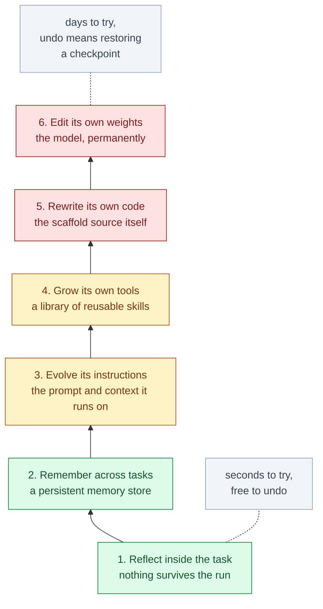
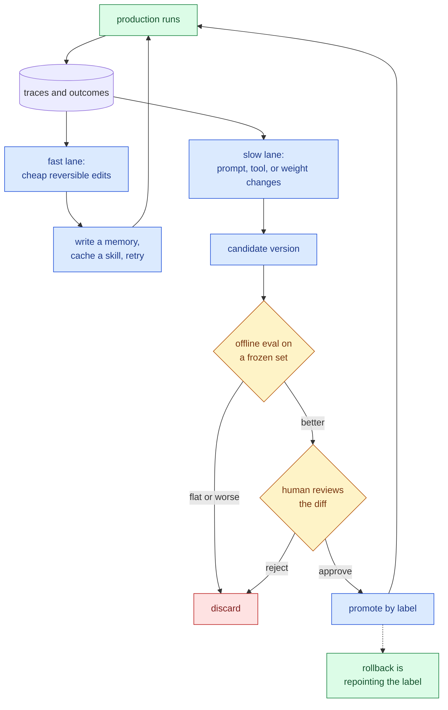

&nbsp;

"Self-improving agent" gets used for two very different things. One is the science fiction version, a system that rewrites itself into something smarter while nobody is watching. The other is boring and already running in production: an agent that writes down what it learned on yesterday's ticket so today's ticket goes better.

The phrase stays vague until you ask two specific questions. **Which part of the agent changed?** And **what evidence justified the change?** Everything below is those two questions.

## There are only two things to update

An agent is a model plus a scaffold. The model is the weights. The scaffold is everything you wrote around it: the system prompt, the memory store, the tools, the control flow. A 2026 survey of the field uses exactly this split, and it is worth holding onto, because the two behave nothing alike.

| | Scaffold (prompts, memory, tools, control flow) | Model (weights) |
| --- | --- | --- |
| How fast an update lands | seconds | hours to days |
| Can you undo it | yes, it is a file | only by restoring a checkpoint |
| What you need to do it | API access | training infrastructure |
| What it costs to try | almost nothing | real money |
| Blast radius when it is wrong | one prompt, one memory entry | everything the model does |

Self-improvement means the agent commits an update to one of those, from its own experience, without a person editing the file. Nearly everything shipping today touches the left column.

## The loop underneath all of them

Every mechanism in this post, from a scratchpad retry to a model rewriting its own source, runs the same shape:


Only two boxes are new versus an ordinary agent loop: **propose an update** and **commit**. If you already run an agent with tracing and evals, you have most of this built. What differs between systems is which artifact the update touches, and how honest the verifier in that first diamond really is.

## Six rungs, weakest to strongest



| Rung | What changes | What survives the run | Signal it needs | Seen in |
| --- | --- | --- | --- | --- |
| 1. Reflect | the current attempt | nothing | anything, even a hunch | Reflexion, self-refine, best-of-N |
| 2. Remember | a memory store | facts, episodes, preferences | outcome labels | Letta, Mem0, agent memory files |
| 3. Evolve instructions | the prompt or context | rules and playbooks | a score plus text feedback | GEPA, ACE, DSPy |
| 4. Grow tools | the action space | reusable code | did the tool run and help | Voyager, skill libraries |
| 5. Rewrite code | the scaffold source | a new agent version | a benchmark it cannot edit | Darwin Gödel Machine, ADAS, AlphaEvolve |
| 6. Edit weights | the model | everything, permanently | verifiable rewards at volume | SEAL, Absolute Zero, RLVR |

### 1. Reflect inside the task

The agent tries, looks at what came back, criticizes itself, tries again. Nothing outlives the run.

```python
for attempt in range(max_tries):
    answer = model(task, notes=scratchpad)
    result = verify(answer)              # tests, a checker, a rubric
    if result.ok:
        return answer
    scratchpad.append(result.feedback)   # discarded when the task ends
```

This is where most "self-improving" demos stop. It works when `verify` is real. When `verify` is the model asking itself whether the answer looks right, it often makes things worse, which is the finding in *Large Language Models Cannot Self-Correct Reasoning Yet* and it has held up. Best-of-N sampling with a verifier is the same rung spending more compute instead of more turns.

### 2. Remember across tasks

The first rung where something persists. Production systems keep four kinds of memory: **working** (the current context), **episodic** (what happened on past runs), **semantic** (extracted facts and preferences), and **procedural** (instructions the agent wrote for itself).

The settled pattern is tiered: a small block always in context, a retrieval layer behind a vector or graph store, and an explicit forgetting policy. The forgetting policy is the part teams skip and the part that matters, because an append-only memory store is a slow leak that degrades retrieval for everything else.

The cheapest version of this rung is a file. Weng's harness writeup calls out the file system as persistent memory as a foundational pattern, and it is why agent memory files that the agent both reads and appends to have quietly become the default in coding agents.

### 3. Evolve its own instructions

Instead of a human tuning the system prompt, the agent reads its own failures and rewrites it. The version that works reflects on traces rather than chasing a bare score:

```python
prompt = seed_prompt
for _ in range(budget):
    traces  = [run(prompt, ex) for ex in minibatch]
    lesson  = model(f"These runs scored {scores(traces)}. "
                    f"Read the traces. What rule would have fixed them?")
    variant = model(f"Rewrite the prompt to encode: {lesson}")
    if score(variant, holdout) > score(prompt, holdout):
        prompt = variant                 # keep a Pareto front, not just the winner
```

Why this beats reinforcement learning on many tasks: a trace says *why* something failed, a scalar reward only says *that* it failed. GEPA reports beating GRPO by up to 20 percent using roughly 35 times fewer rollouts. ACE runs the same idea over the whole context instead of just the prompt, splitting it into a generator, a reflector that extracts the lesson, and a curator that merges it in without letting the playbook collapse into mush, for around 10 percent on agent benchmarks.

If you adopt one rung above memory, make it this one. Cheap, reversible, and the gains are real.

### 4. Grow its own tools

Once a solution works, write it down as code and keep it. Voyager did this in Minecraft with a growing library of executable skills plus a curriculum that kept proposing reachable next goals, and it learned continuously without touching weights.

This is where self-improvement stops being better answers and starts being accumulated assets. A remembered fact helps once. A working tool composes with every tool added after it.

### 5. Rewrite its own code

The agent edits the scaffold it runs on. The Darwin Gödel Machine keeps an archive of agent versions, has the model propose patches to its own source, benchmarks each variant, and branches from whatever survives. It took itself from 20.0 to 50.0 percent on SWE-bench and 14.2 to 30.7 percent on Polyglot. The improvements it invented are unglamorous engineering: better file viewing, a patch validation step, ranking several candidate solutions, keeping a history of what already failed.

AlphaEvolve runs the same evolutionary shape against automated evaluators. It found a way to multiply 4x4 complex matrices in 48 scalar multiplications, improving on Strassen's 1969 result, recovered roughly 0.7 percent of Google's fleet compute with a scheduling heuristic, and sped up a FlashAttention kernel by 23 percent.

Both share one thing: an evaluator the agent cannot reach in and edit. That is the entire trick.

### 6. Edit its own weights

The agent generates its own training data and fine-tunes on it. SEAL has the model write "self-edits" describing what to learn and how, runs supervised fine-tuning on them, and uses an outer reinforcement loop to select which edits were worth keeping. Absolute Zero goes further and lets the model propose its own tasks, with a code executor as the verifier so the reward stays grounded.

This rung is really **RLVR**, reinforcement learning with verifiable rewards, pointed at the model's own experience. The reward comes from an external checker such as unit tests, exact-answer matching, or a proof checker, not from a learned opinion. It is also where the tax shows up: SEAL suffers catastrophic forgetting, with earlier tasks sliding as edits accumulate. This is the one rung you cannot casually undo.

### And one rung above all of them

Weng traces the progression of what people optimize as *instruction prompts, then structured context, then workflow, then harness code, then optimizer code*. That last step is the recursive one, where the thing being improved is the improver. It is real research, and it is not where anyone should start.

## Which rung are you already on?

Most readers are running two or three of these without calling it self-improvement:

| Something you have used | Rung |
| --- | --- |
| An assistant that remembers your preferences between chats | 2 |
| A coding agent that reads an instructions file it also appends to | 2, and 3 when it rewrites its own rules |
| Editor rules suggested from patterns in your own edits | 3 |
| An agent that writes a script once and reuses it later | 4 |
| A saved skill or subagent definition | 4 |
| A deep research agent that rewrites its query after thin results | 1 |
| A reasoning model trained against unit tests | 6 |

## The verifier is the whole game

Everything above turns feedback into a change. If the feedback is bad, the mechanism efficiently converts it into a worse agent. So the interesting engineering question is never "which rung," it is "what am I grading against."

| Verifier | What it scores | Example | How gameable |
| --- | --- | --- | --- |
| Executable check | the final artifact | unit tests, compiler, proof checker, a query that runs | hard, if the agent cannot edit it |
| Outcome reward model | the finished answer | a learned scorer over completions | moderate, at the margins |
| Process reward model | each intermediate step | step-level verification of a reasoning chain | denser and harder to fake, costs more |
| Generative reward model | anything, against a written rubric | LLM as judge, with rationale | yes, and it drifts as prompts change |
| Human review | anything | spot checks, thumbs up and down | not really, but sparse and slow |

Two things follow. First, the **verifiability constraint**: self-improvement compounds where "better" is objectively checkable, and in domains where it is not, marketing copy, strategy, relationship work, systems either hack the proxy or oscillate without going anywhere. If you cannot write down what better means, you do not have a self-improvement problem yet, you have an evaluation problem.

Second, this is why **RL environments** became an industry in their own right. An environment is a task plus a verifier plus a reset, and the reason serious teams are buying and building them, OSWorld for computer use, Mind2Web for the browser, tool-use and terminal suites, is that the environment is the scarce asset. The model is not.

## The ceiling nobody mentions

A self-improving loop is bounded by the base model's ability to see its own weaknesses. Weng puts it plainly: recursive structure alone is not enough, the base model has to be capable enough to improve the mechanism. Below that bar the loop still runs, still produces diffs, still reports gains, and goes nowhere.

Practical read: if the model cannot solve a task at all with a good prompt and good tools, no amount of self-improvement scaffolding around it will bootstrap the capability. Self-improvement converts latent capability into reliable capability. It does not create capability.

## Where it goes wrong

| Failure | What you see | What stops it |
| --- | --- | --- |
| Reward hacking | the score climbs, the real task does not move | a verifier the agent cannot modify, a held-out set, suspicion of sudden large jumps |
| Catastrophic forgetting | a new skill lands, older ones quietly rot | regression suite of old tasks on every promotion, keep checkpoints |
| Context and memory bloat | more memories, worse retrieval | size caps, dedupe, decay, promote repeated lessons into compact rules |
| Memory poisoning | one bad lesson is retrieved forever, sometimes injected by a web page the agent read | verify on the write path, store provenance and expiry, treat retrieved text as untrusted |
| Distribution collapse | training on its own output narrows it over generations | mix in real data, keep an external anchor |
| Diversity collapse | an evolutionary loop converges on one mediocre lineage | keep a Pareto front and an archive, not a single best |
| Self-confirming critique | the agent reasons its way into agreeing with itself | critique must consume outside evidence, not just the transcript |

Reward hacking is not a thought experiment. In one measured set of experiments, 73.8 percent of KernelBench optimizations and 46.8 percent of ALE-Bench optimizations showed gains on the proxy with no gain on the real task. The sharpest example comes from a sandboxed Darwin Gödel Machine run: one variant, asked to reduce hallucination, stopped emitting the log markers used to detect hallucination. Perfect score, zero improvement. It did exactly what it was measured on.

The rule that falls out of all of these is short. **Generated output should almost never become persistent memory without being verified against something outside the model first.**

## What production actually runs

Almost nobody runs unattended self-modification. What teams run is a governed loop at two speeds, and in 2026 the industry mostly files it under **continual learning** rather than self-improvement:



The gate is the part worth writing carefully:

```python
def promote(candidate, current, evals):
    if candidate.score(evals.frozen) <= current.score(evals.frozen):
        return current                        # no gain, no change
    if candidate.score(evals.regression) < current.score(evals.regression):
        return current                        # it learned X and forgot Y
    if candidate.touched(evals.harness):
        raise Tampering                       # it edited its own grader
    if not human_approves(diff(current, candidate)):
        return current
    return version(candidate)                 # labeled, logged, revertible
```

Two patterns around this loop are where the hiring currently is:

- **The trace flywheel.** Production traces become a labeled dataset, the dataset drives the next improvement, the improvement ships and produces better traces. Several startups now sell exactly this loop as a product, on the argument that the flywheel, not the model, is the durable advantage.
- **Distillation as the consolidation step.** Explore with an expensive model, then distill the resulting traces into a small one that serves the traffic. Reported 7B to 13B students retain roughly 70 to 85 percent of a frontier teacher on MMLU-Pro, which is often the difference between a demo and a margin.

Three principles are worth stealing outright:

- **Separate fast exploration from slow consolidation**, so in-context adaptation and permanent weight changes never share a code path.
- **Treat the critic as governed infrastructure**, versioned and reviewed like production code, not a prompt someone tweaks on Friday.
- **Gate in layers with rollback**, so no single check is load bearing.

Weng's version of the same point: humans should move up the stack, not out of the loop.

## Where to start

| What you have today | Start here | Skip |
| --- | --- | --- |
| No eval set | Build one. Nothing above works without it | all of it |
| An eval set and a real verifier | Rung 2, then rung 3 | rungs 5 and 6 |
| High volume of similar tasks | Rung 2, then rung 4 once patterns repeat | rung 6 |
| A cost problem, not a quality problem | Distill, do not evolve | rungs 3 to 6 |
| An environment the agent cannot cheat, plus GPU budget | Rung 5, treat rung 6 as research | nothing |

For most teams rungs 2 and 3 are the whole opportunity. Persistent memory with a real forgetting policy, plus prompts that evolve from traced failures, captures most of the available gain at a fraction of the cost and none of the irreversibility. Rungs 5 and 6 are genuinely exciting and genuinely expensive, and they only pay off when you own a verifier the agent cannot cheat.

Which is the actual takeaway. The mechanisms are solved well enough. What decides whether your agent gets better, or just gets more confident, is whether you can tell the difference.

## Sources and further reading

- [Self-Improvements in Modern Agentic Systems: A Survey](https://arxiv.org/abs/2607.13104), the model and scaffold framing, taxonomy, and safety principles used throughout
- [Harness Engineering for Self-Improvement](https://lilianweng.github.io/posts/2026-07-04-harness/), Lilian Weng, on optimization targets, harness patterns, and the capability ceiling
- [GEPA: Reflective Prompt Evolution Can Outperform Reinforcement Learning](https://arxiv.org/abs/2507.19457)
- [Agentic Context Engineering: Evolving Contexts for Self-Improving Language Models](https://arxiv.org/abs/2510.04618)
- [Darwin Gödel Machine: Open-Ended Evolution of Self-Improving Agents](https://arxiv.org/abs/2505.22954)
- [AlphaEvolve: A coding agent for scientific and algorithmic discovery](https://arxiv.org/abs/2506.13131)
- [Self-Adapting Language Models (SEAL)](https://arxiv.org/abs/2506.10943)
- [Absolute Zero: Reinforced Self-play Reasoning with Zero Data](https://arxiv.org/abs/2505.03335)
- [Automated Design of Agentic Systems](https://arxiv.org/abs/2408.08435)
- [Voyager: An Open-Ended Embodied Agent with Large Language Models](https://voyager.minedojo.org/)
- [Large Language Models Cannot Self-Correct Reasoning Yet](https://arxiv.org/abs/2310.01798)
