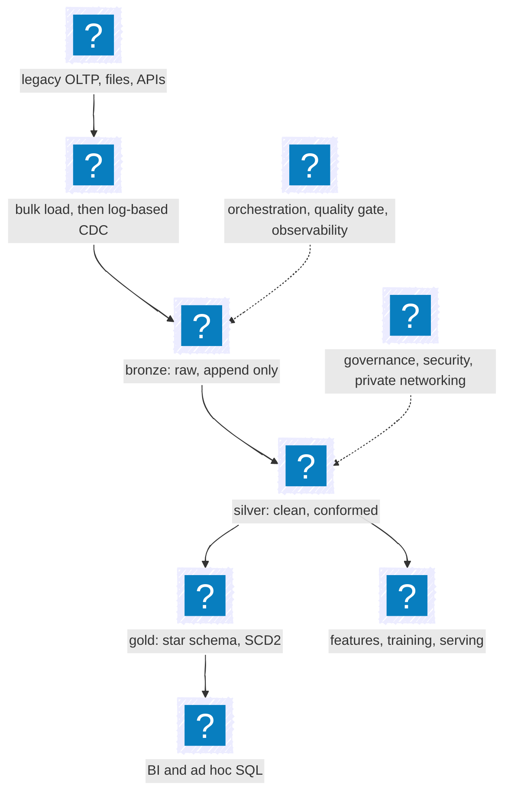
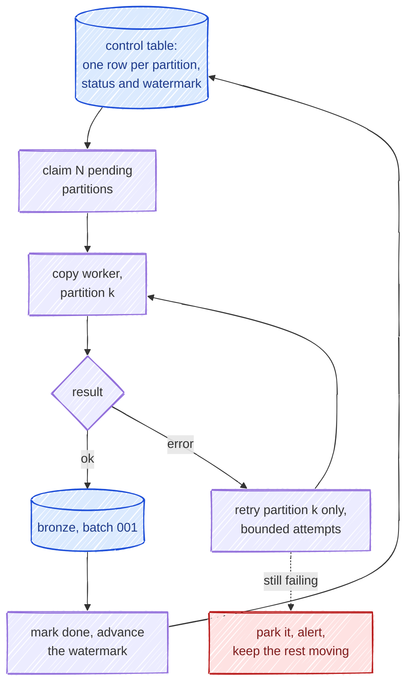
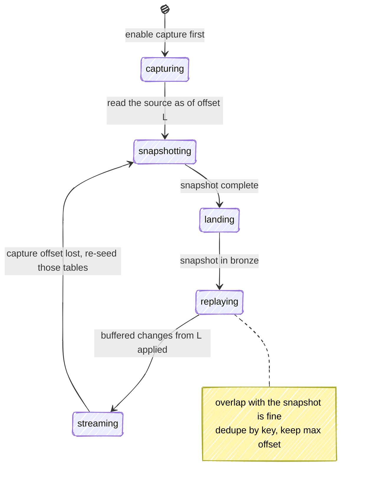
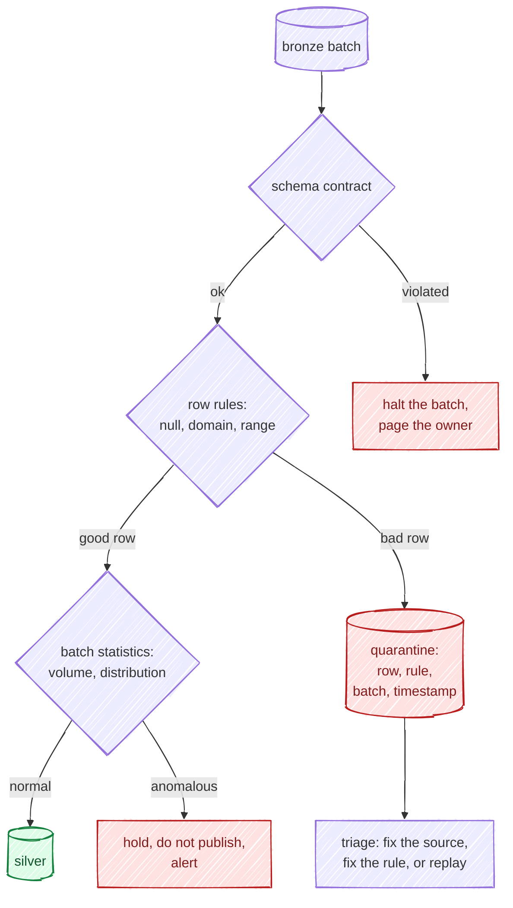
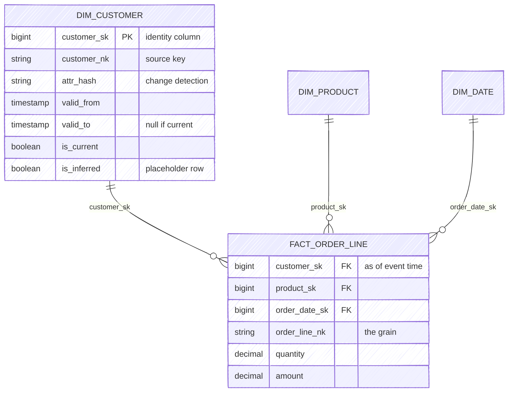
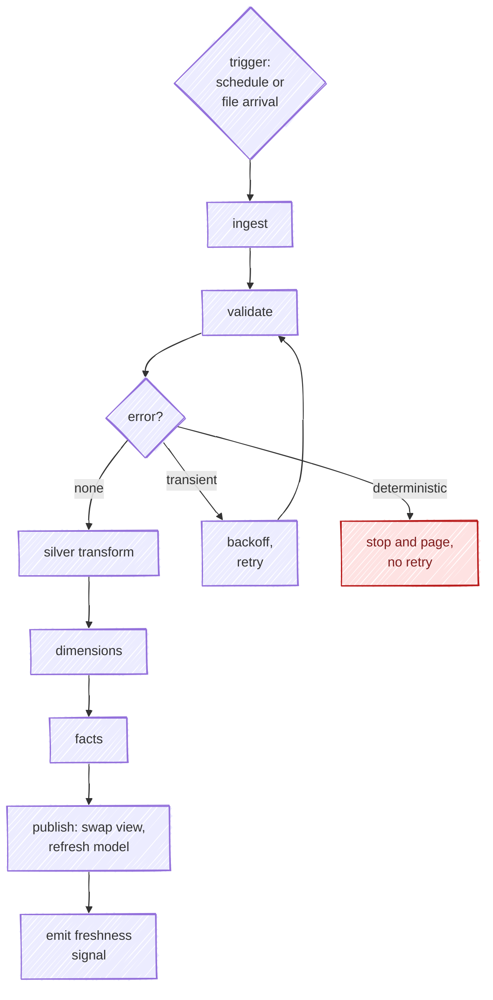
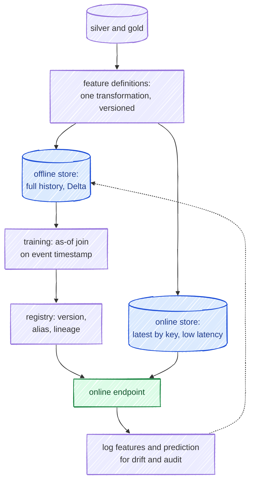
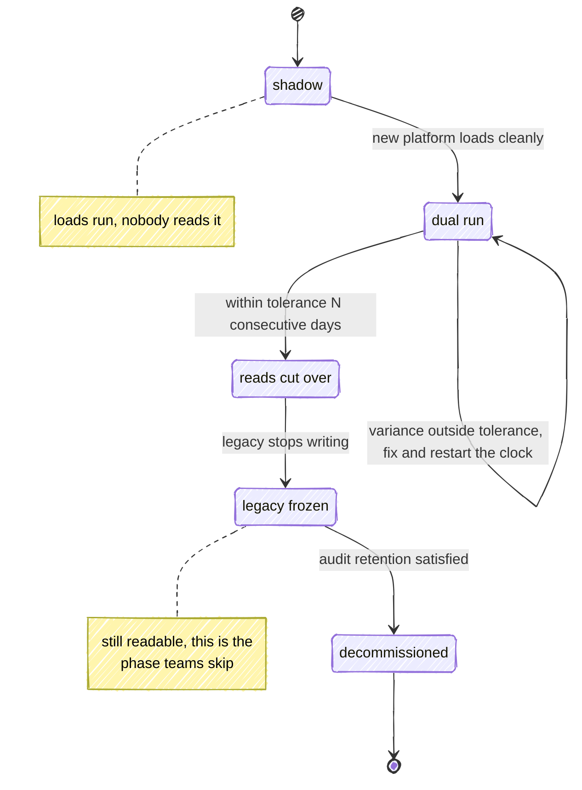

&nbsp;

Say a fifteen year old database still runs the business. Terabytes of history, writes around the clock. The company wants analytics and ML on Azure, and the brief comes with three conditions: don't rewrite the application, don't ask for a maintenance window, and don't let the old system get slower while you copy it out.

That third one rules out most of the obvious designs before you start.

Drawing the boxes takes an afternoon. The rest of this is about the joins between them.

**Table of Contents**

1. [What it has to do](#1-what-it-has-to-do)
2. [Three zones](#2-three-zones)
3. [Picking the stack](#3-picking-the-stack)
4. [Moving the history](#4-moving-the-history)
5. [Keeping it current](#5-keeping-it-current)
6. [Bronze](#6-bronze)
7. [The quality gate](#7-the-quality-gate)
8. [Re-runs](#8-re-runs)
9. [Star schemas and SCD2](#9-star-schemas-and-scd2)
10. [Orchestration](#10-orchestration)
11. [The ML path](#11-the-ml-path)
12. [Security and governance](#12-security-and-governance)
13. [Running it](#13-running-it)
14. [Cutover](#14-cutover)
15. [Where I would start](#15-where-i-would-start)

## 1. What it has to do

Reporting wants yesterday settled by morning. Analysts want every column within hours. Training wants history that is correct as of the moment each event happened. Serving wants one row in milliseconds.

| Property           | Target                     | How you measure it                      |
| ------------------ | -------------------------- | --------------------------------------- |
| Gold freshness     | 06:00 local, 99% of days   | watermark age at SLA time               |
| Silver freshness   | under 15 min p95           | source commit to lake commit            |
| Completeness       | no silent row loss         | source count vs landed count, per batch |
| Correctness        | reconciles to source       | measure sums per day, exact for money   |
| RPO                | 15 min                     | replayable capture offset               |
| RTO                | 4 h analytics, 1 h serving | a restore you have actually run         |
| Load on the source | under 5% added CPU         | the source database's own monitor       |

The last row is the binding constraint. Polling the source with full scans will hit the freshness number and blow the load budget, and the load budget is the one the DBA notices.

## 2. Three zones

| Zone   | Holds                                             | Written by     | Changes how                  |
| ------ | ------------------------------------------------- | -------------- | ---------------------------- |
| Bronze | what the source said, plus arrival metadata       | ingestion only | append only, never updated   |
| Silver | typed, deduped, conformed, business keys resolved | transform jobs | upsert by key, restatable    |
| Gold   | modeled for a question, with history kept         | modeling jobs  | merged or rebuilt, versioned |

Three rather than two because each boundary gives you somewhere to restart. Bad silver logic, rebuild silver from bronze. Bad gold logic, rebuild gold from silver.

One exception is worth designing for up front. Silver holds current state per key, so it cannot regenerate the dimension history in section 9: replaying a snapshot gives you one version of every customer, not five. SCD2 history is rebuilt by replaying bronze in offset order, or from a change feed on silver if you turn one on. Bronze is the tape that makes either possible without going back to the source.

## 3. Picking the stack

| Layer             | What I would pick                          | When I would pick differently                     |
| ----------------- | ------------------------------------------ | ------------------------------------------------- |
| Landing storage   | ADLS Gen2, Delta format                    | Iceberg if the estate already standardised on it  |
| Transform compute | Azure Databricks, Lakeflow pipelines       | Fabric Spark for a Power BI-first team            |
| Serving warehouse | Fabric Warehouse for greenfield            | Synapse dedicated SQL pool if one already exists  |
| Movement          | ADF or Fabric Data Factory                 | a CDC product for Oracle, DB2 or mainframe        |
| Orchestration     | Databricks Jobs plus Data Factory          | Airflow if you already run it at scale            |
| Catalog           | Unity Catalog to enforce, Purview to map   | you need both at enterprise scale                 |
| ML                | Azure ML with MLflow                       | Databricks-native if you never leave Databricks   |

The warehouse row usually gets fudged, so to be plain: as of August 2026 Synapse has no announced end of life and dedicated SQL pools are still fine in production. But Direct Lake, OneLake and everything new are going into Fabric. Leave an existing pool alone if it hits its SLA; start fresh in Fabric if Power BI is the main consumer, or Databricks SQL if there is heavy Spark in the mix.

Running both is cheap now. Unity Catalog mirroring into OneLake shortcuts to the Delta tables already in ADLS, so Databricks can own transformation and Fabric the semantic layer without a second copy.

## 4. Moving the history

The initial load is the only part where the constraint is physics. Roughly `bytes / (throughput x parallelism)`, so four terabytes over a gigabit link at 60% efficiency is about fifteen hours in one stream. Work that out first, because it decides whether you widen the pipe, split into parallel streams, or accept a seed load that runs for days while capture catches up behind it.

Snapshot from a replica or a restored backup, never production. Split the extract into partitions that fail and restart independently, and track their state in a control table.

Monotonic keys split into ranges, date-stamped tables into buckets, and wide tables with no useful key are where restoring a backup beats being clever.

## 5. Keeping it current

After the history is across, the platform stays current through change data capture: reading committed changes out of the source rather than re-querying it. Log reading is much cheaper than re-querying but it is not free, and the SQL Server capture job is a real process on the source, so measure it against that 5% budget on a write-heavy system. Asking it `WHERE updated_at > x` costs a full scan every time.

| Approach                                            | Load on source | Catches deletes | Best for                               |
| --------------------------------------------------- | -------------- | --------------- | -------------------------------------- |
| Query based, high watermark                          | scans          | no              | small tables with no other option      |
| Native log based (SQL Server CDC, Fabric Mirroring)  | low            | yes             | SQL Server and Azure SQL               |
| Debezium into Event Hubs or Kafka                    | low            | yes             | polyglot sources, stream reused widely |
| Commercial replication (Qlik, Fivetran)              | low            | yes             | Oracle, DB2, mainframe, small team     |

That deletes column usually settles the argument, since a query-based reader never notices a hard delete and nothing downstream will tell you.

For SQL Server, Fabric Mirroring is GA and usually the cheapest thing that works. Two details worth knowing first: 2016 through 2022 mirror using CDC underneath, while 2025 uses a change feed and refuses to mirror a database with CDC switched on. Either way you need a gateway, and it caps at a thousand tables.

Turn capture on before the snapshot. Overlap you can dedupe your way out of. A gap loses rows and nothing will flag it.

Ordering holds per key, not across the database. And the schema will drift: land new nullable columns and ignore them until mapped, keep dropped columns and null them forward, and let a narrowed type fail its cast into quarantine rather than truncate quietly.

## 6. Bronze

Bronze has one job, which is to be a faithful copy you can replay from. Delta rather than plain Parquet even though it is append only, for atomic commits and time travel on the layer everything else rebuilds from.

Every row carries metadata, each field there because of a specific bad day: `_source_system`, `_ingest_ts` because arrival and event time differ, `_source_offset` as the ordering key everything leans on, `_op`, `_batch_id`, and `_payload_raw` for the day the parsing itself is the bug.

Commit in minutes rather than seconds, compact towards 128 MB to 1 GB files, and partition by ingest date. Partitioning a landing zone by business date means every late record reaches back into an old partition and shatters it. The small file problem never raises an error; queries just get slower for months until someone profiles a job and finds it opening files rather than reading them.

## 7. The quality gate

Four kinds of check, and they need to fail differently.

| Kind        | Question                 | Example                              | On failure                 |
| ----------- | ------------------------ | ------------------------------------ | -------------------------- |
| Schema      | is this the agreed shape | column present, type castable        | stop the batch             |
| Domain      | is this value possible   | status in enum, quantity at least 0  | quarantine the row         |
| Referential | does the key exist       | order references a known customer    | inferred member, section 9 |
| Statistical | is this batch normal     | row count near the trailing median   | hold and alert             |

The first three work on rows. The fourth works on the batch, and it is the one that earns its keep: if a source silently starts sending 40% of its usual volume, every row is valid and every row-level check passes.

Lakeflow expectations are the natural fit on Databricks, with warn, drop or fail per constraint. Great Expectations suits a suite spanning Spark and non-Spark systems. dbt tests work on gold, but they run after the load, so they report damage instead of preventing it.

Quarantined rows need the raw payload, the rule that tripped, batch id and offset for replay, and the pipeline version so you can tell whether your own deploy caused a spike. Alert on how fast the queue grows rather than its size.

## 8. Re-runs

Idempotency means running the pipeline twice leaves the same table as running it once. Without it you cannot retry, and every network blip wakes somebody up.

The mechanism is an upsert on the business key guarded by the source offset. Absent key, insert. Present key with a newer offset, update in place. Older or equal, do nothing, which is what makes a replay harmless. A delete flags the row rather than removing it, so the deletion survives a rebuild and downstream decides whether to filter it. Dedupe the batch before you merge it, since change streams carry several updates to one key per micro-batch and Delta throws when a target row matches more than one source row.

A few habits break this: inserting without a key check, storing a load timestamp on the row so every re-run looks like a change, appending now and planning to dedupe on read. They share an assumption, which is that the orchestrator will not retry.

Turn on deletion vectors so a heavy merge marks rows rather than rewriting files, and use liquid clustering instead of static partitioning. For late data, pick a watermark. Anything older is a restatement: deliberate, audited, its own path.

## 9. Star schemas and SCD2

Dimensions load before facts, because a fact has to resolve surrogate keys against dimension state that already exists. Pass one merges dimensions and writes new or closed SCD2 versions; pass two reads events, looks up each key as of the event timestamp, and writes the fact.

When a fact arrives referencing a customer the dimension has not seen, insert a placeholder row carrying the natural key and land the fact now. Holding facts lets one slow upstream system push the whole warehouse past its morning deadline. When the real record turns up, overwrite that placeholder in place instead of opening a new version, or every fact that already landed stays pointed at a row with no attributes.

SCD2 has a wrinkle that trips people up. An upsert takes at most one action per source row, but a changed key needs two: close the old version and open a new one. So the key gets fed in twice: the copy carrying the natural key matches and sets `valid_to`, the copy carrying none falls through to insert. Only duplicate rows that genuinely update an existing current version. Duplicate everything and a brand new key hits the insert branch twice, leaving two versions of something that never changed. Take surrogate keys from an identity column, not `max(sk) + 1`, which races.

| SCD type | Keeps history          | Use for                              |
| -------- | ---------------------- | ------------------------------------ |
| Type 1   | no, overwrites         | genuine corrections, typos           |
| Type 2   | yes, fully             | anything reported across time        |
| Type 3   | one step back          | a single "previous value" question   |
| Type 6   | yes, plus current view | when both as-was and as-is are asked |

Write the fact grain down in one sentence before anyone queries the table.

## 10. Orchestration

You need both trigger styles. Schedules give a predictable SLA and bill, file-arrival triggers give latency, and most platforms end up event-driven into bronze and scheduled into gold because a report is due at a time.

Retries have to distinguish transient failures from deterministic ones. Throttling deserves capped backoff with jitter; a cast failure fails identically every time, so retrying it pages you five times for one bad row. When one partition keeps failing, park it and let the run finish.

## 11. The ML path

A feature store solves one problem: the same feature computed by two code paths gives two numbers, the model trains on one and gets served the other, and offline metrics look fine while production does not.

One definition, materialized twice. It only holds if nothing except the feature pipeline writes to the online store.

The other bug here is leakage, and section 9 is what prevents it. Filtering the dimension to `is_current` attaches today's attribute to a year-old event, and that attribute has often already been shaped by the outcome you are predicting. Join on the key plus the event timestamp inside the validity window instead.

Use an online endpoint when someone is waiting on the answer, batch scoring when nobody is. Watch input drift as well as accuracy; the label usually shows up weeks after the prediction.

## 12. Security and governance

No public endpoints, no account keys, no standing access. Storage behind private endpoints with key access off, compute in an injected VNet with no public IP, and the on-premises hop a gateway making outbound connections on 443 so nobody opens an inbound hole. Identity is managed identity granted to Entra ID groups, and PII gets tokenized at the silver boundary.

One trap worth stating plainly: Unity Catalog row filters and privileges do not follow the data into Fabric when you mirror it. Mirroring is a storage-level shortcut, so access control has to be set up again on the Fabric side.

| Capability                            | Unity Catalog  | Purview  |
| ------------------------------------- | -------------- | -------- |
| Grant or deny on a table              | yes, enforced  | no       |
| Row filters and column masks          | yes            | no       |
| Lineage inside the lakehouse          | yes            | ingested |
| Estate-wide catalog and search        | lakehouse only | yes      |
| Classification and sensitivity labels | limited        | yes      |
| Quality scores across sources         | no             | yes      |

Unity Catalog and Purview get framed as competitors, but one enforces access inside the lakehouse and the other maps the estate. The catch is that the Purview scan runs one way, so decide where descriptions and tags are authored and make the other side read-only.

## 13. Running it

Four signals cover most of it: freshness as event time against now, volume against the trailing median with zero treated as an alert, quarantine rate per rule, and cost per run. Alert on the SLO and log the rest. A job that fails at two in the morning and succeeds by four is not an incident if the deadline is six.

| Failure                | Detection                            | Recovery                                      |
| ---------------------- | ------------------------------------ | --------------------------------------------- |
| Source schema change   | schema contract on the first batch   | map or quarantine the column, redeploy        |
| Capture offset lost    | watermark gap monitor                | re-snapshot those tables, replay with overlap |
| Gateway node down      | heartbeat                            | second node in the cluster takes over         |
| Bad transform deployed | reconciliation against source counts | roll back the code, restate from bronze       |
| Oversized late batch   | run duration and queue depth         | chunk it, raise the autoscale ceiling         |
| Duplicate delivery     | uniqueness check on the fact grain   | idempotent merge absorbs it                   |

For recovery: geo-redundant storage under bronze, Delta time travel for silver and gold, restore points on the warehouse, a second region for serving, pipeline definitions in git. Most teams have an RPO written down and a restore nobody has run.

The money is almost always idle or oversized compute, then small files, then full reloads that should have been incremental. Tag pipelines for cost attribution early.

## 14. Cutover

Three environments, each with its own storage account and catalog. Code deploys between them; data does not. A schema change is a breaking API change and deserves the same review.

Agree reconciliation tolerances up front rather than mid-incident: row counts and distinct keys exact, measure sums exact for currency and within an epsilon for floats. A migration finishes when the old system is off, and the phase everyone skips is keeping it frozen but readable for as long as audit requires.

## 15. Where I would start

In this order, because each step makes the next one safe:

1. Bronze and one table, end to end, with replay proven before scaling to four hundred.
2. The idempotent merge into silver, before the gate, since a gate on a non-idempotent pipeline cannot safely quarantine and replay.
3. The quality gate and the quarantine, with an owner and an alert attached.
4. One dimension with SCD2 and one fact, on the smallest model you can.
5. Reconciliation against the source, before anyone sees a dashboard.
6. ML last, since a feature store is worth nothing until silver is trustworthy.

Most of the design comes back to three properties: bronze lets you re-run, idempotency lets you retry, and SCD2 lets you ask what was true at the time.

## Sources

- [Azure Synapse Analytics lifecycle policy (Microsoft Lifecycle)](https://learn.microsoft.com/en-us/lifecycle/products/azure-synapse-analytics)
- [Mirroring for SQL Server in Microsoft Fabric, generally available](https://blog.fabric.microsoft.com/en-GB/blog/mirroring-for-sql-server-in-microsoft-fabric-generally-available/)
- [Limitations of Fabric mirrored databases from SQL Server](https://learn.microsoft.com/en-us/fabric/mirroring/sql-server-limitations)
- [Mirroring Azure Databricks Unity Catalog to OneLake](https://learn.microsoft.com/en-us/fabric/mirroring/azure-databricks-tutorial)
- [Lakeflow pipelines release notes, 2026](https://learn.microsoft.com/en-us/azure/databricks/release-notes/dlt/2026)
- [Choosing an integration runtime configuration](https://learn.microsoft.com/en-us/azure/data-factory/choose-the-right-integration-runtime-configuration)
- [Data quality for Azure Databricks Unity Catalog in Purview](https://learn.microsoft.com/en-us/purview/unified-catalog-data-quality-azure-databricks-unity-catalog)
- [Liquid clustering for Delta tables](https://docs.databricks.com/aws/en/tables/clustering)
- [What is managed feature store? (Azure Machine Learning)](https://learn.microsoft.com/en-us/azure/machine-learning/concept-what-is-managed-feature-store)
