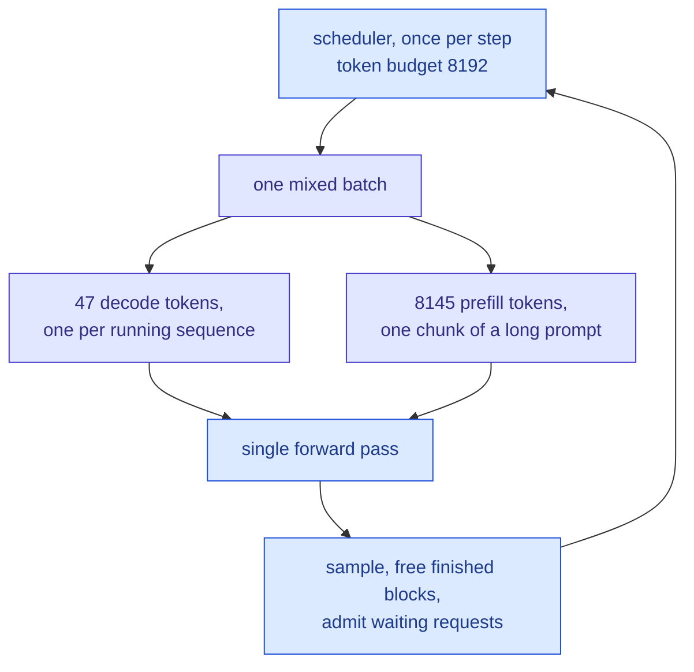
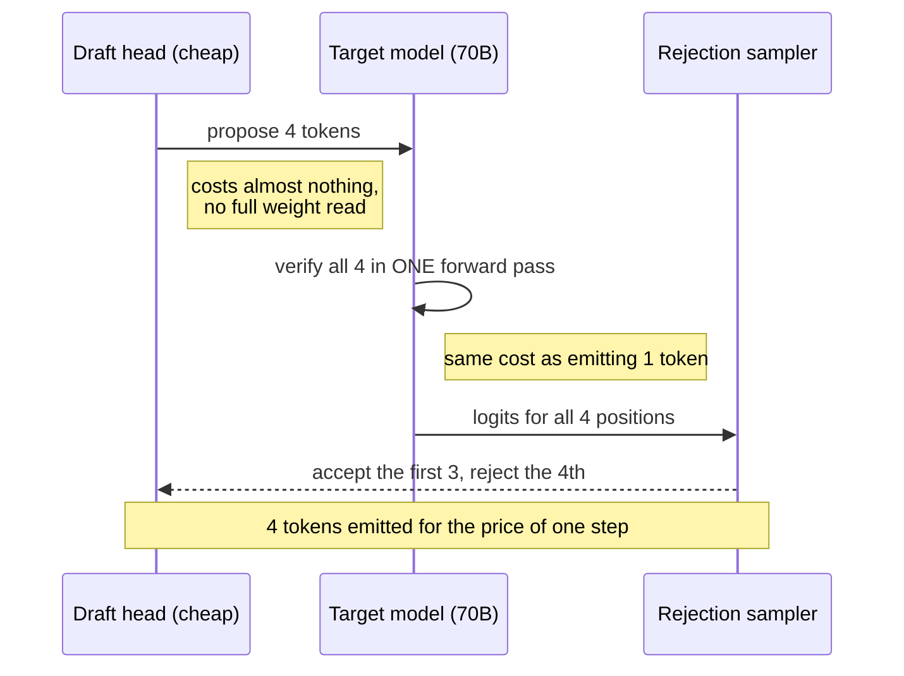

&nbsp;

vLLM is a program that holds a large language model in GPU memory and answers many people's requests at once. It is an engine, not a model. You hand it Llama or Qwen or DeepSeek, and it hands you an API that stays fast when a thousand people are using it at the same time.

One fact explains nearly everything it does: serving a model is a memory problem, not a compute problem.

That sounds wrong. GPUs are math machines and a model is a pile of math. But I once watched a deployment where doubling the GPUs barely moved throughput, while halving the maximum context length nearly quadrupled the number of users we could serve. Memory was the wall, and the thing filling it was not the model. This post is about what that thing is, and what every part of the engine does about it.

**Table of Contents**

1. [What vLLM Actually Is](#1-what-vllm-actually-is)
2. [The Words You Need First](#2-the-words-you-need-first)
3. [Why Your GPU Fills Up](#3-why-your-gpu-fills-up)
4. [Paging the Cache](#4-paging-the-cache)
5. [Taking Requests as They Arrive](#5-taking-requests-as-they-arrive)
6. [Reading and Writing Are Different Jobs](#6-reading-and-writing-are-different-jobs)
7. [Splitting a Model Across GPUs](#7-splitting-a-model-across-gpus)
8. [Reusing Work You Already Did](#8-reusing-work-you-already-did)
9. [Guessing Ahead](#9-guessing-ahead)
10. [Using Smaller Numbers](#10-using-smaller-numbers)
11. [One Model, Many Customers](#11-one-model-many-customers)
12. [Forcing Valid JSON](#12-forcing-valid-json)
13. [Agents Are a Different Workload](#13-agents-are-a-different-workload)
14. [The Four Numbers You Get Judged On](#14-the-four-numbers-you-get-judged-on)
15. [Splitting Prefill and Decode Across Machines](#15-splitting-prefill-and-decode-across-machines)
16. [What Actually Breaks](#16-what-actually-breaks)
17. [What the Job Asks For](#17-what-the-job-asks-for)
18. [Where to Start](#18-where-to-start)

## 1. What vLLM Actually Is

vLLM came out of UC Berkeley's Sky Computing Lab, was published at SOSP 2023, and as of May 2026 lives under the PyTorch Foundation. It is the default open-source way to put a model behind an API.

The name is the idea. The `v` is virtual memory, the operating system trick, and it is worth spelling out because the entire design is a copy of it.

When a program asks your laptop for memory, it believes it received one long unbroken stretch. It did not. The operating system hands out small fixed-size pages scattered anywhere in physical RAM, and keeps a table recording where each one went. The program never notices. That trick is why your machine can run more programs than would fit if each one needed a tidy contiguous slab.

vLLM does exactly that to the model's memory. That is the paper in one sentence. Everything below is a consequence.

Five claims get repeated about vLLM that are slightly off, and the corrected versions are more useful than the originals:

| What gets repeated | What the source says |
| --- | --- |
| "vLLM stands for virtual LLM" | Neither the paper nor the launch post expands it. The `v` is virtual memory. "Virtual LLM" is a backronym |
| "Old systems wasted 60 to 80 percent of VRAM" | 60 to 80 percent of **KV cache** memory. Weights and activations are not in that number |
| "PagedAttention gives 2x to 4x throughput" | 2x to 4x against FasterTransformer and Orca. Against HuggingFace Transformers, up to 24x. The baseline does a lot of work in that sentence |
| "It keeps the GPU 80 percent utilized" | Utilization was never the goal. A server can be 95 percent busy and miss every deadline |
| "Prefix caching cuts prefill 30 to 50 percent" | Depends entirely on how much prefix your traffic shares. A single number here is a guess |

## 2. The Words You Need First

Six terms carry the rest of the post.

| Term | What it actually is |
| --- | --- |
| **Token** | a chunk of text, usually three or four characters. Models read and write tokens, not words |
| **vLLM** | the program that holds a model in GPU memory and answers many people's requests at once. An engine, not a model |
| **KV cache** | the model's notes on every token it has read so far. It keeps them for the whole request, and they are enormous |
| **Prefill** | reading your prompt. Happens once, all at once |
| **Decode** | writing the answer, one token at a time, re-reading those notes at every step |
| **Goodput** | requests per second that actually arrived fast enough to be useful |

The KV cache is the one to sit with, because the rest of the post is about it.

To write the next token, the model looks back at every token so far and decides which ones matter. It does that with three vectors per token. The **query** is what the current token is looking for. The **key** is what each earlier token advertises about itself. The **value** is what that token actually contributes if you decide to use it. Compare the query against every key, turn those scores into weights, and the output is a weighted blend of the values. In folder terms: keys are the labels you scan, values are the contents you pull out.

Keys and values never change once computed, so the model stores them and reuses them at every later step. Queries are computed fresh each step and discarded, which is why it is a KV cache and not a QKV cache. Without that store, generating each new token would mean recomputing keys and values for the whole conversation, which is quadratic work. With it, the store grows by one entry per token and is freed only when the request finishes. It is the model's short-term memory, and it is what you actually run out of.

## 3. Why Your GPU Fills Up

Now put numbers on that store, because the numbers are the argument.

Weights are the easy part. At BF16 (bfloat16, 16 bits per number) each parameter takes 2 bytes, so a 70 billion parameter model is 140 GB. Fixed, computable on a napkin, done.

The KV cache is the part that moves, and it decides how many people you can serve. Its size is:

**bytes per token = 2 (key and value) x layers x kv_heads x head_dim x bytes_per_element**

Read that as: for every token, at every layer, every KV head stores one key vector and one value vector, each `head_dim` numbers long.

For Llama 3 70B at BF16: 2 x 80 layers x 8 KV heads x 128 dimensions x 2 bytes = 327,680 bytes. Roughly 0.31 MB for a single token, which looks harmless. Now run it forward.

Two H100s give you 160 GB. The weights take 140. Call it 15 GB left for cache once activations and overhead are paid. That is about 48,000 tokens of cache in total, across everybody using the server. At 8k context that is six users. Six.

How the model was trained decides this, months before you ever deploy it:

| Attention layout | KV heads | Bytes per token (BF16, 80 layers) | Seen in |
| --- | --- | --- | --- |
| Multi-head (MHA) | 64 | ~2.6 MB | older 70B-class models |
| Grouped-query (GQA) | 8 | ~0.33 MB | Llama 3 70B |
| Multi-head latent (MLA) | compressed to one latent vector | roughly 70 KB reported | DeepSeek V2 and V3 |

GQA lets several query heads share one set of folders, an 8x cut for a small quality cost. MLA compresses the folders into a smaller learned form. Neither is a switch you flip at serving time. You inherit whichever one the model was built with, which is why the architecture section of a model card is a capacity planning document.

**Question:** *How many users can you serve at 32k context on this hardware?*

Do the arithmetic out loud. Pull layers, KV heads, head dimension and dtype from the model config, run the formula, then multiply by the context length. For Llama 3 70B, 0.31 MB per token times 32,768 tokens is about 10 GB of cache for one user at full context. Against 15 GB of free memory, that is one user, not six. Then the levers, in order of what they buy: a model with fewer KV heads, a shorter advertised context, an FP8 KV cache to roughly double capacity, or more GPUs, which splits the cache as well as the weights.

## 4. Paging the Cache

So the cache is what fills the card. The next question is how it gets stored, and the old answer was bad.

Before vLLM, each request got one contiguous block of memory sized for the longest it might ever grow, because attention kernels wanted contiguous memory to run fast. You reserve room for 8,192 tokens, the user asks a 200-token question and stops, and 97 percent of that reservation sits there doing nothing while other users are turned away. Multiply by every request on the server. That is where 60 to 80 percent of cache memory went.

PagedAttention gives up on contiguous. The cache is cut into fixed blocks of 16 tokens, and each sequence keeps a block table: my tokens 0 to 15 live in physical block 47, my tokens 16 to 31 live in physical block 12, and so on. Blocks sit anywhere in a shared pool. The attention kernel is rewritten to gather each block through that table rather than walking a straight line through memory, so a sequence's keys and values can be physically scattered while staying logically contiguous. That is the same indirection your OS does with a page table, applied to attention.

Press play and watch two requests that share a system prompt land in the pool:

<PagedKVSim />

Waste drops under 4 percent, and more usefully it becomes bounded. The only thing left to waste is the unfilled tail of each sequence's last block. Sixteen tokens of slop per request instead of thousands.

Sharing then falls out for free. If two sequences need the same tokens, they point at the same physical block. A reference count tracks how many owners it has, and the block is copied only when one of them writes something different. Prefix caching, parallel sampling and beam search are that one mechanism wearing different hats.

**Question:** *Why blocks of 16 tokens and not 1?*

A block of one token wastes nothing at all, which sounds ideal until you count what it costs. The block table grows to one entry per token, the kernel does a lookup per token instead of per sixteen, and memory locality falls apart because consecutive tokens land in unrelated places. Sixteen is where the waste is already negligible and the bookkeeping is still cheap. It is a tuning constant rather than a law: bigger blocks index less and waste more tail, smaller blocks the reverse.

## 5. Taking Requests as They Arrive

Memory is now packed tightly. The next thing being wasted is time.

Static batching is the obvious way to serve many requests: collect a group, run them together, return them together. It behaves like an airport shuttle, which leaves when the last passenger boards and finishes when the last passenger gets off. Requests do not finish together. One request generating 800 tokens holds the whole batch open while the requests that stopped at 30 tokens sit in their seats, holding their memory, producing nothing.

Continuous batching, or iteration-level scheduling, makes the scheduling decision per forward pass instead of per batch. After every single pass, the engine drops finished sequences, frees their blocks, and pulls waiting requests into the empty slots. The batch is re-formed every step, so nobody waits on anybody else's ending.

Press play and watch the red, which is memory you are paying for and not using:

<BatchingSim />

The V1 engine goes further and mixes prefill and decode work inside one step, which V0 could not. There is no prefill phase anymore. There is a token budget per step and a scheduler filling it with whatever is waiting.

When the block pool does run dry, the engine does not crash. It preempts, which means evicting a running request to make room:

| Mode | What happens to the blocks | Cost to resume |
| --- | --- | --- |
| Recompute (V1 default) | thrown away, request re-prefilled later as if new | a second prefill |
| Swap | copied out to CPU memory and back | two PCIe transfers of the whole sequence |

Recompute won because prefill is fast and PCIe is not. Reading the prompt again is cheaper than shipping a long cache across the bus twice. The practical point is that a rising preemption count is the earliest honest signal that you undersized your KV pool, and it appears long before anything looks wrong from the outside.

**Question:** *What happens when the KV cache fills up in the middle of generation?*

The wrong answer is an out-of-memory crash. The engine preempts: it picks a running sequence, throws its blocks back into the pool, and puts the request back in the queue to be re-prefilled when there is room. It is a throughput hit, not a failure, and the user sees latency rather than an error. Two things follow. The alternative is swapping the cache to CPU memory, which vLLM supports but does not default to, because two PCIe transfers cost more than one recompute. And preemption is a symptom: if the counter is climbing, either `--max-num-seqs` is too high for your context length or `--gpu-memory-utilization` is leaving memory on the table.

## 6. Reading and Writing Are Different Jobs

That scheduler puts prefill and decode work in the same step, which only makes sense once you know how different those two jobs are. If I could keep one section of this post, it would be this one.

Prefill and decode are not two phases of the same workload. They are two different machines sharing one GPU, and they stress the hardware in opposite ways.

| | Prefill | Decode |
| --- | --- | --- |
| What it does | reads the whole prompt at once | produces one token per step |
| Parallelism | thousands of tokens in one matmul | one token per sequence |
| Bound by | compute | memory bandwidth |
| Bigger batch | little help, already saturated | large help, amortizes the weight read |
| Latency it owns | TTFT | inter-token latency |

The decode row is the one to understand. To produce a single token, the GPU streams the model's entire weight set out of memory and does very little arithmetic with it on the way past. The ratio of math done to bytes moved is called **arithmetic intensity**, and decode's is dismal: roughly two floating point operations per weight byte read, on hardware built for hundreds. So the memory bus is saturated while the arithmetic units sit mostly idle.

The fix is to reuse each byte for more work. At batch 1 on a 70B model you read 140 GB to emit one token. At batch 64 you read the same 140 GB and emit 64, because every sequence in the batch multiplies against the same weights while they are on the chip. The truck is driving to the store either way, so you may as well fill it. That is why throughput scales so violently with batch size, and why a GPU that looks nearly idle can still feel slow.

Prefill is the opposite. Your whole prompt arrives at once, so thousands of tokens go through one matmul, arithmetic intensity is high, the compute units are already saturated, and a bigger batch buys almost nothing.

Which sets up the fight. Prefill wants to own an entire step. Decode wants steps to come often. A 32k prompt arrives, a naive scheduler spends a whole step on it, and every user currently streaming watches their text freeze mid-sentence. **Chunked prefill** is the referee: long prompts get sliced, and every step carries all the decode work plus one slice.

Which brings us to the knobs. There are only a few, and each one negotiates the same tension:

| Symptom | Knob | Direction | What it costs |
| --- | --- | --- | --- |
| Streaming stutters when long prompts arrive | `--max-num-batched-tokens` | lower | worse TTFT on those prompts |
| TTFT high, throughput low | `--max-num-batched-tokens` | raise (8192 and up) | more inter-token jitter |
| Preemptions in the logs | `--gpu-memory-utilization` | raise toward 0.90 | less headroom on spikes |
| Preemptions and no headroom left | `--max-num-seqs` | lower | fewer concurrent users |
| A few huge requests hurting everyone | `--max-model-len` | lower | you advertise less context |

One thing worth checking today: `max_num_batched_tokens` was 512 in older releases and is 8192 in current V1 online serving. A config file carried forward from 2024 is leaving throughput on the floor.

At batch 1 there is one more culprit with nothing to do with the model. Every GPU operation has to be launched by the CPU, and launching thousands of tiny operations can take longer than running them. **CUDA graphs** record one step's launches and replay the recording, and `torch.compile` fuses operations so there are fewer of them to launch. Both are on by default. If you set `--enforce-eager` while debugging a crash, remember to take it back off.

**Question:** *Why does a bigger batch raise throughput but hurt per-user latency?*

Because decode is bandwidth bound. Each step reads the entire weight set regardless of how many sequences are in the batch, so adding sequences gets you more tokens out of the same read, and throughput climbs almost linearly until compute or memory runs out. But each step also takes longer, since there is more work in the pass, and every user's next token waits for the whole step to finish. You are amortizing a fixed cost across more people and charging each of them a little more waiting for the privilege. Which side you want depends on whether you are billed per token or judged per user.

## 7. Splitting a Model Across GPUs

Sections 3 through 6 assumed everything fits on the card. A 70B model needs 140 GB and no single GPU has that, so you split it. There are four ways, all confusingly called parallelism, and they split different things:

| Split | What gets divided | Good for | The cost |
| --- | --- | --- | --- |
| Tensor (TP) | every layer's matmuls, across GPUs | latency | talks to peers constantly, needs NVLink |
| Pipeline (PP) | whole layers, into stages | crossing nodes on a slow link | a bubble: later stages wait on earlier ones |
| Data (DP) | nothing, full replicas | throughput, and it is the simplest thing | every replica needs the full weights |
| Expert (EP) | the experts of an MoE layer | sparse models, most experts idle per token | load imbalance when a few experts run hot |

Tensor parallel is the one worth picturing. It splits the weight matrices themselves, so every GPU holds a slice of every layer, computes a partial result, and then an all-reduce sums the slices back into the real answer. That all-reduce happens at every layer, twice per transformer block, which is why TP is fast inside a node with NVLink and falls apart across a network.

So the default layout is: TP equal to the number of GPUs in a node, PP equal to the number of nodes. The chatty split stays on NVLink inside a box, and the quiet split crosses the slower network between boxes.

Two things people miss. TP splits the KV cache too, not only the weights, so TP=4 buys more headroom than the weight math alone suggests. And for mixture-of-experts models vLLM's shipped recipe is a hybrid: data parallel for the attention layers, expert parallel for the expert layers, because those two parts of the model want opposite things.

**Question:** *You have a 70B model and eight GPUs. How do you lay it out?*

Start by asking what you are optimizing, because there is no single right answer. TP=8 across the node if latency is what matters: every GPU works on every token, so per-token time drops, and each request gets the largest possible KV pool, which matters at long context. Two TP=4 replicas behind a load balancer if throughput is what matters: two independent engines, half the cross-GPU traffic each, and a failure takes out half your capacity instead of all of it. Pipeline parallel does not belong in this answer at all, since all eight GPUs are in one node; it is what you reach for when you have to cross a node boundary.

## 8. Reusing Work You Already Did

Everything so far makes work cheaper. This makes some of it disappear.

As blocks fill, they get hashed. The hash of a block chains in the hash of the block before it, so two blocks match only when the entire prefix leading up to them matches, which is what makes reuse safe. When a new request arrives, the engine hashes its prompt the same way and points at the longest run of blocks that already exists instead of recomputing them. Your system prompt gets prefilled once ever, rather than once per request.

Two constraints get missed constantly.

It is **block aligned**. The hash covers a whole 16-token block, so changing one token near the start of your system prompt changes that block's hash and every hash after it. The entire cached prefix dies.

And it accelerates **prefill only**. Decode produces tokens nobody has seen before, so there is nothing to look up.

| Workload | Prefix reuse | What caching buys |
| --- | --- | --- |
| Multi-turn chat | every turn resends the conversation | large, and grows |
| Agent loop | identical system prompt and tool schemas every step | large and consistent |
| RAG over a hot corpus | shared instructions, varying chunks | moderate |
| Unique one-off prompts | almost none | close to nothing |
| Timestamp at the top of the prompt | none | nothing, and this is a real bug people ship |

That last row deserves its own sentence. Put a timestamp, request ID or username at the **start** of your system prompt and you have disabled prefix caching across the entire fleet, silently, while every dashboard stays green. Variable content goes at the end.

SGLang pushed the idea further with RadixAttention, a tree keyed on token prefix so sharing happens at any branch point rather than only at block boundaries. Independent 2026 benchmarks on prefix-heavy traffic put it around 29 percent ahead of vLLM; on unique prompts the gap largely closes. At fleet scale the problem moves to routing, since a cache-blind load balancer will happily send a request to the one replica that does not have its prefix.

**Question:** *Why does prefix caching do nothing for decode?*

Because caching is lookup, and decode has nothing to look up. Prefill computes keys and values for tokens that already exist in the prompt, so if an identical run of tokens was processed before, its blocks are still in the pool and can be pointed at instead of recomputed. Decode generates tokens that have never existed, one at a time, so every step must compute fresh entries. The practical consequence: prefix caching moves TTFT and does not touch inter-token latency, which means it is a large win for agent and chat traffic and close to nothing for a workload with short prompts and long generations.

## 9. Guessing Ahead

Prefix caching skips work that was already done. Speculative decoding buys speed with work you might throw away.

Go back to arithmetic intensity. At low batch the GPU streams weights past compute units that sit mostly idle. Speculative decoding spends those idle units. A cheap draft, either a small model or a small extra head attached to the big one, guesses the next few tokens. The real model then checks all of those guesses in a single forward pass, and a rejection sampler keeps the longest correct run.

Verification is nearly free for the same reason batching is. Checking 4 tokens means pushing 4 positions through the network together, which is a prefill-shaped operation, and the weight read that dominates a decode step happens once regardless. You pay one step's bandwidth and get up to 4 tokens out of it.

The clever part is that the sampler is built so the output distribution is provably identical to what the big model would have produced alone. You are not trading quality for speed. You are getting the same tokens sooner.

The number to watch is **acceptance length**: how many drafted tokens survive per step. vLLM's July 2026 EAGLE-3 measurements are 2.77 on average, 3.16 on coding, 3.12 on math, and essentially flat from 1K to 32K context, so the speedup does not decay on long prompts. On Llama 3.3 70B at batch 1 that works out to a 3.0x to 3.4x decode speedup.

Then the catch that decides whether to switch it on. It shortens the gap between tokens and **leaves TTFT untouched**, because the first token still needs a full prefill. And it pays best at low batch. Once the GPU is saturated there are no idle arithmetic units left to spend, and every rejected draft is pure waste. It is a latency feature for interactive traffic, not a throughput feature.

**Question:** *Does speculative decoding change the quality of the output?*

No, and that is a guarantee rather than an observation. The rejection sampler accepts each drafted token with a probability derived from both models' distributions, and when it rejects one it resamples from a corrected distribution, so the result is mathematically the same as sampling from the target model directly. What changes is speed, and only sometimes. The second half of that sentence is the part people leave out: it cuts inter-token latency at low batch, does nothing for TTFT, and at high batch it can make things slower, because there are no spare FLOPs and every rejected draft is work you paid for and threw away.

## 10. Using Smaller Numbers

Speculative decoding spends spare compute to buy latency. Quantization spends precision to buy memory.

It means storing numbers with fewer bits: a weight kept in 16 bits becomes 8, or 4. The model gets smaller, moves through memory faster, and is slightly less exact. Three different things can be quantized, and they buy three different things:

| You quantize | You get | You risk |
| --- | --- | --- |
| Weights | smaller model, more room for KV, faster weight streaming | modest accuracy loss |
| Activations | actually hitting the low-precision tensor cores, so real speed | more sensitive, needs calibration |
| KV cache | roughly double the concurrent tokens | quality loss at long context if pushed too far |

The naming tells you which you are getting. **W8A8** means 8-bit weights and 8-bit activations, so the multiply itself runs on the low-precision tensor cores and you get real speed. **W4A16** is weight-only: four-bit weights fed into 16-bit math.

That second form is the sharp edge. Weight-only formats have to dequantize each weight back to 16 bits before the matmul, and that unpacking is work the unquantized model never does. If you were not short on memory in the first place, AWQ or GPTQ can leave you **slower** than where you started. Weight-only is a memory technique that people keep reaching for as a speed technique.

| Format | Type | Memory | Reach for it when |
| --- | --- | --- | --- |
| FP8 (W8A8) | weights and activations | about half | the default on Hopper and later. Start here |
| NVFP4 | weights and activations | ~3.5x smaller than FP16 | you are on Blackwell. Emulated elsewhere, so memory only |
| AWQ / GPTQ | weight only | ~4x on weights | it does not fit and W8A8 is unavailable for that model |
| FP8 KV cache | the cache, not the model | doubles token capacity | you are cache-bound, which at long context you probably are |

NVFP4 reports under 1 percent accuracy loss on DeepSeek-R1-0528 across MMLU-Pro, GPQA Diamond and LiveCodeBench, and vLLM, SGLang and TensorRT-LLM all support it as of August 2026. None of this is NVIDIA-only either: vLLM runs on AMD Instinct with hardware FP8 and FP4 on MI300X and the MI350 series.

**Question:** *You are out of memory. Do you quantize the weights or the KV cache?*

Answer with a question back, because which one is bigger flips with context length. Short prompts on a large model: weights dominate, quantize those. Long context with many concurrent users: the cache dominates, and an FP8 KV cache roughly doubles how many tokens you can hold. Run the arithmetic from section 3 and the answer is usually obvious. One refinement: prefer a format that quantizes activations too, because weight-only formats hand you memory without speed, and sometimes cost you speed.

## 11. One Model, Many Customers

Quantization makes one model cheaper. This one makes many models unnecessary.

The base model loads once. A LoRA adapter is a low-rank correction to that model's weight matrices: rather than store a whole new matrix, you store two thin matrices whose product gets added to the original at inference time. At rank 16 against a 4096-wide layer that is under 1 percent of the original numbers, which is how an adapter comes out at tens of megabytes against a model of tens of gigabytes.

vLLM pages adapters in and out of GPU memory the way it pages KV blocks, which is the S-LoRA idea, and runs batches where different rows use different adapters, which is the Punica idea. One GPU, one copy of the weights, many customers.

| Approach | Cost of 20 tasks | Time to add task 21 | Quality ceiling |
| --- | --- | --- | --- |
| 20 fine-tuned 70B models | 20 deployments | a new deployment | highest per task |
| One 70B, prompted per task | 1 deployment | a prompt edit | lowest |
| One 8B base plus 20 adapters | 1 deployment | upload a file | high on narrow tasks |

That third row is why "small model plus adapters" is a default rather than a compromise. A narrow task never needed 70B of general world knowledge in the first place.

One precision the marketing blurs. How many adapters you can **register** is large, because adapters are small. How many can be live in a single **batch** is `--max-loras`, and that number is usually single digits. If your traffic spreads thinly across many adapters at once you will feel it, and the fix is routing, sending one adapter's traffic to one replica.

**Question:** *How do you serve 50 customers with 50 different fine-tunes on one GPU?*

One base model plus 50 LoRA adapters, paged in and out like cache blocks, with a batch that can mix rows belonging to different adapters. The constraint is what separates a real answer from a repeated headline: registering 50 adapters is fine, but only `--max-loras` of them can be active in one batch, so scattered traffic across all 50 at once will thrash. Route by adapter so each replica serves a handful, and pick the smallest base model the tasks tolerate, because the whole point is that narrow tasks do not need a large general model.

## 12. Forcing Valid JSON

Adapters change what the model knows. This changes what it is allowed to say.

At every step the model produces a score, a logit, for every token in its vocabulary, and the sampler picks one of them. Constrained decoding puts a grammar engine between those two steps. Your schema is compiled into a state machine, the engine tracks which state the partial output is in, and at each step it sets the logit of every token that would leave the grammar to negative infinity. The sampler then chooses from what survives. Invalid output is not caught after the fact. It cannot be generated.

| | Prompt and retry | Constrained decoding |
| --- | --- | --- |
| Where it runs | your application | the sampler, inside the engine |
| Invalid output is | caught after generation | never generated |
| Cost of a failure | a full extra generation | none |
| Cost when it works | zero | grammar compilation, cached after the first request |

This became a serving concern rather than an application concern because of agents. Many tool calls per task, and retried tokens are the most expensive tokens you will ever generate. XGrammar-2 (May 2026, now in vLLM, SGLang and TensorRT-LLM) handles the obvious objection with cross-grammar caching, so an agent calling the same tools over and over pays compilation roughly once per process instead of once per request.

**Question:** *How do you guarantee a model returns valid JSON?*

Mask the logits against a compiled grammar, so tokens that would break the schema are given no probability at all. That is a serving answer. "Prompt carefully and retry on a parse error" is an application answer, and it costs a full extra generation every time it fires, which at agent volumes is the most expensive failure mode you have. On cost: compiling a grammar is not free, but it is cached, so a service calling the same tools amortizes it to nothing.

## 13. Agents Are a Different Workload

Everything so far assumed a request is one prompt and one answer. Agents broke that assumption, and it happened to everyone at once because of MCP.

The Model Context Protocol standardizes how a model reaches tools: a client opens a session with a server advertising typed tools and their schemas. It solved a real integration mess. But those schemas are text, they sit near the top of the context, and they go out again on every single turn.

| | Chat request | Agent trajectory |
| --- | --- | --- |
| Shape | one prompt, one long generation | many turns, each a big prefill and a short generation |
| Prefill to decode | decode dominates | prefill dominates, often heavily |
| Prompt content | mostly the user | mostly tool schemas and prior tool output |
| Across turns | independent | one growing conversation the engine sees as unrelated requests |
| What it stresses | memory bandwidth | prefill compute and the prefix cache |

That fourth row is the expensive one. A ten-step agent loop is ten separate requests to the engine, each re-sending the entire history. Prefix caching is the only reason that is survivable, which is why section 8 matters most to anyone building agents.

It is also why **agent hints**, Session-ID and Correlation-ID headers, are on the Q3 2026 roadmap. Today the engine sees fifteen unrelated requests. With those headers it can know they are one agent's trajectory and keep the cache accordingly.

**Question:** *What changes when you serve agents instead of chat?*

The ratio inverts. Chat is mostly decode, so you are bandwidth bound and you tune for batch size and inter-token latency. An agent turn is a huge prefill followed by a short generation, so you become prefill bound, and the levers change with it: prefix cache hit rate becomes the metric that decides your cost, cache-aware routing starts to matter more than load balancing, and speculative decoding, which only helps decode, mostly stops paying. There is an operational trap alongside it: agents re-send the same tool schemas every turn, so anything variable near the top of the prompt destroys the one optimization keeping the workload affordable.

## 14. The Four Numbers You Get Judged On

That is a lot of knobs. These are the numbers that tell you whether turning any of them helped, and there are only four:

| Metric | What it is | Rule of thumb (p99) | What moves it |
| --- | --- | --- | --- |
| TTFT | arrival to first token | under ~300ms reads as instant, ~800ms correlates with abandonment | prefill cost, queue depth, cache hits |
| ITL / TPOT | gap between tokens | around 50ms reads as continuous text | batch size, bandwidth, speculative decoding |
| Throughput | output tokens per second | as high as the above permit | batching, paging, quantization |
| Goodput | throughput that meets both SLOs | the only one that matters | everything above |

Goodput is the one to report, and it should replace "the GPU is 80 percent utilized" in your dashboards. Throughput counts tokens. Goodput counts tokens that arrived in time to be useful. A server running at 95 percent utilization while violating every latency target has excellent throughput and zero goodput. The version finance understands is cost per million tokens **at your SLO**, which is the sentence that gets budget approved.

You measure all of it with `vllm bench serve`. Sweep `--request-rate` instead of sampling one load point, and use traffic shaped like yours, because random prompts will badly understate the cache hit rate of an agent service.

One boundary worth stating out loud. These are **serving** metrics. Not one of them says whether the answer was any good. Quantization in particular can hold every latency target while quietly regressing quality, which is why it needs an eval gate rather than a benchmark. That is a [separate system](/write-up/evaluation-engineering).

**Question:** *What is goodput, and why is throughput not enough?*

Goodput is throughput that met your latency targets, so a request that arrived after its TTFT budget counts as zero no matter how many tokens it produced. Throughput alone is not enough because it can be raised by making every individual user's experience worse: push the batch size up, every step gets longer, tokens per second climbs, and every user waits past their deadline. Goodput refuses to reward that. The version that gets acted on is cost per million tokens at a stated SLO, because it forces the latency target into the same sentence as the money.

## 15. Splitting Prefill and Decode Across Machines

Section 6 said prefill and decode are two different machines sharing a GPU. Take that literally and you get the last two years of infrastructure.

Disaggregated serving puts prefill and decode in separate pools and ships the cache between them, so each pool can be sized against your real prompt-to-generation ratio instead of a compromise between them. Around it sit cache-aware routing, tiered offload to CPU and disk, and context parallelism for long-context agentic work.

Three engines are worth knowing, and the choice is less dramatic than the benchmark posts suggest:

| Pick | When | What it costs |
| --- | --- | --- |
| vLLM | the default. Widest hardware reach, biggest ecosystem, fastest new-model support | a little performance versus a compiled engine |
| SGLang | prefix sharing dominates: agents, RAG on a hot corpus | smaller ecosystem, one more thing to operate |
| TensorRT-LLM | all-in on NVIDIA, latency worth real operational pain | compiled engines per model per GPU |

My honest read is that the gaps between these three are smaller than the benchmark posts suggest, and much smaller than the gap between a tuned deployment and an untuned one.

**Question:** *Why would you split prefill and decode onto separate machines?*

Because they are bound by different things and scale independently. Prefill is compute bound and wants large batches on fewer, faster cards. Decode is bandwidth bound and wants many long-lived replicas. On one GPU each is compromising for the other, and a long prompt can stall everyone's streaming. Split them and you size each pool to your real prompt-to-generation ratio. The cost is the follow-up question: every request now ships its KV cache across the network between pools, so you need a fast interconnect, and you have added a routing problem, since the router should prefer a replica that already holds the prefix.

## 16. What Actually Breaks

None of the above is what wakes you up. This is:

| Symptom | Usually is | How you confirm |
| --- | --- | --- |
| OOM at startup, never under load | `--gpu-memory-utilization` or `--max-model-len` too high for this model | it fails before any traffic |
| Fine for hours, then latency doubles | preemption. Traffic drifted longer and the pool is thrashing | the preemption counter |
| p50 fine, p99 awful | one long prompt monopolising steps | correlate spikes with prompt length |
| Throughput fell off a cliff after a deploy | cache hit rate collapsed. Someone edited the top of the system prompt | prefix cache hit rate |
| Quantized and it got slower | weight-only format on a box that was not memory-bound | compare against the unquantized baseline |
| Good on one replica, poor across ten | cache-blind routing | per-replica hit rate |
| Speculative decoding did nothing | you enabled it on saturated batch traffic | acceptance length and average batch size |

There is a pattern in that right-hand column. The metric that identifies the problem is never the metric that alerted you. Alerts fire on latency; causes live in preemption counts, cache hit rates and acceptance lengths. Instrument those on day one, because you will not think to add them at 3am.

## 17. What the Job Asks For

Reading 2026 inference postings at NVIDIA, Together AI and Red Hat, the same list keeps appearing:

| What postings ask for | What it means day to day | Where it appears above |
| --- | --- | --- |
| Python plus C++/CUDA | you can read the engine, not only configure it | all of it |
| Kernel work: Triton, CUTLASS | you can fix an attention or quantized matmul kernel | sections 4 and 10 |
| `torch.compile`, CUDA graphs | graph capture, fusion, launch overhead | section 6 |
| Quantization | FP8, NVFP4, calibration, accuracy recovery | section 10 |
| KV cache systems | paging, radix trees, tiered stores | sections 4 and 8 |
| NCCL, Kubernetes | TP and PP across a node, then a cluster | sections 7 and 15 |
| The engines | vLLM, SGLang, TensorRT-LLM | section 15 |

The top of the market wants kernel-level people and there are not many of them. The larger and faster-growing slice wants someone who can take an open engine, understand the memory arithmetic, tune it against an SLO, and keep it alive on Kubernetes. That is reachable, and it is roughly this post.

## 18. Where to Start

Find the row that describes you. The third column matters as much as the second, because most wasted effort here is a good technique aimed at the wrong bottleneck.

| Your situation | First move | Skip |
| --- | --- | --- |
| Never served a model | Serve an 8B model, compute its KV bytes per token by hand, predict your limit before measuring | everything else |
| It works but feels slow | Measure TTFT and inter-token latency separately. Different causes, different fixes | quantization, spec decoding |
| Stuttering under load | Lower `--max-num-batched-tokens`, watch the preemption counter | new hardware |
| Out of memory | Decide whether weights or cache dominate, quantize that one | rewriting the app |
| Agent or RAG traffic | Prefix caching, then audit your prompt for variable content near the top | speculative decoding |
| Interactive chat at low batch | Speculative decoding, and check `--enforce-eager` is off | more replicas |
| Many fine-tuned models | One base plus LoRA adapters, routed by adapter | more deployments |
| Model does not fit on one GPU | TP within the node first, PP only when you cross nodes | multi-node layouts |

What I would leave you with is not any single mechanism, because those keep changing. It is that all of them answer two facts small enough to hold in your head: **the KV cache is what fills your GPU, and prefill and decode are two different machines sharing it.** Paging solves the first. Continuous batching, chunked prefill, speculative decoding and disaggregation are all negotiations over the second.

When something new shows up next quarter, you can place it in about thirty seconds by asking which of those two it attacks. That is more durable than knowing this quarter's flags.

## Sources and further reading

**The engine**

- [Efficient Memory Management for LLM Serving with PagedAttention (Kwon et al., SOSP 2023)](https://arxiv.org/abs/2309.06180)
- [vLLM: Easy, Fast, and Cheap LLM Serving with PagedAttention (2023)](https://vllm.ai/blog/2023-06-20-vllm), source of the 60 to 80 percent and under 4 percent figures
- [Inside vLLM: Anatomy of a High-Throughput LLM Inference System (2025)](https://vllm.ai/blog/2025-09-05-anatomy-of-vllm), the best description of the scheduler and block manager
- [Optimization and Tuning](https://docs.vllm.ai/en/latest/configuration/optimization/), [Parallelism and Scaling](https://docs.vllm.ai/en/stable/serving/parallelism_scaling/), [Expert Parallel Deployment](https://docs.vllm.ai/en/latest/serving/expert_parallel_deployment/), and the [Benchmark CLI](https://docs.vllm.ai/en/latest/benchmarking/cli/)

**Techniques**

- [EAGLE-3 Speculative Decoding (vLLM, 2026)](https://vllm.ai/blog/2026-07-13-eagle-3-amd-instinct), acceptance length measurements
- [FP8 W8A8](https://docs.vllm.ai/en/stable/features/quantization/llm_compressor/fp8/) and [NVFP4 with LLM Compressor](https://docs.vllm.ai/projects/llm-compressor/en/latest/examples/quantization_w4a4_fp4/)
- [S-LoRA (2023)](https://arxiv.org/abs/2311.03285) and [Punica (2023)](https://arxiv.org/abs/2310.18547), the two ideas behind vLLM's multi-LoRA
- [XGrammar-2 (MLC, 2026)](https://blog.mlc.ai/2026/05/04/xgrammar-2-fast-customizable-structured-generation)

**Cluster and landscape**

- [vLLM Roadmap Q3 2026](https://github.com/vllm-project/vllm/issues/48168), including agent hints and tiered KV offload
- [vLLM Router (2025)](https://vllm.ai/blog/2025-12-13-vllm-router-release) and [KV-Cache Wins You Can See (llm-d)](https://llm-d.ai/blog/kvcache-wins-you-can-see), project benchmarks, read as such
- [Serving Agentic Workloads at Scale with vLLM x Mooncake (2026)](https://vllm.ai/blog/2026-05-06-mooncake-store)
- [On Evaluating Performance of LLM Inference Serving Systems (2025)](https://arxiv.org/abs/2507.09019), on goodput

**Mine**

- [CPU, GPU, TPU: A Hardware Deep Dive](/write-up/cpu-gpu-tpu-hardware-deep-dive), the memory bandwidth story underneath all of this
- [PyTorch: From First Tensor to Distributed Training](/write-up/pytorch-from-first-tensor-to-distributed-training), for tensor parallelism
- [Evaluation Engineering](/write-up/evaluation-engineering), for the quality side these metrics do not cover
- [The AI Engineer's Swiss Knife](/write-up/ai-engineers-swiss-knife), for token economics
