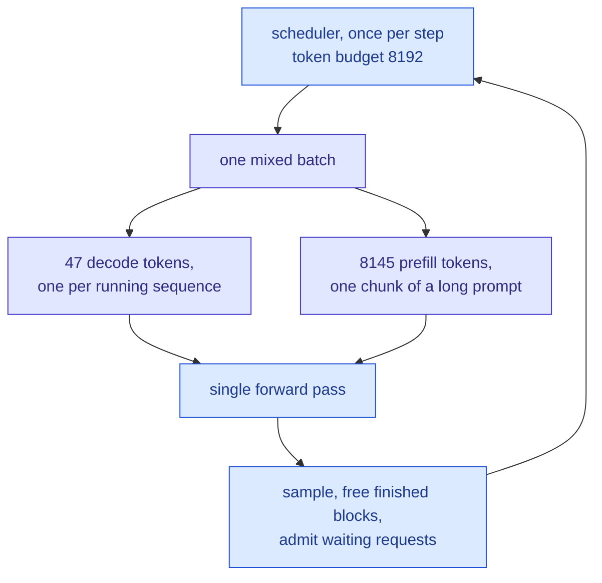
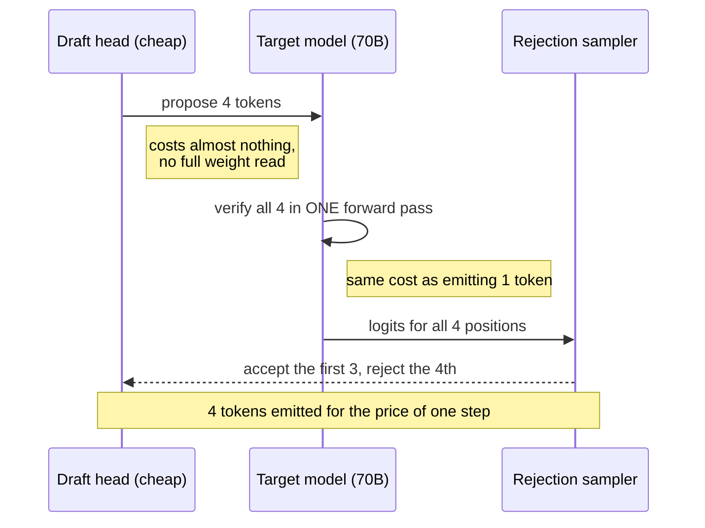
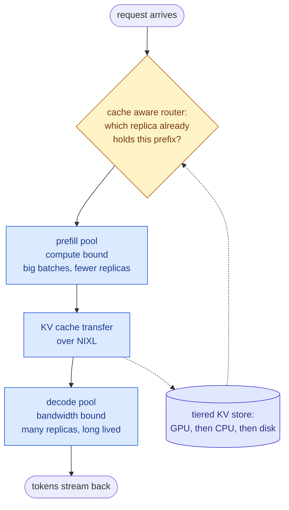

&nbsp;

vLLM is an open-source engine for serving large language models: it holds a model in GPU memory and answers many users' requests at once, as fast as the hardware allows. The name comes straight from operating systems. The `v` is virtual memory, because its core idea, **PagedAttention**, manages GPU memory for the KV cache the way an OS manages virtual memory pages.

One fact makes the whole engine make sense: **serving is a memory problem, not a compute problem**. I once watched a deployment where doubling the GPUs barely moved throughput, while halving the max context nearly quadrupled the number of concurrent users. What fills the GPU is not the model, it is the KV cache. Everything vLLM does follows from that.

## First, the words

Six terms carry this whole post. In plain language:

| Term | What it actually is |
| --- | --- |
| **Token** | a chunk of text, usually three or four characters. Models read and write tokens, not words |
| **vLLM** | the program that holds a model in GPU memory and answers many people's requests at once, as fast as possible. An engine, not a model |
| **KV cache** | the model's notes on every token it has read so far. It must keep them for the whole conversation, and they are enormous |
| **Prefill** | reading your prompt. Happens once, all at once |
| **Decode** | writing the answer, one token at a time, re-reading those notes at every step |
| **Goodput** | requests per second that actually arrived fast enough to be useful |

The KV cache is the one to sit with. Attention means every new token looks back at every previous token, so the model stores a key and a value for each one and reuses them forever after. Without that cache it would re-read the entire conversation to produce each new word. With it, the cache grows with every token and never shrinks until the request ends. It is the model's short-term memory, and it is what you actually run out of.

## The name is the whole idea

vLLM came out of UC Berkeley's Sky Computing Lab, was published at SOSP 2023, and as of May 2026 lives under the PyTorch Foundation.

The virtual memory analogy is worth spelling out. An operating system does not hand a program one contiguous slab of physical memory and hope. It hands out pages, keeps a page table, and lets the physical layout be a mess. vLLM does exactly that to the KV cache. Everything below is a consequence.

Five things get repeated about vLLM that are slightly off, and the corrected versions are more useful:

| What gets repeated | What the source says |
| --- | --- |
| "vLLM stands for virtual LLM" | Neither the paper nor the launch post expands it. The `v` is virtual memory. "Virtual LLM" is a backronym |
| "Old systems wasted 60 to 80 percent of VRAM" | 60 to 80 percent of **KV cache** memory. Weights and activations are not in that number |
| "PagedAttention gives 2x to 4x throughput" | 2x to 4x against FasterTransformer and Orca. Against HuggingFace Transformers, up to 24x. The baseline does a lot of work in that sentence |
| "It keeps the GPU 80 percent utilized" | Utilization was never the goal. A server can be 95 percent busy and miss every deadline |
| "Prefix caching cuts prefill 30 to 50 percent" | Depends entirely on how much prefix your traffic shares. A single number here is a guess |

## Where the memory actually goes

Weights are the easy part: fixed, computable on a napkin, 140 GB for a 70B model at BF16. The KV cache is the part that moves, and it decides how many people you can serve.

**bytes per token = 2 (key and value) x layers x kv_heads x head_dim x bytes_per_element**

For Llama 3 70B at BF16: 2 x 80 x 8 x 128 x 2 = 327,680 bytes. Roughly 0.31 MB for one token. Now run it forward. Two H100s hold 160 GB, the weights take 140 GB, leaving maybe 15 GB for cache. That is about 48,000 tokens. Six users at 8k context. Six.

How a model was trained decides this, years before you deploy it:

| Attention layout | KV heads | Bytes per token (BF16, 80 layers) | Seen in |
| --- | --- | --- | --- |
| Multi-head (MHA) | 64 | ~2.6 MB | older 70B-class models |
| Grouped-query (GQA) | 8 | ~0.33 MB | Llama 3 70B |
| Multi-head latent (MLA) | compressed to one latent vector | roughly 70 KB reported | DeepSeek V2 and V3 |

GQA lets several query heads share one set of notes, an 8x cut for a small quality cost. MLA compresses the notes into a smaller learned form. Neither is an inference trick you can turn on; you inherit whichever one the model was built with.

**What they actually ask:** how many concurrent users at 32k context fit on this hardware. They want the arithmetic out loud, then the levers: fewer KV heads, shorter context, a quantized cache, more GPUs.

## PagedAttention in one picture

Before vLLM, each sequence got one contiguous slab of memory sized to the longest it might get, because attention kernels wanted contiguous memory. Reserve for 8,192 tokens, receive a 200-token question, waste 97 percent of the slab. That is where 60 to 80 percent goes.

PagedAttention breaks the cache into fixed blocks of 16 tokens. Each sequence keeps a block table mapping its logical blocks to physical blocks sitting anywhere in a shared pool.

Press play and watch two requests that share a system prompt land in the pool:

<PagedKVSim />

Waste drops under 4 percent and becomes bounded: the only thing left to waste is the half-filled last block of each sequence. Sixteen tokens of slop instead of thousands.

Sharing falls out for free. Two sequences point at the same physical block, a refcount tracks it, and it is copied only when one writes something different. Prefix caching, parallel sampling and beam search are that one mechanism wearing different hats.

**What they actually ask:** why 16 and not 1. Block size trades wasted space against table overhead and kernel efficiency. Blocks of one waste nothing and wreck memory locality.

## The batch is a lie

Static batching collects a group of requests and waits for all of them. They do not finish together, so one request generating 800 tokens holds the batch open while the ones that stopped at 30 tokens sit there holding memory and doing nothing.

Continuous batching schedules per iteration instead. After every forward pass, finished sequences release their blocks and waiting requests take the slots. Press play and watch the red, which is what you are paying for and not using:

<BatchingSim />

The V1 engine also mixes prefill and decode inside one step, which V0 could not. There is no prefill phase anymore, just a token budget and a scheduler filling it.

When the pool runs dry it does not crash, it **preempts**:

| Mode | What happens to the blocks | Cost to resume |
| --- | --- | --- |
| Recompute (V1 default) | thrown away, request re-prefilled later as if new | a second prefill |
| Swap | copied out to CPU memory and back | two PCIe transfers of the whole sequence |

Recompute won because prefill is fast and PCIe is not. A rising preemption count is the earliest honest signal that you undersized KV, and it shows up long before anything looks broken from outside.

**What they actually ask:** what happens when the KV pool fills up mid-generation. The wrong answer is OOM.

## The asymmetry everything else falls out of

If I could keep one section it would be this. Prefill and decode are not two phases of one workload. They are two different machines sharing a GPU.

| | Prefill | Decode |
| --- | --- | --- |
| What it does | reads the whole prompt at once | produces one token per step |
| Parallelism | thousands of tokens in one matmul | one token per sequence |
| Bound by | compute | memory bandwidth |
| Bigger batch | little help, already saturated | large help, amortizes the weight read |
| Latency it owns | TTFT | inter-token latency |

Decode is bandwidth-bound for a simple reason: to produce one token you stream the model's entire weight set out of memory and barely compute with it. Batch 1 on a 70B model reads 140 GB to emit one token. Batch 64 reads the same 140 GB and emits 64. That explains why throughput scales so violently with batch size.

It also sets up the fight. Prefill wants to monopolize a step, decode wants steps to come often. A 32k prompt arrives, a naive scheduler spends a whole step on it, and every user currently streaming watches their text freeze. **Chunked prefill** is the referee:

Which brings us to the knobs. There are only a few, and each negotiates the same tension:

| Symptom | Knob | Direction | What it costs |
| --- | --- | --- | --- |
| Streaming stutters when long prompts arrive | `--max-num-batched-tokens` | lower | worse TTFT on those prompts |
| TTFT high, throughput low | `--max-num-batched-tokens` | raise (8192 and up) | more inter-token jitter |
| Preemptions in the logs | `--gpu-memory-utilization` | raise toward 0.90 | less headroom on spikes |
| Preemptions and no headroom left | `--max-num-seqs` | lower | fewer concurrent users |
| A few huge requests hurting everyone | `--max-model-len` | lower | you advertise less context |

One thing to check: `max_num_batched_tokens` was 512 in older releases and is 8192 in current V1 online serving. A config carried forward from 2024 is leaving throughput on the floor.

At batch 1 there is one more culprit that has nothing to do with the model: launching the kernels can cost more than running them. `torch.compile` and **CUDA graphs** (which record a step's launches once and replay them) exist for exactly this. If you set `--enforce-eager` while debugging, take it back off.

**What they actually ask:** why does raising batch size increase throughput but hurt per-user latency. "Prefill is compute-bound, decode is bandwidth-bound, batching amortizes the weight read but lengthens every step" is a different conversation from listing features.

## When one GPU is not enough

A 70B model needs 140 GB and no single GPU has that, so you split it. Four ways, all confusingly called parallelism:

| Split | What gets divided | Good for | The cost |
| --- | --- | --- | --- |
| Tensor (TP) | every layer's matmuls, across GPUs | latency | talks to peers constantly, needs NVLink |
| Pipeline (PP) | whole layers, into stages | crossing nodes on a slow link | a bubble: later stages wait on earlier ones |
| Data (DP) | nothing, full replicas | throughput, and it is the simplest thing | every replica needs the full weights |
| Expert (EP) | the experts of an MoE layer | sparse models, most experts idle per token | load imbalance when a few experts run hot |

Start with TP equal to the GPUs in a node and PP equal to the number of nodes, so the chatty split sits on NVLink and the quiet one on the network. Two things people miss: TP splits the **KV cache** too, so TP=4 buys more headroom than the weight math suggests, and for mixture-of-experts models vLLM's shipped recipe is a hybrid, data parallel for attention and expert parallel for the experts, because those layers want opposite things.

**What they actually ask:** 70B model, eight GPUs, how do you lay it out. TP=8 if you want latency, two TP=4 replicas behind a balancer if you want throughput.

## The cheapest win you are probably not taking

Blocks get hashed as they fill. A new request hashes its prompt the same way and reuses the longest matching run instead of recomputing it. Two constraints get missed constantly.

It is **block aligned**: change one token near the start of your system prompt and every block after it hashes differently, so the whole cached prefix dies. And it accelerates **prefill only**, because decode is producing tokens that were never cached.

| Workload | Prefix reuse | What caching buys |
| --- | --- | --- |
| Multi-turn chat | every turn resends the conversation | large, and grows |
| Agent loop | identical system prompt and tool schemas every step | large and consistent |
| RAG over a hot corpus | shared instructions, varying chunks | moderate |
| Unique one-off prompts | almost none | close to nothing |
| Timestamp at the top of the prompt | none | nothing, and this is a real bug people ship |

That last row deserves its own sentence. Put a timestamp, request ID or username at the **start** of your system prompt and you have disabled prefix caching fleet-wide, silently, while every dashboard stays green. Variable content goes at the end.

SGLang pushed this further with RadixAttention, a tree keyed on token prefix so sharing happens at any branch point. Independent 2026 benchmarks on prefix-heavy traffic put it around 29 percent ahead of vLLM; on unique prompts the gap largely closes. At fleet scale the problem moves to routing, since a cache-blind balancer will send a request to the one replica lacking its prefix.

**What they actually ask:** why does prefix caching not help decode. And, if they are good, what a timestamp in the system prompt does to your hit rate.

## Buying latency with compute

At low batch the arithmetic units sit idle while weights stream past. Speculative decoding spends them: a cheap draft proposes k tokens, the real model checks all k in one pass, and a sampler accepts the longest correct run. The output distribution is provably identical, so you are not trading quality.

The metric is **acceptance length**, how many drafted tokens survive per step. vLLM's July 2026 EAGLE-3 numbers: 2.77 on average, 3.16 on coding, 3.12 on math, and essentially flat from 1K to 32K context, so the speedup does not decay on long prompts. On Llama 3.3 70B at batch 1 that is a 3.0x to 3.4x decode speedup.

Then the catch that decides whether to turn it on. It cuts inter-token latency and **leaves TTFT alone**, and it pays best at low batch. Once the GPU is saturated there are no idle FLOPs to spend and rejected drafts are pure waste. It is a latency feature for interactive traffic, not a throughput feature.

**What they actually ask:** does it change output quality. No. The follow-up you should volunteer is the batch size at which it stops paying.

## Where quantization actually pays

Three different things get quantized and they buy three different things:

| You quantize | You get | You risk |
| --- | --- | --- |
| Weights | smaller model, more room for KV, faster weight streaming | modest accuracy loss |
| Activations | actually hitting the low-precision tensor cores, so real speed | more sensitive, needs calibration |
| KV cache | roughly double the concurrent tokens | quality loss at long context if pushed too far |

The sharp edge: weight-only formats dequantize before the matmul, and that is work. If you were not short on memory, AWQ or GPTQ can leave you **slower** than the unquantized model. Weight-only is a memory technique people reach for as a speed technique.

| Format | Type | Memory | Reach for it when |
| --- | --- | --- | --- |
| FP8 (W8A8) | weights and activations | about half | the default on Hopper and later. Start here |
| NVFP4 | weights and activations | ~3.5x smaller than FP16 | you are on Blackwell. Emulated elsewhere, so memory only |
| AWQ / GPTQ | weight only | ~4x on weights | it does not fit and W8A8 is unavailable for that model |
| FP8 KV cache | the cache, not the model | doubles token capacity | you are cache-bound, which at long context you probably are |

NVFP4 reports under 1 percent accuracy loss on DeepSeek-R1-0528 across MMLU-Pro, GPQA Diamond and LiveCodeBench, and vLLM, SGLang and TensorRT-LLM all support it as of August 2026. And none of this is NVIDIA-only: vLLM runs on AMD Instinct with hardware FP8 and FP4 on MI300X and the MI350 series.

**What they actually ask:** you are out of memory, do you quantize the weights or the cache. A good answer starts with a question back: at your context length, which is actually bigger?

## One model, many tenants

The base model loads once. LoRA adapters are small deltas, and vLLM pages them the way it pages KV blocks (the S-LoRA idea) while computing batches where different rows use different adapters (the Punica idea).

| Approach | Cost of 20 tasks | Time to add task 21 | Quality ceiling |
| --- | --- | --- | --- |
| 20 fine-tuned 70B models | 20 deployments | a new deployment | highest per task |
| One 70B, prompted per task | 1 deployment | a prompt edit | lowest |
| One 8B base plus 20 adapters | 1 deployment | upload a file | high on narrow tasks |

That third row is why "small model plus adapters" is a default rather than a compromise. A narrow task never needed 70B of general world knowledge.

One precision the marketing blurs: how many adapters you can **register** is large, because adapters are small. How many can be in one **batch** is `--max-loras`, and that is usually single digits. If your traffic spreads thinly across many adapters at once you will feel it, and the fix is routing one adapter to one replica.

**What they actually ask:** how do you serve 50 customers with 50 fine-tunes on one GPU. If the answer is 50 deployments, the interview has moved on.

## Making it return valid JSON

At each step the model produces scores over the whole vocabulary. A grammar engine masks the tokens that would make the output invalid, and you sample from what remains. Valid JSON by construction rather than by retry.

| | Prompt and retry | Constrained decoding |
| --- | --- | --- |
| Where it runs | your application | the sampler, inside the engine |
| Invalid output is | caught after generation | never generated |
| Cost of a failure | a full extra generation | none |
| Cost when it works | zero | grammar compilation, cached after the first request |

This became a serving concern because of agents: many tool calls per task, and retried tokens are the most expensive tokens you generate. XGrammar-2 (May 2026, now in vLLM, SGLang and TensorRT-LLM) handles the obvious objection with cross-grammar caching, so an agent calling the same tools pays compilation about once per process rather than once per request.

**What they actually ask:** how do you guarantee valid JSON. "Prompt carefully and retry" is an application answer. "Mask the logits against a compiled grammar" is a serving answer.

## Serving agents is a different workload

Everything above assumed a request is a prompt and a response. Agents broke that.

The Model Context Protocol is why this hit everyone at once. MCP standardizes how a model reaches tools: a client opens a session with a server advertising typed tools and their schemas. It solved a real integration mess. But those schemas are text, they sit near the top of the context, and they go out on every turn.

| | Chat request | Agent trajectory |
| --- | --- | --- |
| Shape | one prompt, one long generation | many turns, each a big prefill and a short generation |
| Prefill to decode | decode dominates | prefill dominates, often heavily |
| Prompt content | mostly the user | mostly tool schemas and prior tool output |
| Across turns | independent | one growing conversation the engine sees as unrelated requests |
| What it stresses | memory bandwidth | prefill compute and the prefix cache |

That fourth row is the expensive one. A ten-step agent loop is ten requests to the engine, each re-sending the whole history. Prefix caching is what makes that survivable, which is why the caching section matters most for anyone building agents.

It is also why **agent hints**, Session-ID and Correlation-ID, are on the Q3 2026 roadmap. Today the engine sees fifteen unrelated requests. With those it can know they are one agent's trajectory and keep the cache accordingly.

**What they actually ask:** what changes when you serve agents instead of chat. The prefill-to-decode ratio inverts, and the levers invert with it.

## What you actually get measured on

Four numbers, and really only four:

| Metric | What it is | Rule of thumb (p99) | What moves it |
| --- | --- | --- | --- |
| TTFT | arrival to first token | under ~300ms reads as instant, ~800ms correlates with abandonment | prefill cost, queue depth, cache hits |
| ITL / TPOT | gap between tokens | around 50ms reads as continuous text | batch size, bandwidth, speculative decoding |
| Throughput | output tokens per second | as high as the above permit | batching, paging, quantization |
| Goodput | throughput that meets both SLOs | the only one that matters | everything above |

Goodput should replace "80 percent GPU utilization" in your reporting. Throughput counts tokens; goodput counts tokens that arrived in time to be useful. A server at 95 percent utilization and 100 percent SLO violation has excellent throughput and zero goodput. The version finance cares about is cost per million tokens **at your SLO**, which is the sentence that gets budget approved.

You get these from `vllm bench serve`. Sweep `--request-rate` rather than sampling one load point, and use traffic shaped like yours, since random prompts will understate the cache hit rate of an agent service badly.

One boundary: these are **serving** metrics. None says whether the answer was good. Quantization especially can hold every latency SLO while regressing quality, so it needs an eval gate, not a benchmark. That is a [separate system](/write-up/evaluation-engineering).

**What they actually ask:** define goodput and why throughput alone is not enough.

## The stuff that grew around the engine

If prefill and decode want different hardware profiles, why are they on the same GPU?

Disaggregated serving splits them onto separate pools and moves the cache between them, so you size each against your real prompt-to-generation ratio. Around it sit cache-aware routing, tiered offload to CPU and disk, and context parallelism for long-context agentic work.

| Pick | When | What it costs |
| --- | --- | --- |
| vLLM | the default. Widest hardware reach, biggest ecosystem, fastest new-model support | a little performance versus a compiled engine |
| SGLang | prefix sharing dominates: agents, RAG on a hot corpus | smaller ecosystem, one more thing to operate |
| TensorRT-LLM | all-in on NVIDIA, latency worth real operational pain | compiled engines per model per GPU |

My honest read: the gaps between these are smaller than the benchmark posts suggest, and much smaller than the gap between a tuned deployment and an untuned one.

**What they actually ask:** why split prefill and decode across machines. Different bottlenecks, independent scaling. Then: what it costs, which is a KV transfer per request.

## What actually breaks

None of the above is what pages you. This is:

| Symptom | Usually is | How you confirm |
| --- | --- | --- |
| OOM at startup, never under load | `--gpu-memory-utilization` or `--max-model-len` too high for this model | it fails before any traffic |
| Fine for hours, then latency doubles | preemption. Traffic drifted longer and the pool is thrashing | the preemption counter |
| p50 fine, p99 awful | one long prompt monopolising steps | correlate spikes with prompt length |
| Throughput fell off a cliff after a deploy | cache hit rate collapsed. Someone edited the top of the system prompt | prefix cache hit rate |
| Quantized and it got slower | weight-only format on a box that was not memory-bound | compare against the unquantized baseline |
| Good on one replica, poor across ten | cache-blind routing | per-replica hit rate |
| Speculative decoding did nothing | you enabled it on saturated batch traffic | acceptance length and average batch size |

The pattern: the metric that identifies the problem is never the metric that alerted you. Alerts fire on latency; causes live in preemption counts, hit rates and acceptance lengths. Instrument those on day one.

## What the job actually asks for

Reading 2026 inference postings at NVIDIA, Together AI and Red Hat, the same list keeps appearing:

| What postings ask for | What it means day to day | Where it appears above |
| --- | --- | --- |
| Python plus C++/CUDA | you can read the engine, not only configure it | all of it |
| Kernel work: Triton, CUTLASS | you can fix an attention or quantized matmul kernel | PagedAttention, quantization |
| `torch.compile`, CUDA graphs | graph capture, fusion, launch overhead | the asymmetry section |
| Quantization | FP8, NVFP4, calibration, accuracy recovery | quantization |
| KV cache systems | paging, radix trees, tiered stores | paging, prefix caching |
| NCCL, Kubernetes | TP and PP across a node, then a cluster | parallelism, disaggregation |
| The engines | vLLM, SGLang, TensorRT-LLM | engine picker |

The top of the market wants kernel-level people and there are not many. The larger, faster-growing slice wants someone who can take an open engine, understand the memory arithmetic, tune it against an SLO, and keep it alive on Kubernetes. That is reachable, and it is roughly this post.

## Where to start

| Your situation | First move | Skip |
| --- | --- | --- |
| Never served a model | Serve an 8B model, compute its KV bytes per token by hand, predict your limit before measuring | everything else |
| It works but feels slow | Measure TTFT and inter-token latency separately. Different causes, different fixes | quantization, spec decoding |
| Stuttering under load | Lower `--max-num-batched-tokens`, watch the preemption counter | new hardware |
| Out of memory | Decide whether weights or cache dominate, quantize that one | rewriting the app |
| Agent or RAG traffic | Prefix caching, then audit your prompt for variable content near the top | speculative decoding |
| Interactive chat at low batch | Speculative decoding, and check `--enforce-eager` is off | more replicas |
| Many fine-tuned models | One base plus LoRA adapters, routed by adapter | more deployments |
| Model does not fit on one GPU | TP within the node first, PP only when you cross nodes | multi-node layouts |

What I would leave you with is not any single mechanism, because those keep changing. It is that all of them answer two facts small enough to hold in your head: **the KV cache is what fills your GPU, and prefill and decode are two different machines sharing it.** Paging solves the first. Continuous batching, chunked prefill, speculative decoding and disaggregation are all negotiations over the second.

When something new shows up next quarter, you can place it in about thirty seconds by asking which of those two it attacks. That is more durable than knowing this quarter's flags.

## Sources and further reading

**The engine**

- [Efficient Memory Management for LLM Serving with PagedAttention (Kwon et al., SOSP 2023)](https://arxiv.org/abs/2309.06180)
- [vLLM: Easy, Fast, and Cheap LLM Serving with PagedAttention (2023)](https://vllm.ai/blog/2023-06-20-vllm), source of the 60 to 80 percent and under 4 percent figures
- [Inside vLLM: Anatomy of a High-Throughput LLM Inference System (2025)](https://vllm.ai/blog/2025-09-05-anatomy-of-vllm), the best description of the scheduler and block manager
- [Optimization and Tuning](https://docs.vllm.ai/en/latest/configuration/optimization/), [Parallelism and Scaling](https://docs.vllm.ai/en/stable/serving/parallelism_scaling/), [Expert Parallel Deployment](https://docs.vllm.ai/en/latest/serving/expert_parallel_deployment/), and the [Benchmark CLI](https://docs.vllm.ai/en/latest/benchmarking/cli/)

**Techniques**

- [EAGLE-3 Speculative Decoding (vLLM, 2026)](https://vllm.ai/blog/2026-07-13-eagle-3-amd-instinct), acceptance length measurements
- [FP8 W8A8](https://docs.vllm.ai/en/stable/features/quantization/llm_compressor/fp8/) and [NVFP4 with LLM Compressor](https://docs.vllm.ai/projects/llm-compressor/en/latest/examples/quantization_w4a4_fp4/)
- [S-LoRA (2023)](https://arxiv.org/abs/2311.03285) and [Punica (2023)](https://arxiv.org/abs/2310.18547), the two ideas behind vLLM's multi-LoRA
- [XGrammar-2 (MLC, 2026)](https://blog.mlc.ai/2026/05/04/xgrammar-2-fast-customizable-structured-generation)

**Cluster and landscape**

- [vLLM Roadmap Q3 2026](https://github.com/vllm-project/vllm/issues/48168), including agent hints and tiered KV offload
- [vLLM Router (2025)](https://vllm.ai/blog/2025-12-13-vllm-router-release) and [KV-Cache Wins You Can See (llm-d)](https://llm-d.ai/blog/kvcache-wins-you-can-see), project benchmarks, read as such
- [Serving Agentic Workloads at Scale with vLLM x Mooncake (2026)](https://vllm.ai/blog/2026-05-06-mooncake-store)
- [On Evaluating Performance of LLM Inference Serving Systems (2025)](https://arxiv.org/abs/2507.09019), on goodput

**Mine**

- [CPU, GPU, TPU: A Hardware Deep Dive](/write-up/cpu-gpu-tpu-hardware-deep-dive), the memory bandwidth story underneath all of this
- [PyTorch: From First Tensor to Distributed Training](/write-up/pytorch-from-first-tensor-to-distributed-training), for tensor parallelism
- [Evaluation Engineering](/write-up/evaluation-engineering), for the quality side these metrics do not cover
- [The AI Engineer's Swiss Knife](/write-up/ai-engineers-swiss-knife), for token economics
