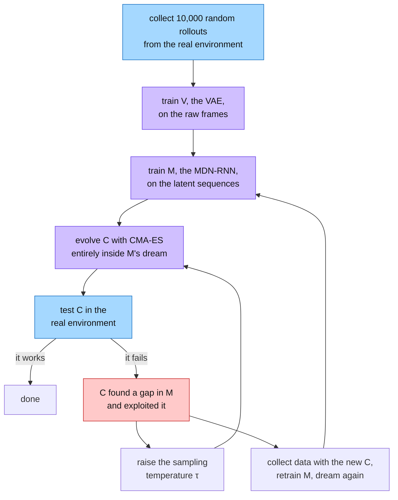
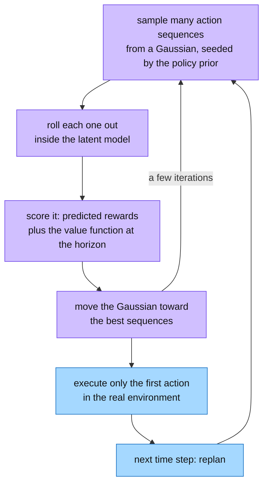
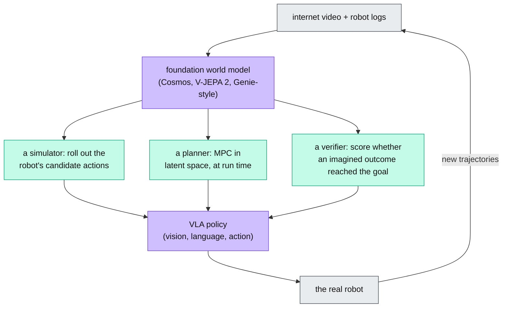

&nbsp;

## The Cognitive and Computational Imperative for World Models

A baseball batter has a few hundred milliseconds to decide how to swing. That is less time than the visual signal needs to reach the parts of the brain that reason. The batter hits the ball anyway, because an internal model predicts where the ball will be from the first few frames of its flight.

Jay Forrester, who founded system dynamics, made the same point about all of human thinking. We never process the full world. We keep a compressed mental model of a few concepts and how they relate, and we run that model forward to guess what happens next.

In reinforcement learning (RL), this idea is called a **world model**: a learned function that predicts the next state of the environment from the current state and the action taken. Formally, it approximates the transition dynamics of a Markov Decision Process (MDP):

$$
P(s_{t+1}, r_{t+1} \mid s_t, a_t)
$$

In plain terms: given where I am ($s_t$) and what I do ($a_t$), how likely is each possible next situation ($s_{t+1}$) and reward ($r_{t+1}$)?

The point of having one is to plan in imagination. A model-free agent needs millions of real interactions to learn a good policy, which is slow in a video game and dangerous or expensive on a robot or a car. An agent with a world model can roll out futures inside the model, compare actions it never took, search over sequences of moves, and update its policy without touching the real world. It can even practice rare disasters safely.

<Sketch name="wm-imagined-rollout" alt="Two loops side by side: an agent acting in the real environment, which is slow and unsafe, and the same agent acting inside a world model, which is fast and safe; real transitions train the model" />

*Visual 1: The same agent can learn by acting in the world or by acting in a model of it. Real transitions are what train the model.*

## The Foundational V+M+C Architecture

The modern recipe for this comes from David Ha and Jürgen Schmidhuber's 2018 paper "World Models". Their idea was to split the agent into a large, unsupervised world model that does the understanding and a tiny controller that does the deciding. This mirrors the brain: a lot of subconscious sensory processing, a little deliberate choice.

The agent has three parts, applied in order.

- **V, the Vision model,** compresses space. Each frame of the game (a 64×64×3 image) goes through a Variational Autoencoder (VAE) and comes out as a 32-number latent vector $z_t$. The pixel noise is gone; the position of things is kept.
- **M, the Memory model,** compresses time. A recurrent network with a Mixture Density Network head (MDN-RNN) takes $z_t$, the action $a_t$, and its own hidden state $h_t$, and predicts a distribution over the next latent, $P(z_{t+1} \mid a_t, z_t, h_t)$. It outputs a mixture of Gaussians rather than one point, because the future is uncertain and a single average prediction turns blurry.
- **C, the Controller,** is a single linear layer from $[z_t, h_t]$ to the action $a_t$. It is deliberately tiny.

<Sketch name="vmc-pipeline" alt="A vertical pipeline: a frame goes into V, which produces z; z and the action go into M, which produces h; z and h go into the linear controller C, which produces the action; the environment returns the next frame" />

*Visual 2: V sees, M remembers and predicts, C acts. Almost all the parameters live in V and M.*

Because C is so small, it can be trained without backpropagation. Ha and Schmidhuber used CMA-ES, an evolution strategy that keeps a population of candidate weight vectors and moves toward the ones that score well. That sidesteps the exploding and vanishing gradients that come from unrolling an RL objective over long horizons.

| Component | Architecture | Parameters (approx.) | Job | Output |
| --- | --- | --- | --- | --- |
| V (Vision) | Variational autoencoder | 4,348,000 | Compress the frame | Latent vector $z_t$ |
| M (Memory) | MDN-RNN | 422,000 | Predict the next latent and its uncertainty | $P(z_{t+1} \mid a_t, z_t, h_t)$ |
| C (Controller) | Linear layer | 867 | Choose the action | Action $a_t$ |

## Learning in the Dream and Adversarial Exploitation

Once V and M are trained, the agent no longer needs the game. M can predict $z_{t+1}$ from its own previous prediction, C can pick $a_{t+1}$ from that, and the loop runs forever inside the model. Ha and Schmidhuber called this training in the dream, and the pipeline looks like this.

The failure branch is the interesting one. The world model is only an approximation, and an optimizer will find its gaps. In VizDoom, the evolved controller discovered a sequence of moves that stopped M from ever generating enemy fireballs. The agent lived forever in its dream and died at once in the real game.

Two fixes are standard. A temperature parameter $\tau$ makes M sample with more noise, so the controller cannot rely on a loophole that only exists at one exact prediction. And for harder tasks, training alternates: act in the real environment with the current policy, retrain M on the new data to close the gaps, then dream again.

## The Dreamer Lineage and Continuous Latent Dynamics

The dream idea was picked up at DeepMind by Danijar Hafner and colleagues, whose PlaNet, DreamerV1, DreamerV2, and DreamerV3 turned it into a general-purpose agent. Every version shares one heart, the Recurrent State-Space Model.

### The Recurrent State-Space Model (RSSM)

A plain recurrent network is deterministic, so it cannot represent several possible futures. A purely stochastic model resamples noise at every step and forgets what happened a while ago. The RSSM keeps both: a deterministic recurrent state $h_t$ for memory and a stochastic state $z_t$ for uncertainty.

<Sketch name="rssm" alt="A chain of deterministic states h(t-1), h(t), h(t+1) connected by a GRU; below h(t), a prior z predicted from h alone and a posterior z that also sees the image, joined by a KL loss; z and the action feed the next h" />

*Visual 3: The RSSM. The prior guesses $z_t$ from memory alone, the posterior also sees the image, and a KL term pulls the two together. In imagination only the prior is used.*

From DreamerV2 onward, $z_t$ is discrete: 32 categorical variables, each with 32 classes. Categorical latents avoid the posterior collapse that plagues Gaussian VAEs, represent multimodal futures without a mixture density head, and are more expressive. Training passes gradients through the hard samples with a straight-through estimator: forward with the one-hot sample, backward with the softmax.

### Robustness across Domains: Symlog and KL Balancing

Discrete latents made the model strong; the next problem was making one configuration work everywhere. DreamerV3's headline result is that it masters over 150 tasks, from continuous control to sparse-reward Atari to 3D worlds like DeepMind Lab and Minecraft, with a single fixed set of hyperparameters.

The obstacle was scale. A robot task might pay rewards between 0 and 1, while an Atari game pays tens of thousands. DreamerV3 applies the same squashing function to observations, rewards, and value estimates:

$$
\operatorname{symlog}(x) = \operatorname{sign}(x)\, \ln(|x| + 1)
$$

In plain terms: small numbers pass through almost unchanged, and huge numbers get compressed like a logarithm, in both directions. Every environment then produces losses of about the same size. Rewards are not regressed as a scalar either; the symlog-transformed return is spread over a set of bins and predicted as a two-hot categorical target.

The RSSM's loss has three parts: a prediction loss (reconstruct the input, the reward, and the continuation flag), a dynamics loss, and a representation loss. The last two are KL divergences between the prior and the posterior. Matched too tightly, the model finds a degenerate solution: uninformative latents that make the KL trivially small. DreamerV3 fixes this with **free bits**, clipping each KL term below 1 nat, and with **KL balancing**, which weights the two directions differently. Once the two distributions are close enough, the KL stops pulling and the capacity goes to prediction.

The actor and critic then train on imagined trajectories using λ-returns, and their gradients never flow back into the world model. Representation learning and policy learning run side by side without destabilizing each other.

| Result | DreamerV3 on Minecraft |
| --- | --- |
| Task | Collect a diamond from scratch, no demonstrations or curriculum |
| Environment steps | First diamond after about 29 million in the 2023 preprint; every agent finds one within 100 million in the 2025 Nature version |
| Compute | About 17 GPU-days in the preprint; one GPU for 9 days in the Nature version |
| Scaling | Larger models are both more data-efficient and better at convergence |

That was the first time any algorithm mined a diamond in Minecraft without human data. It takes thousands of correct steps in a procedurally generated 3D world with a very sparse reward.

## Value Equivalence and the MuZero Paradigm

Dreamer grounds its latent space by reconstructing observations. A parallel line of work asks whether that is necessary at all. The **Value Equivalence Principle** says no: an agent does not need to predict what the world looks like, only the quantities that matter for planning.

Two models are value equivalent for a set of policies and value functions if they give the same Bellman updates. If an imagined transition produces the same reward and the same future value as the real one, the two models are interchangeable for policy improvement, however different their states look. Enlarge the set of policies and functions and the equivalence class shrinks toward the true MDP. When the functions are all value functions, this is called Proper Value Equivalence.

MuZero is the model built on that principle. It has three networks.

<Sketch name="muzero" alt="Past frames go through the representation function h into hidden state s0; the dynamics function g takes s0 and an action to s1 and a reward, then to s2; the prediction function f maps each state to a policy and a value; a note says there is no decoder" />

*Visual 4: MuZero's three functions. Search unrolls $g$ from $s_0$, and the loss only cares about rewards, values, and policies.*

- **Representation $h$** maps the recent observations to an initial hidden state $s_0$.
- **Dynamics $g$** maps a state and an action to the next state and the reward.
- **Prediction $f$** maps a state to a policy $p_k$ and a value $v_k$.

Planning is Monte Carlo Tree Search. The policy prior guides which branches to expand, a PUCT rule balances exploring and exploiting, and the value estimate $v_k$ stands in for the leaves so no rollouts to the end of the game are needed. Training pushes the predicted rewards, values, and policies toward the real rewards, the bootstrapped returns, and the search's visit counts. Nothing asks $s_k$ to resemble a screen, so background pixels that never affect the score are ignored. The result was superhuman play in Chess, Go, Shogi, and the full Atari suite.

## Implicit World Models and TD-MPC for Continuous Control

MuZero's search enumerates discrete moves, which does not work for a robot that outputs joint torques. **Temporal Difference Model Predictive Control (TD-MPC)** and its successor TD-MPC2 keep the decoder-free, value-equivalent model and swap the tree search for trajectory optimization in latent space.

The model, called Task-Oriented Latent Dynamics (TOLD), has the same three pieces as MuZero. The planner is Model Predictive Path Integral (MPPI) control:

### Mitigating Policy Mismatch and Scaling the Architecture

TD-MPC2 showed that this implicit model scales. One 317-million-parameter agent learned 80 tasks across the DeepMind Control suite and Meta-World, with different robots and different action sizes, and no per-task tuning. Actions are zero-padded to the largest dimension and the unused entries are masked out during planning.

Scaling exposed a theoretical crack. The value function is trained by temporal difference learning under the parameterized policy, but the data comes from the MPPI planner, which behaves differently. The value network keeps being asked about states the policy would never visit, and it overestimates them. On a 61-degree-of-freedom humanoid this bias is severe. The fix is to keep the two close: regularize the policy toward the planner that gathered the data, and seed the planner's samples from the policy so it stays near known ground.

| World model paradigm | Representative algorithm | Planning | Reconstructs observations | Home domain |
| --- | --- | --- | --- | --- |
| Generative latent dynamics | DreamerV3 | Actor-critic on imagined rollouts | Yes (partial, regularized) | Discrete and continuous |
| Value-equivalent search | MuZero | Monte Carlo Tree Search | No (decoder-free) | Board games, Atari |
| Implicit predictive control | TD-MPC2 | Model Predictive Path Integral | No (decoder-free) | Robotics, locomotion |

## Generative Video, Foundation World Models, and Action Conditioning

All the models so far learned one environment at a time. As transformers scaled to internet-sized video, the question became whether one model could learn the dynamics of many worlds at once. DeepMind's **Genie** and NVIDIA's **Cosmos** are the first answers, called foundation world models.

A video model is not automatically a world model. Sora or Stable Video Diffusion can generate consistent, realistic frames from text, but they are passive: nothing can step in and change what happens next. A world model must be **action-conditioned**. Injecting an action at time $t$ must causally change the state at $t+1$. Without that interface the model cannot serve as a simulator for RL or control.

### Genie: Unsupervised Latent Action Discovery

Genie is an 11-billion-parameter world model trained only on unlabelled internet videos of 2D platformers. Nobody recorded which buttons the players pressed, so the actions have to be discovered. The researchers started from 55 million public clips (244,000 hours) and filtered them with a learned classifier down to 6.8 million clips, about 30,000 hours of clean gameplay, then trained three components.

<Sketch name="genie" alt="Training: video frames go through a tokenizer, frame pairs go through a latent action model that infers one of 8 actions, and both feed a MaskGIT dynamics model that predicts the next tokens. Playing: an image prompt and a chosen action go into the dynamics model, which produces the next frame, and the loop repeats" />

*Visual 5: Genie learns actions from video alone. At play time, the latent action model is gone and the user supplies the action.*

- **Spatiotemporal video tokenizer.** A VQ-VAE with interleaved spatial and temporal attention turns frames into discrete tokens. Raw video is up to $10^4$ tokens per clip, too many for plain quadratic attention.
- **Latent Action Model (LAM).** An encoder-decoder looks at consecutive frames $(x_t, x_{t+1})$ and infers the action that must have caused the change. Its codebook is limited to 8 entries, which forces the actions to be meaningful things like jump and move right rather than visual noise.
- **Dynamics model.** A MaskGIT transformer predicts the next frame's tokens from the past tokens and the latent action.

At inference the LAM is discarded. You give Genie a starting image (a photo, a generated picture, or a sketch), press an integer from 0 to 7, and it generates the next frame. A passive video generator becomes a playable world, and an RL agent can be trained inside an endless supply of them.

Cosmos takes the same idea to physical scenes. It is an open-weight platform of world foundation models for Physical AI and digital twins, with its own video tokenizers and post-training for control.

### Architectural Mechanisms of Action Conditioning

Whatever the backbone, the action has to get inside the network. Three mechanisms are common.

| Mechanism | How the action enters | Strength | Weakness |
| --- | --- | --- | --- |
| Adaptive LayerNorm (AdaLN, AdaLN-Zero) | The action embedding generates the scale and shift of each normalization layer | Lower FID and cheaper than cross-attention for continuous actions | Modulates whole features, not positions |
| Cross-attention | State tokens are queries; action embeddings are keys and values | High capacity for complex, multimodal alignment | Explicit per-robot labels can split the action space across embodiments and hurt transfer |
| FiLM | An affine transform of the feature maps, computed from the action | Simple; amplifies or suppresses spatial features | Less expressive than attention |

## Failure Modes: Hallucination and Horizon Drift

Every world model above shares one weakness, whatever its architecture. To imagine step $t+2$ it must feed its own prediction for step $t+1$ back in as input. A tiny error at step one becomes the ground truth for step two, and the errors compound. After enough steps the imagined trajectory leaves the region the model was trained on, and the dynamics become physically impossible.

<Sketch name="horizon-drift" alt="Five boxes from green to red: a tiny error at step 1 grows through steps 2 and 3, becomes a hallucination at step 4, and an impossible state at step 5; below, three fixes: a short horizon with a critic, scheduled sampling, and a Dyna-style loop with real data" />

*Visual 6: Compounding rollout error. The policy trains against those red states and then fails in reality.*

The problem is structural, so the fixes limit its damage rather than remove it.

| Mitigation | What it does |
| --- | --- |
| Short imagination horizons | Dreamer imagines only about $H = 15$ steps and lets the critic's value estimate cover the rest, so there is little time to drift |
| Scheduled sampling and noise injection | During training, sometimes feed the model its own past predictions instead of ground truth (with a linear decay schedule) and add input noise, so it learns to recover from its own mistakes |
| KL regularization | Keeps the dynamics model from committing to overconfident, specific, wrong long-term predictions |
| Dyna-style interleaving | Keep acting in the real environment and retraining, so the model stays anchored; ensembles quantify how uncertain it is |

## Yann LeCun's Vision and the JEPA Paradigm

Compounding error is worst when the model has to predict every pixel. Yann LeCun's 2022 position paper "A Path Towards Autonomous Machine Intelligence" argues that pixel-by-pixel or token-by-token generation of the physical world is wasteful and, in his words, doomed to fail. The world is uncertain, so a generator forced to predict every detail averages its possible futures into a blur and never learns the abstract concepts an agent can act on.

His proposed architecture has six modules.

| Module | Role |
| --- | --- |
| Configurator | Sets the goal and tunes the other modules for the task |
| Perception | Estimates the current state of the world from the senses |
| World model | Predicts future states, fills in what is missing, imagines consequences |
| Cost | Scores predicted outcomes against intrinsic drives (and is the module alignment researchers argue about) |
| Actor | Proposes actions that minimize the cost |
| Short-term memory | Tracks past states, costs, and actions |

The world model is built on the **Joint Embedding Predictive Architecture (JEPA)**. Instead of predicting the future frame, it predicts the *representation* of the future frame. V-JEPA, the video version, does this with three networks and no decoder.

<Sketch name="vjepa" alt="A video clip with hidden patches: the visible part goes through a context encoder and a predictor to a predicted embedding; the hidden part goes through a slow-moving target encoder to a target embedding; the loss is the L1 distance between the two" />

*Visual 7: V-JEPA predicts embeddings, not pixels. The loss is a distance in representation space.*

- **Context encoder.** A Vision Transformer embeds the visible frames. It acts as a filter: camera noise, exact textures, and busy backgrounds are dropped, and the capacity goes to object permanence, spatial relations, and collisions.
- **Target encoder.** A slow-moving copy of the context encoder embeds the hidden or future part of the video in the same space.
- **Predictor.** Maps the context embedding to the target embedding, helped by a latent variable $z$ that absorbs whatever was unobservable in the context.

$$
\mathcal{L} = \left\| \text{Pred}\big(E(x_{\text{ctx}}),\, z\big) - E_{\text{tgt}}(x_{\text{tgt}}) \right\|_1
$$

In plain terms: the loss is just how far the predicted embedding is from the target embedding. There is no adversarial training, no pixel decoder, and no negative samples. The one danger is collapse, where both encoders output a constant, and variance-covariance regularization (as in VJ-VCR) keeps the embedding dimensions informative.

The robot version, V-JEPA 2-AC, adds an action-conditioned predictor on top of a frozen video backbone, trained on under 62 hours of robot data. It takes proprioception (position, orientation, gripper state) and a planned action and outputs the future latent patch map. Because everything lives in a continuous embedding, planning is fast: the robot samples short action sequences, scores each imagined future against the goal embedding, keeps the best (the cross-entropy method), and executes the first action. That is model predictive control, and it worked zero-shot on robot arms in labs the model had never seen. The same family extends to language: VL-JEPA matches or beats token-space vision-language models with about half the trainable parameters and about 2.85 times fewer decoding steps.

## World Models as Simulators for Physical AI

JEPA's promise of fast latent planning matters most where real data is scarce: robots. Every pass through the physical world is slow, wears hardware, and can break things, and there is no internet-scale corpus of robot trajectories. World models close that gap in three ways.

- **As a simulator.** A vision-language-action (VLA) policy can be fine-tuned with RL inside the world model, the way DreamerV3 learned inside its RSSM, and then transferred to the robot. The horizon-drift lesson applies with full force: keep imagined rollouts short, keep collecting real data, and expect the sim-to-real gap to be the model's error, not the physics engine's.
- **As a planner.** V-JEPA 2-AC style control never trains a policy at all. It scores candidate action sequences in latent space at every step.
- **As a verifier.** A model that predicts outcomes can check them. That is the same move the [RLVR write-up](/write-up/rlvr-and-the-experience-era) describes for language models, where a verifiable reward replaced a learned reward model. For a robot, the world model is the closest thing to a unit test: did the imagined future contain the cup on the shelf or not?

That last point is where the two eras of RL meet. Post-training for language models learned to trust checkable outcomes over human opinion. Physical AI needs the same shift, and a world model is what makes an outcome checkable before the robot moves.

## What We Learned

- **A world model is a learned transition function.** State and action in, next state and reward out. Its value is that an agent can plan, search, and train in imagination instead of in the world.
- **Split perception from decision.** V+M+C put millions of parameters in the model and 867 in the controller, small enough to evolve with CMA-ES.
- **Dreams get exploited.** An optimizer finds the model's gaps (the VizDoom fireballs). Temperature and alternating real data with dreaming close them.
- **Memory and uncertainty need separate states.** The RSSM's deterministic $h$ remembers; its categorical $z$ captures several futures. Symlog, two-hot targets, and free bits let one configuration master 150 tasks and mine a Minecraft diamond.
- **You do not have to reconstruct pixels.** Value equivalence says predicting rewards, values, and policies is enough. MuZero plans with tree search; TD-MPC2 plans with MPPI for continuous control.
- **Action conditioning is what makes a video model a world model.** Genie discovers 8 latent actions from unlabelled video; AdaLN, cross-attention, and FiLM are the ways to inject them.
- **Errors compound over the horizon.** Short rollouts with a critic, scheduled sampling, KL regularization, and real-data interleaving keep the drift in check.
- **JEPA predicts representations, not frames.** A simple L1 loss in embedding space, no decoder, and fast latent planning, which is the design LeCun proposes for autonomous machines.
- **For robots, the world model is simulator, planner, and verifier.** That is how the verifiable-reward idea from LLM post-training reaches Physical AI.

## Sources and further reading

- [World Models](https://arxiv.org/abs/1803.10122) by Ha and Schmidhuber, and its [interactive site](https://worldmodels.github.io/)
- [PlaNet](https://arxiv.org/abs/1811.04551), [Dream to Control](https://arxiv.org/abs/1912.01603) (DreamerV1), [Mastering Atari with Discrete World Models](https://arxiv.org/abs/2010.02193) (DreamerV2), and [Mastering Diverse Domains through World Models](https://arxiv.org/abs/2301.04104) (DreamerV3)
- [Mastering Atari, Go, Chess and Shogi by Planning with a Learned Model](https://arxiv.org/abs/1911.08265) (MuZero), [The Value Equivalence Principle for Model-Based RL](https://arxiv.org/abs/2011.03506), and [Proper Value Equivalence](https://arxiv.org/abs/2106.10316)
- [TD-MPC](https://arxiv.org/abs/2203.04955), [TD-MPC2](https://arxiv.org/abs/2310.16828), and [TD-M(PC)²](https://arxiv.org/abs/2502.03550) on policy mismatch
- [Genie: Generative Interactive Environments](https://arxiv.org/abs/2402.15391) and [Cosmos World Foundation Model Platform for Physical AI](https://arxiv.org/abs/2501.03575)
- [Scalable Diffusion Models with Transformers](https://arxiv.org/abs/2212.09748) (AdaLN-Zero versus cross-attention) and [FiLM](https://arxiv.org/abs/1709.07871)
- [Scheduled Sampling for Sequence Prediction](https://arxiv.org/abs/1506.03099) and Sutton's [Dyna](https://dl.acm.org/doi/10.1145/122344.122377)
- [A Path Towards Autonomous Machine Intelligence](https://openreview.net/forum?id=BZ5a1r-kVsf) by LeCun, [V-JEPA](https://arxiv.org/abs/2404.08471), [V-JEPA 2](https://arxiv.org/abs/2506.09985), and [VL-JEPA](https://arxiv.org/abs/2512.10942)
