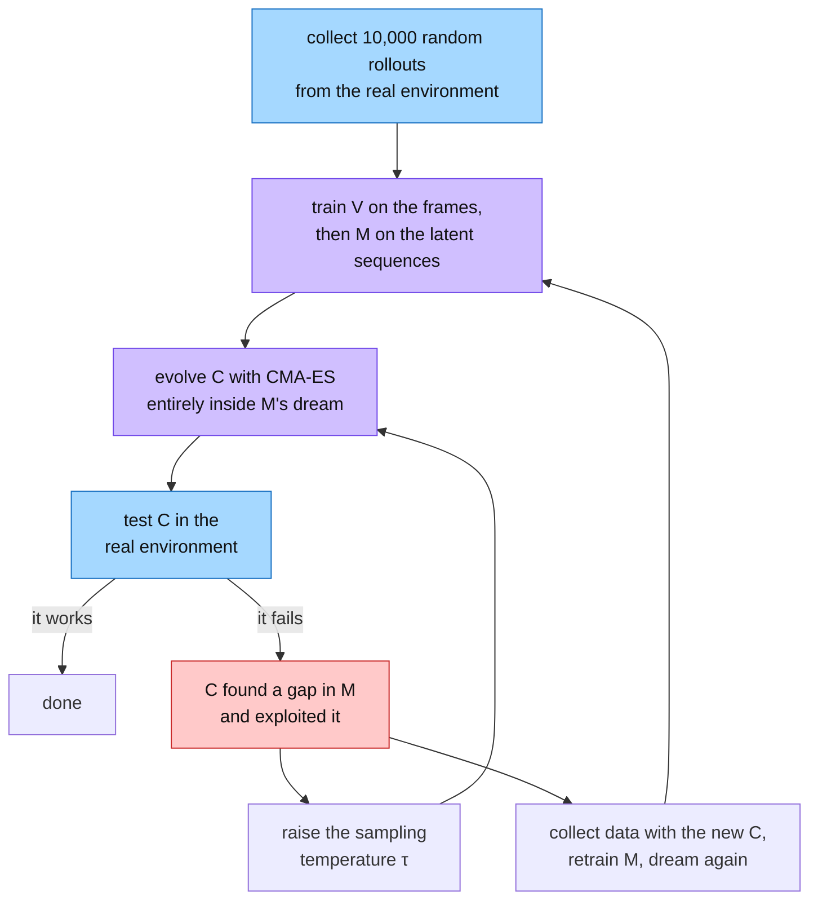
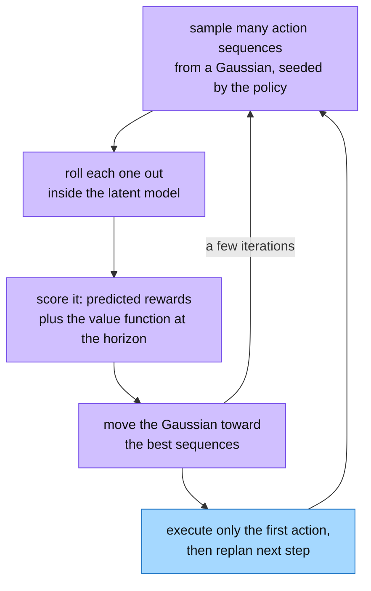
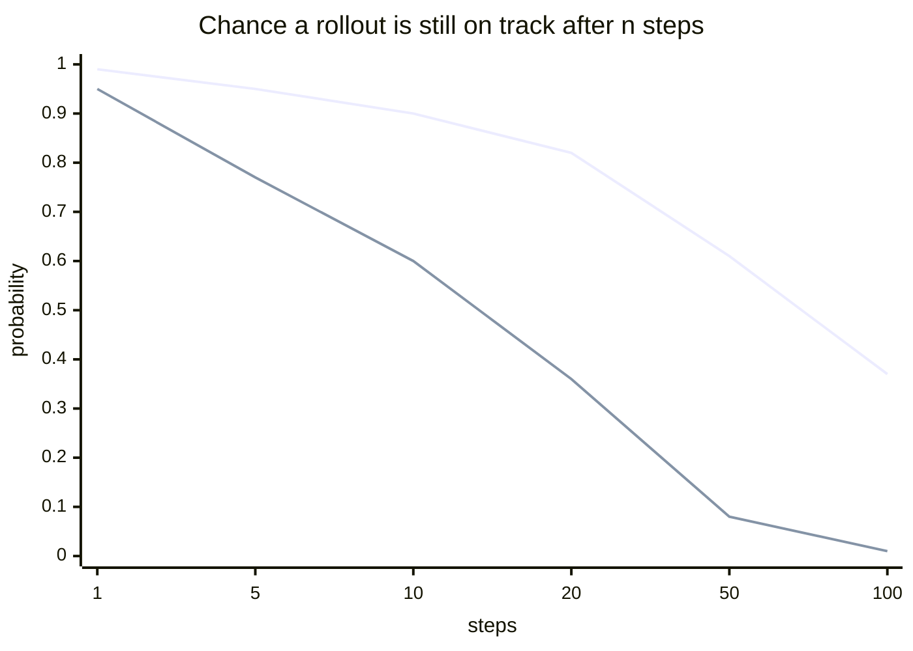
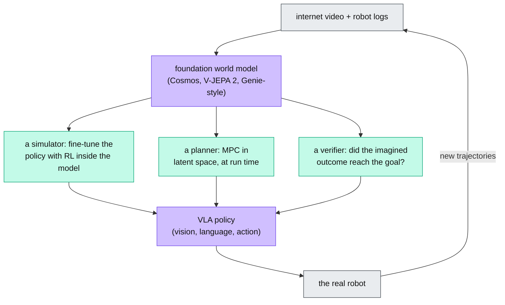

&nbsp;

## The Cognitive and Computational Imperative for World Models

A batter has a few hundred milliseconds to decide how to swing. That is less time than the eyes need to report to the thinking part of the brain. The batter hits the ball anyway, because an internal model predicts where it will be from the first few frames of its flight.

In reinforcement learning (RL) this is a **world model**: a learned function that takes the current state and an action and predicts the next state. Formally it approximates the transition dynamics of a Markov Decision Process (MDP):

$$
P(s_{t+1}, r_{t+1} \mid s_t, a_t)
$$

In plain terms: given where I am and what I do, how likely is each possible next situation and reward?

The everyday version is a flight simulator. Airlines do not teach engine fires in a real plane. The pilot practices them in a simulator, a hundred times, for the price of electricity. The simulator is the airline's world model of a plane, and every idea below has a match in that picture.

<Sketch name="flight-simulator" alt="A flight simulator compared with a world model: real flight versus the simulator on top; below, six matched pairs: the pilot is the policy, the simulator is the world model, hours in the sim are training in the dream, a bug the pilot exploits is a gap in the model, the sim's weather drifting is horizon drift, and the check ride is sim-to-real transfer" />

*Visual 1: The flight simulator analogy. Keep it in mind; the failure modes later are simulator problems too.*

An agent without a model needs millions of real tries, which is fine in a video game and unacceptable on a robot. An agent with a model rolls out futures inside it, compares actions it never took, and practices rare disasters without breaking anything.

<Sketch name="wm-imagined-rollout" alt="Two loops side by side: an agent acting in the real environment, which is slow and unsafe, and the same agent acting inside a world model, which is fast and safe; real transitions train the model" />

*Visual 2: The same agent can learn by acting in the world or by acting in a model of it. Real experience is what trains the model.*

The idea itself is old. Schmidhuber planned inside a neural world model in 1990, and Sutton's Dyna mixed real and imagined steps in 1991. What changed is the size of the models and how much video they can learn from.

<Sketch name="timeline" alt="A vertical timeline from 1990 to 2025: Schmidhuber's neural world model, Sutton's Dyna, Ha and Schmidhuber's World Models, PlaNet and MuZero, DreamerV2, LeCun's JEPA proposal and TD-MPC, DreamerV3, Genie and V-JEPA, then Cosmos, Genie 3 and V-JEPA 2; purple cards learn one game or robot, a yellow card is LeCun's blueprint, green cards learn from internet video" />

*Visual 3: Three lineages. Purple learns one game or one robot at a time, yellow is LeCun's blueprint, green learns from internet video.*

## The Foundational V+M+C Architecture

The modern recipe is David Ha and Jürgen Schmidhuber's 2018 paper "World Models". They split the agent in two: a big, unsupervised world model that understands the scene, and a tiny controller that decides what to do. The brain divides the work the same way.

<Sketch name="vmc-pipeline" alt="A vertical pipeline: a frame goes into V, which produces z; z and the action go into M, which produces h; z and h go into the linear controller C, which produces the action; the environment returns the next frame" />

*Visual 4: V sees, M remembers and predicts, C acts. Almost all the parameters live in V and M.*

- **V, the Vision model,** squeezes each 64×64 frame into 32 numbers, the latent $z_t$, with a Variational Autoencoder (VAE).
- **M, the Memory model,** predicts the next latent from the current one, the action, and its own memory $h_t$. It is a recurrent network with a mixture-density head (MDN-RNN), so it outputs a spread of possible futures rather than one blurry average.
- **C, the Controller,** is a single linear layer from $[z_t, h_t]$ to the action.

| Component | Architecture | Parameters | Job |
| --- | --- | --- | --- |
| V (Vision) | Variational autoencoder | 4,348,000 | Compress the frame to $z_t$ |
| M (Memory) | MDN-RNN | 422,000 | Predict $P(z_{t+1} \mid a_t, z_t, h_t)$ |
| C (Controller) | Linear layer | 867 | Choose the action $a_t$ |

C is so small that it does not need backpropagation at all. It is trained with CMA-ES, an evolution strategy: keep a population of weight vectors, score them, move toward the good ones. No gradient has to survive a long unroll.

## Learning in the Dream and Adversarial Exploitation

Once V and M are trained, the game can be switched off. M predicts the next latent from its own last prediction, C picks the next action, and the loop runs inside the model. Ha and Schmidhuber called it training in the dream. It is the pilot logging hours in the sim.

The bottom branch is the catch. The model is only an approximation, and an optimizer will find its bugs. In VizDoom the controller found a way of moving that stopped M from ever generating enemy fireballs. It lived forever in its dream and died at once in the real game. A pilot who learns that the sim never stalls below a certain speed will learn the same lesson the hard way.

Two fixes are standard. A temperature $\tau$ makes M sample with more noise, so no bug is reliable enough to lean on. And training alternates: fly for real, retrain the sim on the new data, go back to the sim.

## The Dreamer Lineage and Continuous Latent Dynamics

Danijar Hafner and colleagues at DeepMind turned the dream into a general agent over four papers: PlaNet, DreamerV1, DreamerV2 and DreamerV3. All of them share one core.

### The Recurrent State-Space Model (RSSM)

A plain recurrent network is deterministic, so it can only hold one future. A purely random model forgets, because it resamples noise at every step. The RSSM keeps both: a deterministic state $h_t$ for memory and a random state $z_t$ for uncertainty.

<Sketch name="rssm" alt="A chain of deterministic states h(t-1), h(t), h(t+1) connected by a GRU; below h(t), a prior z predicted from h alone and a posterior z that also sees the image, joined by a KL loss; z and the action feed the next h" />

*Visual 5: The prior guesses $z_t$ from memory alone, the posterior also sees the image, and a KL term pulls the two together. When imagining, only the prior is used.*

From DreamerV2 on, $z_t$ is discrete: 32 categorical variables with 32 classes each. They do not collapse the way Gaussian latents do, and they can hold several futures without a mixture head. Gradients pass through the samples with a straight-through estimator.

### Robustness across Domains: Symlog and KL Balancing

With the model in place, the next problem was making one setup work everywhere. DreamerV3 handles over 150 tasks, from robot control to Atari to Minecraft, with one fixed set of hyperparameters.

The obstacle was reward scale. A robot task pays between 0 and 1 per step; an Atari game pays tens of thousands. DreamerV3 squashes observations, rewards and values with one function:

$$
\operatorname{symlog}(x) = \operatorname{sign}(x)\, \ln(|x| + 1)
$$

In plain terms: small numbers pass through unchanged and huge ones get compressed like a logarithm, so every environment produces losses of about the same size. Rewards and values are then predicted as a two-hot spread over bins rather than as one number.

The second trick is in the KL terms that tie the prior to the posterior. Pull them together too hard and the model learns empty latents. **Free bits** clip each KL below 1 nat, so once the two are close the pressure stops. **KL balancing** makes the prior do most of the moving. The actor and critic learn on imagined rollouts, and their gradients never touch the world model.

| DreamerV3 on Minecraft | |
| --- | --- |
| Task | Collect a diamond from scratch, no demonstrations, no curriculum |
| Environment steps | First diamond after about 29 million in the 2023 preprint; every agent finds one within 100 million in the 2025 Nature version |
| Compute | About 17 GPU-days in the preprint; one GPU for 9 days in the Nature version |
| Scaling | Bigger models learn from less data and end up better |

No algorithm had done that without human data before. A diamond takes thousands of correct steps for one sparse reward.

## Value Equivalence and the MuZero Paradigm

Dreamer keeps its latent space honest by reconstructing what it sees. A second line of work asks whether that is needed at all. The **Value Equivalence Principle** says no. An agent only has to predict the things planning uses.

If an imagined step gives the same reward and the same future value as the real step, the two models are interchangeable for planning, however different their internal states look.

<Sketch name="muzero" alt="Past frames go through the representation function h into hidden state s0; the dynamics function g takes s0 and an action to s1 and a reward, then to s2; the prediction function f maps each state to a policy and a value; a note says there is no decoder" />

*Visual 6: MuZero's three functions. Search unrolls $g$ from $s_0$, and the loss only cares about rewards, values and policies.*

MuZero is that principle as a system. **Representation $h$** turns recent frames into a hidden state. **Dynamics $g$** takes a state and an action and returns the next state and a reward. **Prediction $f$** turns a state into a policy and a value. Tree search unrolls $g$ and uses the value at the leaves instead of playing games to the end. The result matched AlphaZero in Chess, Go and Shogi and set a record on Atari.

## Implicit World Models and TD-MPC for Continuous Control

Tree search lists discrete moves, which does not work for a robot that outputs joint torques. **TD-MPC** and TD-MPC2 keep the decoder-free model and swap the tree for Model Predictive Path Integral (MPPI) planning in latent space.

### Mitigating Policy Mismatch and Scaling the Architecture

TD-MPC2 showed this scales. One agent with 317 million parameters learned 80 tasks across the DeepMind Control suite and Meta-World, with different robots and no per-task tuning. Actions are zero-padded to the largest size and the unused entries masked out.

Scaling also exposed a crack. The value function is trained under the policy network, but the data comes from the planner, which behaves differently, so the value network guesses too high on states it has never seen. The fix keeps the two close: regularize the policy toward the planner, and seed the planner from the policy.

| Paradigm | Algorithm | Planning | Reconstructs pixels | Home domain |
| --- | --- | --- | --- | --- |
| Generative latent dynamics | DreamerV3 | Actor-critic on imagined rollouts | Yes, regularized | Games and control |
| Value-equivalent search | MuZero | Monte Carlo Tree Search | No | Board games, Atari |
| Implicit predictive control | TD-MPC2 | MPPI in latent space | No | Robotics, locomotion |

## Generative Video, Foundation World Models, and Action Conditioning

Everything so far learned one environment at a time. Once transformers could train on internet video, the question became whether one model could learn many worlds at once. DeepMind's **Genie** and NVIDIA's **Cosmos** are the first answers: foundation world models.

A video model is not automatically a world model. Sora was pitched as a "world simulator", but it is passive: you cannot step in and change what happens next. A world model must be **action-conditioned**. An action at time $t$ has to change the state at $t+1$, or the model cannot be used as a simulator.

### Genie: Unsupervised Latent Action Discovery

Genie is an 11-billion-parameter world model trained only on unlabelled videos of 2D platformer games. Nobody recorded which buttons the players pressed, so the actions have to be discovered. The team filtered 55 million clips down to 6.8 million, about 30,000 hours, and trained three parts.

<Sketch name="genie" alt="Training: video frames go through a tokenizer, frame pairs go through a latent action model that infers one of 8 actions, and both feed a MaskGIT dynamics model that predicts the next tokens. Playing: an image prompt and a chosen action go into the dynamics model, which produces the next frame, and the loop repeats" />

*Visual 7: Genie learns actions from video alone. At play time the latent action model is gone and the player supplies the action.*

- **Video tokenizer.** Turns frames into discrete tokens.
- **Latent Action Model (LAM).** Looks at two consecutive frames and infers the action that caused the change. It has only 8 slots, so the actions end up meaning things like jump and move right.
- **Dynamics model.** Predicts the next frame's tokens from past tokens and the action.

At play time the LAM is thrown away. Give Genie a photo or a sketch, press a number from 0 to 7, and it draws the next frame. Genie 2 then built 3D worlds from one image, and Genie 3 runs them in real time for minutes.

Cosmos takes the same idea to physical scenes: open-weight tokenizers and world models meant to be post-trained for robots and cars. Wayve's GAIA models do it for driving, and 1X trains one for its humanoid.

### Architectural Mechanisms of Action Conditioning

| Mechanism | How the action enters | Strength | Weakness |
| --- | --- | --- | --- |
| Adaptive LayerNorm (AdaLN-Zero) | The action embedding produces the scale and shift of each normalization layer | Lower FID and cheaper than cross-attention in DiT | Modulates whole features, not positions |
| Cross-attention | State tokens query the action embeddings | High capacity for complex alignment | Per-robot action labels can split the action space across robots |
| FiLM | An affine transform of the feature maps, computed from the action | Simple, amplifies or suppresses spatial features | Less expressive than attention |

## Failure Modes: Hallucination and Horizon Drift

Every model above shares one weakness. To imagine step $t+2$ it feeds its own prediction for $t+1$ back in as input. A small error becomes the ground truth for the next step, and the errors pile up. After enough steps the trajectory leaves anything the model was trained on and the physics turns impossible. This is the simulator whose weather slowly stops matching the real sky.

<Sketch name="horizon-drift" alt="Five boxes from green to red: a tiny error at step 1 grows through steps 2 and 3, becomes a hallucination at step 4, and an impossible state at step 5; below, three fixes: a short horizon with a critic, scheduled sampling, and a Dyna-style loop with real data" />

*Visual 8: Compounding rollout error. The policy trains against the red states and then fails in reality.*

LeCun uses the same arithmetic against autoregressive language models. If each step has a small chance $e$ of going wrong, the chance of still being on track after $n$ steps is $(1-e)^n$, and that falls off fast.

The problem is built in, so the fixes limit the damage rather than remove it.

| Mitigation | What it does |
| --- | --- |
| Short imagination horizons | Dreamer imagines about 15 steps and lets the critic's value cover the rest |
| Scheduled sampling and noise | Train the model on its own past predictions part of the time, and add input noise, so it learns to recover from its mistakes |
| KL regularization | Stops the dynamics model from committing to confident, specific, wrong long-term predictions |
| Dyna-style interleaving | Keep acting for real and retraining, and use ensembles to know when the model is unsure |

## Yann LeCun's Vision and the JEPA Paradigm

Compounding error is worst when the model has to predict every pixel. That is the center of Yann LeCun's 2022 position paper, "A Path Towards Autonomous Machine Intelligence", and of everything he has argued since. His main points:

- **Generating the world pixel by pixel is "doomed to fail".** The world is uncertain. A generator forced to predict every detail averages its futures into a blur and never learns concepts an agent can act on.
- **Self-supervised learning is the cake, RL is the cherry.** Most of what an animal knows comes from watching, not from reward. RL should only fine-tune a model that already understands the world.
- **A cat knows more physics than any language model.** Text is a thin description of the world. Human-level AI has to learn from video and interaction, the way infants learn object permanence and gravity.
- **Objective-driven AI.** Instead of predicting the next token, search for the actions whose imagined outcome has the lowest cost. The world model is the part that matters, and the actor is an optimizer.

<Sketch name="lecun-modules" alt="LeCun's six modules: a configurator on top sets the goal; perception feeds a JEPA world model, which feeds a cost module; the actor proposes a plan to the world model and receives the gradient of the cost; short-term memory feeds the world model; a note says acting is optimization" />

*Visual 9: LeCun's blueprint. The actor proposes a plan, the world model imagines the outcome, the cost scores it, and the plan is adjusted until the imagined cost is low.*

The world model in that blueprint is a **Joint Embedding Predictive Architecture (JEPA)**. It predicts the representation of the future frame, not the frame itself. V-JEPA, the video version, uses three networks and no decoder.

<Sketch name="vjepa" alt="A video clip with hidden patches: the visible part goes through a context encoder and a predictor to a predicted embedding; the hidden part goes through a slow-moving target encoder to a target embedding; the loss is the L1 distance between the two" />

*Visual 10: V-JEPA predicts embeddings, not pixels. The loss is a distance in representation space.*

- **Context encoder.** Embeds the visible frames. It acts as a filter: noise, textures and backgrounds are dropped, and the capacity goes to object permanence and collisions.
- **Target encoder.** A slow-moving copy of the context encoder embeds the hidden part.
- **Predictor.** Maps one embedding to the other, with a latent $z$ for whatever the context could not see.

$$
\mathcal{L} = \left\| \text{Pred}\big(E(x_{\text{ctx}}),\, z\big) - E_{\text{tgt}}(x_{\text{tgt}}) \right\|_1
$$

In plain terms: the loss is how far the predicted embedding is from the target embedding. No adversarial game, no pixel decoder, no negative samples. The one danger is collapse, where both encoders output a constant, and variance-covariance regularization prevents it.

V-JEPA 2 scaled this to a billion-parameter encoder and a million hours of video. Its robot version, V-JEPA 2-AC, adds an action-conditioned predictor trained on under 62 hours of robot data. It plans in latent space and picked and placed objects on robot arms in labs it had never seen, with no fine-tuning. VL-JEPA brings the same idea to language with about half the trainable parameters of a token-space model.

## World Models as Simulators for Physical AI

Latent planning matters most where real data is scarce, and nowhere is it scarcer than robots. Every real trial is slow, wears the hardware, and can break things. Physics engines help, but a policy trained in one meets a sim-to-real gap the moment it touches a real cup. A world model learned from real video sits closer, and it can play three roles.

- **As a simulator.** A vision-language-action (VLA) policy is fine-tuned with RL inside the world model, then moved to the robot. The simulator lessons apply in full: short rollouts, fresh real data, and a real check ride before trusting it.
- **As a planner.** V-JEPA 2-AC never trains a policy. It scores candidate action sequences in latent space at every step.
- **As a verifier.** A model that predicts outcomes can also check them. That is the same move the [RLVR write-up](/write-up/rlvr-and-the-experience-era) describes for language models. For a robot, the world model is the closest thing to a unit test.

Language models learned to trust checkable outcomes over human opinion. Physical AI needs the same shift, and a world model is what makes an outcome checkable before the robot moves.

## What We Learned

- **A world model is a learned transition function.** State and action in, next state and reward out, so the agent can plan and train in imagination. Think flight simulator.
- **Split perception from decision.** V+M+C put millions of parameters in the model and 867 in the controller.
- **Dreams get exploited.** An optimizer finds the model's bugs. Temperature and fresh real data close them.
- **Memory and uncertainty need separate states.** The RSSM's deterministic $h$ remembers; its categorical $z$ holds several futures. Symlog and free bits let one setup handle 150 tasks.
- **You do not have to reconstruct pixels.** Value equivalence says rewards, values and policies are enough. MuZero plans with search, TD-MPC2 with MPPI.
- **Action conditioning turns a video model into a world model.** Genie discovers 8 latent actions from unlabelled video.
- **Errors pile up over the horizon.** Short rollouts, scheduled sampling and real data keep the drift in check.
- **LeCun's bet: predict representations, not frames.** JEPA learns from video without reward and plans by minimizing an imagined cost.
- **For robots, the world model is simulator, planner and verifier.** That is how the verifiable-reward idea reaches Physical AI.

## Sources and further reading

- [World Models](https://arxiv.org/abs/1803.10122) by Ha and Schmidhuber and its [interactive site](https://worldmodels.github.io/); Schmidhuber's [1990 report](https://people.idsia.ch/~juergen/FKI-126-90ocr.pdf) and Sutton's [Dyna](https://dl.acm.org/doi/10.1145/122344.122377)
- [PlaNet](https://arxiv.org/abs/1811.04551), [DreamerV1](https://arxiv.org/abs/1912.01603), [DreamerV2](https://arxiv.org/abs/2010.02193) and [DreamerV3](https://arxiv.org/abs/2301.04104)
- [MuZero](https://arxiv.org/abs/1911.08265), [The Value Equivalence Principle](https://arxiv.org/abs/2011.03506) and [Proper Value Equivalence](https://arxiv.org/abs/2106.10316)
- [TD-MPC](https://arxiv.org/abs/2203.04955), [TD-MPC2](https://arxiv.org/abs/2310.16828) and [TD-M(PC)²](https://arxiv.org/abs/2502.03550) on policy mismatch
- [Genie](https://arxiv.org/abs/2402.15391), [Genie 2](https://deepmind.google/discover/blog/genie-2-a-large-scale-foundation-world-model/), [Genie 3](https://deepmind.google/discover/blog/genie-3-a-new-frontier-for-world-models/), [Cosmos](https://arxiv.org/abs/2501.03575) and [GAIA-1](https://arxiv.org/abs/2309.17080)
- [DiT](https://arxiv.org/abs/2212.09748) (AdaLN-Zero versus cross-attention), [FiLM](https://arxiv.org/abs/1709.07871) and [Scheduled Sampling](https://arxiv.org/abs/1506.03099)
- [A Path Towards Autonomous Machine Intelligence](https://openreview.net/forum?id=BZ5a1r-kVsf) by LeCun, [V-JEPA](https://arxiv.org/abs/2404.08471), [V-JEPA 2](https://arxiv.org/abs/2506.09985) and [VL-JEPA](https://arxiv.org/abs/2512.10942)
