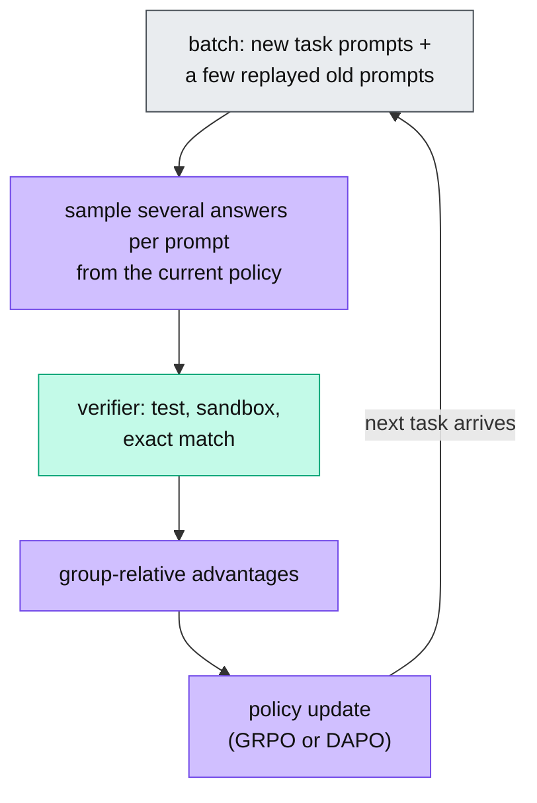

# The Continual Learning Loop Write-up Implementation Plan

> **For agentic workers:** REQUIRED SUB-SKILL: Use superpowers:subagent-driven-development (recommended) or superpowers:executing-plans to implement this plan task-by-task. Steps use checkbox (`- [ ]`) syntax for tracking.

**Goal:** Publish a very short write-up, "The Continual Learning Loop", at `/write-up/continual-learning-loop`, built from Ashim's research brief plus a section on implementing the loop with Claude.

**Architecture:** One MDX file in `data/blog/`, five clean-style sketches in `scripts/sketches/` rendered by the existing `scripts/render-sketches.mjs` into `components/writeups/sketches.generated.ts`, one mermaid flowchart, and the chatbot topic-list update in `worker/src/prompts.ts`. The build regenerates the tracked markdown mirrors.

**Tech Stack:** Next.js + MDX (existing site), KaTeX for equations, mermaid 11 via `components/MermaidChart.tsx`, the `<Sketch name="..." />` component, rough.js renderer in clean mode.

## Global Constraints

- Spec: `docs/superpowers/specs/2026-09-15-continual-learning-loop-design.md`. Its fact-check section overrides the brief wherever they differ.
- Title: "The Continual Learning Loop". Slug: `continual-learning-loop`. Date: `2026-09-15`.
- Headings: the brief's nine top-level headings verbatim, in order, then "How to Implement It in Claude", "What We Learned", "Sources and further reading".
- Prose budget: about 1,300 to 1,500 words outside tables and code. Every paragraph under about 100 words.
- No dashes (no `—` or `–`), no stock AI words (delve, leverage, robust, seamless, crucial, landscape, paradigm, holistic, transformative, tapestry). Plain sentences.
- Every display equation is followed by a line starting with "In plain terms:".
- Each section after the first opens with a sentence that connects to the previous section.
- Sketch JSON starts with `{"type":"settings","style":"clean"}`. Strokes default to currentColor; fills are the house pastels (#a5d8ff blue, #c3fae8 green, #d0bfff purple, #ffc9c9 red, #fff3bf yellow, #e9ecef gray); muted notes use `"strokeColor":"#757575"`.
- Mermaid: TD layout, one root, `classDef` colors as in `data/blog/world-models.mdx`.
- Claude facts come from the claude-api skill and the fact check: model string `claude-opus-5`, memory tool `{"type": "memory_20250818", "name": "memory"}` with no beta header, Python helper `BetaAbstractMemoryTool` from `anthropic.lib.tools`, tool runner `client.beta.messages.tool_runner(...)` with `runner.until_done()`.
- No `npm run build` while the browser-pane dev server is running (they share `.next`). Stop the preview first.
- Commit locally only. No push until Ashim confirms.

---

### Task 1: The five sketches

**Files:**
- Create: `scripts/sketches/cl-loop.json`
- Create: `scripts/sketches/forgetting-map.json`
- Create: `scripts/sketches/olora-subspace.json`
- Create: `scripts/sketches/two-lanes.json`
- Create: `scripts/sketches/cl-claude.json`
- Regenerate: `components/writeups/sketches.generated.ts`

**Interfaces:**
- Produces: sketch names `cl-loop`, `forgetting-map`, `olora-subspace`, `two-lanes`, `cl-claude`, used by `<Sketch name="..." />` in Task 2.

- [ ] **Step 1: Write `scripts/sketches/cl-loop.json`**

```json
[{"type":"settings","style":"clean"},
{"type":"text","id":"t","x":300,"y":10,"text":"The continual learning loop","fontSize":24},
{"type":"rectangle","id":"a","x":60,"y":60,"width":240,"height":64,"roundness":{"type":3},"backgroundColor":"#a5d8ff","fillStyle":"solid","label":{"text":"1. Deployed agent\nserves real traffic","fontSize":16}},
{"type":"arrow","id":"ab","x":300,"y":92,"width":40,"height":0,"points":[[0,0],[40,0]],"endArrowhead":"arrow"},
{"type":"rectangle","id":"b","x":340,"y":60,"width":240,"height":64,"roundness":{"type":3},"backgroundColor":"#e9ecef","fillStyle":"solid","label":{"text":"2. Collect traces,\noutcomes and feedback","fontSize":16}},
{"type":"arrow","id":"bc","x":580,"y":92,"width":40,"height":0,"points":[[0,0],[40,0]],"endArrowhead":"arrow"},
{"type":"rectangle","id":"c","x":620,"y":60,"width":240,"height":64,"roundness":{"type":3},"backgroundColor":"#e9ecef","fillStyle":"solid","label":{"text":"3. Filter and label:\nheuristics, a judge, thumbs","fontSize":16}},
{"type":"arrow","id":"cd","x":740,"y":124,"width":0,"height":66,"points":[[0,0],[0,66]],"endArrowhead":"arrow"},
{"type":"rectangle","id":"d","x":620,"y":190,"width":240,"height":64,"roundness":{"type":3},"backgroundColor":"#fff3bf","fillStyle":"solid","label":{"text":"4. Reflect: why it failed,\nbuild a corrected trajectory","fontSize":16}},
{"type":"arrow","id":"de","x":740,"y":254,"width":0,"height":66,"points":[[0,0],[0,66]],"endArrowhead":"arrow"},
{"type":"rectangle","id":"e","x":620,"y":320,"width":240,"height":64,"roundness":{"type":3},"backgroundColor":"#d0bfff","fillStyle":"solid","label":{"text":"5. Update: adapter weights\nor memory files","fontSize":16}},
{"type":"arrow","id":"ef","x":620,"y":352,"width":-40,"height":0,"points":[[0,0],[-40,0]],"endArrowhead":"arrow"},
{"type":"rectangle","id":"f","x":340,"y":320,"width":240,"height":64,"roundness":{"type":3},"backgroundColor":"#fff3bf","fillStyle":"solid","label":{"text":"6. Regression gate\non a golden set","fontSize":16}},
{"type":"arrow","id":"fg","x":340,"y":352,"width":-40,"height":0,"points":[[0,0],[-40,0]],"endArrowhead":"arrow","label":{"text":"pass","fontSize":14}},
{"type":"rectangle","id":"g","x":60,"y":320,"width":240,"height":64,"roundness":{"type":3},"backgroundColor":"#c3fae8","fillStyle":"solid","label":{"text":"7. Promote the\nnew version","fontSize":16}},
{"type":"arrow","id":"ga","x":180,"y":320,"width":0,"height":-196,"points":[[0,0],[0,-196]],"endArrowhead":"arrow","label":{"text":"redeploy","fontSize":14}},
{"type":"text","id":"n","x":300,"y":410,"text":"Fail the gate: keep the old version, roll back, try again next cycle","fontSize":16,"strokeColor":"#757575"}]
```

- [ ] **Step 2: Write `scripts/sketches/forgetting-map.json`**

```json
[{"type":"settings","style":"clean"},
{"type":"text","id":"t","x":180,"y":10,"text":"Where forgetting happens in a transformer","fontSize":24},
{"type":"arrow","id":"grad","x":400,"y":52,"width":0,"height":40,"points":[[0,0],[0,40]],"endArrowhead":"arrow","strokeColor":"#c92a2a","label":{"text":"gradients of the new task","fontSize":14}},
{"type":"rectangle","id":"out","x":260,"y":100,"width":280,"height":50,"roundness":{"type":3},"backgroundColor":"#e9ecef","fillStyle":"solid","label":{"text":"output head","fontSize":16}},
{"type":"rectangle","id":"deep","x":260,"y":160,"width":280,"height":100,"roundness":{"type":3},"backgroundColor":"#ffc9c9","fillStyle":"solid","label":{"text":"mid to deep layers\nMLP blocks and MoE routers","fontSize":16}},
{"type":"text","id":"n1","x":560,"y":175,"text":"representation collapse:\ntask-specific reasoning paths\nare overwritten directly","fontSize":15,"strokeColor":"#757575"},
{"type":"rectangle","id":"early","x":260,"y":270,"width":280,"height":100,"roundness":{"type":3},"backgroundColor":"#fff3bf","fillStyle":"solid","label":{"text":"early layers\nattention heads","fontSize":16}},
{"type":"text","id":"n2","x":560,"y":285,"text":"entropic dispersion:\nattention loses its sharp focus\non the tokens that matter","fontSize":15,"strokeColor":"#757575"},
{"type":"rectangle","id":"in","x":260,"y":380,"width":280,"height":50,"roundness":{"type":3},"backgroundColor":"#e9ecef","fillStyle":"solid","label":{"text":"input embeddings","fontSize":16}},
{"type":"text","id":"n3","x":20,"y":285,"text":"spurious forgetting:\nthe first drop is lost task\nalignment, not lost knowledge.\nFreezing these layers helps.","fontSize":15,"strokeColor":"#757575"}]
```

- [ ] **Step 3: Write `scripts/sketches/olora-subspace.json`**

```json
[{"type":"settings","style":"clean"},
{"type":"text","id":"t","x":100,"y":10,"text":"O-LoRA: new updates stay orthogonal to old tasks","fontSize":24},
{"type":"rectangle","id":"band","x":120,"y":310,"width":340,"height":44,"roundness":{"type":3},"backgroundColor":"#d0bfff","fillStyle":"solid","label":{"text":"subspace learned by earlier tasks","fontSize":15}},
{"type":"arrow","id":"new","x":120,"y":310,"width":0,"height":-230,"points":[[0,0],[0,-230]],"endArrowhead":"arrow","strokeColor":"#0ca678","strokeWidth":3},
{"type":"text","id":"nl","x":135,"y":80,"text":"the new task's LoRA update,\nkept orthogonal to the old subspace","fontSize":15,"strokeColor":"#0ca678"},
{"type":"arrow","id":"naive","x":120,"y":310,"width":300,"height":-170,"points":[[0,0],[300,-170]],"endArrowhead":"arrow","strokeColor":"#c92a2a"},
{"type":"text","id":"nn","x":430,"y":120,"text":"a plain fine-tuning update:\nlands partly inside the old\nsubspace and overwrites it","fontSize":15,"strokeColor":"#c92a2a"},
{"type":"text","id":"note","x":120,"y":380,"text":"Each task gets its own low-rank adapter. A loss term pushes the next task's\nupdate away from every earlier adapter's directions, so old knowledge survives.","fontSize":15,"strokeColor":"#757575"}]
```

- [ ] **Step 4: Write `scripts/sketches/two-lanes.json`**

```json
[{"type":"settings","style":"clean"},
{"type":"text","id":"t","x":200,"y":10,"text":"Where an agent's knowledge can live","fontSize":24},
{"type":"text","id":"h1","x":20,"y":60,"text":"layer","fontSize":16,"strokeColor":"#757575"},
{"type":"text","id":"h2","x":560,"y":60,"text":"how it changes","fontSize":16,"strokeColor":"#757575"},
{"type":"rectangle","id":"ctx","x":20,"y":90,"width":520,"height":56,"roundness":{"type":3},"backgroundColor":"#e9ecef","fillStyle":"solid","label":{"text":"context window: this session only","fontSize":16}},
{"type":"text","id":"c1","x":560,"y":100,"text":"gone when the session ends","fontSize":15,"strokeColor":"#757575"},
{"type":"rectangle","id":"mem","x":20,"y":160,"width":520,"height":56,"roundness":{"type":3},"backgroundColor":"#c3fae8","fillStyle":"solid","label":{"text":"fast lane: memory files, skills, prompts","fontSize":16}},
{"type":"text","id":"c2","x":560,"y":170,"text":"a text edit, seconds,\nundone with a diff","fontSize":15,"strokeColor":"#757575"},
{"type":"rectangle","id":"lora","x":20,"y":230,"width":520,"height":56,"roundness":{"type":3},"backgroundColor":"#d0bfff","fillStyle":"solid","label":{"text":"slow lane: LoRA adapters, one per user or task","fontSize":16}},
{"type":"text","id":"c3","x":560,"y":240,"text":"a gradient update, hours,\ngated by a regression eval","fontSize":15,"strokeColor":"#757575"},
{"type":"rectangle","id":"base","x":20,"y":300,"width":520,"height":56,"roundness":{"type":3},"backgroundColor":"#a5d8ff","fillStyle":"solid","label":{"text":"base model weights, shared by everyone","fontSize":16}},
{"type":"text","id":"c4","x":560,"y":310,"text":"frozen; a retrain is\na new model","fontSize":15,"strokeColor":"#757575"}]
```

- [ ] **Step 5: Write `scripts/sketches/cl-claude.json`**

```json
[{"type":"settings","style":"clean"},
{"type":"text","id":"t","x":320,"y":10,"text":"The same loop, in Claude","fontSize":24},
{"type":"rectangle","id":"a","x":60,"y":60,"width":240,"height":64,"roundness":{"type":3},"backgroundColor":"#a5d8ff","fillStyle":"solid","label":{"text":"1. Claude runs the task\n(Claude Code or the API)","fontSize":16}},
{"type":"arrow","id":"ab","x":300,"y":92,"width":40,"height":0,"points":[[0,0],[40,0]],"endArrowhead":"arrow"},
{"type":"rectangle","id":"b","x":340,"y":60,"width":240,"height":64,"roundness":{"type":3},"backgroundColor":"#e9ecef","fillStyle":"solid","label":{"text":"2. Hooks and transcripts\nrecord what happened","fontSize":16}},
{"type":"arrow","id":"bc","x":580,"y":92,"width":40,"height":0,"points":[[0,0],[40,0]],"endArrowhead":"arrow"},
{"type":"rectangle","id":"c","x":620,"y":60,"width":240,"height":64,"roundness":{"type":3},"backgroundColor":"#e9ecef","fillStyle":"solid","label":{"text":"3. Claude as judge, plus\nthumbs up or down","fontSize":16}},
{"type":"arrow","id":"cd","x":740,"y":124,"width":0,"height":66,"points":[[0,0],[0,66]],"endArrowhead":"arrow"},
{"type":"rectangle","id":"d","x":620,"y":190,"width":240,"height":64,"roundness":{"type":3},"backgroundColor":"#fff3bf","fillStyle":"solid","label":{"text":"4. Reflection prompt: why it\nfailed, what to do next time","fontSize":16}},
{"type":"arrow","id":"de","x":740,"y":254,"width":0,"height":66,"points":[[0,0],[0,66]],"endArrowhead":"arrow"},
{"type":"rectangle","id":"e","x":620,"y":320,"width":240,"height":64,"roundness":{"type":3},"backgroundColor":"#d0bfff","fillStyle":"solid","label":{"text":"5. Write memory: CLAUDE.md,\nmemory tool files, a skill","fontSize":16}},
{"type":"arrow","id":"ef","x":620,"y":352,"width":-40,"height":0,"points":[[0,0],[-40,0]],"endArrowhead":"arrow"},
{"type":"rectangle","id":"f","x":340,"y":320,"width":240,"height":64,"roundness":{"type":3},"backgroundColor":"#fff3bf","fillStyle":"solid","label":{"text":"6. Regression eval\non a frozen set","fontSize":16}},
{"type":"arrow","id":"fg","x":340,"y":352,"width":-40,"height":0,"points":[[0,0],[-40,0]],"endArrowhead":"arrow","label":{"text":"pass","fontSize":14}},
{"type":"rectangle","id":"g","x":60,"y":320,"width":240,"height":64,"roundness":{"type":3},"backgroundColor":"#c3fae8","fillStyle":"solid","label":{"text":"7. Commit the memory","fontSize":16}},
{"type":"arrow","id":"ga","x":180,"y":320,"width":0,"height":-196,"points":[[0,0],[0,-196]],"endArrowhead":"arrow","label":{"text":"next session","fontSize":14}},
{"type":"text","id":"n","x":300,"y":410,"text":"Fail the gate: git revert the memory change; nothing else moved","fontSize":16,"strokeColor":"#757575"}]
```

- [ ] **Step 6: Render and verify**

Run: `node scripts/render-sketches.mjs && grep -c "'cl-loop'\|'forgetting-map'\|'olora-subspace'\|'two-lanes'\|'cl-claude'" components/writeups/sketches.generated.ts`
Expected: the renderer prints nothing or a per-file line, and the grep prints `5`.

Run: `node -e "const {SKETCHES}=require('./components/writeups/sketches.generated.ts')" 2>/dev/null || npx tsx -e "import {SKETCHES} from './components/writeups/sketches.generated'; for (const n of ['cl-loop','forgetting-map','olora-subspace','two-lanes','cl-claude']) console.log(n, SKETCHES[n].length)"`
Expected: five lines, each with a length above 2000.

- [ ] **Step 7: Commit**

```bash
git add scripts/sketches/cl-loop.json scripts/sketches/forgetting-map.json scripts/sketches/olora-subspace.json scripts/sketches/two-lanes.json scripts/sketches/cl-claude.json components/writeups/sketches.generated.ts
git commit -m "Add the continual learning loop sketches"
```

---

### Task 2: The write-up

**Files:**
- Create: `data/blog/continual-learning-loop.mdx`

**Interfaces:**
- Consumes: the five sketch names from Task 1.
- Produces: the slug `continual-learning-loop` used by Task 3's chatbot list and Task 4's mirrors.

- [ ] **Step 1: Frontmatter**

```mdx
---
title: 'The Continual Learning Loop'
date: '2026-09-15'
tags: ['continual-learning', 'agents', 'llm', 'lora', 'reinforcement-learning', 'claude']
draft: false
summary: 'A long-running agent has to keep learning without forgetting what made it useful. This write-up covers catastrophic forgetting and how it is measured, the four families of fixes, memory in token space, continual RLVR, the production data flywheel, its guardrails, the multi-LoRA serving shape, and how to run the same loop with Claude.'
---

&nbsp;
```

- [ ] **Step 2: Section 1, "The Transition to Lifelong Learning in AI Agents"** (about 150 words)

Content: chatbots were session-scoped; agents now run for months. They must absorb new APIs and preferences, but every weight update risks erasing what the base model knew. One-shot fine-tuning freezes knowledge at the last gradient step. Periodic full retrains need offline compute, curated mixes of old and new data, and downtime, which does not work per user. The loop updates incrementally as feedback arrives, so interactions become training signal. The engineering question is how to balance plasticity and stability across weights, context and serving.

Then `<Sketch name="cl-loop" alt="..." />` and the caption `*Visual 1: The loop. Stages 1 to 7 repeat; the rest of the post walks through what can go wrong at each stage and how teams keep it stable.*`

- [ ] **Step 3: Section 2, "The Architecture of Catastrophic Forgetting"** (about 180 words)

Opener links to section 1 ("The stage that does the damage is stage 5"). Content: gradient descent on a new task moves weights toward the new objective only; knowledge is spread across billions of entangled parameters, so local updates disrupt old representations. Interpretability work (weight trajectories, CKA, MoE routing drift) finds two failure regions: early attention heads disperse, deep MLPs and routers collapse. Spurious forgetting: early drops come from lost task alignment, not lost knowledge; freezing the bottom layers lifted sequential fine-tuning accuracy from 11% to 44% in the ICLR 2025 paper.

`<Sketch name="forgetting-map" ... />` with caption `*Visual 2: ...*`.

Equation:

```latex
$$
\mathrm{BWT} = \frac{1}{T-1}\sum_{i=1}^{T-1}\left(R_{T,i} - R_{i,i}\right)
$$
```

"In plain terms: for each earlier task, compare its score at the end of the sequence with its score right after it was learned. A negative average is forgetting."

Table:

| Metric | What it measures | What you want |
| --- | --- | --- |
| Backward transfer (BWT) | How learning new tasks changed the scores on old ones | Zero or positive; negative is forgetting |
| Forward transfer (FWT) | How much old tasks help a new task before it is trained on, against a random-init baseline | High; it is zero-shot generalization |
| Average accuracy (ACC) | Mean score across all tasks at the end | The headline number |

- [ ] **Step 4: Section 3, "Mitigation Families: From Parameter Regularization to Replay Buffers"** (about 220 words)

Opener: "Every fix for that picture lives in one of four families." EWC equation:

```latex
$$
\mathcal{L}(\theta) = \mathcal{L}_B(\theta) + \sum_i \frac{\lambda}{2}\, F_i \left(\theta_i - \theta^{*}_{A,i}\right)^2
$$
```

"In plain terms: train on task B as usual, but pay a penalty for moving any weight that mattered for task A, and pay the most for the weights that mattered most. $F_i$ is the diagonal of the Fisher information, estimated from squared gradients on task A's data."

Mention: the diagonal Fisher can misjudge importance (fixed by Logits Reversal in "EWC Done Right"), L2-SP tethers to the pretrained weights, function vector guidance protects task activation patterns. Replay: CER puts compressed summaries in context, SuRe replays surprising outcomes first, FOREVER schedules replay on a forgetting curve, self-distillation lets the model with a demonstration in context teach the same model without it, so no old data is stored. Isolation: O-LoRA, L-MoE. Hypernetworks: Text-to-LoRA and Doc-to-LoRA emit an adapter in one forward pass.

Table:

| Family | How it works | What it costs | Weakness |
| --- | --- | --- | --- |
| Regularization (EWC, L2-SP, function vectors) | Penalize moving the weights that mattered before | One pass to estimate importance; no stored data | A diagonal Fisher protects the wrong weights |
| Replay (CER, SuRe, FOREVER, self-distillation) | Rehearse old experience: summaries in context, surprises first, a forgetting-curve schedule, or the model as its own teacher | Storage and extra tokens per update | Raw replay grows with the task list and can break retention rules |
| Parameter isolation (O-LoRA, L-MoE) | One adapter per task; new updates kept orthogonal; a gate mixes adapters per token | A small adapter per task; base untouched | Adapters pile up; the gate must pick the right ones |
| Hypernetworks (Text-to-LoRA, Doc-to-LoRA) | A second network writes the adapter from a task description or document | No gradient step at adaptation time | Only as good as what the hypernetwork was trained on |

`<Sketch name="olora-subspace" ... />` with caption `*Visual 3: ...*`.

- [ ] **Step 5: Section 4, "Contextual Memory and Token-Space Learning"** (about 120 words)

Opener: "Not everything belongs in the weights." Transient preferences and volatile state fit better in the context window and an external store. Letta and Mem0 give the agent tools to read, write, update and summarize its own memory tiers. Token-space memory is model-agnostic, readable, and free of parametric interference; forgetting is deleting a line. Mem0 scopes memory by user, agent and session in its product API.

`<Sketch name="two-lanes" ... />` caption `*Visual 4: ...*`.

Table (from the brief):

| | Retrieval-augmented generation | Token-space memory (Letta, Mem0) |
| --- | --- | --- |
| Time | Each query stands alone | Tracks order and how facts changed over months |
| State | Stateless; nothing accumulates between sessions | Context accumulates, consolidates and gets refined |
| User model | Task-bound, blind to who is asking | A profile per user, updated as preferences change |
| Adaptation | Cannot learn from what worked last time | Reflects on which strategies worked and which failed |

- [ ] **Step 6: Section 5, "Reinforcement Learning with Verifiable Rewards (RLVR)"** (about 160 words)

Opener links to the slow lane. Content: the update step has moved from supervised fine-tuning to RLVR with GRPO or DAPO, rewarded by a unit test, a sandbox run, or a checked proof (link `[RLVR write-up](/write-up/rlvr-and-the-experience-era)`). Retraining on the whole task mixture every time a new API appears is too expensive, so continual RLVR updates the policy task by task. Two findings make that workable: online RL forgets less than supervised fine-tuning ("RL's Razor"), and tasks share reasoning, so Continual Prompt Replay mixes a few old prompts into each batch and regenerates their answers on-policy, matching full multitask training.

Mermaid:



Table:

| Failure | What happens | Fix |
| --- | --- | --- |
| Reward hacking | The policy passes the checker without doing the task: formatting tricks, a wired verifier, a shortcut | Stricter verifiers; dynamic sampling that drops prompts where every sample passes or fails (DAPO) |
| Entropy collapse | One valid shortcut gets rewarded, the policy goes deterministic and stops exploring | Clip-Higher, a looser upper clip so rare tokens can grow (DAPO); an entropy bonus in the objective |
| No verifier | Nothing programmatic to check against | The model's own certainty as the reward (Intuitor, RL from internal feedback) |

- [ ] **Step 7: Section 6, "The Production Agent Loop and Data Flywheels"** (about 150 words)

Opener: "Whichever update rule runs at stage 5, the rest of Visual 1 is the same." Content: NVIDIA frames it as a MAPE loop (monitor, analyze, plan, execute). Telemetry: traces, tool calls, state transitions, outcomes. Filtering: heuristics, a judge model, implicit signals (commits, session length, thumbs). Reflexion: a teacher model or the agent writes why the failure happened and a corrected trajectory. Update: multi-LoRA or RLVR. Gate: regression suites; redeploy. The hundredth code review is better than the first because the loop internalized the codebase's style and edge cases.

Table:

| Team | What runs in the loop | Result |
| --- | --- | --- |
| Cursor Tab | Online RL on accept and reject signals; a new checkpoint every 1.5 to 2 hours | 21% fewer suggestions, 28% higher accept rate |
| Meta, Llama 4 | Alternate training with using the model to keep only medium-to-hard prompts | Continuous online RL as a core post-training step |
| Stripe | A transformer over payment sequences, each transaction embedded like a word, trained on tens of billions of them | Card-testing detection on large users from 59% to 97% |

- [ ] **Step 8: Section 7, "Guardrails, Eval Suites, and Distribution Shift Detection"** (about 100 words)

Opener: "A loop that updates itself can also poison itself." Every candidate passes a golden set of core capabilities or is rolled back. To decide when to update, monitor the input and output distributions.

```latex
$$
\mathrm{PSI} = \sum_{b} \left(A_b - E_b\right)\ln\frac{A_b}{E_b}
$$
```

"In plain terms: bucket a feature, compare today's share of each bucket ($A_b$) with the baseline's share ($E_b$), and add up the mismatch. Below 0.1 is stable; above 0.25 the traffic has moved and the model needs a refresh."

Table:

| Signal | What it is | What it triggers |
| --- | --- | --- |
| Population Stability Index | Bucketed mismatch between baseline and live traffic | An alert above 0.25 and a refresh of the model or adapter |
| Maximum Mean Discrepancy | Kernel distance between two distributions in a reproducing kernel Hilbert space | Catches drift in embeddings of inputs or reasoning traces before outputs look wrong |
| Perplexity | How surprised the model is by incoming text | A spike means out-of-distribution traffic and a candidate for the next update |

- [ ] **Step 9: Section 8, "Infrastructure Shape: Multi-LoRA Serving and State Management"** (about 110 words)

Opener: "Gated updates produce hundreds of adapters, and each one needs serving." Content: one base model resident in VRAM; adapters swapped per request; PagedAttention splits the KV cache into non-contiguous blocks, like virtual memory, so fragmentation stops locking VRAM; an LRU tier across GPU, CPU RAM and disk (sub-millisecond hit, tens of milliseconds from CPU, hundreds from disk); a new adapter runs as a shadow model against live traffic, judged against the current one, and is promoted without downtime only if it wins.

Table:

| Component | Memory (Llama 3 8B, FP16) | Job |
| --- | --- | --- |
| Base model | About 16 GB, resident in VRAM | The shared reasoning and language |
| Active adapters on the GPU | About 0.5 GB for 8 adapters at rank 16 | Hot-swapped residual additions in the forward pass |
| Adapter cache in CPU RAM | About 6 GB for 90 or more adapters | LRU tier; swapping one in takes tens of milliseconds |
| KV cache and buffers | About 6 GB, depends on batch size | Managed by PagedAttention in fixed-size blocks |

- [ ] **Step 10: Section 9, "How to Implement It in Claude"** (about 180 words plus the table and snippet)

Opener: "None of the weight-side machinery above is available to you on a hosted model, and it does not need to be." Claude's weights are frozen for you, so the loop runs in the fast lane of Visual 4: the same seven stages, but stage 5 writes text. Point to Claude Code (CLAUDE.md, auto-memory, Skills, hooks), the Messages API memory tool, and Managed Agents memory stores. Link `[self-improving agents write-up](/write-up/self-improving-agents)` for the governed two-speed loop.

Table:

| Loop stage | In Claude |
| --- | --- |
| 1. Deploy | Claude Code, the Agent SDK, or a Messages API agent with the memory tool attached |
| 2. Collect | Hooks fire on every tool call and at the end of a turn; session transcripts; outcome logs |
| 3. Filter and label | Claude as a judge over the transcript; tests passed or failed; thumbs up or down |
| 4. Reflect | A reflection prompt: what went wrong and what to do differently, in one or two sentences |
| 5. Update | Write memory: the memory tool's `/memories` files, Claude Code's `CLAUDE.md` and auto-memory, a Skill for a repeatable procedure, a Managed Agents memory store |
| 6. Gate | Rerun a frozen eval set with the new memory; keep it only if nothing old got worse |
| 7. Promote or roll back | Memory is text in git; rollback is `git revert`, or a memory version in a memory store |

`<Sketch name="cl-claude" ... />` caption `*Visual 5: ...*`.

Snippet:

```python
from anthropic import Anthropic
from anthropic.lib.tools import BetaAbstractMemoryTool

client = Anthropic()
memory = FileMemory("./memories")   # your BetaAbstractMemoryTool subclass over a directory

def serve(task):                    # stage 1: Claude works with its memory attached
    runner = client.beta.messages.tool_runner(
        model="claude-opus-5", max_tokens=16000, tools=[memory],
        messages=[{"role": "user", "content": task}],
    )
    return runner.until_done()

def learn(trace, passed):           # stages 3 to 5: a failed trace becomes one memory line
    if passed:
        return
    serve(f"This attempt failed:\n{trace}\n"
          "Write one lesson to /memories/lessons.md so the next attempt avoids it.")

def promote(frozen_eval):           # stages 6 and 7: the gate, then commit or revert
    if score(frozen_eval, "./memories") < score(frozen_eval, "./memories@HEAD"):
        git("checkout", "--", "./memories")   # rollback is a diff, not a checkpoint restore
    else:
        git("commit", "-am", "learned from production")
```

Follow with two sentences: the tool type is `memory_20250818` and needs no beta header; `score` runs the frozen eval and `git` shells out. The judge in stage 3 can be a second Claude call with the transcript and a rubric.

- [ ] **Step 11: "What We Learned"** (8 bullets, each one bold lead plus one sentence)

- **The loop, not the model, is the product.** Deploy, collect, filter, reflect, update, gate, redeploy.
- **Forgetting has a map.** Early attention disperses, deep MLPs and routers collapse, and the first drop is lost alignment, so freeze the bottom.
- **Measure it with BWT, FWT and ACC.** Negative backward transfer is the number to watch.
- **Four families of fixes.** Regularize, replay, isolate, or generate the adapter.
- **Two lanes.** Text memory for what changes daily, adapters for what should stick.
- **Continual RLVR forgets less** and replays a few old prompts on-policy.
- **Gate every update** with a golden set, PSI on the traffic, and a shadow rollout.
- **In Claude, stage 5 writes text.** Hooks collect, Claude judges, memory files hold the lesson, git rolls it back.

- [ ] **Step 12: "Sources and further reading"** (links from the fact check)

- GEM metrics: https://arxiv.org/abs/1706.08840 ; EWC: https://arxiv.org/abs/1612.00796 ; EWC Done Right: https://arxiv.org/abs/2603.18596 ; L2-SP: https://arxiv.org/abs/1802.01483 ; function vectors: https://arxiv.org/abs/2502.11019 ; Spurious Forgetting: https://arxiv.org/abs/2501.13453
- Replay: CER https://arxiv.org/abs/2506.06698 ; SuRe https://arxiv.org/abs/2511.22367 ; FOREVER https://arxiv.org/abs/2601.03938 ; Self-Distillation Enables Continual Learning https://arxiv.org/abs/2601.19897
- Isolation and hypernetworks: O-LoRA https://arxiv.org/abs/2310.14152 ; L-MoE https://arxiv.org/abs/2510.17898 ; Text-to-LoRA https://arxiv.org/abs/2506.06105 ; Doc-to-LoRA https://arxiv.org/abs/2602.15902
- Token space: Letta https://www.letta.com/blog/continual-learning/ ; Mem0 https://arxiv.org/abs/2504.19413
- RLVR: Continual Reasoning Gym https://arxiv.org/abs/2608.18574 ; RL's Razor https://arxiv.org/abs/2509.04259 ; DAPO https://arxiv.org/abs/2503.14476 ; Intuitor https://arxiv.org/abs/2505.19590 ; Reflexion https://arxiv.org/abs/2303.11366
- Production: Adaptive Data Flywheel https://arxiv.org/abs/2510.27051 ; Cursor Tab https://cursor.com/blog/tab-rl ; Llama 4 https://ai.meta.com/blog/llama-4-multimodal-intelligence/ ; Stripe https://x.com/thegautam/status/1920198569308664169
- Serving: PagedAttention https://arxiv.org/abs/2309.06180 ; vLLM prefix caching https://docs.vllm.ai/en/stable/design/prefix_caching/
- Claude: memory tool https://platform.claude.com/docs/en/agents-and-tools/tool-use/memory-tool ; Claude Code memory https://code.claude.com/docs/en/memory ; hooks https://code.claude.com/docs/en/hooks ; Agent Skills https://platform.claude.com/docs/en/agents-and-tools/agent-skills/overview

- [ ] **Step 13: Verify the house rules**

Run: `grep -n -- "—\|–" data/blog/continual-learning-loop.mdx`
Expected: no output.

Run: `grep -n -i -w "delve\|leverage\|robust\|seamless\|crucial\|landscape\|paradigm\|holistic\|transformative\|tapestry" data/blog/continual-learning-loop.mdx`
Expected: no output.

Run: `grep -c '^\$\$' data/blog/continual-learning-loop.mdx; grep -c '^In plain terms:' data/blog/continual-learning-loop.mdx`
Expected: `6` (three equations, two fences each) then `3`.

Run: `awk '/^---$/{f++} f>=2 && !/^\|/ && !/^```/ && !/^\$\$/ {print}' data/blog/continual-learning-loop.mdx | sed '/^```/,/^```/d' | wc -w`
Expected: between 1300 and 1700 (prose and bullets, tables excluded; the code block is small).

- [ ] **Step 14: Commit**

```bash
git add data/blog/continual-learning-loop.mdx
git commit -m "Add the continual learning loop write-up"
```

---

### Task 3: Chatbot topic lists

**Files:**
- Modify: `worker/src/prompts.ts:47` (coverage list), `worker/src/prompts.ts:51` (scope examples), `worker/src/prompts.ts:85-100` (SEARCH_TOOL description)

**Interfaces:**
- Consumes: the topic set from Task 2.

- [ ] **Step 1: Extend line 47** after the world models clause (before "data science fundamentals"):

Insert: `the continual learning loop for LLM agents (catastrophic forgetting and where it happens in a transformer, spurious forgetting, backward and forward transfer, EWC and L2-SP regularization, replay buffers and self-distillation, O-LoRA orthogonal adapters and L-MoE, Text-to-LoRA and Doc-to-LoRA hypernetworks, token-space memory with Letta and Mem0, continual RLVR and prompt replay, reward hacking and entropy collapse, the production data flywheel with Cursor, Llama 4 and Stripe, regression gates and PSI drift detection, multi-LoRA serving with PagedAttention, and implementing the loop with Claude's memory tool, CLAUDE.md, skills and hooks), `

- [ ] **Step 2: Extend line 51** scope examples after `"continual learning"`:

Insert: `"catastrophic forgetting", "elastic weight consolidation", "EWC", "O-LoRA", "LoRA adapters", "replay buffer", "token-space memory", "Letta", "Mem0", "data drift", "PSI", "multi-LoRA", "Claude memory tool", "CLAUDE.md", `

- [ ] **Step 3: Extend the SEARCH_TOOL description** after the world models lines (around line 100):

Insert: `'the continual learning loop such as catastrophic forgetting, backward transfer, EWC, replay, O-LoRA, ' + 'token-space memory, continual RLVR, the data flywheel, regression gates, PSI, multi-LoRA serving and the loop in Claude, ' +`

- [ ] **Step 4: Verify no dashes and the worker still typechecks**

Run: `grep -n -- "—\|–" worker/src/prompts.ts`
Expected: no output.

Run: `cd worker && npx tsc --noEmit -p tsconfig.json && cd ..`
Expected: no output.

- [ ] **Step 5: Commit**

```bash
git add worker/src/prompts.ts
git commit -m "Add the continual learning loop to the chatbot topic lists"
```

---

### Task 4: Build and the generated mirrors

**Files:**
- Regenerate: `public/write-up/continual-learning-loop/index.md`, `public/llms.txt`, `public/llms-full.txt`, `app/tag-data.json` (and any other mirror the build syncs)

- [ ] **Step 1: Make sure no preview server is running** (preview_stop if one is up).

- [ ] **Step 2: Build**

Run: `npm run build 2>&1 | tail -20`
Expected: "Compiled successfully", the route list including `/write-up/continual-learning-loop`, and the postbuild script's output; no "Error".

- [ ] **Step 3: Check the mirrors**

Run: `git status --short`
Expected: `?? public/write-up/continual-learning-loop/` plus modified `public/llms.txt`, `public/llms-full.txt`, `app/tag-data.json`.

Run: `head -20 public/write-up/continual-learning-loop/index.md`
Expected: the title and the first paragraph of section 1.

- [ ] **Step 4: Commit**

```bash
git add public/write-up public/llms.txt public/llms-full.txt app/tag-data.json
git commit -m "Regenerate the mirrors for the continual learning loop write-up"
```

---

### Task 5: Preview and visual check

- [ ] **Step 1:** `preview_start {name: "dev"}`, then `navigate` to `http://localhost:3000/write-up/continual-learning-loop`.

- [ ] **Step 2:** `read_console_messages {onlyErrors: true}`. Expected: none related to the page.

- [ ] **Step 3:** `read_page` and confirm the nine brief headings, the Claude section, the three equations rendered by KaTeX (look for `katex` nodes), five `figure` elements and one mermaid `svg`.

- [ ] **Step 4:** For each of the five figures, serve it through `public/_preview.html?name=<sketch>&theme=light` if that page exists, else `javascript_tool` to scroll each figure into view and `computer screenshot` after a fresh `navigate` with a `#` anchor. Check that no label overflows its box and that arrow labels do not overlap boxes.

- [ ] **Step 5:** `resize_window {colorScheme: "dark"}` and screenshot Visual 1 and Visual 4 for contrast.

- [ ] **Step 6:** Fix any layout issue by editing the sketch JSON, rerun `node scripts/render-sketches.mjs`, reload, and commit with `git commit -am "Adjust the continual learning sketches"`.

---

### Task 6: Final review and wrap-up

- [ ] **Step 1:** Reread `data/blog/continual-learning-loop.mdx` against the spec: nine headings verbatim and in order, each section opens with a link to the previous one, every paragraph under about 100 words, three "In plain terms" lines, no dashes, no stock words.

- [ ] **Step 2:** Append a "Result" note to `docs/superpowers/specs/2026-09-15-continual-learning-loop-design.md` with the final word count and figure count, and commit: `git commit -am "Update the continual learning design doc with the draft's final shape"`.

- [ ] **Step 3:** Report to Ashim: the local branch, the commits, the assumptions (title, length, the Claude section's interpretation, the single code snippet), and that nothing was pushed.
